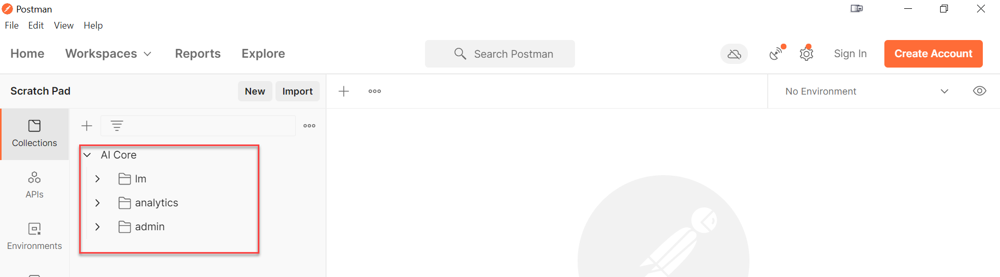
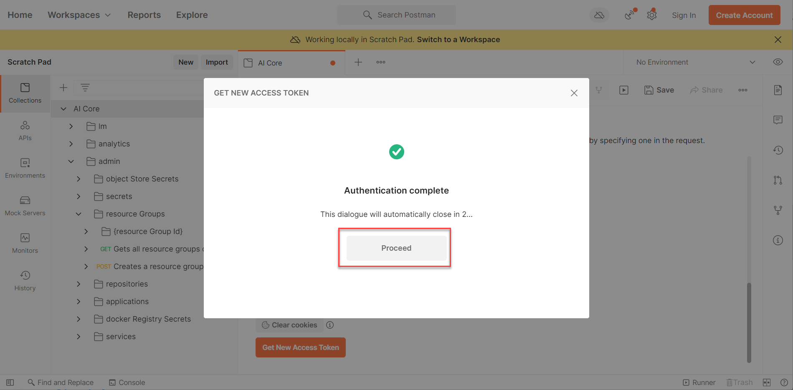

# Set Up Tools to Connect With and Operate SAP AI Core
<!-- description --> Use SAP AI Launchpad, Postman or python to connect with SAP AI Core.

## Prerequisites
- You have created an SAP AI Core instance.

## You will learn
- How to create a connection between SAP AI Core and your tool of choice (SAP AI Launchpad, Postman, python)
- How to look explore the tools for SAP AI Core

## Intro
If you want to use SAP AI Core with python, select the tab for **SAP AI Core SDK** or **AI API client SDK**.

---

### Get your SAP AI Core keys


Using your SAP Business Technology Platform (BTP), to generate keys for the SAP AI Core instance, using [Provision SAP AI Core](https://help.sap.com/docs/AI_CORE/2d6c5984063c40a59eda62f4a9135bee/38c4599432d74c1d94e70f7c955a717d.html)

The following is a set of keys for **example reference only**. Please generate keys for your own SAP AI Core instance.

```JSON
{
  "clientid": "ss-2222-aaa-4444-888-8555!bbb|aicore!bbb",
  "appname": "2222-aaa-4444-888-8555!bbb|aicore!bbb",
  "identityzone": "tutorial",
  "identityzoneid": "11111-dddd-444-888-888888",
  "clientsecret": "qwertyuiop",
  "serviceurls": {
  "AI_API_URL": "https://api.ai.prod.us-east-1.aws.ml.hana.ondemand.com"
  },
  "url": "https://tutorial.authentication.us10.hana.ondemand.com"
}
```


### Get tools to connect to SAP AI Core


[OPTION BEGIN [SAP AI Launchpad]]

Subscribe to SAP AI Launchpad on your SAP BTP Cockpit, and add **SAP AI Launchpad** to the **Entitlements** of your subaccount.

Access the app through your SAP BTP Cockpit.

<!-- border -->

[OPTION END]


[OPTION BEGIN [Postman]]

[Download](https://www.postman.com/downloads/) and install Postman.

[OPTION END]

[OPTION BEGIN [SAP AI Core SDK]]

[Download](https://www.python.org/downloads/) python 3.

Start the installer with the following settings.

<!-- border -->

The command line tool `pip` is the python package installer, it will be installed automatically with python.

Use `pip` to install the SAP AI Core SDK.

```BASH
pip install ai-core-sdk
```

<!-- border -->

Use `pip` to install Jupyter Notebook. Jupyter is used to execute python code pieces in the form of reusable cells.

```BASH
pip install notebook
```

[OPTION END]

[OPTION BEGIN [AI API client SDK]]

The command line tool `pip` is the python package installer, it will be installed automatically with python.

Use `pip` to install the AI API client SDK.

```BASH
pip install ai-api-client-sdk
```

Use `pip` to install Jupyter Notebook. Jupyter is used to execute python code pieces in the form of reusable cells.

```BASH
pip install notebook
```

[OPTION END]


### Set up tools for usage with SAP AI Core


[OPTION BEGIN [SAP AI Launchpad]]

Click on the **Workspaces** app. Click **Add** to create connection to your SAP AI Core instance.

<!-- border -->

Enter the name `my-ai-core` for the connection . Fill other details from your SAP AI Core service key as marked in the image.

> **INFORMATION** If you find that a connection already exists in your SAP AI Launchpad then you may add your connection under a different name. You may add any number of connections to SAP AI Core instances in your SAP AI Launchpad (this may not be case if you are using Free Tier).

<!-- border -->


[OPTION END]

[OPTION BEGIN [Postman]]

Visit [SAP API Business Hub](https://api.sap.com/api/AI_CORE_API/overview) and search for "SAP AI Core". In this site you can find the latest collections and endpoints available for use with SAP AI Core.

Click on the **Download** icon next to the JSON. This downloads a file `AI_CORE_API.json` which has the available API endpoint of SAP AI Core.

<!-- border -->

On the Postman app, click **Import** and open the downloaded JSON file.

<!-- border -->

Click **Upload files** and open `AI_CORE_API.json` file. Next, click **Show advanced settings**. Set the following settings:

<!-- border -->

| Setting | Value
| --- | --- |
|Request parameter generation | Schema
|Response parameter generation | Schema
|Disable optional parameters | ON

Leave other settings unchanged and click **Import**.

You now have your copy of the official API collections of SAP AI Core named `AI Core`.

<!-- border -->

Click on the collection `AI Core`, this shows you the settings page for the whole collections.

<!-- border -->

Under the **Authorization** tab, scroll to **Configure New Token**. Edit the settings, using the example and instructions below as a guide.

<!-- border -->

1. Type any descriptive name for **Token Name**.
2. Set **Grant Type** to `Client Credentials`.
3. Paste your `url` (from your SAP AI Core keys) for **Access Token URL**. Also notice the suffix `/oauth/token`, which you need to add.
4. Set value from your keys.
5. Set value from your keys.
6. Click **Save**.

This process saves your credentials to make the repetitive task of token generation (covered later) easier.

Click on the **Variables** tab. Fill the settings as mentioned below.

<!-- border -->

1. Remove the values from the **Initial Value** column to avoid confusion. Set the value from your `AI_API_URL` for the variable `baseUrl`.

>Note that you have to set part of your `AI_API_URL` (from SAP AI Core Keys) for the value `region` (in Postman), for this you can put any part, there are no specific constraint. **But please ensure you add the suffix `/v2` at the end of you `baseUrl`** as shown in the screenshot.

2. Click **Save**.

[OPTION END]

[OPTION BEGIN [SAP AI Core SDK]]

Start your Jupyter notebook. This will start a Jupyter session in the browser.

```BASH
jupyter notebook
```

Create a python notebook.


Create a new cell.

<!-- border -->

Run the cell.

<!-- border -->

Use this notebook in the tutorial to try out python commands for yourself. Please explore how to save, rename and create new cells in the notebook.

[OPTION END]

[OPTION BEGIN [AI API client SDK]]

Start your Jupyter notebook. This will start a Jupyter session in the browser.

```BASH
jupyter notebook
```

Create a python notebook.


Create a new cell.

<!-- border -->

Run the cell.

<!-- border -->

Use this notebook in the tutorial to try out python commands for yourself. Please explore how to save, rename and create new cells in the notebook.

[OPTION END]


### Connect with SAP AI Core


[OPTION BEGIN [SAP AI Launchpad]]

Click on `my-ai-core` under the **Workspaces** app. You will observe the connection name on the header. You can find new apps on the side navigation bar, like **SAP AI Core Administration** and **ML Operations**.

<!-- border -->

Select `default` from the **Resource Groups** Pane. Again this selection is updated in the header.

<!-- border -->

[OPTION END]


[OPTION BEGIN [Postman]]

Click on the collection **AI Core**. Navigate to the **Authorization** tab and scroll below. Click **Get New Access Token**.

> **IMPORTANT**: If you face error in this step, please check previous steps and ensure you added the suffix `/oauth/token` to the **Access Token URL**.

<!-- border -->

Follow the guided steps in  the dialog box that appears.

<!-- border -->

Click **Use Token**.

<!-- border -->

[OPTION END]

[OPTION BEGIN [SAP AI Core SDK]]

Edit the command with your SAP AI Core credentials. Please add the suffixes to the values of `base_url` and `auth_url` as shown in the code snippet below. Execute the command.

```PYTHON
# Load Library
from ai_core_sdk.ai_core_v2_client import AICoreV2Client

# Create Connection
ai_core_client = AICoreV2Client(
    base_url = "<YOUR_AI_API_URL>" + "/v2", # The present SAP AI Core API version is 2
    auth_url=  "<YOUR_url>" + "/oauth/token", # Suffix to add
    client_id = "<YOUR_clientid>",
    client_secret = "<YOUR_clientsecret>"
)
```

<!-- border -->


[OPTION END]

[OPTION BEGIN [AI API client SDK]]

Edit the command with your SAP AI Core credentials. Please add the suffixes to the values of `base_url` and `auth_url` as shown in the code snippet below. Execute the command.

```PYTHON
# Load library
from ai_api_client_sdk.ai_api_v2_client import AIAPIV2Client

# Create connection
ai_api_client = AIAPIV2Client(
    base_url = "https://api.ai.ml.hana.ondemand.com" + "/v2", # The present SAP AI Core API version is 2
    auth_url=  "https://tutorial.authentication.sap.hana.ondemand.com" + "/oauth/token", # Suffix to add
    client_id = "ab-cdefg-111-12233!h7777|aicore!1111",
    client_secret = "qwertyiop="
)
```

<!-- border -->

[OPTION END]


### Perform an action in SAP AI Core

[OPTION BEGIN [SAP AI Launchpad]]

Click on **Scenarios** in the **ML Operations** app. The term Scenario refers to a use case. You may not have any scenario listed. You will learn how to add workflows (AI pipelines) to SAP AI Core in future tutorials, which can then be used to create scenarios.

<!-- border -->

[OPTION END]

[OPTION BEGIN [Postman]]

List all the resource groups. Check that there is a resource group named **default** in the response.

<!-- border -->

>**Troubleshooting (Optional)**

>If you receive the error: `RBAC: Access Denied`:

>1. Click on the collection named **AI Core**, click the **Authorization** tab, and check whether a token is being used or not. It might be that you generated a token but forgot to click **Use Token** in the process.

>2. Click the **Variables** tab and check if the value for `baseUrl` matches the value of `AI_API_URL` and you have the suffix `/v2` at the end.

[OPTION END]

[OPTION BEGIN [SAP AI Core SDK]]

Execute the command below to list the GitHub repositories connected to your SAP AI Core. If the response prints `error stack trace`, verify that you used the correct set of keys and added the suffixes mentioned the previous step, when setting the connection.

```PYTHON
response = ai_core_client.repositories.query()
print(response.count)
```

<!-- border -->


[OPTION END]

[OPTION BEGIN [AI API client SDK]]
Execute the command below to list the GitHub repositories connected to your SAP AI Core. If the response prints `error stack trace`, verify that you used the correct set of keys and added the suffixes mentioned the previous step, when setting the connection.

```PYTHON
ai_api_client.rest_client.get(
    path="/admin/repositories"
)
```

<!-- border -->

[OPTION END]


### Discover tool specific nuances


[OPTION BEGIN [SAP AI Launchpad]]

If you are don't have apps (like **SAP AI Core Administration** and **ML Operations**) on the navigations pane, please check that you are assigned the required role collections in the SAP BTP Cockpit for SAP AI Launchpad.

If you have assigned the roles and the sections are still not visible then please clear your browser cache and relaunch.

> **INFORMATION**: **New role collections** introduced in new releases of SAP AI Launchpad are not auto-assigned to existing users. The administrator of your SAP BTP Cockpit must ensure that the  correct users are assigned new roles. New role collections and other feature releases can be found in [Release Notes for SAP AI Launchpad](https://help.sap.com/doc/43b304f99a8145809c78f292bfc0bc58/Cloud/en-US/98bf747111574187a7c76f8ced51cfeb.html?sel1=SAP%20AI%20Launchpad).

[OPTION END]


[OPTION BEGIN [Postman]]

You added the suffix `/v2` in your `baseUrl`, because the current SAP AI Core endpoint version is `v2`. You will find all the related information in the SAP API Business Hub.

<!-- border -->

[OPTION END]

[OPTION BEGIN [SAP AI Core SDK]]

Compare the previous step between SAP AI Core SDK and AI API client SDK. Whilst both are python packages offered to control SAP AI Core, the AI API client SDK can also control other AI runtimes which implement the AI API. Therefore the AI API client SDK lacks native function support for operations specific to SAP AI Core, like GitHub repository connection control.

[OPTION END]

[OPTION BEGIN [AI API client SDK]]

When creating a connection to SAP AI Core using the AI API client SDK you must use one of the following:

- Type 1: Required when performing Admin operations, where `base_url` has suffix `/v2`

    ```PYTHON
    # Load library
    from ai_api_client_sdk.ai_api_v2_client import AIAPIV2Client

    # Create connection
    ai_api_client = AIAPIV2Client(
        base_url = "https://api.ai.ml.hana.ondemand.com" + "/v2", # The present SAP AI Core API version is 2
        auth_url=  "https://tutorial.authentication.sap.hana.ondemand.com" + "/oauth/token", # Suffix to add
        client_id = "ab-cdefg-111-12233!h7777|aicore!1111",
        client_secret = "qwertyiop="
    )
    ```

- Type 2: Required when performing lifecycle management operations, where `base_url` has suffix `/v2/lm`

    ```PYTHON
    # Load library
    from ai_api_client_sdk.ai_api_v2_client import AIAPIV2Client

    # Create connection
    ai_api_client = AIAPIV2Client(
        base_url = "https://api.ai.ml.hana.ondemand.com" + "/v2/lm", # The present SAP AI Core API version is 2
        auth_url=  "https://tutorial.authentication.sap.hana.ondemand.com" + "/oauth/token", # Suffix to add
        client_id = "ab-cdefg-111-12233!h7777|aicore!1111",
        client_secret = "qwertyiop="
    )
    ```

Visit [SAP API Business Hub](https://api.sap.com/api/AI_CORE_API/resource) to find out which operation endpoints start with `/v2/admin` (Admin operations) and which ones start with `/v2/lm` (lifecycle management).

[OPTION END]


### Find help provisions for your interface, and the SAP AI Core help page


[OPTION BEGIN [Postman]]

If Postman is unable to decipher the schema of the JSON file that you downloaded, you will require the following information, which is stored, for your reference, at [API Business Hub of SAP AI Core](https://api.sap.com/api/AI_CORE_API/resource).

<!-- border -->

1. Click on any of the endpoints you would like to know information on, for example, click on **Artifact**.

2. Click on **POST** endpoint.

3. Click the **Schema** tab. Here, you will find the detailed description of the values supported by this endpoint.

[OPTION END]

[OPTION BEGIN [SAP AI Core SDK]]

1. Use python's `dir` function to list contained modules and functions.

```PYTHON
print(dir(ai_core_client))
```

<!-- border -->

2. Use python's `help` function on a listed module or function to get a `docstring`, which documents what the function does and what parameters it requires.

```PYTHON
help(ai_core_client.scenario.query)
```

<!-- border -->

[OPTION END]

[OPTION BEGIN [AI API client SDK]]

1. Use python's `dir` function to list contained modules and functions.

```PYTHON
print(dir(ai_api_client))
```

<!-- border -->

2. Use python's `help` function on a listed module or function to get a `docstring`, which documents what the function does and what parameters it requires.

```PYTHON
help(ai_api_client.scenario.query)
```

<!-- border -->

[OPTION END]

For support, look at the [Troubleshooting Guide for SAP AI Core](https://help.sap.com/docs/AI_CORE/2d6c5984063c40a59eda62f4a9135bee/3da90ba77bcb401496028d8bd6e819dd.html?locale=en-US). If this does not help resolve your issue, please raise a ticket.


