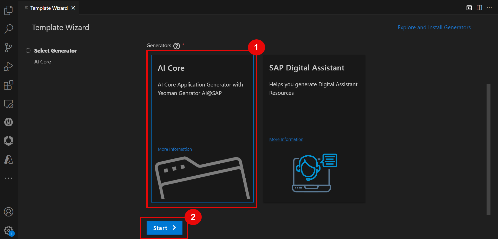
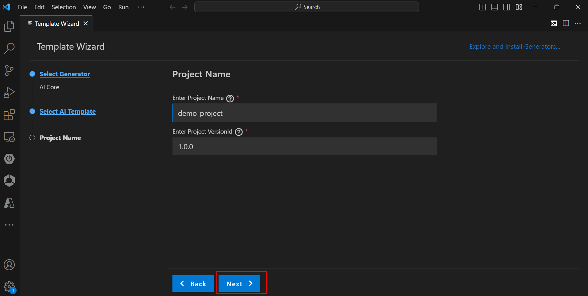
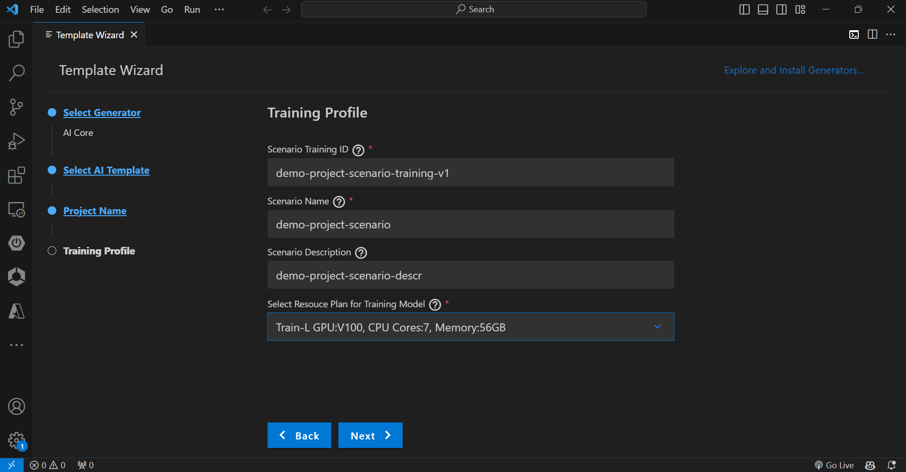
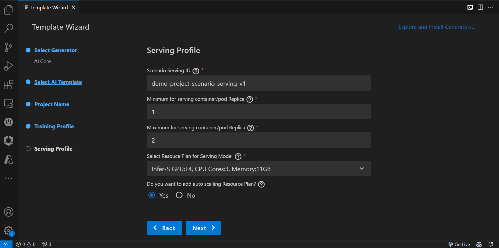
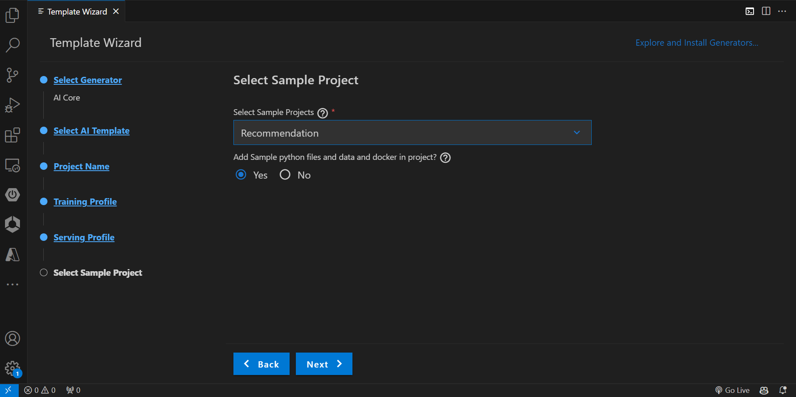
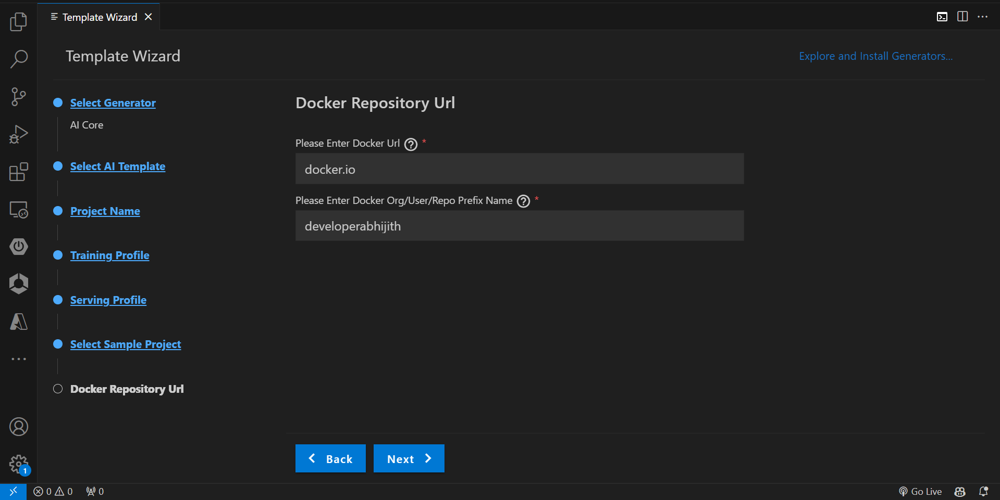
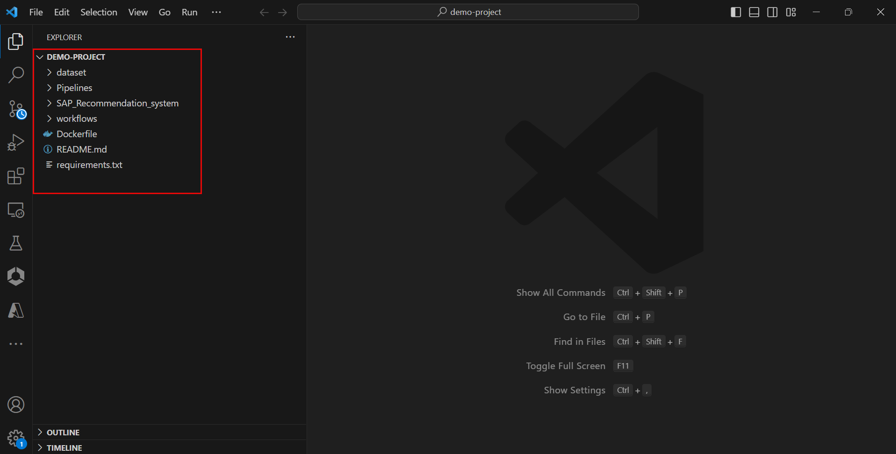
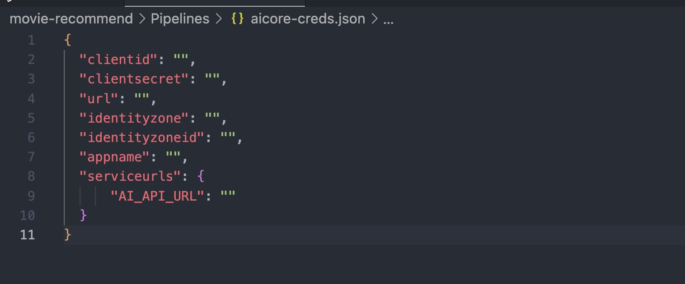
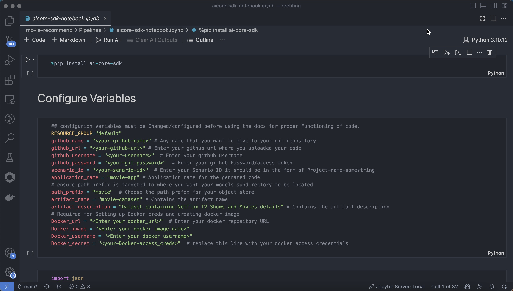

# Deploy a Movie Recommendation System to AI Core Using Template Generator
<!-- description --> Build a portable AI code with Vs code template generator and deploy the same on SAP AI Core. 

## Prerequisites
- Understanding Of SAP AI Core

## You will learn
- How to setup a VS Code template generator
- How to deploy generated code to AI Core

## Intro
In this tutorial we would be Creating a movie recommendation Template and deploying the same using AI core.

### Generate a template for movie recommendaiton

-  press Command + shift + p for *mac* and Control + shift + p for *Windows* to open control center and choose open template wizard.

- Once the Template generator opens choose AI core and press start.

- If you have your custom code choose Basic Project or if you wanted to use the pre-generated training and serving code use AI core sample project for this demo we are going to use.

- enter the project name and version and press enter

- fill up the details like scenario ID and Resource plan.

- Similarly fill the details for Serving Plan.

- Choose the demo sample project as Movie Recommendation and click on next.

- As a last step add the Docker Details like Docker registry URL and username and click next to create the project.

- It will create all the required folders in the current directory.

### Deploying Template to AI Core

In the generated tempelate visit Template folder > Pipelines and replace `ai-core_creds.json` and `S3_creds.json` with your actual AI core Creds.

Once done Under the same pipelines folder open AI-core-skd-notebook and replace the Configure variables with your own Variables and click on run all.

