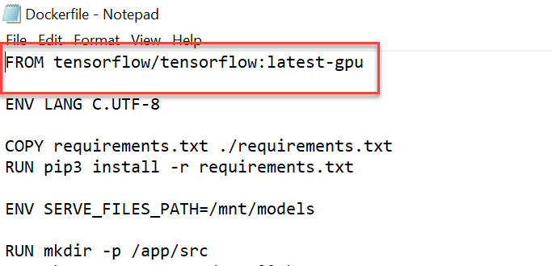
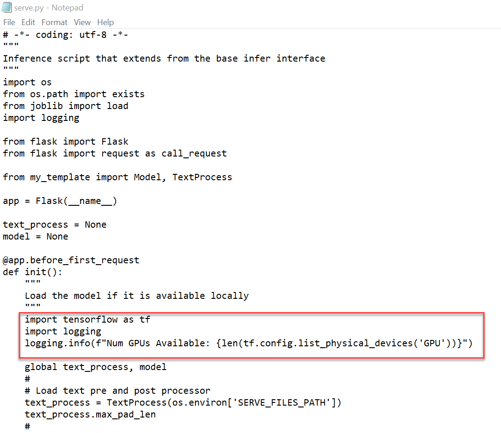
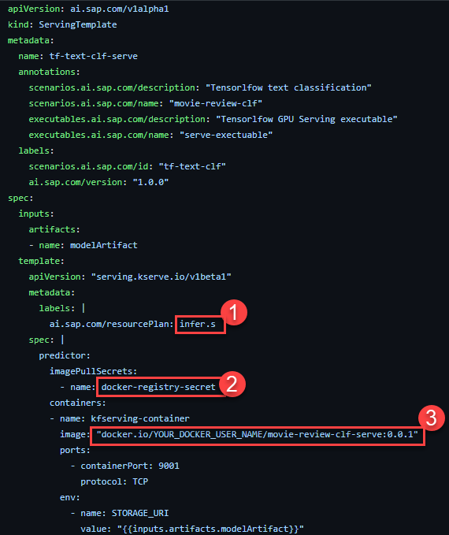

# Use Pre-Trained Tensorflow Models with a GPU in SAP AI Core
<!-- description --> Bring a pre-trained text classifier Tensorflow model to SAP AI Core, and write a workflow which will enable GPU deployment of this model, for movie review classification.

## Prerequisites
- You have [set up an Enterprise SAP BTP Account for Tutorials](group.btp-setup). Follow the instructions to get an account, and set up entitlements and service instances for **SAP AI Core**.
- You have [set up your Git Repository with SAP AI Core](https://help.sap.com/viewer/808d9d442fb0484e9b818924feeb9add/LATEST/en-US/3269092e37d141a293f0dbd7eaafc829.html).
- You have [created docker registry secret in SAP AI Core](https://help.sap.com/viewer/2d6c5984063c40a59eda62f4a9135bee/LATEST/en-US/b29c7437a54f46f39c911052b05aabb1.html)


## You will learn
- How to sync pre-trained model to SAP AI Core
- How to write a pipeline and necessary docker code to enable GPU deployment.
- How to deploy an AI model and use it for online inferencing.

## Pre-read
 All the required files are available for download in the specified step, so that you can easily complete the tutorial.

## Intro
This tutorial demonstrates a use-case in which you have trained an ML model on your local computer and would like to deploy this model to production with SAP AI Core.

The model used in this example uses a pre-trained embedding layer of [`GloVe`](https://nlp.stanford.edu/projects/glove/) followed by custom stack of neural network layers for fine tuning. Please find the following tutorials used as reference for the same.

- [Train your own word embeddings using a simple `Keras`](https://www.tensorflow.org/text/guide/word_embeddings#using_the_embedding_layer)
- [Using pre-trained word embeddings in `Keras`](https://keras.io/examples/nlp/pretrained_word_embeddings/)

By the end of this tutorial you will have a movie review classification model deployed in SAP AI Core, using which you can make predictions in real-time.

You may complete each step of this tutorial using any of the following tools to control operations in your SAP AI Core:

- Postman
- SAP AI Core SDK (demonstrated below)
- AI API client SDK

Please complete the prerequisites before you get started.

---

### Create workspace (resource group)


Create a **resource group** with ID `tf-demo`. You may use any existing resource group or even create multiple resource groups with different IDs.

```PYTHON
response = ai_core_client.resource_groups.create("tf-demo")
```

List all the **resource groups** IDs to confirm creation.

```PYTHON
response = ai_core_client.resource_groups.query()

for rg in response.resources:
    print(rg.resource_group_id)
```

<!-- border -->


### Upload model files to AWS S3


1. Install the AWS CLI client. [Download here](https://docs.aws.amazon.com/cli/latest/userguide/getting-started-install.html).

2. Login to AWS using your AWS CLI.

    Enter your AWS credentials. You can leave the `Default output format` entry blank. Press enter.

    ```BASH
    aws configure
    ```

    <!-- border -->

3. Download and save the following model files in your local system.

    These files are generated locally. They contain embeddings and other settings of the `Tensorflow` model which you will deploy.

    |  File     | Download
    |  :------------- | :-------------
    |  `model.h5`           | [LINK to ZIP](https://help.sap.com/doc/8f444170b7c044ac9db948f2c2a136a7/CLOUD/en-US/model.zip) | Please extract the files after download
    |  `max_pad_len.txt`           | [LINK](https://raw.githubusercontent.com/sap-tutorials/Tutorials/master/tutorials/ai-core-tensorflow-byod/files/model/max_pad_len.txt)
    |  `label_endcoded_classes.npy`           | [LINK](https://github.com/sap-tutorials/Tutorials/blob/0644e8c1bf3fd54a18d47dc3be30899454eeae35/tutorials/ai-core-tensorflow-byod/files/model/label_encoded_classes.npy)
    |  `tokens.json`           | [LINK to ZIP](https://help.sap.com/doc/91fe42b8f21f47f390dd9b9a665bfd3f/CLOUD/en-US/tokens.zip) | Please extract the files after download

    After download, your directory should look like the following:

    <!-- border -->

5. Upload all model files to your AWS S3 bucket. Edit and run the following commands.

    ```BASH[1-4]
    aws s3 cp model.h5 s3://<YOUR_BUKCET_ID>/movie-clf/model/  
    aws s3 cp max_pad_len.txt s3://<YOUR_BUKCET_ID>/movie-clf/model/  
    aws s3 cp label_encoded_classes.npy s3://<YOUR_BUKCET_ID>/movie-clf/model/  
    aws s3 cp tokens.json s3://<YOUR_BUKCET_ID>/movie-clf/model/  

    ```

    <!-- border -->


6. Verify your AWS S3 files upload.


    ```BASH[1]
    aws s3 ls s3://<YOUR_BUKCET_ID>/movie-clf/model/
    ```

    It should look like the following:

    <!-- border -->


### Connect AWS S3 to SAP AI Core


Create an **object store secret** to connect your AWS S3 bucket to SAP AI Core. You can create multiple object store secrets.

Replace the following with your credentials and execute.

> Note that the parameter `path_prefix` should point to the parent folder of the folder where your model is located in AWS S3. Hence the value `movie-clf`.


```PYTHON[6, 7, 8, 10, 11]
response = ai_core_client.object_store_secrets.create(
    resource_group = 'tf-demo',
    type = "S3",
    name = "my-s3-secret1",
    path_prefix = "movie-clf",
    endpoint = "s3-eu-central-1.amazonaws.com", # Change this
    bucket = "asd-11111111-2222-3333-4444-55555555555", # Change this
    region = "eu-central-1", # Change this
    data = {
        "AWS_ACCESS_KEY_ID": "ASDFASDFASDFASDF", # Change this
        "AWS_SECRET_ACCESS_KEY": "asdfASDFqwerQWERasdfQWER" # Change this
    }
)

print(response.__dict__)
```

You should see the following response:

<!-- border -->

> Note that depending on your region, your  AWS endpoint syntax may differ from the example above. In the event of an error, try this step again with alternative syntax. For available syntaxes, please see the [AWS documentation](https://docs.aws.amazon.com/AmazonS3/latest/userguide/WebsiteEndpoints.html)


### Register model as artifact


An **artifact** is a reference to your model files located in AWS S3.

Use the object store secret created in the previous step in the URL field. The URL takes the form `ai://YOUR_OBJECT_STORE_SECERT_NAME/path/to/files`. The `YOUR_OBJECT_STORE_SECERT_NAME` value will be replaced by the `path_prefix` you had used in that object store secret.

> The value of `scenario_id` should not already exist in SAP AI Core at this step, but the following code will not create any errors.

Execute the following:

```PYTHON
from ai_core_sdk.models import Artifact

response = ai_core_client.artifact.create(
    resource_group = 'tf-demo',
    name = "tf-txt-clf-model",
    kind = Artifact.Kind.MODEL,
    url = "ai://my-s3-secret1/model",
    scenario_id = "tf-text-clf",
    description = "Review Classification Model"
)

print(response.__dict__)
```
You should see the following response:

<!-- border -->

> Important: Make a note of the ID. This ID uniquely identifies your artifact.


### Set up serving code


Download and save each of the following files to your local computer. These are the code files that you will upload as a docker image and use later for deployment in SAP AI Core.

| File | Download | Note |
| --- | --- |  --- |
| `Dockerfile` | [LINK](https://raw.githubusercontent.com/sap-tutorials/Tutorials/master/tutorials/ai-core-tensorflow-byod/files/infer/Dockerfile) | No file extension required. Remove manually if automatically added upon save.
| `requirements.txt` | [LINK](https://raw.githubusercontent.com/sap-tutorials/Tutorials/master/tutorials/ai-core-tensorflow-byod/files/infer/requirements.txt)
| `tf_template.py` | [LINK](https://raw.githubusercontent.com/sap-tutorials/Tutorials/master/tutorials/ai-core-tensorflow-byod/files/infer/tf_template.py)
| `serve.py` | [LINK](https://raw.githubusercontent.com/sap-tutorials/Tutorials/master/tutorials/ai-core-tensorflow-byod/files/infer/serve.py)

After download your local directory should look like following:

<!-- border -->

A few important parts of the code are discussed here, which will help your understanding.

- To enable GPU usage by `Tensorflow`, your `Dockerfile` must contain following line. This will set all the required dependencies for the GPU. [Read more on `Tensorflow` docker images](https://hub.docker.com/r/tensorflow/tensorflow/)

    ```
    FROM tensorflow/tensorflow:latest-gpu
    ```

    <!-- border -->

- To verify GPU availability, your code must contain the following lines. The output will appear in the logs of SAP AI Core during deployment.
```
import tensorflow as tf
import logging
logging.info(f"Num GPUs Available: {len(tf.config.list_physical_devices('GPU'))}")
```

    <!-- border -->

Follow the steps to upload the files downloaded in step two as a docker image.

1. Login to your docker account using your terminal. If you incur an error, ensure your [Docker Desktop](https://www.docker.com/products/docker-desktop) is installed and running.

    ```BASH[1]
    docker login <YOUR_DOCKER_REGISTRY> -u <YOUR_DOCKER_USERNAME>

    ```

    Type your password, it may not be visible but continue to type and press the `Enter` key.

    <!-- border -->

2. Navigate to your downloaded files location and build docker the image using the code files that you downloaded.

    ```BASH[1]
    docker build -t <YOUR_DOCKER_REGISTRY>/<YOUR_DOCKER_USERNAME>/movie-review-clf-serve:0.0.1 .
    ```

    > Don't forget the period (.) at the end of the command, this denotes that the location of the `Dockerfile` is the curent directory.
    >
    > **WARNING** The build process will require approximately 3 GBs of storage space.


    <!-- border -->

3. Upload your docker image to the docker cloud.

    ```BASH[1]
    docker push <YOUR_DOCKER_REGISTRY>/<YOUR_DOCKER_USERNAME>/movie-review-clf-serve:0.0.1  
    ```

    <!-- border -->


### Create workflow to serve your model


Save the following executable file in your local system:

| Filename | Download link |
| -------- | ------------- |
| `serving_executable.yaml` | [LINK](https://raw.githubusercontent.com/sap-tutorials/Tutorials/master/tutorials/ai-core-tensorflow-byod/files/workflow/serving_executable.yaml) |

In the executable, ensure the following.

<!-- border -->

1. Ensure that your `resourcePlan` is set to `infer.s`. This will enable the GPU node in deployment. Find all the available resource plans0 [here](https://help.sap.com/viewer/2d6c5984063c40a59eda62f4a9135bee/LATEST/en-US/57f4f19d9b3b46208ee1d72017d0eab6.html).

2. Replace `docker-registry-secret` with the name of your docker registry secret. You can create and use multiple docker secrets in SAP AI Core. [See how to create docker registry secret](https://help.sap.com/viewer/2d6c5984063c40a59eda62f4a9135bee/LATEST/en-US/b29c7437a54f46f39c911052b05aabb1.html).

3. Set your docker image URL.

Save your executable.


### Sync workflow with SAP AI Core


You will create a folder in your GitHub repository connected SAP AI Core, where you will store the workflow (executable). You will then register this folder as an **Application** in SAP AI Core to enable syncing of the workflow as an executable.

> You can create multiple **Applications** in SAP AI Core for syncing multiple folders. This helps you organize separate folders for storing workflows YAML files for separate use cases.

1. Create a folder named `tutorial-tf-text-clf` in your GitHub repository connected to SAP AI Core. Place the following workflows inside it:

    <!-- border -->

2. Edit and execute the code below to create an **Application** and sync the folder `tutorial-tf-text-clf`.

    ```PYTHON[4]
    response = ai_core_client.applications.create(
    application_name = "tf-clf-app",
    revision = "HEAD",
    repository_url = "https://github.com/YOUR_GITHUB_USERNAME/YOUR_REPO_NAME", # Change this
    path = "tutorial-tf-text-clf"
    )

    print(response.__dict__)
    ```
You should then see:

    <!-- border -->

3. Verify your workflow sync status, using the following code:

    ```PYTHON
    response = ai_core_client.applications.get_status(application_name = 'tf-clf-app')

    print(response.__dict__)
    print('*'*80)
    print(response.sync_ressources_status[0].__dict__)
    ```
You should then see:

    <!-- border -->

After you workflows are synced, your **Scenario** will be automatically created in SAP AI Core. The name and ID of the scenario will be same as the one mentioned in your workflows. After The syncing, your workflow will be recognized as an executable.


### Create configuration for deployment


Here are the important pieces of your configuration:

- The `scenario_id` should contain the same value as in your executable.

    <!-- border -->

- The `executable_id` is the `name` key of your executable.

    <!-- border -->

- The `artifact_id` uses the value that was generated after you registered model files as artifacts.

Copy the code below, and replace the `artifact_id` field value with your own ID, then execute the code.

```PYTHON[10]
from ai_core_sdk.models import InputArtifactBinding

response = ai_core_client.configuration.create(
    name = "TF-clf-serve-conf",
    resource_group = "tf-demo",
    scenario_id = "tf-text-clf",
    executable_id = "tf-text-clf-serve",
    input_artifact_bindings = [
        # list
        InputArtifactBinding(key="modelArtifact", artifact_id ="94d2b0fc-7fc3-4fe7-8f54-9509ad782609"), # Change artifact id
    ]
)

print(response.__dict__)
```
You should then see:

<!-- border -->

>Important: Note down the ID generated. This is your unique configuration identification.


### Start deployment


Replace the `configuration_id` field value with the ID from the previous step.  Execute the code.

```PYTHON[3]
response = ai_core_client.deployment.create(
    resource_group = "tf-demo",
    configuration_id = "904ee948-0e99-4007-811c-0aaf2118ffb6" # change this
)
print(response.__dict__)
```
You should then see:
<!-- border -->

>Important: Note the unique ID generated of your deployment. You may create multiple deployments using the same configuration ID, each of which will have s unique endpoint.


### Check deployment status


Replace with the `deployment_id` field value with the ID from previous step and execute your code.

```PYTHON[3]
response = ai_core_client.deployment.get(
    resource_group = "tf-demo",
    deployment_id = "d9dc9250d05f7df8" # Change this
)

print("Status: ", response.status)
print('*'*80)
print(response.__dict__)
```


> This may take 2-3 minutes to change state from `UNKNOWN` > `PENDING` > `RUNNING`.

You should then see:

<!-- border -->


### Make a prediction


Replace the `deployment_id` field value with your deployment ID and execute the code.

> The `custom_endpoint` is generated by the code pieces inside of the docker image. This is customizable and you can add multiple routes for different purposes.

```PYTHON[2]
query_text = "The story after the interval had predictable twist-turns."
deployment_id = "d9dc9250d05f7df8" # Change this

custom_endpoint = "/v1/predict"

prediction = ai_core_client.rest_client.post(
    resource_group = "tf-demo",
    path = "/inference/deployments/" + deployment_id + custom_endpoint,
    body = {
        "text": query_text
    }
)

print(prediction)
```

You should then see something like:

<!-- border -->

Your prediction will be either a `positive` or `negative` along with a confidence value between 0 and 1. This prediction return structure is dependent of the code in docker the image. You can change this as per your requirement.


### Verify GPU availability


In the preceding steps, you saw that your docker code has the following lines, which will log the number of GPUs that the `Tensorflow` package recognizes during deployment.

<!-- border -->

Now query the deployment logs to view its output. Replace with the `deployment_id` field value with your own ID, and execute.

```PYTHON[3]
response = ai_core_client.deployment.query_logs(
    resource_group = "tf-demo",
    deployment_id = "d9dc9250d05f7df8"
)

for log in response.data.result:
    print(log.msg)
    print("---")
```

The output will contain the log message on the number of GPUs available.

<!-- border -->


### Stop deployment


A running deployment incurs costs.

Replace with  the `deployment_id` field value with your ID, and execute the code, to stop the deployment.

```PYTHON[5]
from ai_core_sdk.models import TargetStatus

response = ai_core_client.deployment.modify(
    resource_group = "tf-demo",
    deployment_id = "d9dc9250d05f7df8", # Change this
    target_status = TargetStatus.STOPPED
)

print(response.__dict__)
```

You should then see:

<!-- border -->


