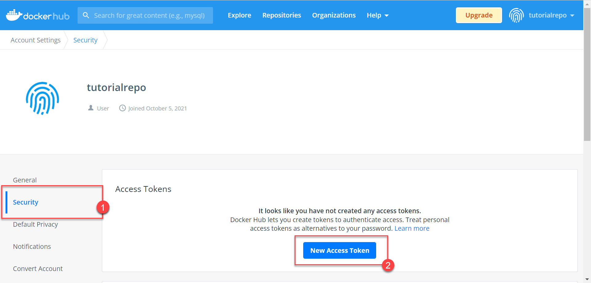
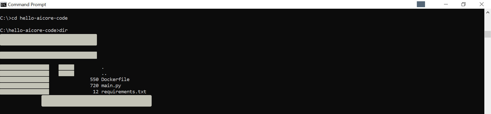
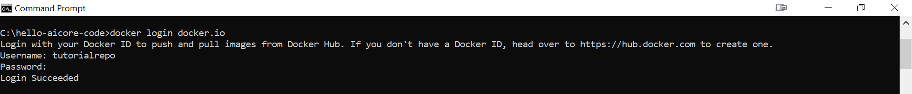
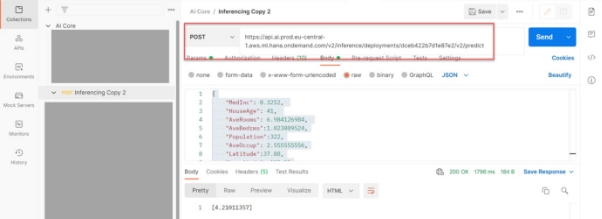

# Build a House Price Predictor with SAP AI Core using VS Code Toolkit
<!-- description --> Build portable AI code with Vs code Toolkit and use it with SAP AI Core.

## Prerequisites
- Understanding Of SAP AI Core

## You will learn
- Setup Vs code Toolkit
- Train a Model on SAP AI core using Vs Code Toolkit
- Deploy a model on SAP AI core Exentention

## Intro
By the end of the tutorial you will have your AI code in form of a Docker image, connected to your AI workflow. You will also know how to use Docker images together with AI core and how to debug your code if the **Execution** goes to an unexpected state. This tutorial is a precursor to the set up of data pipelines and model generation.

You may still complete this tutorial if you are not familiar with the Python programming language.

---

### Create a Docker account and generate a Docker access token


You need a Docker repository to store your AI code on the cloud in the form of Docker images. SAP AI core will fetch your code from this Docker repository. The image ensures that your code is bundled along with all of the dependencies, directory structure and drivers that are required when using GPU.

> **INFORMATION** You may use your organization's own Docker registry/repository. But please ensure that the repository is internet facing, not protected by a firewall.

[Sign Up](https://www.docker.com/) for a Docker account.

Click on the profile button (your profile name) and then select **Account Settings**.

<!-- border -->

Select **Security** from the navigation bar and click **New Access Token**.

<!-- border -->

Follow the guided steps, and then store the token that you receive in your local system.

> **SECURITY TIP**: This access token means that SAP AI Core can access the specified Docker repository without you sharing you Docker credentials. It also means that you can revoke access by deleting the token, rather than having to change your credentials.


### Install Docker Desktop


[Download and Install](https://www.docker.com/products/docker-desktop) Docker Desktop. You will need Docker Desktop to help you build Docker images of your AI code.

Run your Docker Desktop. You will observe "whale icon" on your tray when Docker Desktop is running.

<!-- border -->


### Write AI code for house price prediction


Create a directory (folder) named **hello-aicore-code**.

Create a file `main.py`. Paste the following snippet in the file.

```PYTHON
# Load Datasets
from sklearn import datasets
data_house = datasets.fetch_california_housing()
X = data_house['data']
y = data_house['target']
#
# Partition into Train and test dataset
from sklearn.model_selection import train_test_split
train_x, test_x, train_y, test_y = train_test_split(X, y, test_size=0.3)
#
# Init model
from sklearn.tree import DecisionTreeRegressor
clf = DecisionTreeRegressor()
#
# Train model
clf.fit(train_x, train_y)
#
# Test model
test_r2_score = clf.score(test_x, test_y)
# Output will be available in logs of SAP AI Core.
# Not the ideal way of storing /reporting metrics in SAP AI Core, but that is not the focus this tutorial
print(f"Test Data Score {test_r2_score}")
```

<!-- border -->

Create another file `requirements.txt` in the same directory. Here you will mention which python libraries are required to execute your code.

> **RECOMMENDED** In production you should use the terminal command `pip list --format freeze > requirements.txt` to auto generate `requirements.txt`.

Paste the following snippet into `requirements.txt`.

```TEXT
sklearn==0.0
```

<!-- border -->

The code builds a model using the [California Housing Dataset](https://scikit-learn.org/stable/datasets/real_world.html#california-housing-dataset) available in Scikit-Learn. Note that the code neither reads a datafile nor stores the model. We will cover both of these in a different tutorial.


### Transform your AI code into a Docker image


In the same directory, create a file named `Dockerfile` with **no extension**. This file stores instructions for Docker to build an image. Your Docker image is a Linux distribution, therefore commands in this `Dockerfile` are similar to Linux commands with verbs for Docker as the suffix. Paste the following content **exactly** as it is, into the file:

```TEXT
# Specify which base layers (default dependencies) to use
# You may find more base layers at https://hub.docker.com/
FROM python:3.7
#
# Creates directory within your Docker image
RUN mkdir -p /app/src/
#
# Copies file from your Local system TO path in Docker image
COPY main.py /app/src/
COPY requirements.txt /app/src/
#
# Installs dependencies within you Docker image
RUN pip3 install -r /app/src/requirements.txt
#
# Enable permission to execute anything inside the folder app
RUN chgrp -R 65534 /app && \
    chmod -R 777 /app
```

<!-- border -->

You may notice that you did not specify the command to run the script `main.py` in the `Dockerfile`. This command will be written into the AI workflow and is covered later in this tutorial.

Open your terminal and navigate to your `hello-aicore-code` directory.  You will use the terminal to build your Docker image.

<!-- border -->

Copy and edit the following command to build your docker image. The command follows the format `docker build -t <DOCKER_REGITRY>/<YOUR_DOCKER_USERNAME>/<IMAGE_NAME>:<TAG_NAME>`. So for example, if you are using your organization's registry which has the URL `myteam.myorg`, The command should be `docker build -t myteam.myorg/yourusername/house-price:01 .`

```BASH
docker buildx build –load --platform=<YOUR_DOCKER_PLATFORM>  -t docker.io/<YOUR_DOCKER_USERNAME>/house-price:01 .
```

> **INFORMATION** In the command, `-t` indicates that there is a tag name, followed by a colon and version. The name is your descriptive string, and the version can be in any format, here `house-price` and `01`, respectively. The `.` (dot) at the end instructs Docker to look for the filename `Dockerfile` in the present directory.

> **INFORMATION** The platform information relates to your operating system, for example `linux/amd64`.

The result of this command should be:

<!-- border -->


### Connect your local system to a Docker account


Login to your Docker account from your terminal. This is a one time step that stores your Docker account credentials in your local Docker Desktop.

> **INFORMATION** If you are using your organization docker registry (hosting) please use the command in the format `docker login <URL_YOUR_ORGANIZATIONS_DOCKER_REGISTRY>`

```BASH
docker login docker.io
```

Copy and paste your generated Docker Access Token to use as your password. For security reasons, your input will not be printed on the screen.

<!-- border -->


### Upload a Docker image to the cloud


```BASH
docker push docker.io/<YOUR_USERNAME>/house-price:01
```

<!-- border -->


### Adding GitHub

Here we will be adding our GitHub repository to AI core.

**Step 1:** Select Ai core connection > Go inside admin operations > right click on GitHub repository and click on create git repository.

<!-- border -->

**Step 2:** A pop up will open enter the values as follows

<!-- border -->

<!-- border -->

<!-- border -->

You created the token from from Github.com you can reffer to [here to learn how create Git Token](https://developers.sap.com/tutorials/ai-core-helloworld.html#7ab4912e-2277-496b-84d9-7f1c9ef2365c)

<!-- border -->


Step 3: Fill the details GitHub URL, Name for GitHub, Username, password/token and press enter. This would mark as Completion of adding GitHub.

<!-- border -->


### Creating an application

Here we are adding an application from the GitHub repository we added to AI core.

**Step 1:** Select Ai core connection > Go inside admin operations > right click on Applications and click on Register Application. A Pop up will open

<!-- border -->


Step 2: Fill the details like application Name, GitHub URL, For following this tutorial enter Git version as HEAD (you can choose any specific commit too for the same repository If you are using Head make sure its in CAPS) also enter the path to Argo templates and press enter. This would mark as Completion of registering an application.

**Please follow screenshots below**

<!-- border -->

<!-- border -->

<!-- border -->

<!-- border -->

### Setting up docker secret

Docker secrets are required to Perform the authentication while fetching Docker Images from docker hub.

**How to get docker credentials.:**

**On hub.docker.com**
 Click on profile > Go to settings > go to security and click on create Access Tokens.
<!-- border -->
for more info you can reffer [here](https://developers.sap.com/tutorials/ai-core-code.html#9219aeb5-63bb-460a-b5a4-a2d1dd4db740).


### Connecting docker secrets to AI core

**Step 1 :** Select Ai core connection > Go inside admin operations > right click on Docker Credentials and click on create docker credentials.

<!-- border -->

**Step 2 :** A pop up will open

**Step 3:** Fill the details Docker hub URL, Username, password and Set docker<yourname> as name the secret and press enter.

And Docker credentials would be created.

<!-- border -->

<!-- border -->

Enter the your docker secret secret creds that we created in the previous step

<!-- border -->

<!-- border -->


### Uploading the dataset to S3

Your First task will be to download the dataset from <https://raw.githubusercontent.com/sap-tutorials/Tutorials/master/tutorials/ai-core-data/train.csv>

Then using [AWS CLI](https://docs.aws.amazon.com/cli/latest/userguide/getting-started-install.html), to upload Data to S3 bucket.

**If you don’t have AWS CLI Configured, you can configure AWS CLI using pre-requisite documentation:**

**Command to upload data would be :**


|aws s3 cp train.csv s3://<YOUR\_BUCKET\_NAME>/example-dataset/house-price-toy/data/train.csv |
| :- |

**You can reffer the steps here for uploading Files to S3 [here](https://developers.sap.com/tutorials/ai-core-data.html#dc4f71c0-ed4f-409f-bb1b-695c32438e80)**

### Creating object store credentials

Object store credentials are required to access the data stored inside S3 bucket.

Step 1: Select Ai core connection > Go inside ML operations > right click on Object store creds and click on register Object store creds

<!-- border -->

Step 2: enter all the bucket details like Bucket access id, secret name and region and path to the dataset. Object store secret should be **default**

You can follow the Steps below.

<!-- border -->

Enter your Bucket Name

<!-- border -->

<!-- border -->

Enter your AWS Access Key ID

Enter your AWS Access Secret Key


### Creating an Artifact

Step 1: Select Ai core connection > Go inside ML operations > > Go inside ML Scenarios > Name of the Scenario you created > right click on Artifacts and click on Create Artifact.

<!-- border -->

Step 2: Enter the artifact name for reference, choose type as dataset and enter the artifact URL as : AI://<object\_credStore\_name>/Path\_to\_dataset, and the description for your reference. **In our case it would be ai://default/data**

A pop-up will appear on the screen enter the values as per the screenshots below.

<!-- border -->

**Choose dataset.**

<!-- border -->

<!-- border -->

<!-- border -->

### Creating a Configuration

**Step 1:** Select Ai core connection > Go ML operations > select Resource groups and choose the resource group.

Step 2: Go inside ML Scenarios and you would be able to see all the Scenarios that are available in the Git repository.

Step 3: Go inside the Scenario and click and right click on Create training configuration. 

<!-- border -->

Step 4: A pop up will appear on the top of screen Enter all the required details as per the Argo template and press enter It will create the Configuration that we will use to run the training.

<!-- border -->

<!-- border -->

<!-- border -->

<!-- border -->

### Running Training

Go inside training configurations and choose the created Configuration and right click on Execution and click on Start execution to start the training.

<!-- border -->

Step 2: Expand the execution to see the code status of execution.

<!-- border -->

Step 3 : Right click on the execution id to perform operations related to execution we are choosing check execution logs to see the status of our training.

<!-- border -->

Step 4: A pop up appears at the bottom of VS code where you will be able to see execution logs of the extension.

<!-- border -->


### Deployment

As soon as training ends the second part would be to deploy the model. So, we will be again creating a deployment configuration using the same steps as we used for creating the configuration for training but this time we would refer these steps under serving configurations.

<!-- border -->

Choose the values in pop-up as shown below

<!-- border -->

<!-- border -->

Then we will choose the created configuration and right click on deployments and click on start deployment to deploy the model.

<!-- border -->

Once the deployment starts, we would be able to see the Deployment deployment URL by Right click on view Deployment details. To get the deployment URL.

<!-- border -->

A Output will open at bottom of VS code showing Deployment details.

<!-- border -->


you can refer at : <https://developers.sap.com/tutorials/ai-core-setup.html#6ba18db2-51b7-4c79-baea-df58471b5c42> under Postman Section on how to Download and Setup postman with AI core.

And we would be moving towards inferencing the model using the API by sending the post request to the Deployment URL.

<!-- border -->

Json Body shown in Screen shot

|<p>{</p><p>`    `"MedInc": 8.3252,</p><p>`    `"HouseAge": 41,</p><p>`    `"AveRooms": 6.984126984,</p><p>`    `"AveBedrms":1.023809524,</p><p>`    `"Population":322,</p><p>`    `"AveOccup": 2.555555556,</p><p>`    `"Latitude":37.88,</p><p>`    `"Longitude":-122.23</p><p>}</p>|
| :- |

### Troubleshooting ERRORS

If you get RBAC: Access Denied then check the following in the order mentioned.

- Authorization: if a bearer token is used correctly while authentication .
- The Resource group in the header is your-name.
- If the Endpoint (deployment url) is correct .
- The POST or GET method used in this case we are using a post request.


