## Prerequisites
- You have [set up an Enterprise SAP BTP Account for Tutorials](group.btp-setup). Follow the instructions to get an account, and then to set up entitlements and service instances for the following BTP services/applications.
    - **SAP AI Launchpad**
    - **SAP AI Core**
- You have [set up your Git Repository with SAP AI Core](https://help.sap.com/viewer/808d9d442fb0484e9b818924feeb9add/LATEST/en-US/3269092e37d141a293f0dbd7eaafc829.html).
- You have [uploaded and synced workflows (AI scenario) to SAP AI Core](https://developers.sap.com/tutorials/ai-core-aiapi-postman-workflows.html#).
- You have [created a resource group in SAP AI Core](https://help.sap.com/viewer/808d9d442fb0484e9b818924feeb9add/LATEST/en-US/01753f4dcb454401b539ecc4def641be.html).
- You have [set up your AWS storage with SAP AI Core](https://help.sap.com/viewer/808d9d442fb0484e9b818924feeb9add/LATEST/en-US/b083d73f672c428faac3048b74733546.html).
- You have [registered your dataset as an artifact in SAP AI Core](https://developers.sap.com/tutorials/ai-core-aiapi-postman-train.html#85ffe540-02d1-480b-b7c7-476852a614fc).


## Details
### You will learn
- How to implement operation of machine learning lifecycle
- How to use machine learning pipelines and ingest your own data
- How to deploy an AI model and use for online inferencing

SAP AI Launchpad is a multitenant software as a service (SaaS) application in SAP Business Technology Platform (BTP). AI scenario is an implementation of an AI use case that solves a business's AI need. AI runtimes is a platform that offers processing resources to implement AI scenarios (training and inference). Using SAP AI Launchpad you will be able to manage AI scenarios across multiple instances of AI runtimes like SAP AI Core.


### Functional Overview

Who is this tool for?

Primarily SAP AI Launchpad has different component apps that cater to different personas and their needs.


|  Apps   | Persona | Usage |
|  :------------- | :------------- | :------------- |
|  Workspace           | Admin/AI Operations | Create and manage connections to underline AI runtime or service.
|  ML Operations | AI operations/AI Engineers | Provide operations and lifecycle management capabilities for AI scenarios.


**Text Classification Use Case**

The text classification use case demonstrated here will classify text into categories:
**complaint** or **compliment**

Your organization would like to create and productize the example text classification scenario in an AI runtime (such as SAP AI Core). You are an ML Ops engineer, using SAP AI Launchpad, and you will manage operations and lifecycle tasks for the scenario for one of your organization's customer.

---

[ACCORDION-BEGIN [Step 1: ](Connect to runtime)]

The operations for the text classification use case will be implemented in SAP AI Core runtime (the platform system to execute AI).  

You will manage the operations on your SAP AI Core by connecting to it through the SAP AI Launchpad.

The **Workspaces** app helps you manage the connection.

1. Click **Add** in SAP AI Launchpad under **Workspaces** app.

    !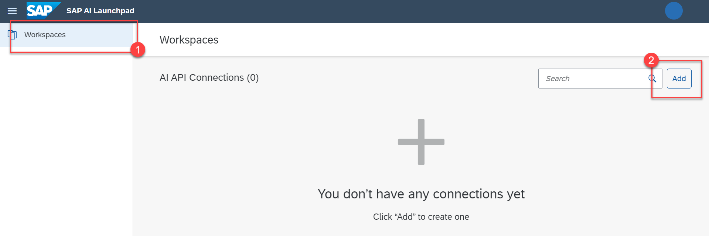

2. Fill in the details from your SAP AI Core service key.

    !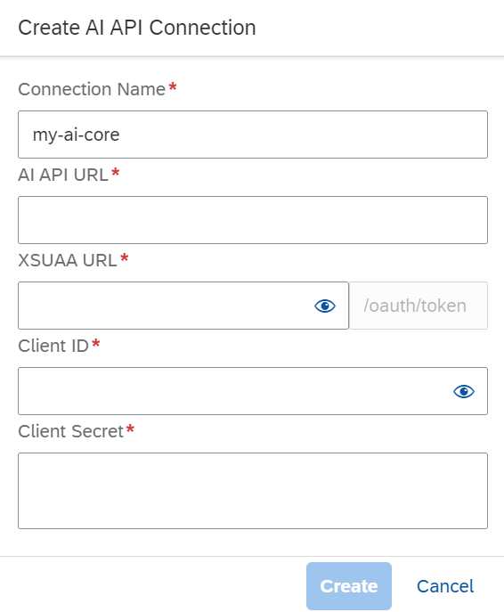

    Name the connection `my-ai-core`. See [how to create service key for SAP AI Core](https://help.sap.com/viewer/2d6c5984063c40a59eda62f4a9135bee/LATEST/en-US/7323ff4e37ba41c198b06e9669b80920.html). Use the following table to fill other fields.

    |  Field Name     | Key Name in Service Key of your SAP AI Core
    |  :------------- | :-------------
    |  AI API           | **`AI_API_URL`**
    |  XSUAA            | **`url`**
    |  Client ID        | **`clientid`**
    |  Client Secret    | **`clientsecret`**

Your new connection will be viewable under **Workspace** as AI API Connection.

>**AI API** refers to an application layer that enables communication between your SAP AI Launchpad and SAP AI Core.

!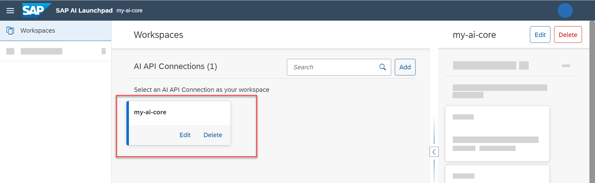

[DONE]
[ACCORDION-END]

[ACCORDION-BEGIN [Step 2: ](Set connection context)]

Select the AI API Connection named `my-ai-core`, The resource groups pane will appear.

!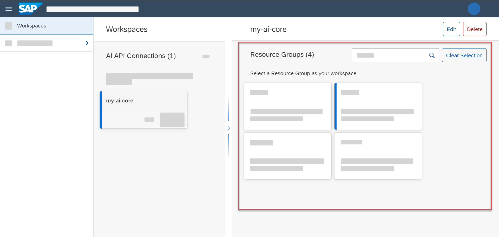

> ### What's resource group?
>
> Resource Groups in your SAP AI Core represents a virtual collection related resources. These resources includes AI artifacts (datasets, models, etc.), configurations, execution (AI model training process) and deployments. For more information, see [Resource Groups](https://help.sap.com/viewer/2d6c5984063c40a59eda62f4a9135bee/LATEST/en-US/26c6c6b50e3f412f8bc0cd6a8ebdb850.html).
>
> In this tutorial, you will use resource group to represent your organization's customer for whom you will implement text classification use case.

Select **Resource Group** named `default` (or `tutorial`) will be available on your SAP AI Launchpad.

!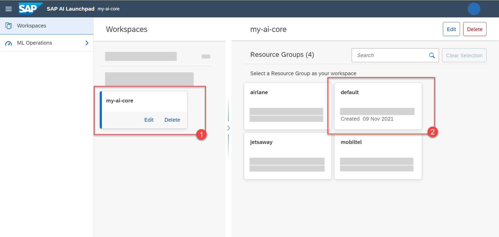

> All the steps in this tutorial will only affect the selected resource group. You can switch between your resource groups and perform all the same steps.

Preview your set context (connection name and resource group) under header.

!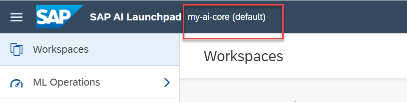

[DONE]
[ACCORDION-END]


[ACCORDION-BEGIN [Step 3: ](View available ML operations)]

View all your available ML operations. The operations will affect only the selected connection context.

!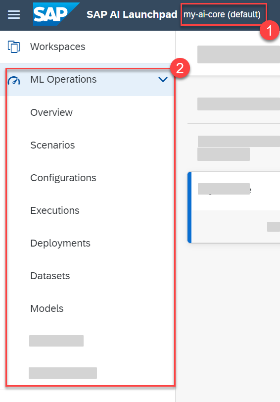

You will use each of these operations in subsequent steps.

[DONE]
[ACCORDION-END]

[ACCORDION-BEGIN [Step 4: ](View text classification scenario)]

> A scenario is a technical realization of a business use case (or parts thereof) that benefits from using AI technology. A scenario groups executables (AI pipelines).

Select **Scenario** under **ML Operations**.

Click `text-clf-tutorial-scenario` (row) to see its overview.

!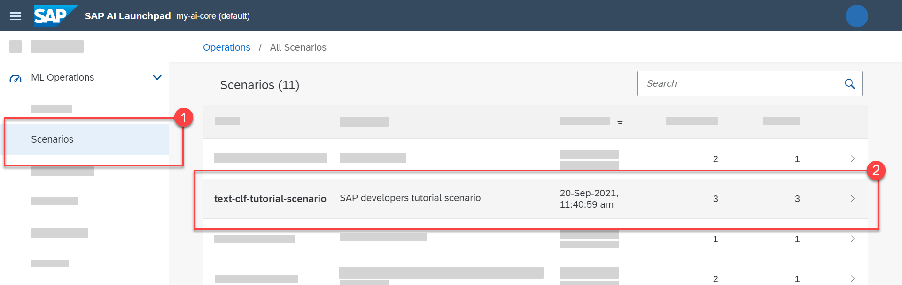

> Scenario is created automatically by taking data from the workflow templates you have synced with your SAP AI Core in the prerequisites.


[DONE]
[ACCORDION-END]

[ACCORDION-BEGIN [Step 5: ](View executables)]

> Executables are AI pipelines for your AI scenarios. Executables refers to the workflows you synced with your SAP AI Core in the prerequisites.

Click **Executables** tab in the `text-clf-tutorial-scenario` scenario dashboard.

!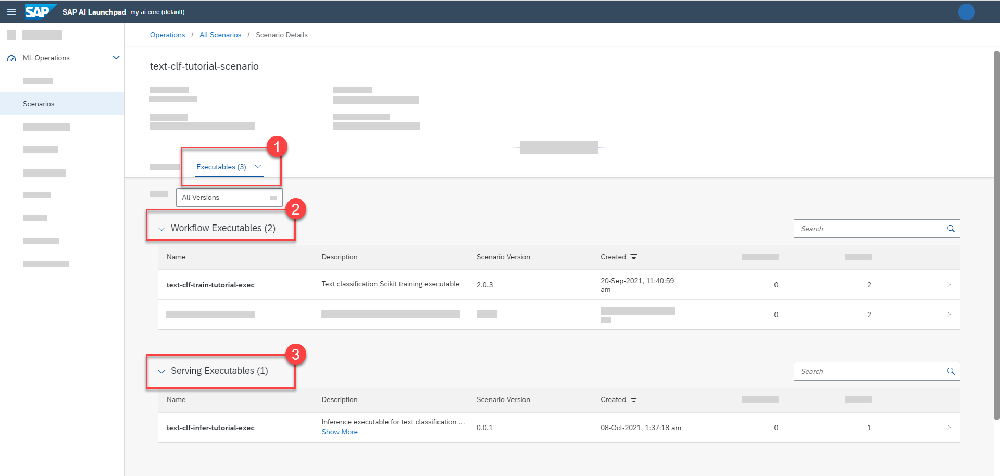

You will see two kinds of executables.

| Executable Kind | Description |
| --- | --- |
| Workflow Executable | AI pipeline used to train model. |
| Serving Executable | AI pipeline used to deploy model. |

You will use each kind of these executables. You must know their name and version listed.

[DONE]
[ACCORDION-END]

[ACCORDION-BEGIN [Step 6: ](Explore dataset)]

Select **Datasets** under **ML Operations**. This list dataset artifacts present in your selected connection context.

> ### What's an artifact?
>
> An artifact, it is a reference to a data source (example AWS S3 Storage Bucket) and the instruments required to access and investigate it (the data source path). This gives you flexibility in the type/ structure/ count of files you want to use as dataset with your executable.

Find `airline-complaints` dataset. You must know its ID (unique) to use this dataset for training text classification.

!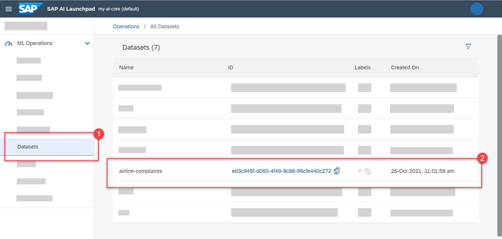

[DONE]
[ACCORDION-END]

[ACCORDION-BEGIN [Step 7: ](Set training configuration)]

With **configuration** you bind text classification scenario's executable (AI pipeline) with dataset (artifact) to train the model.

1. Select **Configuration** under **ML Operations**. Click **Create**.

    !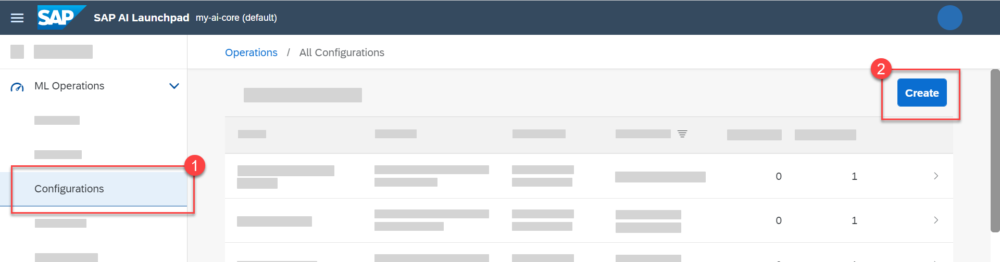

2. Set configuration details as shown below.

    !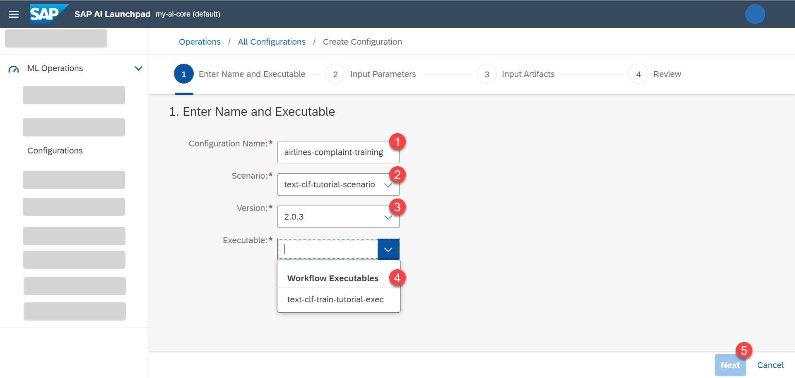
    <div>&nbsp;</div>

    |  Field Name     | Value | Note
    |  :------------- | :------------- | :------
    |  Configuration Name | **`airlines-complaint-training`**   | |
    |  Scenario           | **`text-clf-tutorial-scenario`**    | |
    |  Version            | **`2.0.3`** or **`1.0.0`**          | Choose version similar to synced workflow |
    |  Executable         | **`text-clf-train-tutorial-exec`**  | **Workflow executable** refers to an executable for training the model |


3. Click **Next** when asked for **Input Parameters**.
    > With **Input Parameters** you set values to the **placeholder for hyper-parameters** in your executable.

    !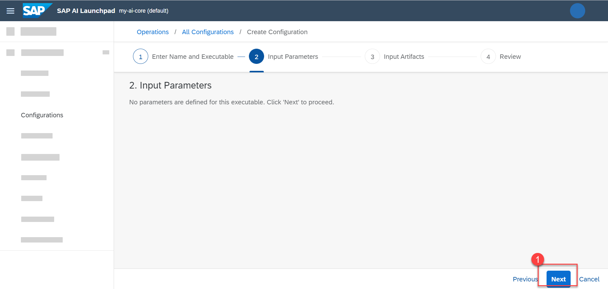

4. Identify your dataset row in the **Available Artifacts** pane by using the unique ID. Select the drop-down next to it and check `text-data`.

    > With **Input artifacts** you set values to **placeholder for artifacts** (dataset or models) in your executable. Here `text-data` is a placeholder name for which to set value for.

    !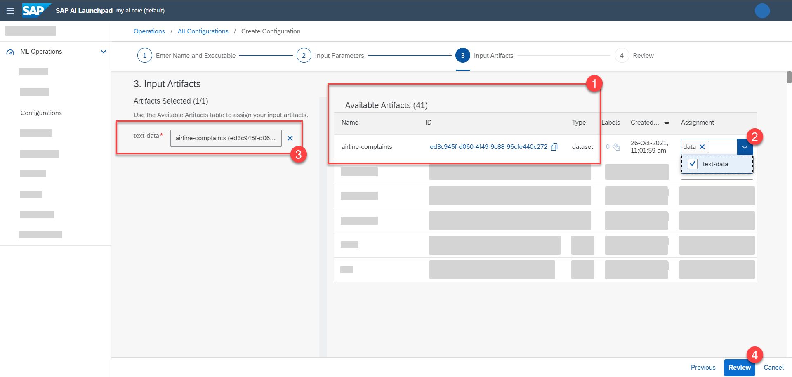

5. Review your configuration settings and click **Create**.

    !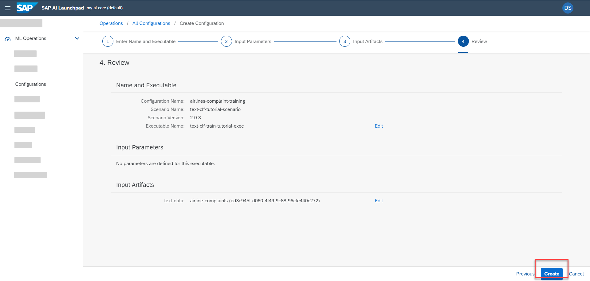

You will see the overview of your configuration. The configuration ID is a unique identification of your configuration.

> You can create multiple **Configurations** on the same executable with different values for the placeholders, that is, **Input Artifacts** or **Parameters**.

[DONE]
[ACCORDION-END]

[ACCORDION-BEGIN [Step 8: ](Start training with execution)]

> ### What's an execution?
>
>Execution refers to the training process. It is a one-life process, therefore, you use the **configuration** to create another execution with the same settings (value bindings).

1. Click **Execution** under **ML Operations**. Then click **Create**.

    !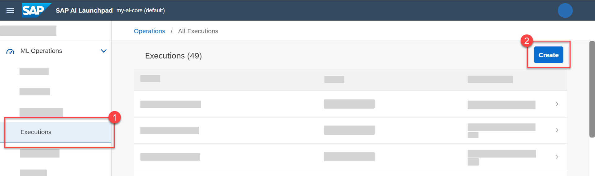

2. Select the configuration named `airlines-complaint-training`.

    Verify your configuration ID and click **Create**.

    !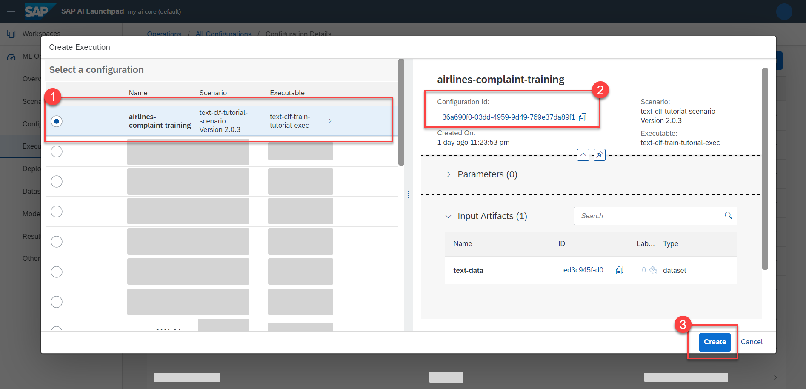

    You will be redirected to the dashboard of your newly created **Execution**.

2.	Observe each step of execution that is, your training process.

    !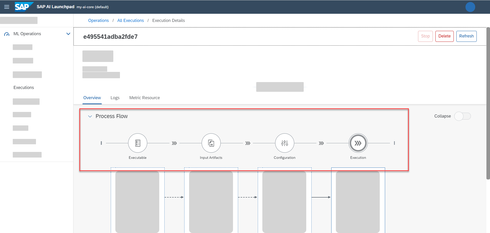

3.	Click **Refresh**.

    Once the execution status changes to `COMPLETED`, it will generate **Output Artifact** that is, model for text classification.

    !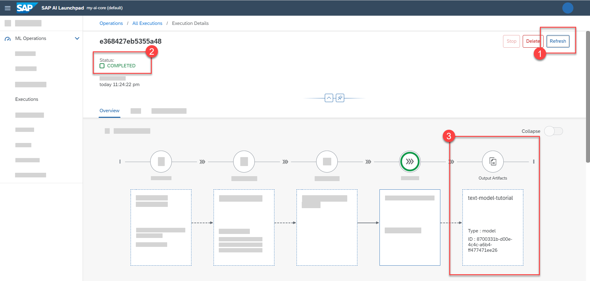

Take a note of your generated Output Artifact's (model) ID. You can always visit the execution details page to get this.

[DONE]
[ACCORDION-END]

[ACCORDION-BEGIN [Step 9: ](Set deployment configuration)]

Previously you bound the **Workflow Executable** to the dataset using **configuration** to train model.

Now you will bind **Serving Executable** to the model using configuration to deploy the model.

1. Select **Configuration** under **ML Operations**. Click **Create**.

    !


2. Set the configuration details as shown below.

    !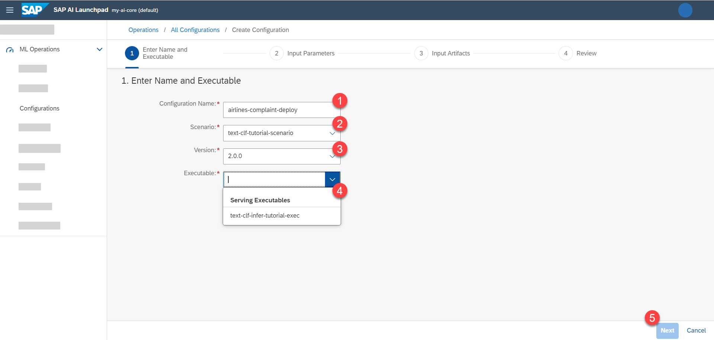
    <div>&nbsp;</div>

    |  Field Name     | Value | Note
    |  :------------- | :------------- | :------
    |  Configuration Name | **`airlines-complaint-deploy`**   | |
    |  Scenario           | **`text-clf-tutorial-scenario`**    | |
    |  Version            | **`2.0.0`** or **`1.0.0`**          | Choose version similar to synced workflow |
    |  Executable         | **`text-clf-infer-tutorial-exec`**  | **Serving executable** refers to an executable for deploying the model. |


3. Click **Next** when asked for **Input Parameters**.
    > With **Input Parameters** you set values to the placeholder for hyper-parameters in your executable.

    !

4. Identify your model row in the **Available Artifacts** pane by using the unique ID. Select the drop-down next to it and check `text-data`.

    > Input artifacts refers to placeholder for artifacts (dataset or models) in your executable. Here the `textmodel` is the placeholder name for artifact.

    !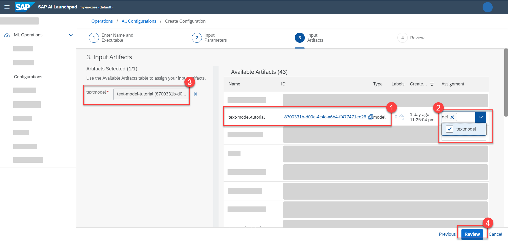

5. Review your configuration settings and click **Create**.

    !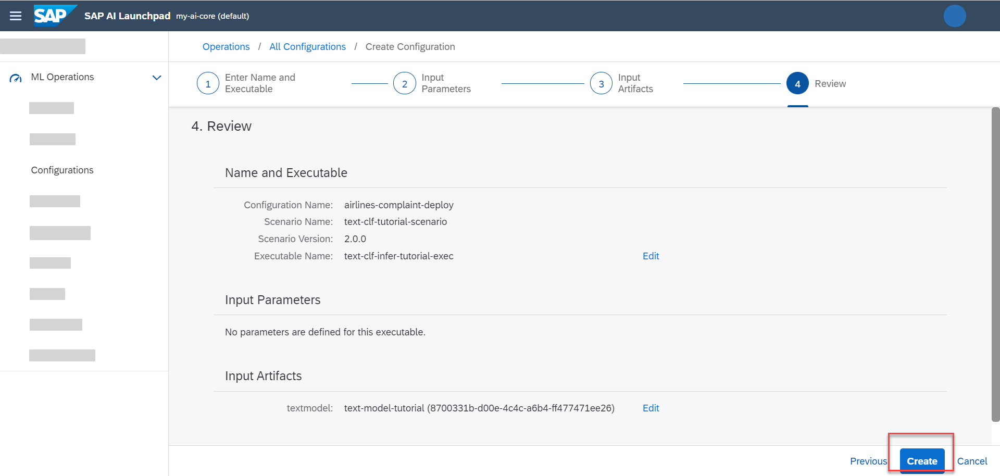

You will see the overview of your configuration.

[DONE]
[ACCORDION-END]

[ACCORDION-BEGIN [Step 10: ](Start model serving with deployment)]

> ### What's a deployment?
>
> A deployment refers to the serving/ hosting your model. For this tutorial, the runtime is SAP AI Core, so it will generate a REST API endpoint URL using which you can classify text as `compliment` or `complaint` in real time (known as online inferencing).
>
> Alike execution, a deployment is also one-life process, therefore you use the **configuration** to create another deployment having same settings (bindings of values). **But the endpoint URL will be different**.

1. Click **Deployment** under **ML Operations**. Then click **Create**.

    !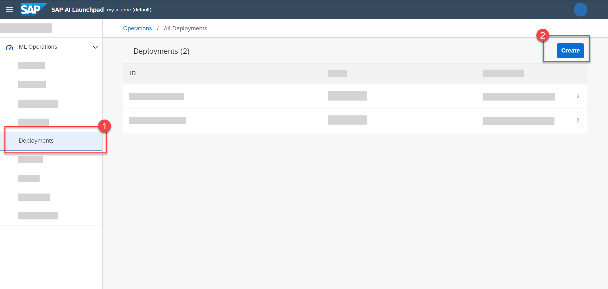


2. Select the configuration named `airlines-complaint-deploy`.

    Verify your configuration ID and click **Create**.

    !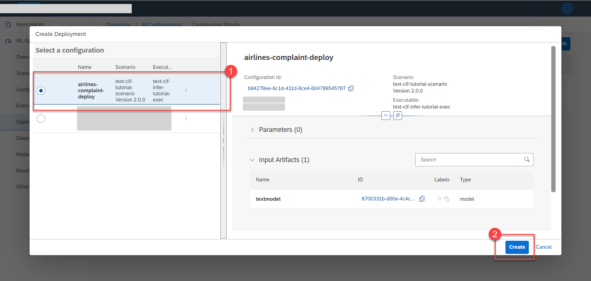

    You will be redirected to the dashboard of your newly created **Deployment**.

3. Observe each step of model deploying process.

    !

4. Click **Refresh**. Once your execution status changes to `RUNNING`, it will generate endpoint.

    !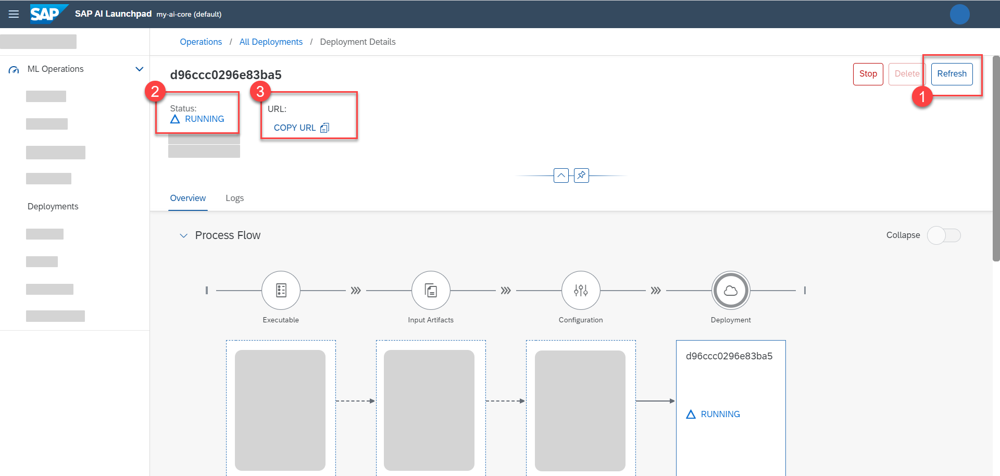

[DONE]
[ACCORDION-END]

[ACCORDION-BEGIN [Step 11: ](Make prediction)]

1. Click **Deployments** under **ML Operation**.

2. Select a deployment (ID may be different) with status `RUNNING`.

    !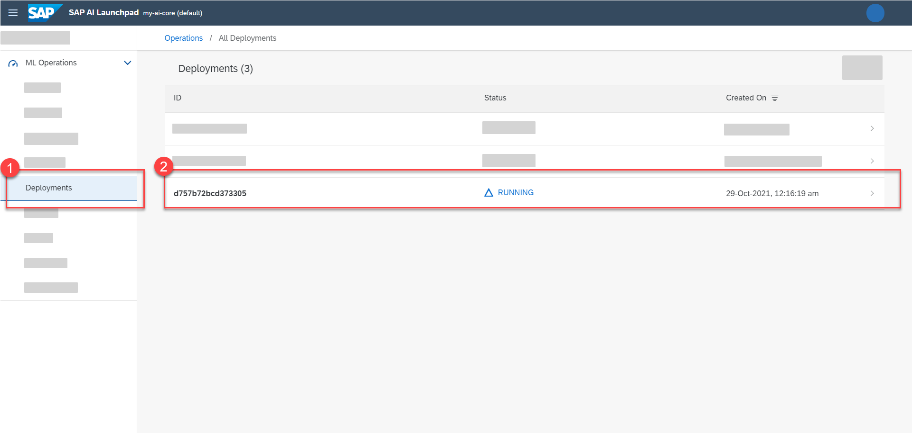

3. Click **COPY URL**.

    !

4. Open your REST API client , postman endpoint. See [Set Up Postman Client for SAP AI Core](https://developers.sap.com/tutorials/ai-core-aiapi-postman-setup.html#).

5. Make the following REST API call.

    - **Endpoint**

        **POST**
        `{{deploymenturl}}/v1/models/{{modelName}}:predict`

        > **CAUTION:** The endpoint usage to make inference depends upon code written in the docker image referenced by your serving executable. This may not necessarily be the same in all other scenarios.

    - **Postman Environment Variable**

        | VARIABLE | CURRENT VALUE |
        | --- | --- |
        | `deploymentURL` | *(copied URL from SAP AI Launchpad)*
        | `modelName` | `textmodel` |

    - **Headers**

        | Key | Value |
        | --- | --- |
        | `Content-Type` | application/json |
        | `AI-Resource-Group` | default |

    - **Body**

        ```
        {
            "text": "I loved this food, it was very good"
        }
        ```

    When the call is all set up, click **Send**.

    The following is a sample response:

    !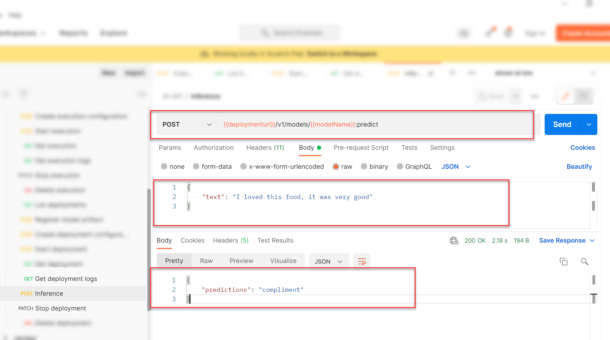

[DONE]
[ACCORDION-END]

[ACCORDION-BEGIN [Step 12: ](Stop model deployment to save cost)]

Cost of running deployment depends upon on your SAP AI Core runtime and the resource quota mentioned in your serving executable. For more information refer SAP AI Core product description guide.

1. Click **Deployments** under **ML Operation**.

2. Select a deployment (ID may be different) with status `RUNNING`.

    !

2. Click **STOP** to release computing resource from your SAP AI Core. Followed by **DELETE** to delete information of this deployment.

    !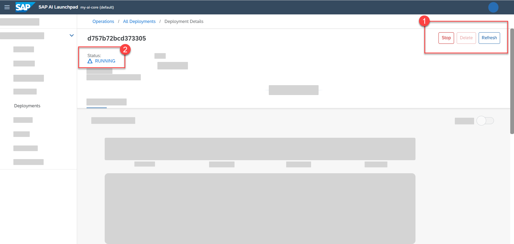

[VALIDATE_1]
[ACCORDION-END]
