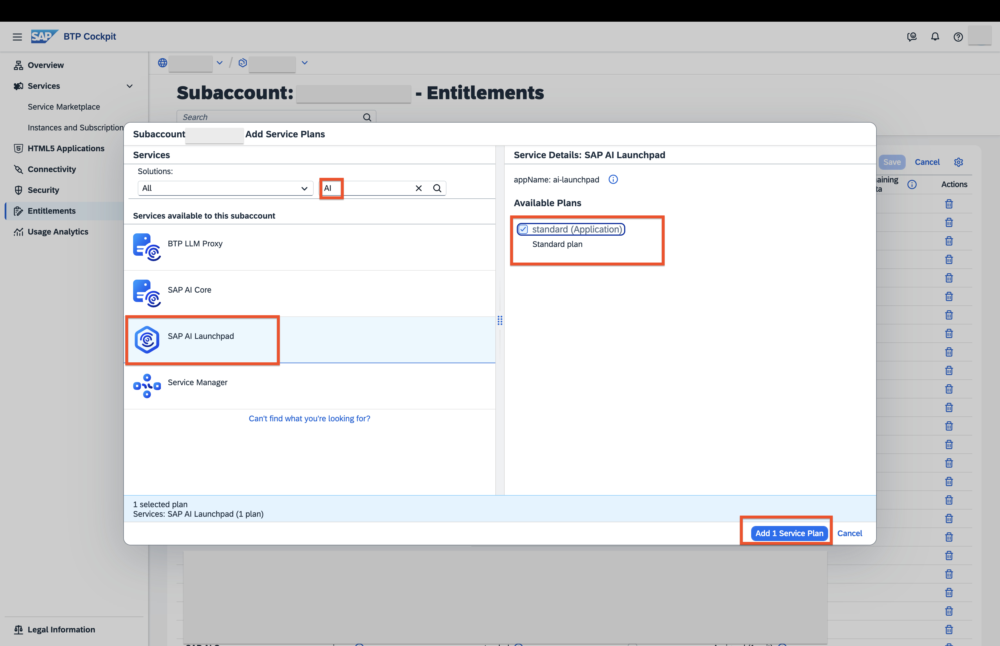
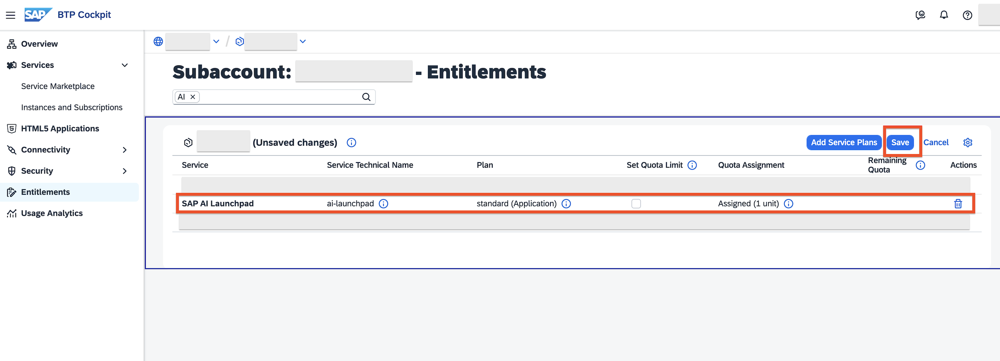
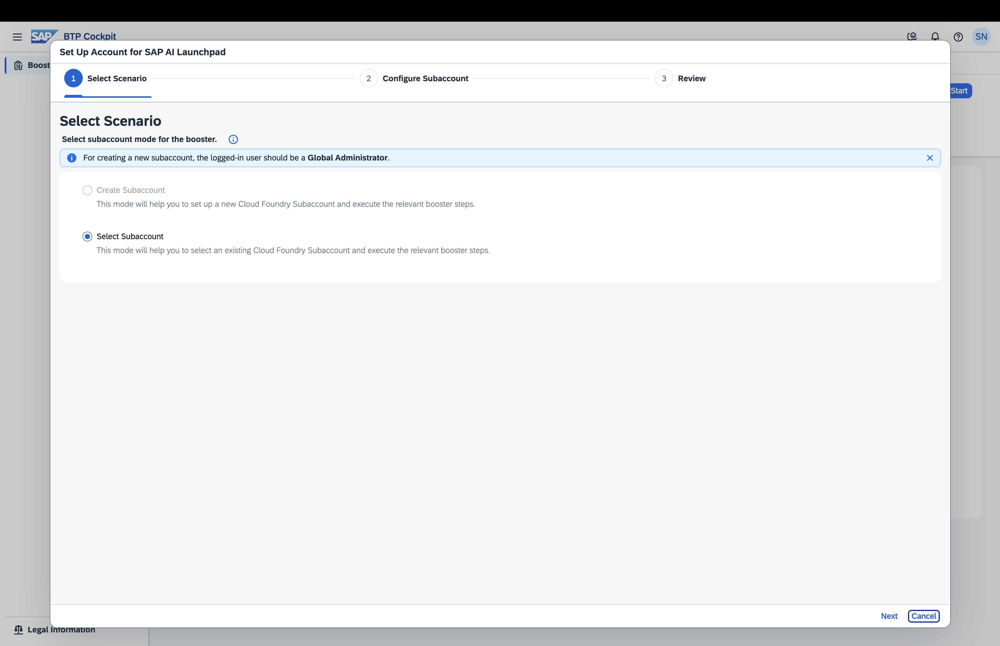
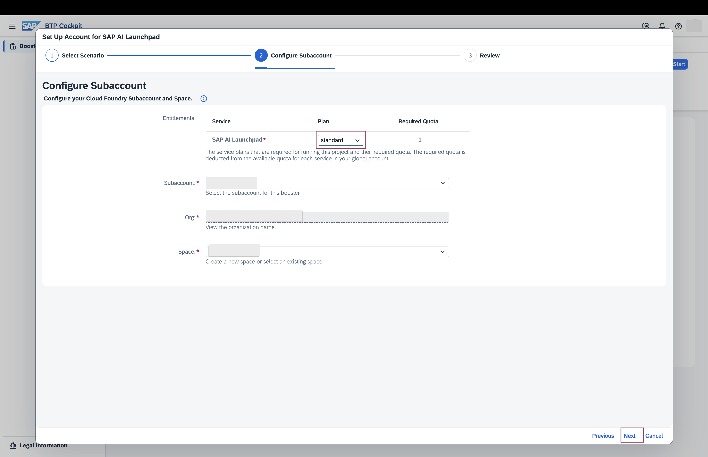
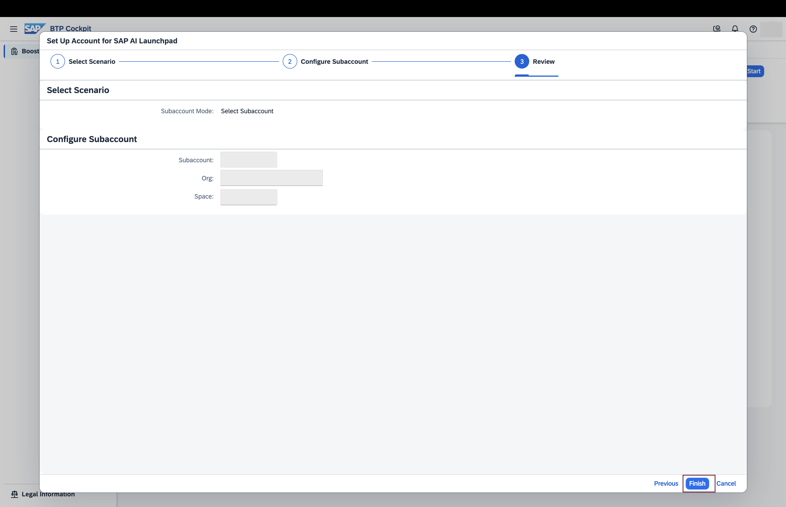
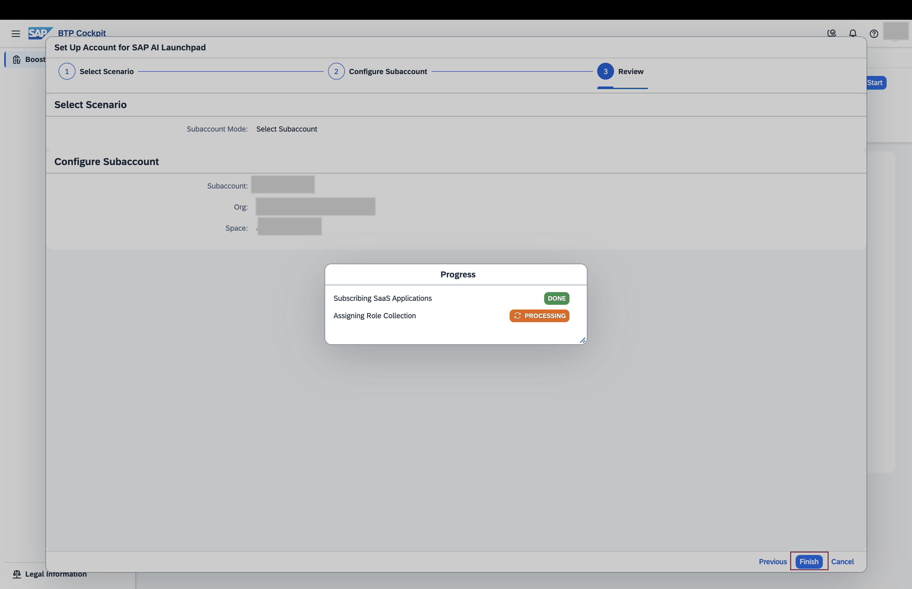
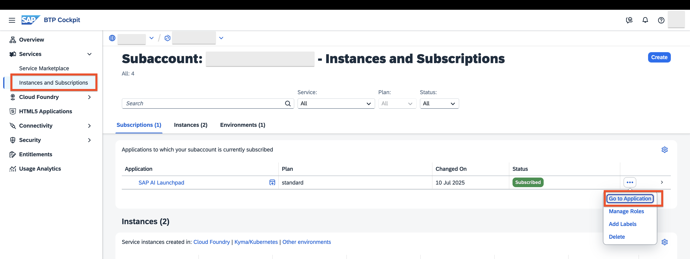
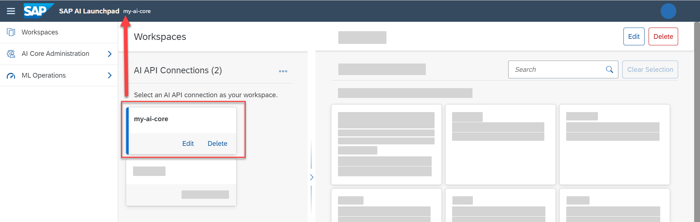

# Setup Generative AI Hub in SAP AI Launchpad
<!-- description --> Set up Generative AI Hub in SAP AI Launchpad.
## Prerequisites
- A BTP global account
If you are an SAP Developer or SAP employee, please refer to the following links ( **for internal SAP stakeholders only** ) - 
[How to create a BTP Account (internal)](https://me.sap.com/notes/3493139)
[SAP AI Core](https://help.sap.com/docs/sap-ai-core?version=INTERNAL&locale=en-US&state=PRODUCTION)
If you are an external developer or a customer or a partner kindly refer to this [tutorial](https://developers.sap.com/tutorials/btp-cockpit-entitlements.html)
- A BTP global account, For more details, refer to: [BTP global account](https://statics.teams.cdn.office.net/evergreen-assets/safelinks/1/atp-safelinks.html)
- To continue this tutorial, you should have a BTP subaccount

## You will learn
- In this tutorial, you’ll learn how to set up SAP AI Launchpad and connect it to SAP AI Core to get started with orchestration in the Generative AI Hub.

## Pre-read

In this tutorial, you’ll learn how to **set up SAP AI Launchpad** and connect it to SAP AI Core to get started with **orchestration** in the **Generative AI Hub**.

SAP AI Launchpad is a service which you can link to your BTP global account. The launchpad offers an easy-to-use interface to manage AI workflow administration, processes, and tasks. 
 
The **Generative AI Hub** incorporates generative AI into your AI activities in SAP AI Core. You can access Generative AI Hub via SAP AI Launchpad.

Boosters is available for SAP AI Launchpad. Boosters are a set of guided interactive steps that enable you to select, configure, and consume services on SAP BTP. In this tutorial, we'll use the SAP AI Launchpad booster to create the subscription for SAP AI Launchpad in your subaccount with the standard plans.

> **Note:** SAP AI Launchpad is optional, but is the recommended interface for use with SAP AI Core.

---

### Add AI Launchpad Entitlements to your subaccount

> **Note:** SAP AI Launchpad is optional, but is the recommended interface for use with SAP AI Core.

Entitlements and quota are managed at the global account and directory levels, distributed to directories and subaccounts, and consumed by the subaccounts. See also [Entitlements and Quotas](https://help.sap.com/viewer/65de2977205c403bbc107264b8eccf4b/Cloud/en-US/00aa2c23479d42568b18882b1ca90d79.html).

- **Entitlements** are your right to provision and consume a resource. They refer to what you’re entitled to use (for example, which services and service plans).

- **Quota** is the numeric quantity that defines the maximum allowed consumption of that resource. In other words, how much of a service plan you’re entitled to use.

Open the SAP BTP cockpit, access your global account and go to your subaccount.

Check the entitlements for your subaccount by clicking `Entitlements`.

Click `Configure Entitlements` > `Add Service Plans`.

Select SAP AI Core and the `standard` service plan.

Save your new entitlement.

### Run the booster for SAP AI Launchpad

Choose `Boosters` from the navigation pane, and then choose the booster for `SAP AI Launchpad` from the selection. 

Click `Start` when you are ready.

In the Scenario Section, choose `Select Subaccount` option and click `Next`.

In the Configure Subaccount, choose `standard` plan, your subaccount and space where you want to provision SAP AI Launchpad and click `Next`

Review the subaccount and entitlement details you have selected previously and click `Finish`.

wait until setup completes. Once completed, navigate to your subaccount.

### View your instances

View your SAP AI Launchpad instance by navigating to `Instances and subscriptions`. To see the details of your new instance, click the chevron on the entry.

### Setup SAP AI Launchpad for usage with SAP AI Core
Click on the **Workspaces** app. Click **Add** to create connection to your SAP AI Core instance.

Enter the name `my-ai-core` for the connection . Fill other details from your SAP AI Core service key as marked in the image.

> **INFORMATION** If you find that a connection already exists in your SAP AI Launchpad then you may add your connection under a different name. You may add any number of connections to SAP AI Core instances in your SAP AI Launchpad (this may not be case if you are using Free Tier).

### Connect with SAP AI Core

Click on `my-ai-core` under the **Workspaces** app. You will observe the connection name on the header. You can find new apps on the side navigation bar, like **Generative AI Hub**.

Select `default` from the **Resource Groups** Pane. Again this selection is updated in the header.

### Get started with Orchestration in Generative AI Hub

As part of the SAP AI Core onboarding process, an `orchestration deployment` is automatically created in the `default resource group`.

This means you can start using orchestration in the Generative AI Hub right away—no need to create a separate deployment.

Click on `Generative AI Hub` > `Orchestration`

### What's Next?

You can proceed to the [Orchestration Tutorial](https://developers.sap.com/tutorials/ai-core-orchestration-consumption.html) to learn `how to consume generative AI models using the orchestration capabilities available in the Generative AI Hub`.

