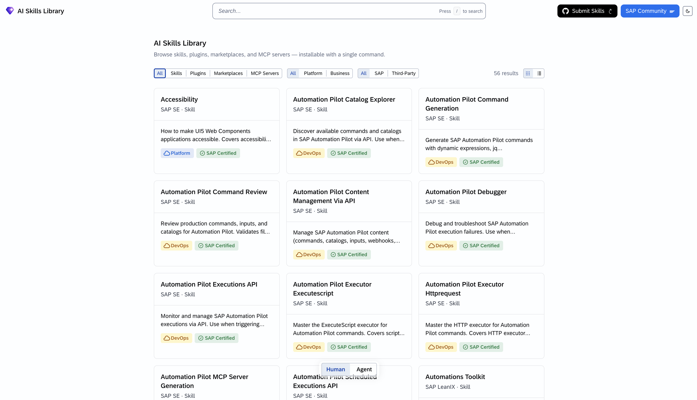
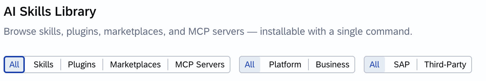
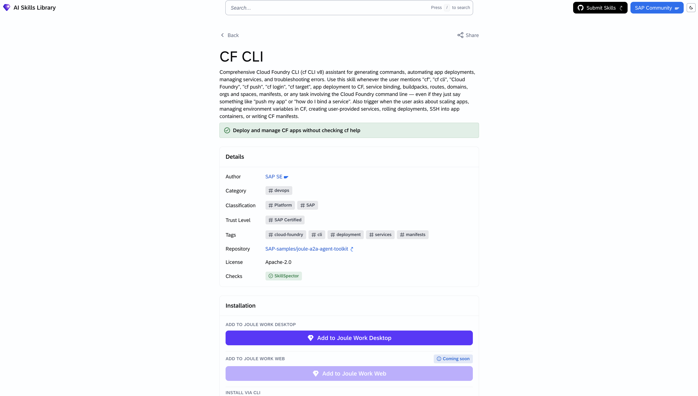
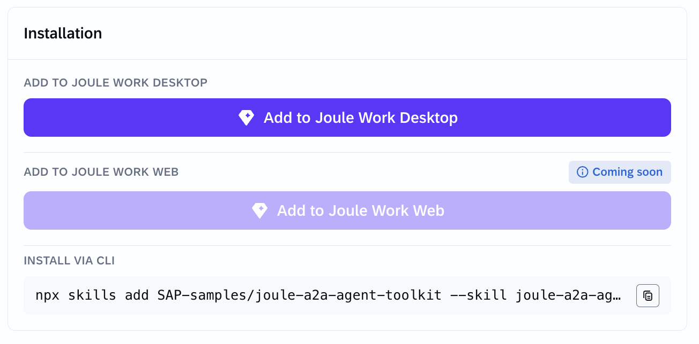
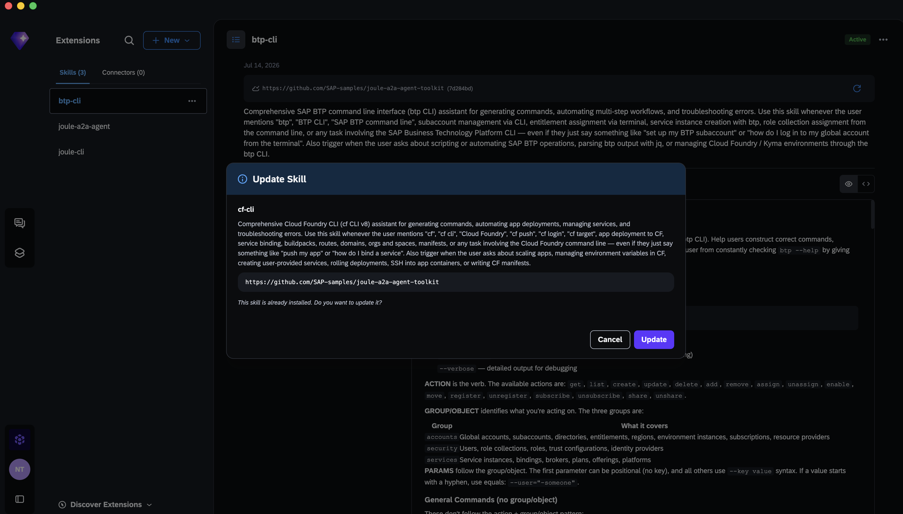
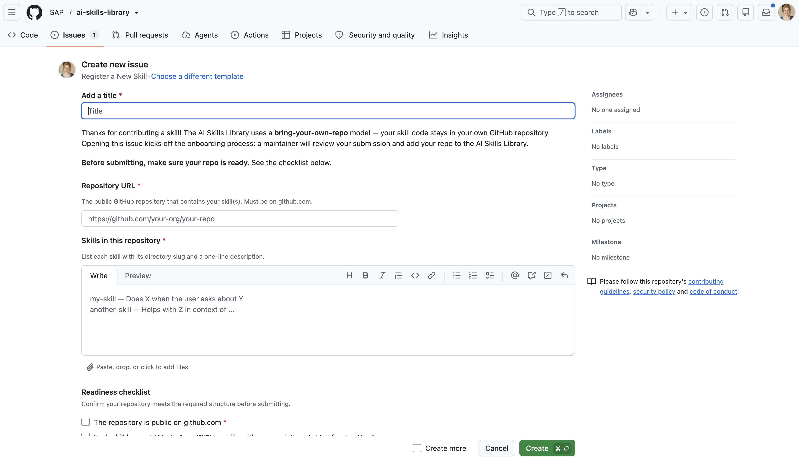

# Get Started with the AI Skills Library

## You will learn
- What the AI Skills Library is
- How to browse and find skills, plugins and MCP servers
- How to install a skill in your environment (Joule Work, Joule Work Desktop, or CLI)
- How to create your own skill and submit it to the library

## Prerequisites
- A browser to access [skills.cloud.sap](https://skills.cloud.sap/)
- For Joule Work Desktop installation: Joule Work Desktop installed locally (not GA yet)
- For CLI installation: Node.js installed and a terminal (e.g. Claude Code)
- A public GitHub account (for contributing a skill)

> Important note! Joule Work and Joule Work Desktop are not GA (General Availability) yet.

---

### What Is the AI Skills Library?

The [AI Skills Library](https://skills.cloud.sap/) is a public catalog of reusable AI skills and related components that you can browse, install, and contribute to. It is built on an open, bring-your-own-repository model — anyone can publish a skill, and the platform surfaces it alongside SAP's own certified content.

The library contains four types of items:

| Type | Description |
|---|---|
| **Skill** | A markdown file that teaches an AI assistant how to perform a specific, repeatable task |
| **Plugin** | A bundle that combines multiple skills with one or more MCP servers |
| **MCP Server** | A tool server that gives AI assistants access to external data or actions (files, APIs, services) |
| **Marketplace** | A curated collection of skills and plugins grouped around a product or domain |

Each item carries a **trust level** that tells you who is behind it:

- **SAP Certified** — developed and maintained by SAP
- **Partner Verified** — published by a verified SAP partner
- **Community** — contributed by the broader developer and business-user community

Skills work across AI environments that support the installation methods described below. Including Joule Work, Joule Work Desktop, and local AI coding assistants such as Claude Code.

---

### Browse the Skills Library

1. Open [skills.cloud.sap](https://skills.cloud.sap/) in your browser.


    


2. Use the **search bar** to find skills by name, description, tag, or author.

3. Narrow the results with the filter buttons:
   - **Classification** — choose *Platform* (development, DevOps, security) or *Business* (finance, HR, procurement)
   - **Publisher** — choose *SAP* or *Third-Party*


    


4. Toggle between grid and list view using the icon in the toolbar.

5. Click any item to open its detail page. You will see:
   - Author, category, trust level, tags, and license
   - Links to the source repository
   - Related agents, MCP servers, API resources, and packages


    


Take a moment to explore a few skills and notice how each one describes a concrete, repeatable workflow.

---

### Install a Skill

Installation options depend on which environment you are working in. Each skill's detail page shows the available methods.

#### Option A — Joule Work Desktop

1. On the skill's detail page, click **Add to Joule Work Desktop**.


    


2. A deep link opens Joule Work Desktop and installs the skill locally.


    


3. The skill is now available in your local Joule desktop application.

#### Option B - **Add to Joule Work Web**
- Coming soon

#### Option C — CLI (npx)

Use this option when working with a local AI coding assistant such as Claude Code.

1. On the skill's detail page, copy the **npx** command. It looks similar to this:

    ```bash
    npx -y @sap/skill-install <skill-slug>
    ```

    


2. Open your terminal and run the command.

3. The skill is installed into your local environment and is ready to use.

---

### Create Your Own Skill

A skill lives in a public GitHub repository under a specific folder structure. The AI Skills Library does not host your code but it points to your repository.

#### 1. Structure your repository

Create the following layout in your public GitHub repository:

```
your-repo/
└── skills/
    └── <skill-slug>/
        └── SKILL.md
```

Replace `<skill-slug>` with a short, lowercase, hyphenated name for your skill (for example, `summarize-meeting-notes`).

#### 2. Write your SKILL.md

The `SKILL.md` file must include at minimum a `name` and `description` in its frontmatter:

```markdown
---
name: Summarize Meeting Notes
description: Extracts action items, decisions, and open questions from raw meeting notes.
---

## Instructions

Given a block of meeting notes, identify and return:
- **Action items** — who is responsible and by when
- **Decisions made** — what was agreed
- **Open questions** — what still needs to be resolved

Keep the output concise and structured.
```

Add author and license information somewhere in your repository — a `README.md`, `LICENSE` file, or `package.json` all work.

#### 3. Test your skill locally

Before submitting, install your skill locally using the CLI method and verify it behaves as expected in your AI assistant.

---

### Submit Your Skill to the Library

The AI Skills Library uses a **bring-your-own-repo** model. You keep your skill in your own GitHub repository and register it with the platform.

1. Make sure your repository is **public on github.com** and follows the folder structure from the previous step.

2. Open a **Register a New Skill** issue in the AI Skills Library repository (the link is available on the [documentation page](https://skills.cloud.sap/)).


    


3. A maintainer reviews your submission and onboards your repository. Once approved, your skill appears in the catalog with a **Community** trust level.

For updates to an existing skill, edit your own repository directly — the catalog reflects your latest published content.

---

## What's Next?

- **Explore the catalog** — [skills.cloud.sap](https://skills.cloud.sap/) is growing. Check back regularly for new community contributions.
- **Join the conversation** — Ask questions and share ideas on [SAP Community](https://community.sap.com/).
- **Build a plugin** — Once you have a skill working, consider bundling it with an MCP server into a plugin to share richer functionality.
- **For more information**: Check out [this blog post](https://community.sap.com/)!
