# Modify Error Handling with Custom Objects
<!-- description --> Maintain custom objects to customize the error handling in the message monitor of SAP Application Interface Framework.

## Prerequisites
 - You've set up SAP Application Interface Framework
 - SAP S/4HANA 1709 or later, AIF 4.0
 - You've completed the tutorial [Create a Simple IDoc Interface](aif-idoc-monitoring-interface-create)

## You will learn
  - How to create a custom hint to provide additional information about how to solve a particular error
  - How to create a custom data link that links a particular error code to a field in the data structure
  - How to create a custom message text to replace the default log message text with a user-specific text
  - How to create a custom function to navigate to a transaction

## Intro
In this tutorial, you will learn how to use custom objects to simplify the error resolution of an interface in SAP Application Interface Framework.

You can link custom objects, such as hints, data links, message texts, and functions, to a log message and an interface to modify the error handling process to your preference.

> This tutorial focuses on creating custom objects for an IDoc interface. Note that custom objects are also supported for any other technology that SAP Application Interface Framework supports, such as Proxies or Web Services.


---

### Send sample requests

As custom objects are defined directly in the Message Monitor based on an existing log message, let's first create a couple of sample messages to use later.

Send in new test IDocs, for example using the **Test Tool for IDoc Processing** (transaction code `WE19`).

1. Send in a new test message with a new customer. The message should be processed successfully.

2. Send in a new test message with a wrong customer type (for example, change **CUSTTYPE** to `X`). This message should run into an error.

3. In SAP GUI, check the results of your test in the Interface Monitor (transaction code `/n/AIF/IFMON`).

      When you select the summary line for your interface, you're forwarded to **Monitoring and Error Handling**, where you can see your selected test messages. Choose either the **Success** or the **Error** icon to display the respective message. One message should be in status `Successful` with the message text confirming that the flight customer has been created. The other message should be in status `Error` with the message text `Customer type can be only B or P`.

<!-- border -->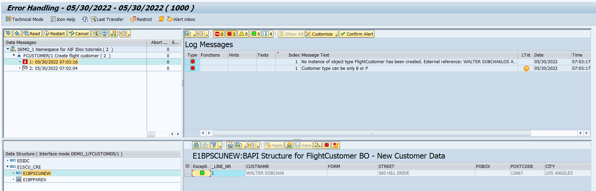


### Create custom function

Once the new flight customer has been created, you want to navigate to the customer record to display its details. Let's configure this navigation using a custom function.

1. In **Monitoring and Error Handling**, select the successful message.

2. In the **Log Messages** section, select the message text stating that the flight customer has been created.

3. In the menu, choose **Customize** > **Custom Functions**.

    <!-- border -->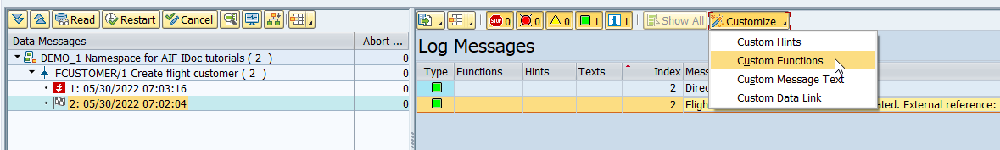

4. In the Custom Function Action section, enter transaction **`BC_GLOBAL_SCUST_DISP`**.

5. In the **Parameter** table, maintain a new entry with the following details:

    | Parameter ID | Fill Method | Value from Message Variable
    | :----  | :---- | :----
    | **`CSM`** | **`Message Variable`** | **`[MsgVar2]`**

    <!-- border -->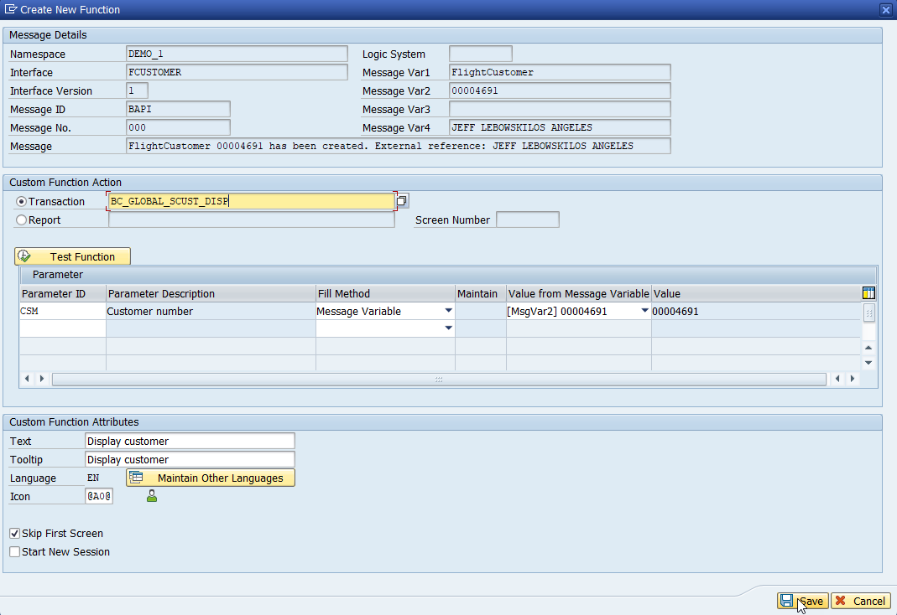

6. Maintain the following details in section Custom Function Attributes:

    | Parameter | Value
    | :----  | :----
    | Text | **`Display customer`**
    | Tooltip | **`Display customer`**
    | Icon | **`@A0@`**
    | Skip First Screen | check the box

7. **Save** your changes

    Selecting the **Display customer** icon in the Log Messages section now forwards you to the customer record display screen.


### Create custom message text


For the erroneous message, you'd prefer an own custom text instead of the default log message.

1. Select the erroneous message.

2. In the **Log Messages** section, select the message text stating that the customer type can only be B or P.

3. In the menu, choose **Customize** > **Custom Message Text**.

    <!-- border -->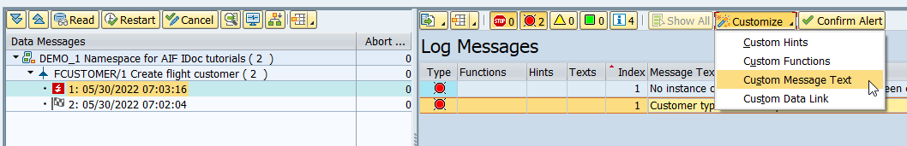

4. In the upcoming dialog, enter the **New Message** `Wrong customer type`.

    <!-- border -->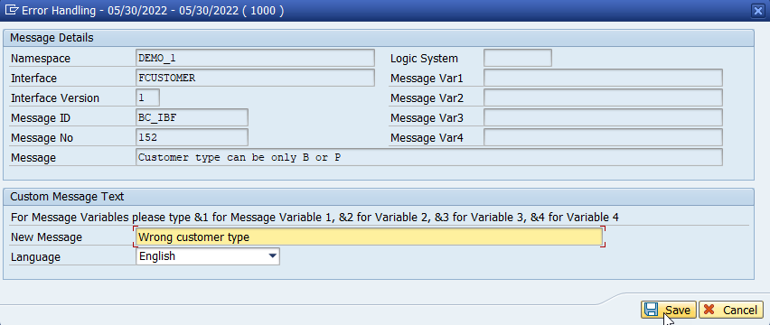

5. **Save** your changes.

    The customized message text is now displayed in the message log.


### Create custom hint


For the erroneous message, you also want to maintain a hint that describes how to fix the error.

1. Select the erroneous message.

2. In the **Log Messages** section, select the new customized message text.

3. In the menu, choose **Customize** > **Custom Hints**.

    <!-- border -->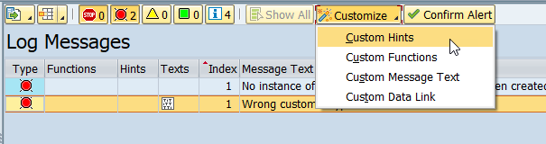

4. In the upcoming dialog, enter the **Tooltip** `Wrong customer type`.

5. Maintain the **Text** by copying and pasting the following hint:

    ```
      You have entered a wrong customer type.
      To be able to proceed with the customer creation, navigate to the Customer Type field in your message, and enter a valid type, i.e., either B or P, then save and restart the message.
    ```

    <!-- border -->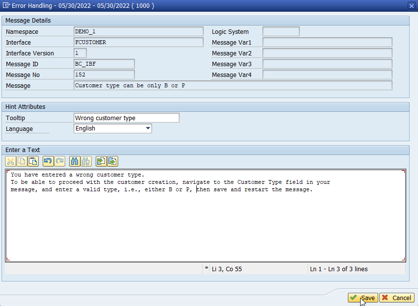

6. **Save** your changes.

    Selecting the icon in the **Hints** column in the **Log Messages** section now displays your custom hint text.


### Create custom data link

To facilitate the error resolution, you'd like to directly navigate to the field in the data structure that causes the error.

1. Select the erroneous message.

2. In the **Log Messages** section, select your customized message text.

3. In the **Data Structure** section, double-click the data structure `E1BPSCUNEW`.

4. In the **Data Content** section, scroll to the very right, and select the field in column `CUSTTYPE`.

5. In the **Log Messages** menu, choose **Customize** > **Custom Data Link**.

    <!-- border -->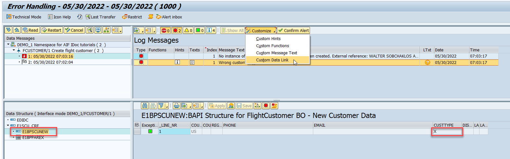

6. In the upcoming dialog, choose **Create** to confirm the creation of the new data link.

    <!-- border -->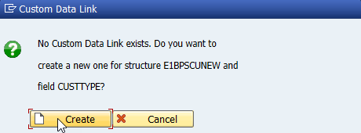

      The value of the field `CUSTTYPE` is highlighted in red.

      Double-clicking the log message now navigates you to the problematic field in the Data Content section.


### Define changeable field


Before testing the custom objects, let's change the customer type field so we can fix the error.

1. Go to **Customizing** for SAP Application Interface Framework (transaction code `/n/AIF/CUST`) and navigate to **Error Handling** > **Define Interface-Specific Features**.

2. In the upcoming dialog, enter namespace `DEMO_1`, interface `FCUSTOMER`, and version `1`, then press **Enter**.

3. Double-click **Define Changeable Fields** in the menu on the left. Add a new entry with **Index** number `10` and **Field Path** `E1SCU_CRE-E1BPSCUNEW-CUSTTYPE`.

    <!-- border -->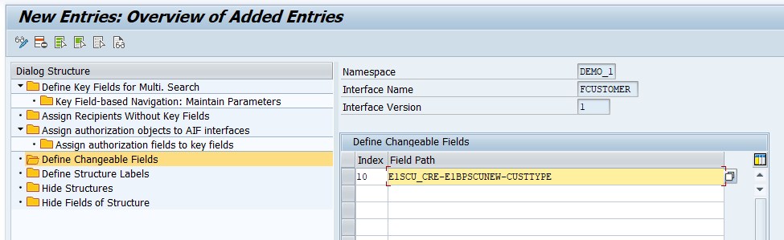

4. **Save** your changes.

    Back in the **Monitoring and Error Handling** screen, the field **Customer Type** is now editable in the Data Content section.

    > If you opened **Customizing** in a new screen, you might have to restart **Monitoring and Error Handling** for the changes to be visible. 


### Test custom objects

Now finally, let's test that the custom objects we configured are working as planned.


1. As in step 1, send in a new test message with a wrong customer type to force an error.

2. In **Monitoring and Error Handling**, refresh the list of messages. The new message should be in status `Error`.

    Your custom message text `Wrong customer type` should be displayed.

    <!-- border -->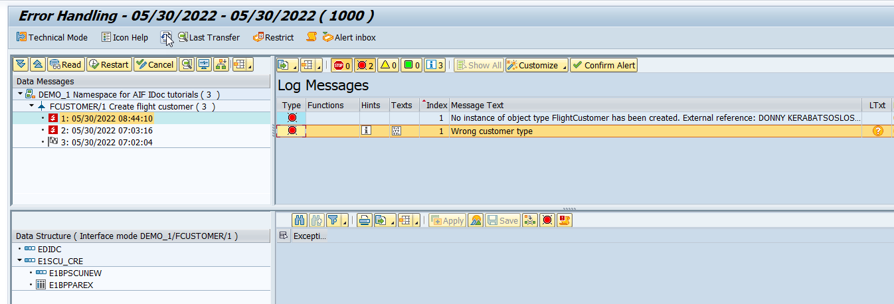

3. Choose the icon in the **Hints** column to display the custom hint you maintained.

    <!-- border -->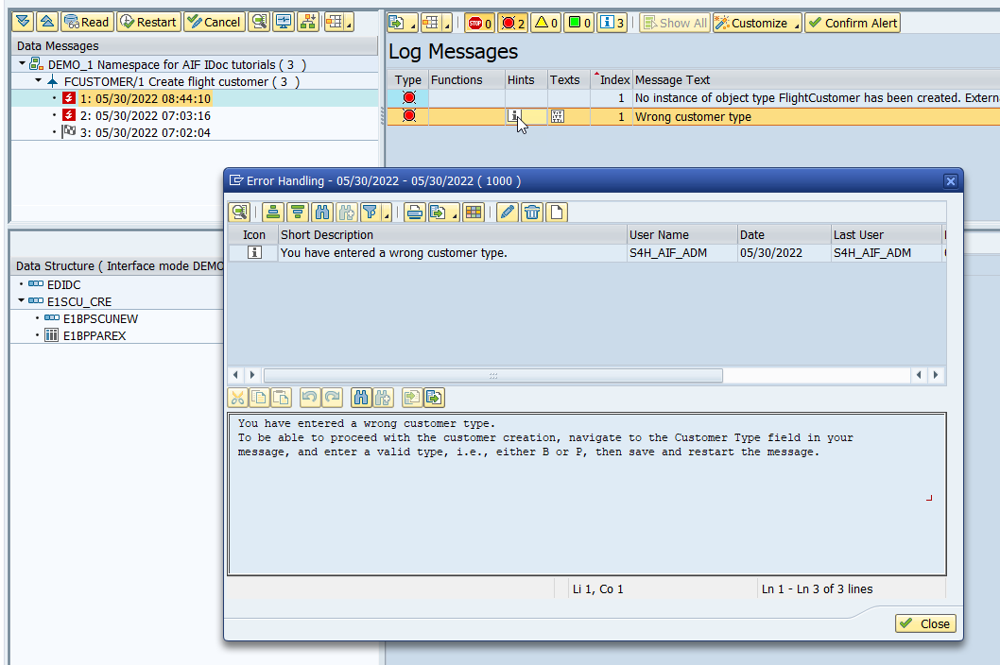

      Choose **Close**.

4. Use your custom data link to find the source of the erroneous message and double-click the message log text. You're navigated to the field **CUSTTYPE**.

5. Maintain a valid value for the field **CUSTTYPE** - either `B` or `P` - and choose **Confirm**.

    <!-- border -->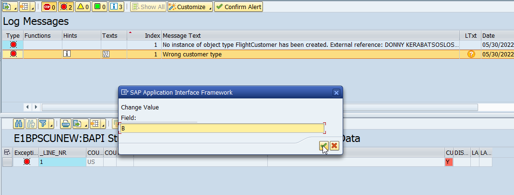

6. **Save** the changes.

    <!-- border -->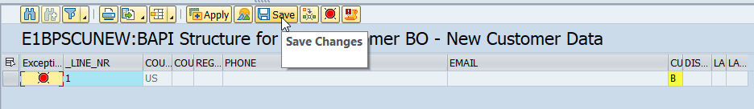

7. **Restart** the data message. It should now process without errors.

8. To test your custom function, click the **Display customer** icon that has appeared for your log message in column **Function**.

    <!-- border -->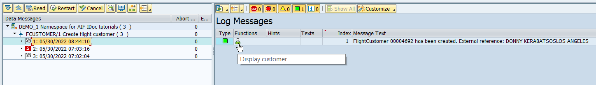

      The customer record details are displayed.

    <!-- border -->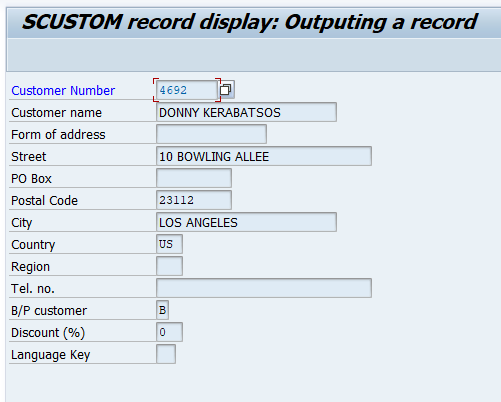

Congratulations! You've successfully configured a custom hint, custom function, custom message text, and custom data link for a log message.

### Test yourself


---
