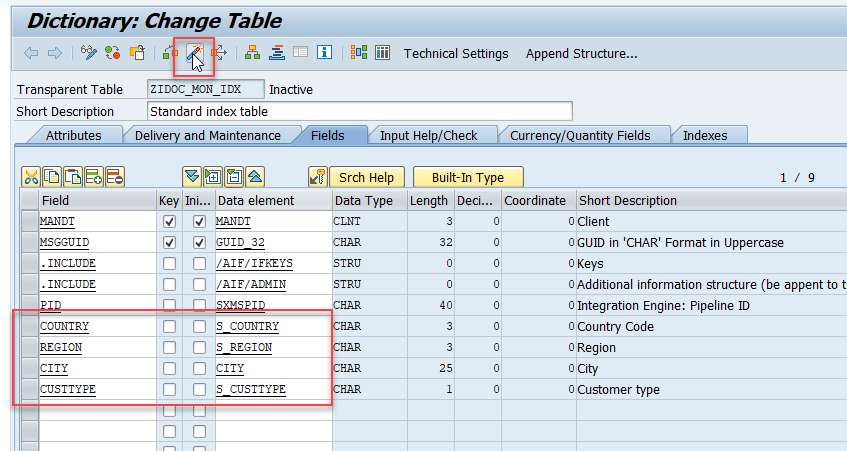
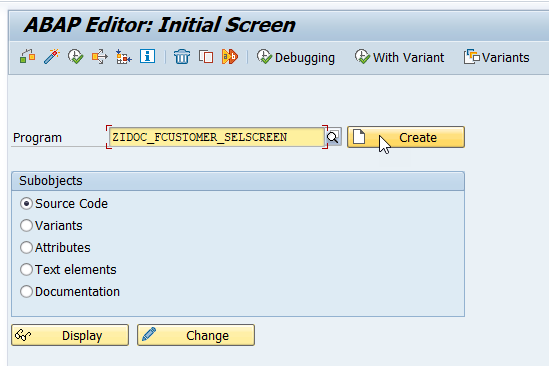
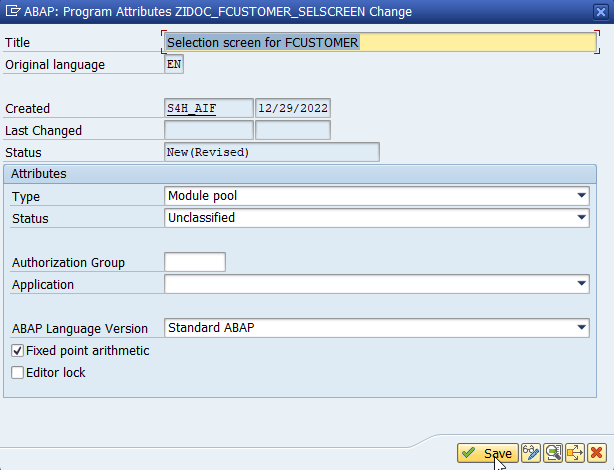
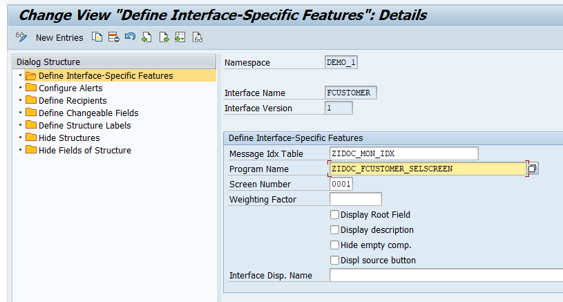
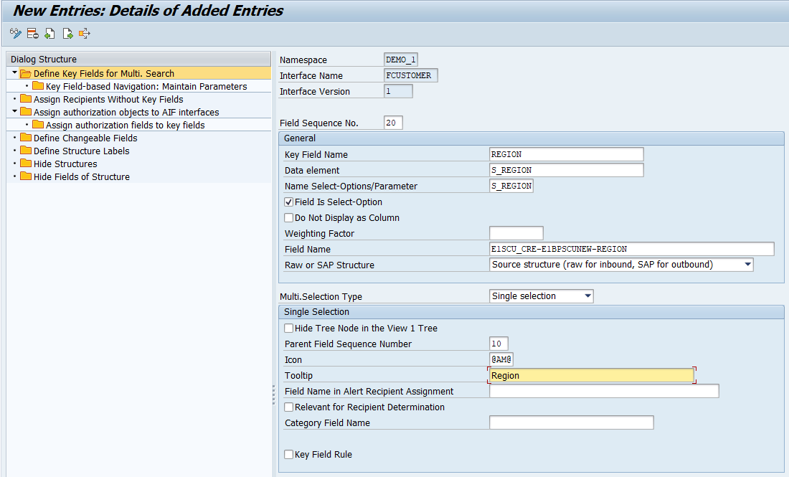
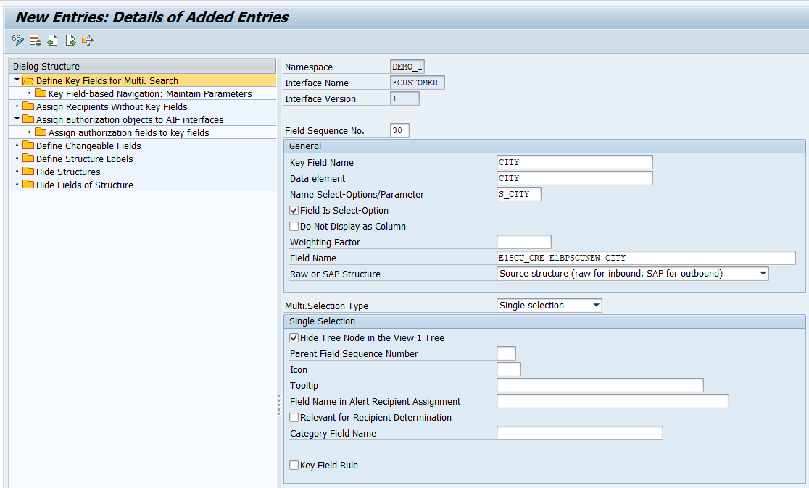
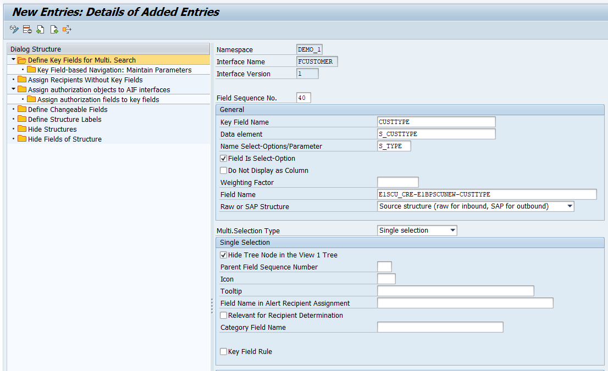
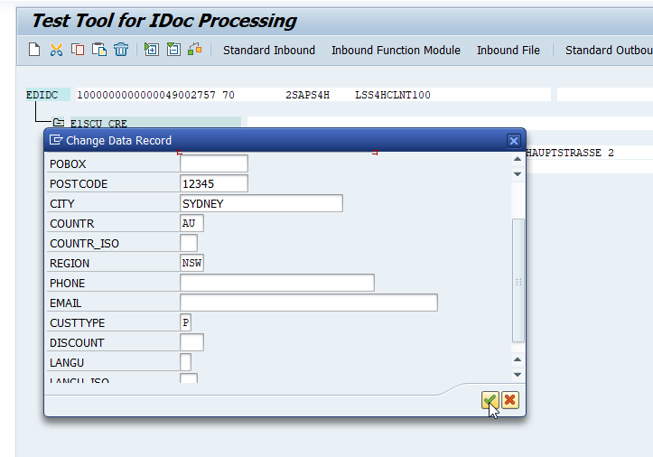
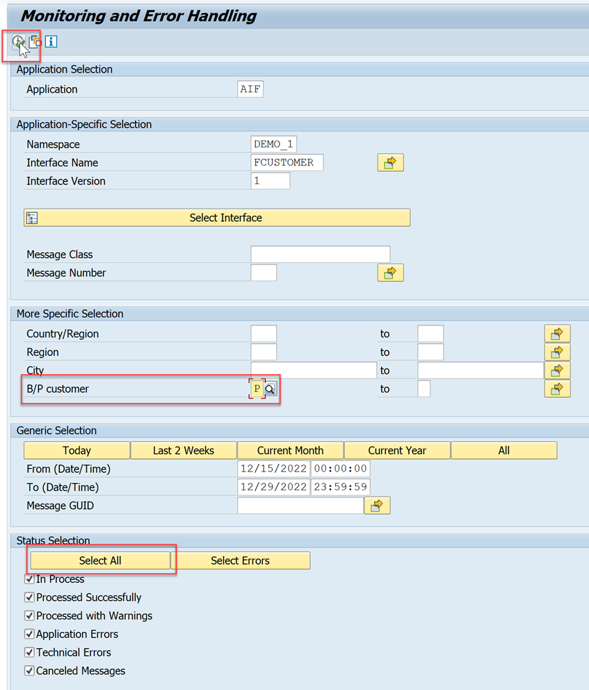
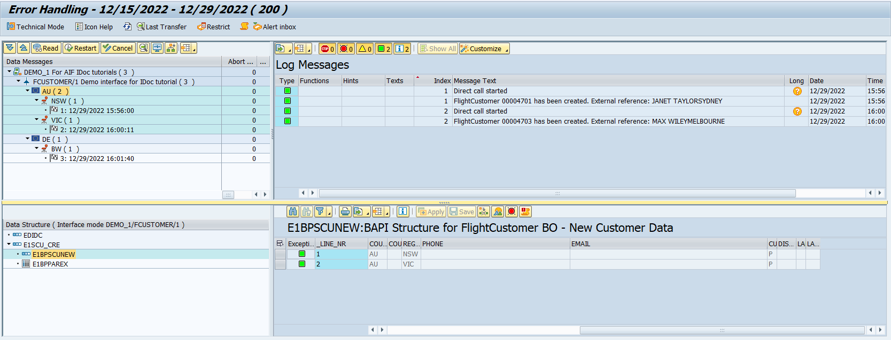

# Define Single Key Fields
<!-- description --> Define single key fields to improve error handling in the message monitor of SAP Application Interface Framework.

## Prerequisites
 - You've set up SAP Application Interface Framework
 - SAP S/4HANA 1709 or later, AIF 4.0
 - You've completed the tutorial [Create a Simple IDoc Interface](aif-idoc-monitoring-interface-create)

## You will learn
  - How to define single key fields
  - How to create a selection screen

## Intro
In this tutorial, you will learn how to define single key fields to simplify the error resolution of an interface in SAP Application Interface Framework.

You can define single key fields and a selection screen to be able to search for messages based on business data.

> This tutorial focuses on customizing an IDoc interface. All the settings are also supported for any other technology that SAP Application Interface Framework supports, such as Proxies or Web Services.


---


### Maintain interface-specific single index table

To be able to search for messages based on business data, you need to enhance the interface-specific index table.

> As a prerequisite, you should have gone through the [Create a Simple IDoc Interface](aif-idoc-monitoring-interface-create) tutorial and hence should have already defined an interface-specific single index table with name `ZIDOC_MON_IDX`. Otherwise, run through **step 7** of the tutorial to create the index table.

1. Run transaction code `SE11`, enter the table name `ZIDOC_MON_IDX` and choose **Change**.

2. Add the following new entries:

    | Field                   | Data element
    | :-----------------------| :-------------------------------------------
    | **`COUNTRY`**           | **`S_COUNTRY`**
    | **`REGION`**            | **`S_REGION`**
    | **`CITY`**              | **`CITY`**
    | **`CUSTTYPE`**          | **`S_CUSTTYPE`**

3. **Save** and **activate** your changes.

    <!-- border -->


### Create selection screen

To select the additional fields from the index table, you need to create an interface-specific selection screen. 

1. Run transaction code `SE38`, enter the program name `ZIDOC_FCUSTOMER_SELSCREEN` and choose **Create**.
   
    <!-- border -->

2. In the upcoming dialog, maintain a **Title**, and select the **Type** `Module pool`. Then select **Save**.

    <!-- border -->

3. In the ABAP editor, maintain the code as follows:

    ```ABAP
    PROGRAM ZIDOC_FCUSTOMER_SELSCREEN.

    DATA: lv_country  TYPE s_country,
        lv_region   TYPE s_region,
        lv_city     TYPE city,
        lv_custtype TYPE s_custtype.

    SELECTION-SCREEN BEGIN OF SCREEN 0001 AS SUBSCREEN.
    SELECT-OPTIONS:
        s_cntry  FOR lv_country,
        s_region FOR lv_region,
        s_city   FOR lv_city,
        s_type   FOR lv_custtype.
    SELECTION-SCREEN END OF SCREEN 0001.

    AT SELECTION-SCREEN OUTPUT.
    /aif/cl_global_tools=>get_value_from_mem( ).

    ``` 

4. Navigate to **Goto** > **Text Elements** from the main menu, then switch to the **Selection Texts** tab.

5. For each of the selection options, select the **DDIC Reference** flag to copy the text from the ABAP Dictionary.

    <!-- border -->

6. **Save** and **activate** your changes.


### Assign selection screen to interface

To fill the additional fields of the index table, you need to assign both the index table and the selection screen to your interface.

1. Go to **Customizing** for SAP Application Interface Framework (transaction code `/n/AIF/CUST`) and navigate to **Error Handling** > **Define Namespace-Specific Features**.

2. In the upcoming dialog, enter namespace `DEMO_1`, then press **Enter**.

3. Select **Define Interface-Specific Features** in the menu on the left.

    > If you have gone through the [Create a Simple IDoc Interface](aif-idoc-monitoring-interface-create) tutorial, the interface-specific single index table `ZIDOC_MON_IDX` should be already maintained for your interface `FCUSTOMER`. Otherwise, enter `ZIDOC_MON_IDX` into the **Message Idx Table** field.

4. Enter the previously created selection screen `ZIDOC_FCUSTOMER_SELSCREEN` into the **Program Name** field.
   
5. Finally, enter **Screen Number** `0001`.

    <!-- border -->

6. **Save** your changes.


### Define single key fields

Finally, you need to define the key fields for your interface.

1. In the **Customizing** for SAP Application Interface Framework (transaction code `/n/AIF/CUST`), navigate to **Error Handling** > **Define Interface-Specific Features**.

2. In the upcoming dialog, enter namespace `DEMO_1`, interface `FCUSTOMER`, and version `1`, then press **Enter**.

3. Double-click **Define Key Fields for Multi. Search** in the menu on the left. Add a new entry with **Field Sequence No.** `10` and add the following values:

    | Field name                        | Value
    | :---------------------------------| :-------------------------------------------
    | Key Field Name                    | **`COUNTRY`**
    | Data element                      | **`S_COUNTRY`**
    | Name Select-Options/Parameter     | **`S_CNTRY`**
    | Field is Select-Option            | **selected**
    | Field Name                        | **`E1SCU_CRE-E1BPSCUNEW-COUNTR`**
    | Raw or SAP Structure              | **`Source structure`**
    | Multi.Selection Type              | **`Single selection`**
    | Hide Tree Node in the View 1 Tree | **unselected**
    | Icon                              | **`@DV@`**
    | Tooltip                           | **`Country`**

    <!-- border -->

4. Add a second new entry with **Field Sequence No.** `20` and the following values:

    | Field name                        | Value
    | :---------------------------------| :-------------------------------------------
    | Key Field Name                    | **`REGION`**
    | Data element                      | **`S_REGION`**
    | Name Select-Options/Parameter     | **`S_REGION`**
    | Field is Select-Option            | **selected**
    | Field Name                        | **`E1SCU_CRE-E1BPSCUNEW-REGION`**
    | Raw or SAP Structure              | **`Source structure`**
    | Multi.Selection Type              | **`Single selection`**
    | Hide Tree Node in the View 1 Tree | **unselected**
    | Parent Field Sequence Number      | **`10`**
    | Icon                              | **`@AM@`**
    | Tooltip                           | **`Region`**

    <!-- border -->

5. Add a third new entry with **Field Sequence No.** `30` as follows:

    | Field name                        | Value
    | :---------------------------------| :-------------------------------------------
    | Key Field Name                    | **`CITY`**
    | Data element                      | **`CITY`**
    | Name Select-Options/Parameter     | **`S_CITY`**
    | Field is Select-Option            | **selected**
    | Field Name                        | **`E1SCU_CRE-E1BPSCUNEW-CITY`**
    | Raw or SAP Structure              | **`Source structure`**
    | Multi.Selection Type              | **`Single selection`**
    | Hide Tree Node in the View 1 Tree | **selected**

    <!-- border -->

6. Add a fourth new entry with **Field Sequence No.** `40` as follows:

    | Field name                        | Value
    | :---------------------------------| :-------------------------------------------
    | Key Field Name                    | **`CUSTTYPE`**
    | Data element                      | **`S_CUSTTYPE`**
    | Name Select-Options/Parameter     | **`S_TYPE`**
    | Field is Select-Option            | **selected**
    | Field Name                        | **`E1SCU_CRE-E1BPSCUNEW-CUSTTYPE`**
    | Raw or SAP Structure              | **`Source structure`**
    | Multi.Selection Type              | **`Single selection`**
    | Hide Tree Node in the View 1 Tree | **selected**

    <!-- border -->

7. **Save** your changes.


### Send sample requests

Let's create a couple of sample messages to showcase the customizing changes.

Open the **Test Tool for IDoc Processing** (transaction code `WE19`). Send in new test messages with different customer names, countries, regions, and cities maintained. Enter an existing customer type, either `P` or `B`.

<!-- border -->


### Monitor your interface

Now, let's check the results of your tests in the Monitoring and Error Handling.

1. Open the **Monitoring and Error Handling** (transaction code `/n/AIF/ERR`).

2. In the selection screen, you'll notice that the additional selection fields have been added. 
In the **Status Selection** section, select the **Select All** button. Apply any filter, for example, filter on selection field **B/P customer** with value `P`. Then choose **Execute**.

    <!-- border -->

3. In the message monitor, expand the complete navigation tree. You can see that the messages are grouped by country and region hierarchy. Only the messages suitable to your filter should be displayed.

    <!-- border -->


Congratulations! You've successfully defined single key fields.

### Test yourself


---
