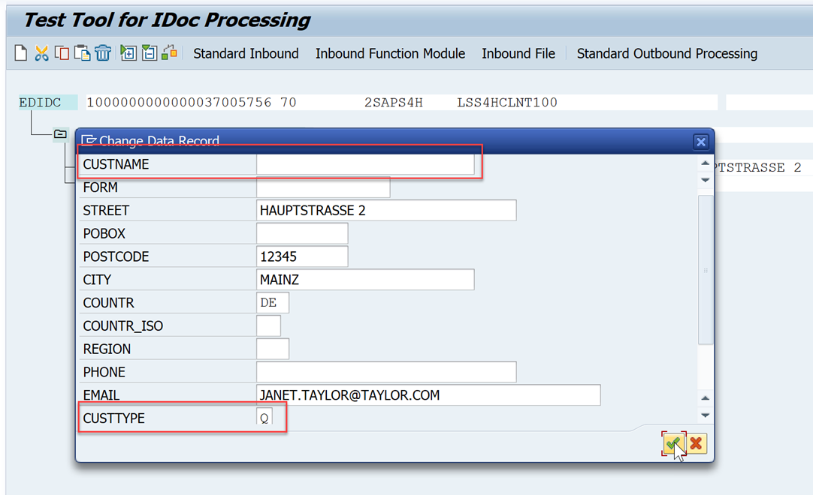
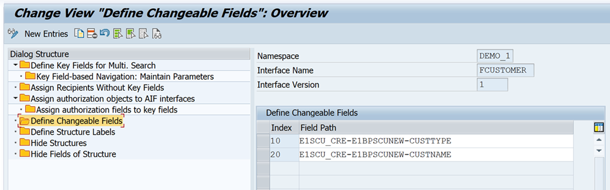
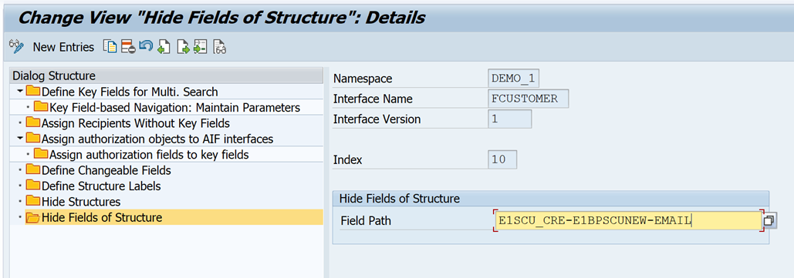
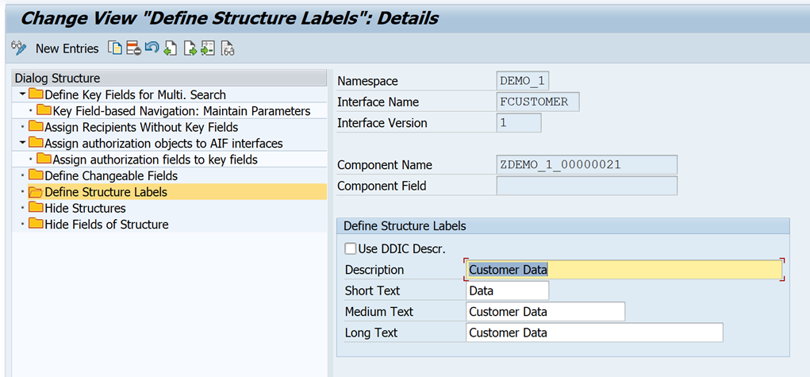
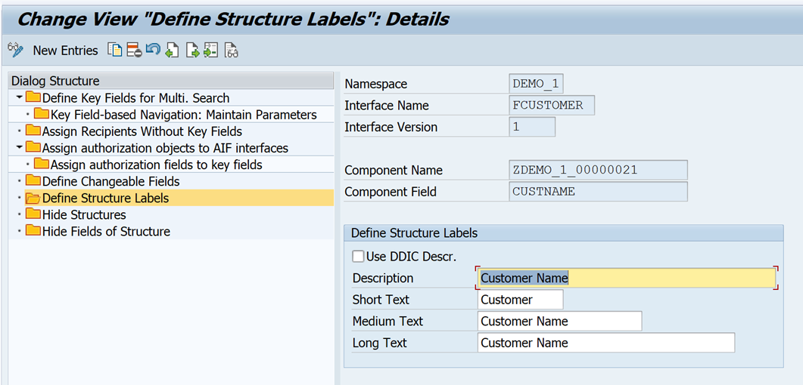
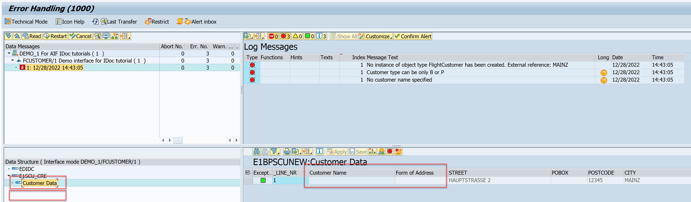
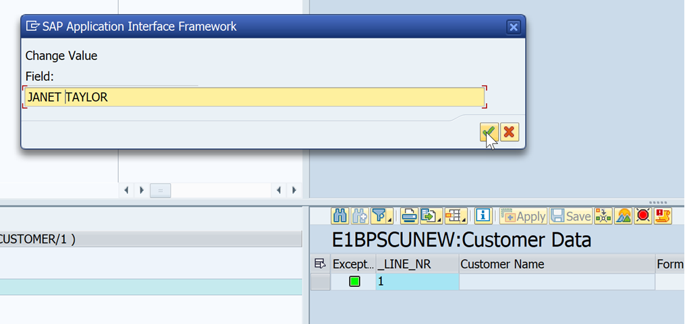
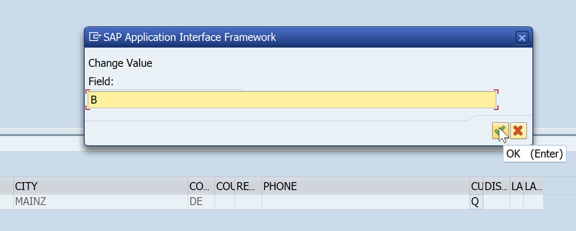

# Modify Data Structures and Fields
<!-- description --> Modify data structures and data fields to customize the error handling in the message monitor of SAP Application Interface Framework.

## Prerequisites
 - You've set up SAP Application Interface Framework
 - SAP S/4HANA 1709 or later, AIF 4.0
 - You've completed the tutorial [Create a Simple IDoc Interface](aif-idoc-monitoring-interface-create)

## You will learn
  - How to define changeable fields
  - How to hide structures and fields
  - How to rename structure and field labels

## Intro
In this tutorial, you will learn how to customize the data structure view and the data content view to simplify the error resolution of an interface in SAP Application Interface Framework as follows:

  - You can define a field in your structure as being editable to be able to edit the content of an erroneous message.
  
  - You can hide a field to avoid that its data is displayed in the message monitor. This may apply for fields that contain sensitive data for instance.

  - You can hide a complete structure. This may apply for empty structures for instance.

  - You can rename structure and field labels.

> This tutorial focuses on customizing an IDoc interface. All the settings are also supported for any other technology that SAP Application Interface Framework supports, such as Proxies or Web Services.

---

### Send sample request

Let's first create a sample message to showcase the customizing changes.

1. Open the **Test Tool for IDoc Processing** (transaction code `WE19`). 

2. Send in a new test message with an empty customer name and a wrong customer type (for example, change **CUSTTYPE** to `Q`) to force an error.

    <!-- border -->

3. In SAP GUI, check the results of your test in the Interface Monitor (transaction code `/n/AIF/IFMON`).

    When you select the summary line for your interface, you're forwarded to **Monitoring and Error Handling**, where you can see your selected test message. Choose the **Error** icon to display the respective message. The message should be in status `Error` with the message texts `Customer type can be only B or P` and `No customer name specified`.
  
    > The fields and structures that are highlighted in the following screenshot will be impacted by the customizing changes carried out in this tutorial.
  
    <!-- border -->

### Define changeable fields

Since you want to edit fields that contain wrong or even no data to be able to fix the errors caused by the wrong data, you need to define changeable fields.

1. Go to **Customizing** for SAP Application Interface Framework (transaction code `/n/AIF/CUST`) and navigate to **Error Handling** > **Define Interface-Specific Features**.

2. In the upcoming dialog, enter namespace `DEMO_1`, interface `FCUSTOMER`, and version `1`, then press **Enter**.

3. Double-click **Define Changeable Fields** in the menu on the left. Add a new entry with **Index** number `10` and **Field Path** `E1SCU_CRE-E1BPSCUNEW-CUSTTYPE`.

4. Add a new entry with **Index** number `20` and **Field Path** `E1SCU_CRE-E1BPSCUNEW-CUSTNAME`.

    <!-- border -->

5. **Save** your changes.

### Hide structures

As a next step, you want to hide a structure that is empty anyway.

1. Stay in the **Define Interface-Specific Features** customizing activity and double-click **Hide Structures** in the menu on the left.

2. Add a new entry with **Field Path** `E1SCU_CRE-E1BPPAREX`.

    <!-- border -->

3. **Save** your changes.

### Hide fields

Now, you also want to hide a field that contains sensitive data.

1. Stay in the **Define Interface-Specific Features** customizing activity and double-click **Hide Fields of Structure** in the menu on the left.

2. Add a new entry with **Index** number `10` and **Field Path** `E1SCU_CRE-E1BPSCUNEW-EMAIL`.

    <!-- border -->

3. **Save** your changes.

### Rename labels

You want to rename the labels of the data structures and fields.

1. Stay in the **Define Interface-Specific Features** customizing activity and double-click **Define Structure Labels** in the menu on the left.

2. First, let's rename the structure label. 
Add a new entry. For the **Component Name**, select the **Field Path** `E1SCU_CRE-E1BPSCUNEW`. The **Component Name** is now `ZDEMO_1_00000021`. Enter `Customer Data` as **Description**, **Medium Text**, and **Long Text**, and `Data` as **Short Text**.

    <!-- border -->

4. Next, let's rename the label of the customer name. 
Add a new entry. Select the same **Component Name** `ZDEMO_1_00000021` as before and the **Component Field** `CUSTNAME`. Enter `Customer Name` as **Description**, **Medium Text**, and **Long Text**, and `Customer` as **Short Text**.

    <!-- border -->

5. Finally, let's rename the label of the form of address. 
Add a new entry. Select the same **Component Name** `ZDEMO_1_00000021` as before and the **Component Field** `FORM`. Enter `Form of Address` as **Description**, **Medium Text**, and **Long Text**, and `Form` as **Short Text**.

    <!-- border -->

6. **Save** your changes.

### Test customizing

Now, let's test that the customizing we configured works as planned.

1. Reopen the **Monitoring and Error Handling**. You should still see the message in status `Error`.

    > If you opened **Customizing** in a new screen, you might have to restart **Monitoring and Error Handling** for the changes to be visible.

    You'll notice that the structure `E1BPPAREX` is not displayed and that the structure and field labels have been changed accordingly. If you scroll to the right, you'll notice that the field containing the email address is not displayed either.

    <!-- border -->

2. Double-click the **Customer Name** field, and maintain any customer name, then choose **Confirm**.

    <!-- border -->

3. Maintain a valid value for the field **CUSTTYPE** (either `B` or `P`), then choose **Confirm**.

    <!-- border -->

4. **Save** the changes and **Restart** the data message. It should now process without errors.

Congratulations! You've successfully customized the data structures and data fields.

### Test yourself

---
