# Create a Simple OData Interface
<!-- description --> Create a simple AIF interface to enable monitoring of an OData Gateway service.

## Prerequisites
  - You've set up SAP Application Interface Framework
  - SAP S/4HANA 1709 or later
  - You have set up SAP Gateway and registered the basic OData sample service for SAP Gateway, see [Registering Sample Service - Basic](https://help.sap.com/viewer/68bf513362174d54b58cddec28794093/1809BW.001/en-US/3a1236932c344e529ef3f621c6e75433.html)

## You will learn
  - How to create a simple OData interface
  - How to set up monitoring of an OData service in SAP Application Interface Framework

## Intro
In this tutorial, you will learn how to create a simple SAP Application Interface Framework interface that enables you to monitor an OData service. In our example, we use the basic OData sample service **GWSAMPLE_BASIC**.

---

### Create package

>If you've completed other tutorials for SAP Application Interface Framework, you might already have created a package. In this case, you can skip this step.

Create a package that serves as the destination for your newly created objects.

1. Open your system and navigate to the **Object Navigator** (transaction code `SE80`).
2. From the drop-down menu, choose **Package** and enter the name `ZDEMO`. Press **Enter** or choose **Display or Create Object**.
3. Confirm the dialogue window, enter a meaningful short description for your new package, and select **Confirm**. If prompted, enter a workbench request and confirm again.

    <!-- border -->

You have successfully created a new package named `ZDEMO`.

### Create structure in ABAP Dictionary

Next, create a new structure in ABAP Dictionary to be used in your interface later.

1. Run the **ABAP Dictionary** (transaction code `SE11`) and create a new structure named `ZDEMO_ODATA_SALES_ORDER`. 

2. Enter the **Data type** name `ZDEMO_ODATA_SALES_ORDER` and choose **Create**.

3. In the upcoming dialog, select the `Structure` radio button. Choose **Continue**.

4. Enter a short description.

5. Switch to the **Components** tab and maintain the following structure:

    | Component       | Typing Method | Component Type
    | :----------- | :--------- | :------
    | `ODATA_STD`  | Types     | `/AIF/ODATA_STD_RAW_FLDS_S`
    | `PAYLOAD`  | Types     | `CHAR_132`

    >The DDIC structure needs to contain a component of type `/AIF/ODATA_STD_RAW_FLDS_S` and a component of any type  that can be used to display the payload.

    <!-- border -->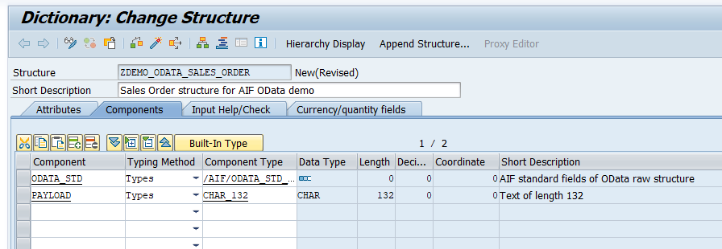

6. **Save** and **activate** your changes.

### Create namespace

As interfaces in SAP Application Interface Framework are grouped using namespaces, you must create a namespace.

Go to **Customizing** for SAP Application Interface Framework (transaction code `/n/AIF/CUST`) and navigate to **Interface Development** > **Define Namespace**.

Select **New Entries** and enter the following name and description for your new namespace:

| Namespace       | Namespace Description
| :----------- | :---------
| **`DEMO_4`** | **`Namespace for AIF OData tutorials`**

  <!-- border -->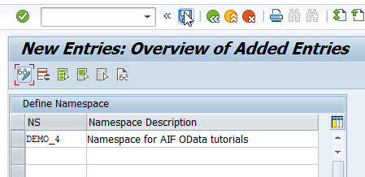

### Create interface

Now it's time to create an interface using the structure you created before.

1. While still in **Customizing** (transaction code `/n/AIF/CUST`), navigate to **Interface Development** > **Define Interfaces**.

2. In the upcoming dialog, enter your previously created namespace **`DEMO_4`** and press **Enter**.

3. Select **New Entries** and enter the following parameters based on your previously created structure:

    | Field name          | Description                         | Value
    | :--------          | :---------                         | :--------
    | Interface Name      | Name of the interface to be created | **`SALESORD`**   
    | Interface Version   | Version number of the interface     | **`1`**
    | Description         | Description of the interface        | **`Sales Order interface for OData tutorial`**
    | SAP Data structure  | Input substructure of the RFC       | **`ZDEMO_ODATA_SALES_ORDER`**
    | Raw Data structure  | Input structure of the RFC            | **`ZDEMO_ODATA_SALES_ORDER`**
    | Interface Direction | Indicates the direction of the interface  |  **`Inbound`**

4. **Save** your changes.

### Specify interface engines

Next, select the engines that should be used to handle the messages that are processed.

1. While still in **Customizing** (transaction code `/n/AIF/CUST`), navigate to **Interface Development** > **Additional Interface Properties** > **Specify Interface Engines**.

2. In the upcoming dialog, enter your previously created namespace **`DEMO_4`** and press **Enter**.

3. If your namespace contains more than one interface, select interface `SALESORD` of version `1`. If not, your interface is already displayed.

4. Change the values for the following engines:

    | Parameter          | Value
    | :--------         | :--------
    | Application Engine      | `OData application engine`
    | Persistence Engine   | `OData persistency engine`
    | Selection Engine  | `AIF Index Tables`
    | Logging Engine     | `OData logging engine`

5. **Save** your changes.

### Define OData services

Next, you need to assign the OData service to the interface.

1. While still in **Customizing** (transaction code `/n/AIF/CUST`), navigate to **Interface Development** > **Additional Interface Properties** > **Define OData Services**.

2. In the upcoming dialog, enter your previously created namespace `DEMO_4`, and press **Enter**.

3. If your namespace contains more than one interface, select interface `SALESORD` of version `1`. If not, your interface is already displayed.

4. For **oData Service Name**, enter `GWSAMPLE_BASIC`.

    <!-- border -->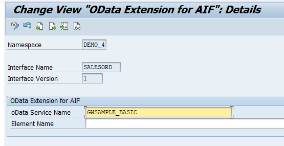

5. **Save** your changes.

### Create interface-specific single index table

It's recommended to implement an interface-specific single index table to ensure full flexibility, especially if you expect a high load of messages or if you plan to define key fields for your interface (now or later).

> You can also switch the single index table later, but when you do, all processed messages stored in the old single index table will no longer be visible in the Interface Monitor. The information for the newly incoming messages is stored in the new single index table of the interface.

1. Create a table via transaction `SE11`. You can use table `/AIF/T_ODATA_IDX` as a template by entering **`/AIF/T_ODATA_IDX`** in the field **Database table**, right-clicking it and selecting **Copy...**. Enter the name **`ZSO_MON_IDX`** for the new table and select **Continue**. When prompted, enter package **`ZDEMO`**, which you created earlier.

2. After creating the single index table, activate it by selecting **Display** and then **Activate**.

3. Go to **Customizing** (transaction code `/n/AIF/CUST`) and navigate to **SAP Application Interface Framework** > **Error Handling** > **Define Namespace-Specific Features**. Enter your namespace **`DEMO_4`** and select **Continue**.

4. Select **New Entries** to create a new entry in **Define Interface-Specific Features**. Enter your interface name **`SALESORD`** and version **`1`** and enter the name of the newly created single index table **`ZSO_MON_IDX`** in the field **Message Index Table**.

    <!-- border -->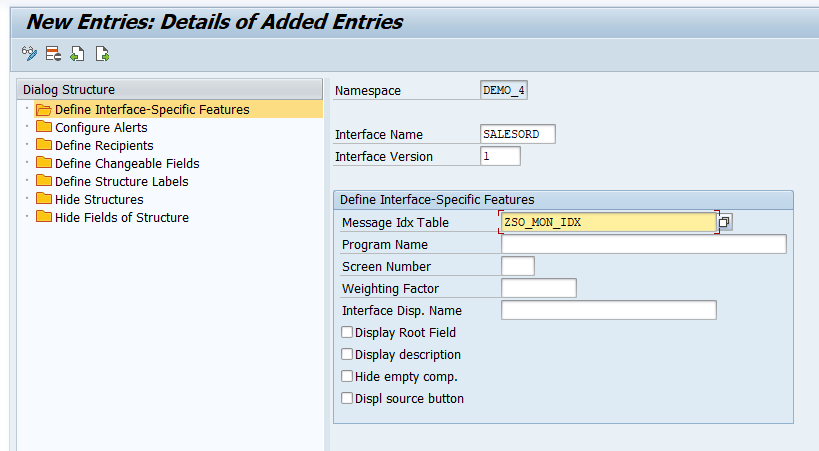

5. **Save** your changes.

### Create recipient for interface

If you want to monitor the newly created interface in the Interface Monitor of the Message Dashboard app, you need a recipient for the interface.

1. While still in **Customizing** (transaction code `/n/AIF/CUST`), navigate to **SAP Application Interface Framework** > **Error Handling** > **Define Namespace-Specific Features**. Enter or select your namespace **`DEMO_4`** and choose **Continue**.

2. In the menu on the left, navigate to **Define Recipients** by double-clicking it. Choose **New Entries**, enter the name **`ZODATA_TEST_RECIPIENT`** for your new recipient, and add a meaningful description.

    <!-- border -->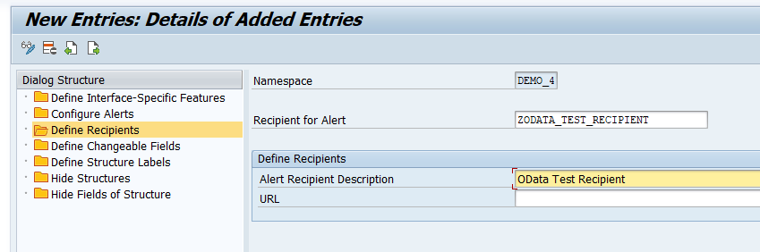

3. **Save** your changes.

### Assign recipient to interface

To be able to see any data in the Interface Monitor or the Message Dashboard, a recipient must be assigned to the interface they want to monitor.

1. While still in **Customizing** (transaction code `/n/AIF/CUST`), navigate to **SAP Application Interface Framework** > **Error Handling** > **Define Interface-Specific Features**. Enter or select your namespace **`DEMO_4`**, as well as your interface name **`SALESORD`** and interface version **`1`**. Choose **Continue**.

2. In the menu on the left, double-click **Assign Recipients Without Key Fields** and create a new entry. Enter or select the namespace and the recipient you created before.

    <!-- border -->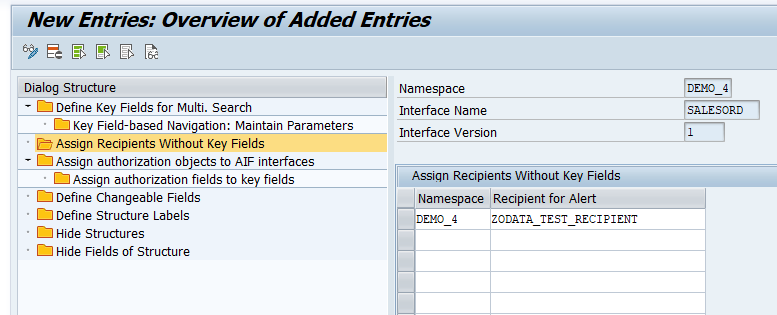

3. **Save** your changes.

### Assign users to recipient

Now the users in charge of monitoring the OData service must be assigned to the recipient.

1. Run transaction `/AIF/MYRECIPIENTS` and create a new entry. 

2. Select the namespace **`DEMO_4`** and recipient `ZODATA_TEST_RECIPIENT` you created in the steps before. 

3. Check the boxes for **Overview** and **Technical User**.

      <!-- border -->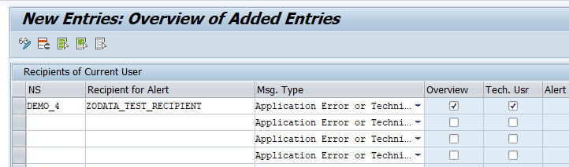

4. **Save** the new entry.

### Create variant for OData transfer job

The OData logs are passed to SAP Application Interface Framework via the OData transfer job. First, you need to create a variant of the respective program for the particular OData service.

1. Run the **ABAP Editor** (transaction code `SE38`) and enter `/AIF/ODATA_TRANSFER_JOB` in the **Program** field. Select the **Variants** radio button, and choose **Display**.
   
    <!-- border -->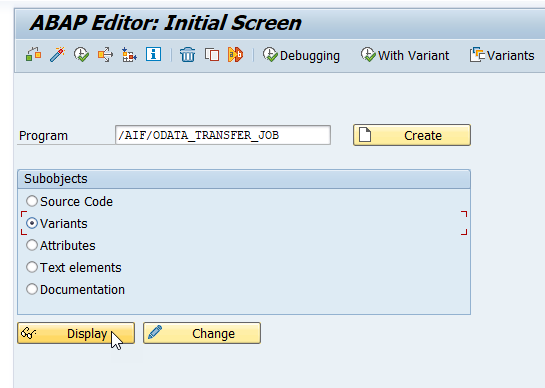

2. On the next screen, enter a name for the variant, here `SALES_ORDER`, and choose **Create**.

    <!-- border -->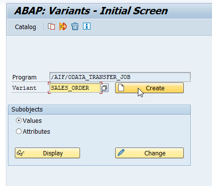

3. On the next screen, enter the **Service Name** `GWSAMPLE_BASIC` and choose **Attributes**.

    <!-- border -->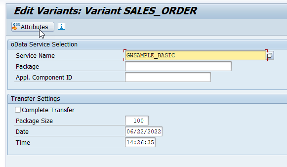

4. Finally, enter a description.

5. **Save** your changes.

### Define background job

After creating a variant of the OData transfer job, you need to schedule the respective program to collect the OData logs and pass them on to SAP Application Interface Framework.

> For demo purposes, you may also directly execute the program with variant instead of scheduling a background job once you have sent an erroneous sample message. In this case you can skip this chapter.

1. Run the **Define Background Job** (transaction code `SM36`).
Enter the job name `ODATA_TRANSFER_JOB` and choose **Start condition**.

    <!-- border -->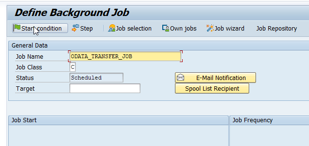

2. In the upcoming **Start Time** dialog, choose **Immediate**, which selects the **Immediate Start** flag. At the bottom of the dialog, choose **Period values** and enter a time value after which the job should be started periodically, for example, every `5 mins`. The option **Periodic Job** is now selected. **Save** your changes.

    <!-- border -->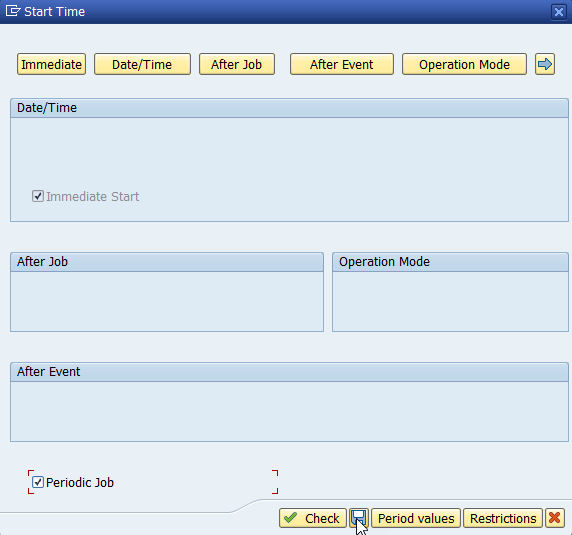

3. To maintain the program, choose **Step** from the toolbar.
   
4. In the **Create Step** dialog, enter the program name `/AIF/ODATA_TRANSFER_JOB` and the previously created variant `SALES_ORDER`. Then **save**.
   
    <!-- border -->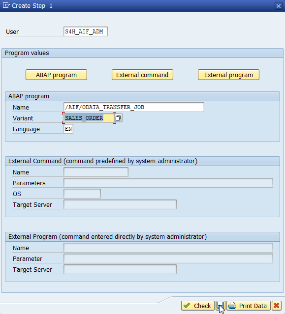

5. Click on **Back**, and then **save**. This will schedule the background job to run on a regular basis.

### Change log level

By default, only technical errors are logged in the SAP Gateway error log. To also add business-related errors, you need to change the log level.

1. Open the **SAP Gateway: Error Log** (transaction code `/IWFND/ERROR_LOG`) and navigate to **Error Log** > **Global Configuration**.

    <!-- border -->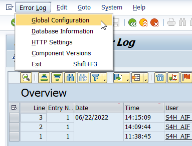

2. In the **Global Configuration**, change the **Error Log level** to `Full`.

    <!-- border -->

3. **Save** your changes.

### Determine service endpoint

Before you can send sample requests, you need to determine the service endpoint.

1. Navigate to **Activate and Maintain Services** (transaction code `/IWFND/MAINT_SERVICE`), select the service `GWSAMPLE_BASIC` with technical service name `ZGWSAMPLE_BASIC`, and choose **Call Browser**.

    <!-- border -->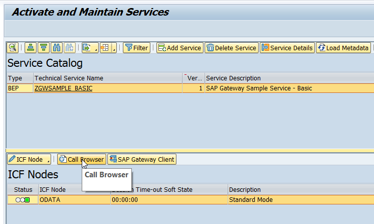

2. A browser window opens, displaying the service entities. From here, the basic endpoint URL can be gathered. In this tutorial, we use the `SalesOrderSet` collection.

    <!-- border -->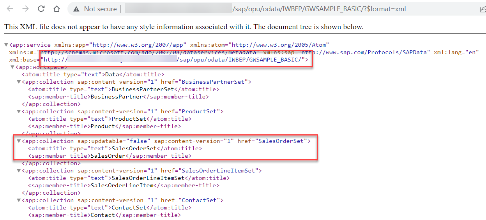

3. Since you'll need the service endpoint in the next step, copy it or leave the window open. 

### Send sample requests

Let's send in sample requests to test the SAP Application Interface Framework interface. Use a test client of your choice to call the OData service to fetch the details of a particular sales order. If you use Postman, create a new GET request, and enter the end point URL of your OData service into the address field, see previous step **Determine service endpoint** above.

> The URL should have the following format with host and port of your backend system and a particular sales order ID: **`https://host:port/sap/opu/odata/IWBEP/GWSAMPLE_BASIC/SalesOrderSet('id')`**

1. Enter the user credentials in your test client to log on to your backend system.

2. Let's first run a successful request. Select a sales order ID that exists, e.g. `0500000000`. In this case, a response with **http status code** `200` containing the sales order details should be returned. Since SAP Gateway doesn’t log successful messages, you won’t find a new entry in the message monitoring.

    <!-- border -->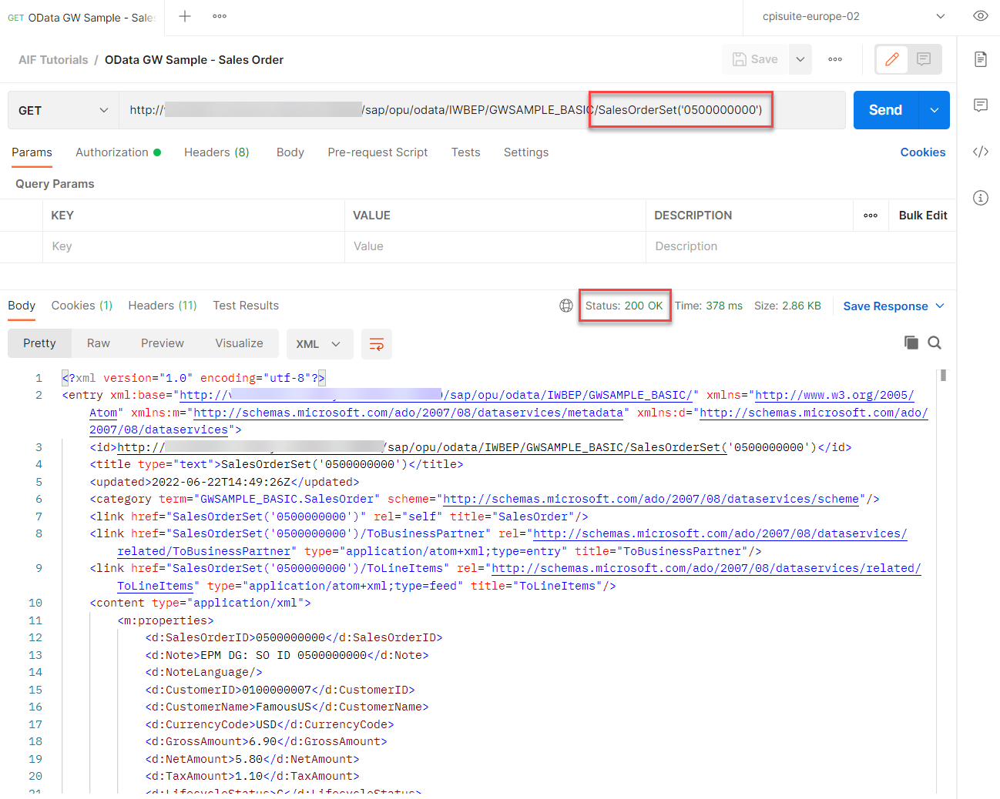

3. Now, force an error by selecting a sales order ID that doesn't exist, for example `1500000000`. In this case, you get an **http error code** `400 Bad Request`.

    <!-- border -->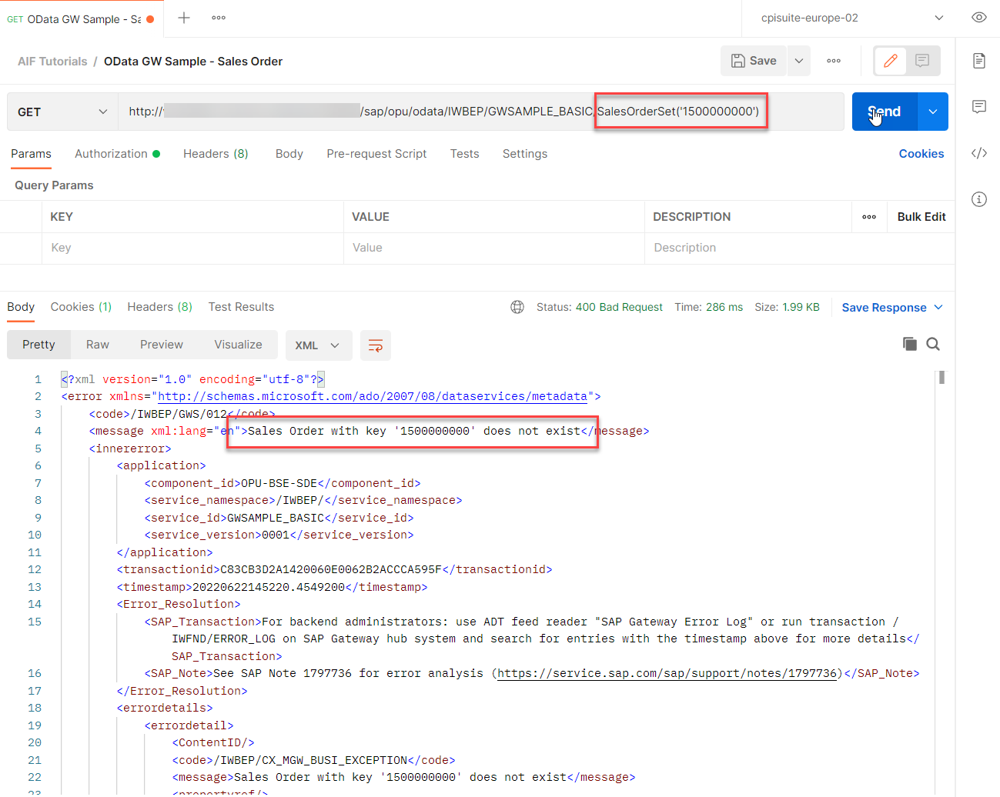

### Monitor OData interface

Finally, test your settings and verify that the OData monitoring is working as planned.

If you're using SAP GUI, check the results of your test in the **Interface Monitor** (transaction code `/n/AIF/IFMON`).

>If you don't see the new interface, check that your user is correctly assigned to the recipient as described in step **Assign users to recipient**.

Select the summary line for your interface. You're forwarded to **Monitoring and Error Handling**, which shows your selected test message(s).

<!-- border -->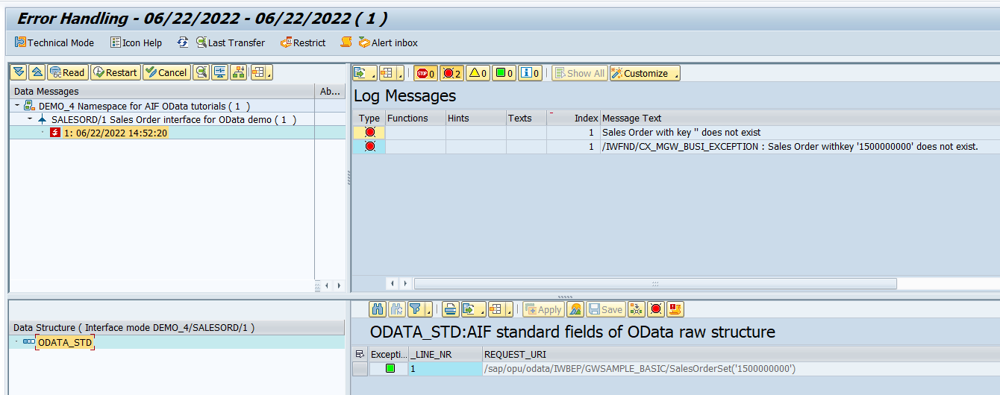

Alternatively, if you've set up Message Monitoring in the SAP Fiori launchpad, you can check the test results there. See [How to configure the SAP Fiori Apps for SAP Application Interface Framework](https://blogs.sap.com/2021/11/04/how-to-configure-the-sap-fiori-apps-for-sap-application-interface-framework/).

<!-- border -->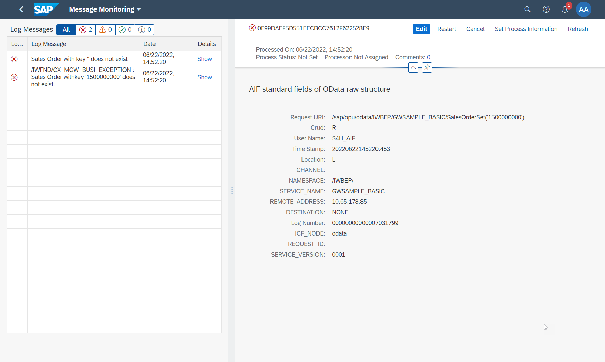

Congratulations! You've created a simple OData interface and set up monitoring for it in SAP Application Interface Framework.  

### Test yourself

---
