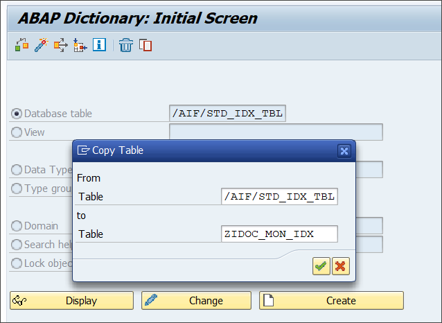

# Create a Simple IDoc Interface
<!-- description --> Create a simple IDoc interface to enable monitoring IDocs with SAP Application Interface Framework.

## Prerequisites
 - You have set up SAP Application Interface Framework
 - SAP S/4HANA 1709 or later, SAP Application Interface Framework 4.0
 - Optionally: You have a working IDoc communication in place

## You will learn
  - How to create a simple IDoc interface
  - How to use the IDoc Structure Generator
  - How to set up IDoc monitoring in SAP Application Interface Framework

## Intro
In this tutorial, you'll learn how to create a simple IDoc interface that enables you to set up IDoc monitoring. In this process, you'll use the IDoc Structure Generator to create interfaces to display and process IDocs.

> If you don't have a working IDoc scenario in place, the first three steps show you how to set up the IDoc communication with the IDoc message type `FLCUSTOMER_CREATEFROMDATA`. Otherwise, you can skip the first three steps and set up the customizing based on your existing IDoc communication.

---

### Create RFC destination

Open your system. Go to **Configuration of RFC Connections** (transaction `SM59`) and choose **Create**.

Enter a destination name following the naming convention `<SID>CLNT<client>`, with `<SID>` being your system ID and `<client>` the client number of your system. As **Connection Type**, choose `3 RFC connection to ABAP system`.  Choose **Continue**. The settings for your newly created destination open.

Switch to the **Logon & Security** tab. Maintain **Language** and **Client** and set the `Current User` flag.

**Save** your changes.

### Create port

Go to **Ports in IDoc processing** (transaction `WE21`), select the **Transactional RFC** node and choose **Create** to create a new port.

In the upcoming dialog, choose `Generate port name` and then **Continue**.

Maintain a description and in the field **RFC destination**, enter the destination you created in the previous step.

**Save** your changes.

### Create partner profile

Go to **Partner profiles** (transaction `WE20`) and choose **Create**.

Enter a **Partner no.**, following the naming convention `<SID>CLNT<client>`, `<SID>` being your system ID and `<client>` being the client number of your system. As **Type**, choose `LS` (Logical System).

In tab **Post Processing: Valid Processors**, enter **Ty.** (agent type)  `US` (User). As **Agent**, enter your user name.

In the **Inbound** table, choose **Create inbound parameter**. In the upcoming screen, choose or enter **Message Type** `FLCUSTOMER_CREATEFROMDATA` and **Process Code** `BAPI`. Lastly, for **Processing by Function Module**, choose `Trigger immediately`.

Navigate back to the partner profile and **Save** your changes.

### Create namespace

The **IDoc Structure Generator** is a report that generates most of the required customizing settings for SAP Application Interface Framework. To be able to use it correctly, you require a namespace.

Open your system. Go to **Customizing** for SAP Application Interface Framework (transaction `/n/AIF/CUST`) and navigate to **Interface Development** > **Define Namespace**.  

Select **New Entries** and enter the following name and description for your new namespace:

| NS            | Namespace description
| :-----------  | :--------------------
| **`DEMO_1`**  | **`For AIF IDoc tutorials`**

Press **Enter** to confirm your entry.

### Create package

For the next steps, you need to create a package that serves as the destination for your newly created objects.

Go to the **Object Navigator** (transaction `SE80`). From the drop-down menu, select **Package**, enter the name **`ZDEMO`**, and press **Enter** or select **Display or Create Object**. Confirm the dialogue window, enter a meaningful short description for your new package, and select **Confirm**. If prompted, enter a workbench request and confirm again.

You have successfully created a new package named `ZDEMO`.

### Generate DDIC structure and interface

Internally, SAP Application Interface Framework works with DDIC structures, but IDoc Basic Types are not available as DDIC structures. However, the IDoc Structure Generator can create the required DDIC structure for a specific basic type and extension combination.

Open the **IDoc Structure Generator** (transaction `/n/AIF/IDOC_GEN`) and enter the following general information about the IDoc you want to monitor:

| Field name                    | Description                                                | Value
| :---------------------------- | :--------------------------------------------------------  | :-------
| Basic Type                    | The basic type of the IDoc you want to monitor             | **`FLCUSTOMER_CREATEFROMDATA01`**
| Message Type                  | The message type used in the IDoc you want to monitor      | **`FLCUSTOMER_CREATEFROMDATA`**
| Extension                     | The extension name if used in the IDoc                     | leave empty
| Root Structure Name           | The name of the structure you want to create               | **`ZDEMO_1_FLCUSTOMER_CREATEFROMD`**
| Destination for Remote Search | The standard name of an RFC destination                    | leave empty
| Create or Update Structure    | Indicates if a DDIC structure should be created or updated | check the box
| Create Interface              | Indicates if an interface should be created                | check the box

Once you check the boxes for **Create or Update Structure** and **Create Interface**, two additional sections are displayed: Structure Details and Interface Definition.

In section **Structure Details**, leave the boxes unchecked and enter the following details:

| Field name         | Description   | Value
| :---------         | :------------ | :-----------
| Structure Prefix   | All DDIC objects created by the generator will start with this prefix to ensure correct naming | **`ZDEMO_1_`**
| Package            | The destination package for the new DDIC objects; if the field is left empty, the objects will be created as local objects | **`ZDEMO`**
| Workbench Request  | Enter a workbench request if the structure should be transported | your workbench request

In section **Interface Definition**, enter the following details:

| Field name               | Description | Value
| :---------               | :---------- | :-------------
| Namespace                | An existing namespace in which the interface should be created | **`DEMO_1`** (the namespace created in step 4)
| Interface Name           | The name of the to be created interface, for example (an abbreviation of) the basic type | **`FCUSTOMER`**
| Interface Version        | The version number of the interface | **`1`**
| Interface Description    | The short description of the interface | your short description  
| IDoc Processing Scenario | There are several possibilities to monitor and process an IDoc with SAP Application Interface Framework; depending on the scenario the interface is generated with different settings | **`ALE runtime; AIF enabler writing application log`**
| Customizing Request      | Enter a customizing request if the interface should be transported | your customizing request

When you've entered all the details, press **F8** or select **Execute**. The IDoc Structure Generator will start to create the required DDIC objects and the interface. Once the report is finished, a summary of what was created is displayed. Select **Continue**.

### Create interface-specific single index table

It's recommended to implement an interface-specific single index table to ensure full flexibility, especially if you expect a high load of messages or if you plan to define key fields for your interface (now or later).

> You can also switch the single index table later, but when you do, all processed messages stored in the old single index table will no longer be visible in the Interface Monitor. The information for the newly incoming messages is stored in the new single index table of the interface.

Create a table via transaction `SE11`. You can use table `/AIF/STD_IDX_TBL` as a template by entering **`/AIF/STD_IDX_TBL`** in the field **Database table**, right-clicking it and selecting **Copy...**. Enter the name **`ZIDOC_MON_IDX`** for the new table and select **Continue**. When prompted, enter the package name you created earlier.

After creating the single index table, activate it by selecting **Display** and then **Activate**.

Go to **Customizing** (transaction `/n/AIF/CUST`) and navigate to **SAP Application Interface Framework** > **Error Handling** > **Define Namespace-Specific Features**. Enter your namespace **`DEMO_1`** and select **Continue**.

Select **New Entries** to create a new entry in **Define Interface-Specific Features**. Enter your interface name **`FCUSTOMER`** and version **`1`** and enter the name of the newly created single index table **`ZIDOC_MON_IDX`** in the field **Message Index Table**.

**Save** your changes.

### Create recipient for interface

If you want to monitor the newly created interface in the Interface Monitor of the Message Dashboard app, a recipient for the interface is required.

Go to **Customizing** (transaction `/AIF/CUST`) and navigate to **SAP Application Interface Framework** > **Error Handling** > **Define Namespace-Specific Features**. Enter or select your namespace **`DEMO_1`** and select **Continue**.

In the menu on the left, navigate to **Define Recipients** by double-clicking it. Select **New Entries**, enter a meaningful name for your new recipient and add a description.

**Save** your changes.

### Assign recipient to interface

To be able to see any data in the Interface Monitor or the Message Dashboard, a recipient must be assigned to the interface you want to monitor.  

Go to **Customizing** (transaction `/AIF/CUST`) and navigate to **SAP Application Interface Framework** > **Error Handling** > **Define Interface-Specific Features**. Enter or select your namespace **`DEMO_1`**, as well as your interface name **`FCUSTOMER`** and interface version **`1`**. Select **Continue**.

In the menu on the left, double-click **Assign Recipients Without Key Fields** and create a new entry. Enter or select the namespace and the recipient you created before.

**Save** your changes.

### Assign users to recipient

Now the users in charge of monitoring the IDoc must be assigned to the recipient.

Go to transaction `/n/AIF/RECIPIENTS` and select or enter your user name and any additional user names you want to assign to the recipient.

Create a new entry and select the namespace and recipient you created in the steps before. Enter a user number and check the boxes for **Include on Overview Screen** and **Technical User**.

**Save** the new entry.

### Test IDoc interface

After the setup is complete, test your settings and verify that the IDoc monitoring is working as planned.

1. Send in new test IDocs, for example using the **Test Tool for IDoc Processing** (transaction `WE19`).

2. In the test tool, maintain basic type `FLCUSTOMER_CREATEFROMDATA01`.

3. Maintain the control record fields corresponding to your partner profile and the port created beforehand as follows:

    | Field name                    | Value
    | :---------------------------- | :-------
    | Receiver Port                 | `SAP<SID>` (`<SID>` being your system ID)
    | Receiver Partner Number       | The partner number as specified in the partner profile
    | Receiver Type                 | `LS`
    | Sender Port                   | The port as specified before
    | Sender Partner Number         | The partner number as specified in the partner profile
    | Sender Type                   | `LS`
    | Message Type                  | **`FLCUSTOMER_CREATEFROMDATA`**

    

4. Maintain sample data record by entering at least customer name, form, street, postcode, city, country and customer type. As customer type, choose either `B` or `P`.

    

5. Then, select **Standard Inbound**. A dialog pops up informing you that the IDoc was passed to the application.

6. If you're using SAP GUI, check the results of your test in the **Interface Monitor** (transaction `/n/AIF/IFMON`). You'll only be able to see the new interface if you correctly assigned your user to the recipient.

    

    When you select the summary line for your recipient, you're forwarded to **Monitoring and Error Handling**, where you can see your selected test message(s).

    

7. Alternatively, if you're using SAP Application Interface Framework with SAP Web Dynpro, you can check the test results on the **Message Dashboard** (transaction `/n/AIFX/ERR_WEB`).

    

    Here, too, selecting the summary line for your recipient forwards you to **Monitoring and Error Handling**, where you can see your selected test message(s).

      

Congratulations! You've created and tested a simple IDoc interface for monitoring in SAP Application Interface Framework.

### Test yourself 

---
