# Customize an IDoc Interface with Runtime and Monitoring
<!-- description --> Create an IDoc interface to be able to carry out data checks and mappings as well as the monitoring and error resolution capabilities of SAP Application Interface Framework.

## Prerequisites
 - You have set up SAP Application Interface Framework
 - SAP S/4HANA 1709 or later, SAP Application Interface Framework 4.0
 - Optionally: You have a working IDoc communication in place

## You will learn
  - How to create an IDoc interface
  - How to use the IDoc Structure Generator
  - How to implement a mapping in SAP Application Interface Framework
  - How to create an action to call the actual application

## Intro
In this tutorial, you'll learn how to create and customize an IDoc interface. In this process, you'll use the IDoc Structure Generator to create interfaces to display and process IDocs.

> If you don't have a working IDoc scenario in place, the first five steps show you how to set up the IDoc communication with the IDoc message type `FLIGHTBOOKING_CREATEFROMDAT`. The steps show you how to process an IDoc with SAP Application Interface Framework instead of using the IDoc standard processing. Otherwise, if you have an existing IDoc communication set up, you can skip the first two steps and start with step number three in order to change the IDoc processing from the standard processing to the SAP Application Interface Framework processing.

---

### Create RFC destination


1. Open your system. Go to **Configuration of RFC Connections** (transaction code `SM59`) and choose **Create**.

2. Enter a destination name following the naming convention `<SID>CLNT<client>`, with `<SID>` being your system ID and `<client>` the client number of your system. As **Connection Type**, choose `3 RFC connection to ABAP system`.  Choose **Continue**. The settings for your newly created destination open.

3. Switch to the **Logon & Security** tab. Maintain **Language** and **Client** and set the `Current User` flag.

    <!-- border -->

4. **Save** your changes.


### Create port

1. Go to **Ports in IDoc processing** (transaction code `WE21`), select the **Transactional RFC** node and choose **Create** to create a new port.

2. In the upcoming dialog, choose `Generate port name` and then **Continue**.

3. Maintain a description and in the field **RFC destination**, enter the destination you created in the previous step.

    <!-- border -->

4. **Save** your changes.


### Assign function module to message type and basic type

To process an IDoc message via SAP Application Interface Framework, one of the SAP Application Interface Framework function modules need to be assigned to the combination of IDoc message type and IDoc basic type.

1. Go to **IDoc Assignment of FM to Log. Message and IDoc Type** (transaction code `WE57`). Confirm the upcoming dialog warning you that the table is cross-client.

2. Choose **New Entries** and enter the following data:

| Field Name            | Value
| :-----------  | :--------------------
| Function module  | **`/AIF/IDOC_INB_PROCESS_FUNC_1`**
| Function type  | **`Function module`**
| Basic type  | **`FLIGHTBOOKING_CREATEFROMDAT01`**
| Message type  | **`FLIGHTBOOKING_CREATEFROMDAT`**
| Direction  | **`Inbound`**

    <!-- border -->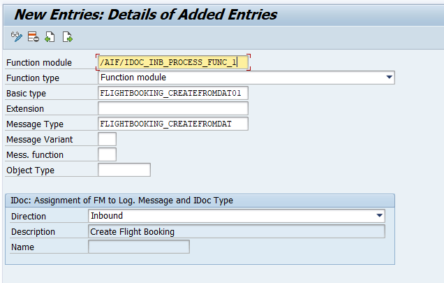

3. **Save** your changes.


### Create process code

1. Go to **Inbound process code** (transaction code `WE42`).

2. Choose **New Entries** and enter the following data:

| Field Name            | Value
| :-----------  | :--------------------
| Process code  | **`ZDEMO_FLBOOK`**
| Identification  | **`/AIF/IDOC_INB_PROCESS_FUNC_1`**

3. Maintain a description, select the `Process with ALE service` flag and the `Processing by function module` flag.

    <!-- border -->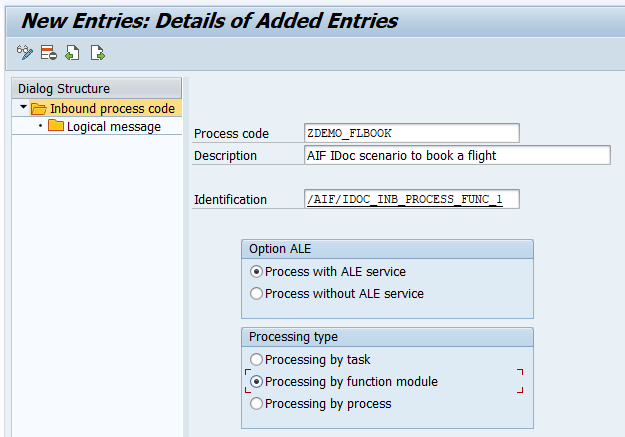

4. **Save** your changes.


### Create partner profile

1. Go to **Partner profiles** (transaction `WE20`) and choose **Create**.

2. Enter a **Partner no.**, following the naming convention `<SID>CLNT<client>`, `<SID>` being your system ID and `<client>` being the client number of your system. As **Type**, choose `LS` (Logical System).

3. In tab **Post Processing: Valid Processors**, enter **Ty.** (agent type)  `US` (User). As **Agent**, enter your user name.

    <!-- border -->

4. In the **Inbound** table, choose **Create inbound parameter**. In the upcoming screen, choose or enter **Message Type** `FLIGHTBOOKING_CREATEFROMDAT` and the beforehand created **Process Code** `ZDEMO_FLBOOK`. Lastly, for **Processing by Function Module**, choose `Trigger immediately`.

    <!-- border -->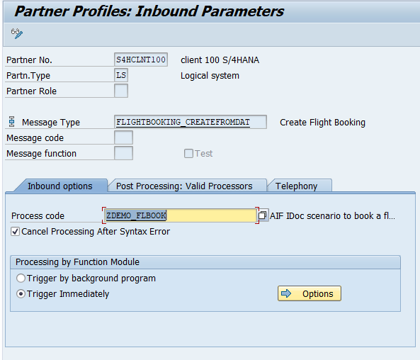

5. Navigate back to the partner profile and **Save** your changes.


### Create package and function group

Create a package that serves as the destination for your newly created objects.

1. Go to the **Object Navigator** (transaction code `SE80`).
   
2. From the drop-down menu, select **Package**, enter the name **`ZDEMO`**, and press **Enter** or choose **Display or Create Object**. If you have run through other SAP Application Interface Framework tutorials before, the package may exist. In this case, it will be displayed. Otherwise create it. Confirm the dialogue window, enter a meaningful short description for your new package, and choose **Confirm**. If prompted, enter a workbench request and confirm again.

    <!-- border -->

3. Additionally, create a new function group by selecting **Function Group** from the drop-down menu and enter the name **`ZDEMO`**.

    <!-- border -->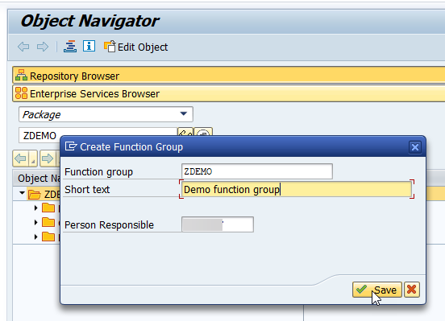

You have successfully created a new package named `ZDEMO` and a new function group named `ZDEMO`.


### Create namespace

The **IDoc Structure Generator** is a report that generates most of the required customizing settings for SAP Application Interface Framework. To be able to use it correctly, you require a namespace.

1. Open your system. Go to **Customizing** for SAP Application Interface Framework (transaction code `/AIF/CUST`) and navigate to **Interface Development** > **Define Namespace**.  

2. Choose **New Entries** and enter the following name and description for your new namespace:

| NS            | Namespace description
| :-----------  | :--------------------
| **`DEMO_1`**  | **`For AIF IDoc tutorials`**

    <!-- border -->

3. Press **Enter** to confirm your entry.


### Generate ABAP Dictionary structure and interface

Internally, SAP Application Interface Framework works with ABAP Dictionary structures, but IDoc Basic Types are not available as ABAP Dictionary structures. However, the IDoc Structure Generator can create the required ABAP Dictionary structure for a specific basic type and extension combination.

1. Open the **IDoc Structure Generator** (transaction code `/AIF/IDOC_GEN`) and enter the following general information about the IDoc you want to monitor:

| Field name                    | Description                                                | Value
| :---------------------------- | :--------------------------------------------------------  | :-------
| Basic Type                    | The basic type of the IDoc you want to monitor             | **`FLIGHTBOOKING_CREATEFROMDAT01`**
| Message Type                  | The message type used in the IDoc you want to monitor      | **`FLIGHTBOOKING_CREATEFROMDAT`**
| Extension                     | The extension name if used in the IDoc                     | leave empty
| Root Structure Name           | The name of the structure you want to create               | **`ZDEMO_1_FLIGHTBOOKING_CREATE`**
| Destination for Remote Search | The standard name of an RFC destination                    | leave empty
| Create or Update Structure    | Indicates if an ABAP Dictionary structure should be created or updated | check the box
| Create Interface              | Indicates if an interface should be created                | check the box


2. Once you check the boxes for **Create or Update Structure** and **Create Interface**, two additional sections are displayed: Structure Details and Interface Definition. In section **Structure Details**, leave the boxes unchecked and enter the following details:

| Field name         | Description   | Value
| :---------         | :------------ | :-----------
| Structure Prefix   | All ABAP Dictionary objects created by the generator will start with this prefix to ensure correct naming. | **`ZDEMO_1_`**
| Package            | The destination package for the new ABAP Dictionary objects; if the field is left empty, the objects will be created as local objects. | **`ZDEMO`**
| Workbench Request  | Enter a workbench request if the structure should be transported. | your workbench request

3. In section **Interface Definition**, enter the following details:

| Field name               | Description | Value
| :---------               | :---------- | :-------------
| Namespace                | An existing namespace in which the interface should be created | **`DEMO_1`** (the namespace created before)
| Interface Name           | The name of the to be created interface, for example (an abbreviation of) the basic type | **`FLBOOK`**
| Interface Version        | The version number of the interface | **`1`**
| Interface Description    | The short description of the interface | your short description  
| IDoc Processing Scenario | There are several possibilities to monitor and process an IDoc with SAP Application Interface Framework; depending on the scenario the interface is generated with different settings. | **`AIF runtime; Call IDoc function as action`**
| Customizing Request      | Enter a customizing request if the interface should be transported. | your customizing request

    <!-- border -->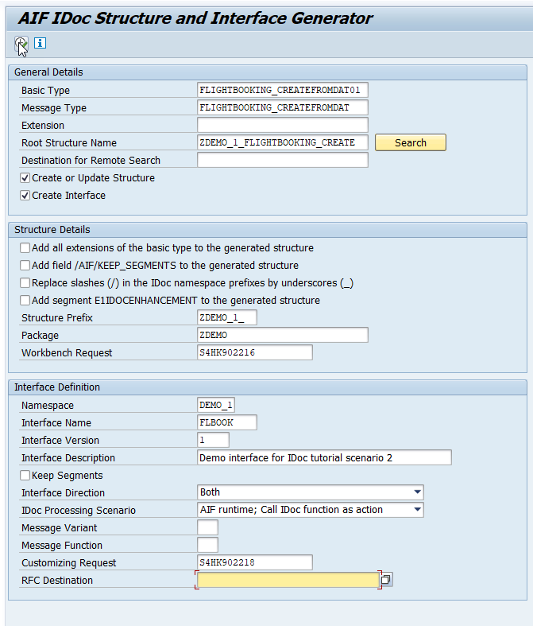

4. When you've entered all the details, press **F8** or choose **Execute**. The IDoc Structure Generator will start to create the required ABAP Dictionary objects and the interface. Once the report is finished, a summary of what was created is displayed.

    <!-- border -->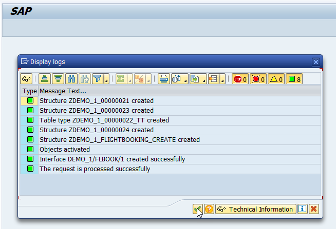

5. Choose **Continue**.


### Change generated interface

1. Go to **Customizing** for SAP Application Interface Framework (transaction code `/AIF/CUST`) and navigate to **Interface Development** > **Define Interfaces**. In the upcoming dialog, enter your previously created namespace **`DEMO_1`**, and continue.

2. Enable **Change** mode. Double-click the newly generated interface `FLBOOK` to open it. Because we like to maintain checks and field mappings, deselect the **Move Corresponding Structures** flag here. We will set it in the structure mapping.

    <!-- border -->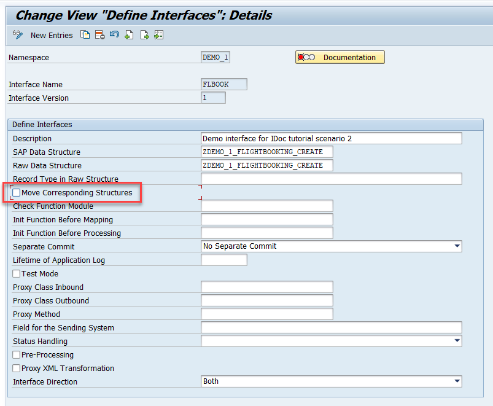

3. **Save** your changes.


### Select source and destination structures


1. While in **Customizing** (transaction code `/AIF/CUST`), navigate to **Interface Development** > **Define Structure Mappings**.

2. In the upcoming dialog, enter your previously created namespace **`DEMO_1`**, interface name **`FLBOOK`**, and interface version **`1`**. Choose **Continue**.

3. Choose **New Entries** and enter the root node of your interface structure, here **`ZDEMO_1_FLIGHTBOOKING_CREATE`**.

    <!-- border -->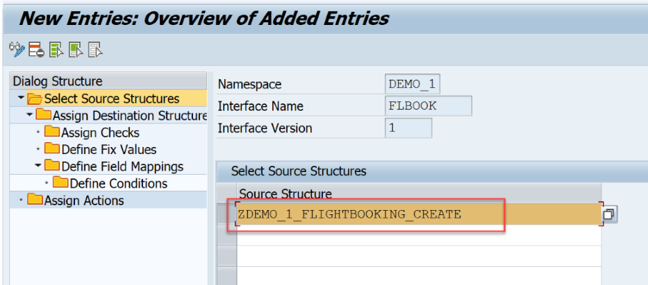

4. Select the new entry and double-click **Assign Destination Structure** in the menu on the left.

5. Choose **New Entries** and enter the **Number of Structure Mapping** **`10`**. As **Destination Structure**, enter the same root node of your interface structure, **`ZDEMO_1_FLIGHTBOOKING_CREATE`**. Finally, select the **Move Corresponding Fields** flag. Unless you define a mapping for a particular field, this ensures that the fields are mapped one to one.

    <!-- border -->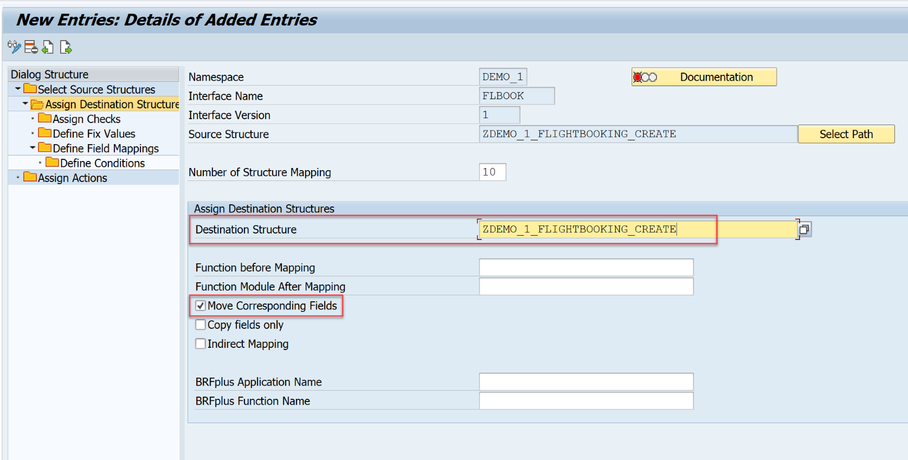

6. **Save** your changes.


### Define mapping

In the following, we like to enrich the incoming flight booking data, that is, the field pass name should be filled based on the customer ID. For this, we implement a table lookup to fetch the pass name.

1. While in **Define Structure Mappings**, double-click the node **Define Field Mappings**. Create a new entry and define the field mapping as follows:

    | Field | Value
    | :--- | :----
    | Field in Destination Structure | **`E1SBO_CRE-E1BPSBONEW-PASSNAME`**
    | Field Name 1 | **`E1SBO_CRE-E1BPSBONEW-CUSTOMERID`**
    | Namespace | **`DEMO_1`**
    | Value Mapping | **`VM_CUSTOMER`**

    <!-- border -->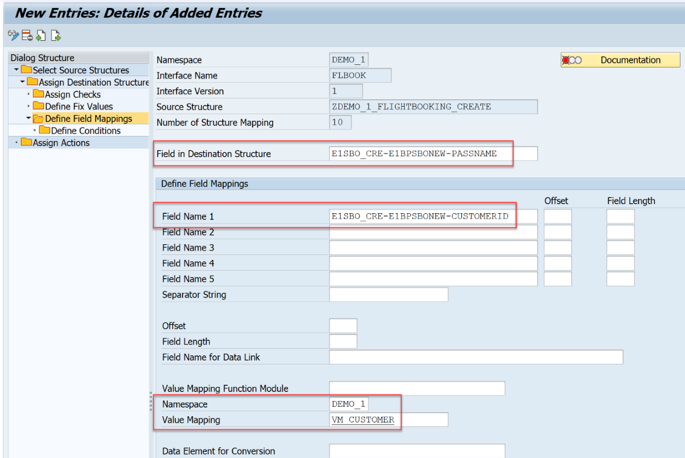

    Since the value mapping doesn't exist yet, you are asked to create it. Confirm the dialog.

2. Navigate to the reusable value mapping by double-clicking `VM_CUSTOMER` and define it with the following information:

    | Field | Value
    | :--- | :----
    | Value Mapping Description | **`Fetch customer name from table SCUSTOM`**
    | Table Name | **`SCUSTOM`**
    | Field Name | **`NAME`**
    | Where Condition for Select Statement | **`ID = '$1'`**

    <!-- border -->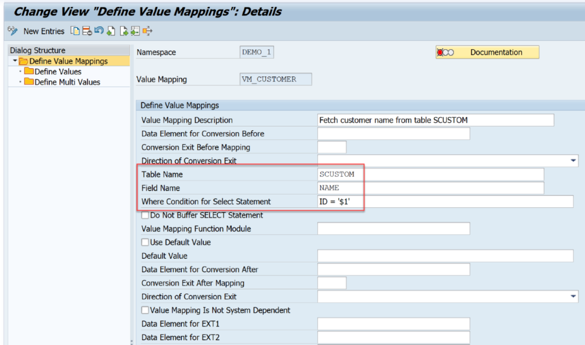

3. **Save** the value mapping and navigate back to **Define Field Mappings**.


### Define action


Next, create an action with a function to book the flights in your test scenario.

1. In **Define Structure Mappings**, double-click the node **Assign Actions**.

    Create a new entry and enter the following details:

    | Field | Value
    | :--- | :----
    | Action Number | **`10`**
    | Namespace | **`DEMO_1`**
    | Action | **`FLIGHT_CREATE`**

    <!-- border -->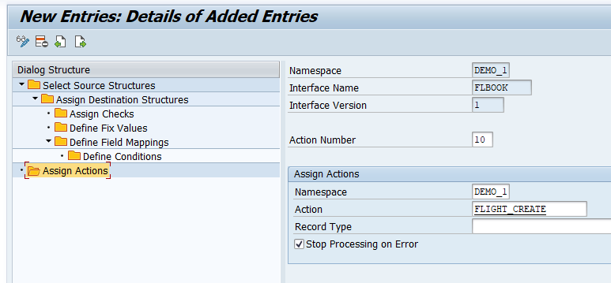

2. Since the action doesn't exist yet, you're asked to create it. Confirm the upcoming dialog with **Yes**.

3. Navigate to the new action by double-clicking `FLIGHT_CREATE`.

    In **Define Actions**, you can maintain multiple functions for each application. In this tutorial, you only need one function calling the IDoc runtime to create new flight bookings.

    Enter an action description and set the **Commit Mode** to **`COMMIT WORK`** and the **Commit Level** to **`After Each Function`**.

    <!-- border -->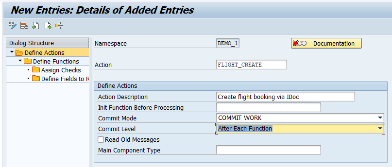

4. Double-click the **Define Functions** node. Create a new function with **Function Number** **`10`** and **Function Module Name** **`ZFLIGHT_CREATE_IDOC`**.

    <!-- border -->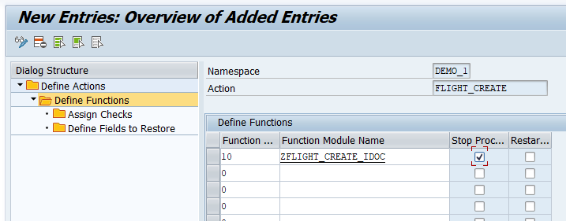

    Since the function module doesn't exist yet, you're asked to create it. Confirm the upcoming dialog with **Yes**.

5. In the next dialog, enter your function group **`ZDEMO`** and choose **Copy**. A new function module is created as copy of the `/AIF/FILE_TEMPL_PROCESS` template.

    Open the function module, switch to the **Source code** tab and enter the following source code:

    ```ABAP

    FUNCTION ZFLIGHT_CREATE_IDOC .
    *"----------------------------------------------------------------------
    *"*"Local Interface:
    *"  IMPORTING
    *"     REFERENCE(TESTRUN) TYPE  C
    *"     REFERENCE(SENDING_SYSTEM) TYPE  /AIF/AIF_BUSINESS_SYSTEM_KEY
    *"       OPTIONAL
    *"  TABLES
    *"      RETURN_TAB STRUCTURE  BAPIRET2
    *"  CHANGING
    *"     REFERENCE(DATA)
    *"     REFERENCE(CURR_LINE)
    *"     REFERENCE(SUCCESS) TYPE  /AIF/SUCCESSFLAG
    *"     REFERENCE(OLD_MESSAGES) TYPE  /AIF/BAL_T_MSG
    *"----------------------------------------------------------------------

      CALL FUNCTION '/AIF/IDOC_ACTION_FUNCTION'
        EXPORTING
          iv_idoc_function  = 'IDOC_INPUT_FLIGHTBOOKING_CREAT'
        TABLES
          return = return_tab
        CHANGING
          data = data.

    ENDFUNCTION.
    ```

6. **Save** and activate your function module.

7. Navigate back to the action and **save** your changes.

8. Navigate back to **Define Structure Mappings** and **save** your changes.


### Create interface-specific single index table


It's recommended to implement an interface-specific single index table to ensure full flexibility, especially if you expect a high load of messages or if you plan to define key fields for your interface (now or later).

> You can also switch the single index table later, but when you do, all processed messages stored in the old single index table will no longer be visible in the Interface Monitor. The information for the newly incoming messages is stored in the new single index table of the interface.

1. Create a table via transaction `SE11`. You can use table `/AIF/STD_IDX_TBL` as a template by entering **`/AIF/STD_IDX_TBL`** in the field **Database table**, right-clicking it and choosing **Copy...**. Enter the name **`ZIDOC_RT_IDX`** for the new table and choose **Continue**. When prompted, enter the package name you created earlier.

    <!-- border -->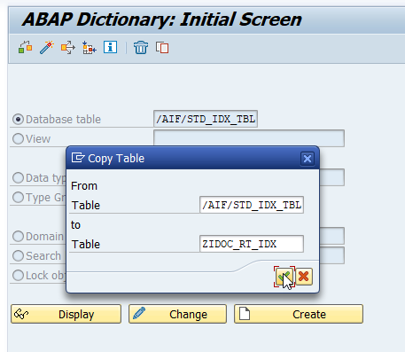

2. After creating the single index table, activate it by choosing **Display** and then **Activate**.

    <!-- border -->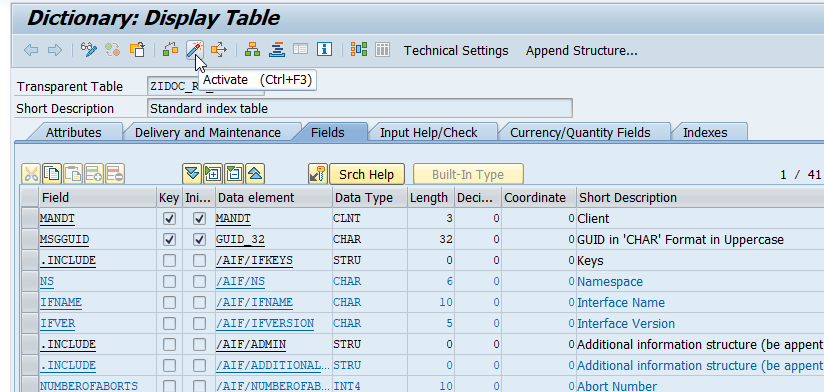

3. Go to **Customizing** (transaction `/AIF/CUST`) and navigate to **SAP Application Interface Framework** > **Error Handling** > **Define Namespace-Specific Features**. Enter your namespace **`DEMO_1`** and choose **Continue**.

4. Choose **New Entries** to create a new entry in **Define Interface-Specific Features**. Enter your interface name **`FLBOOK`** and version **`1`** and enter the name of the newly created single index table **`ZIDOC_RT_IDX`** in the field **Message Index Table**.

    <!-- border -->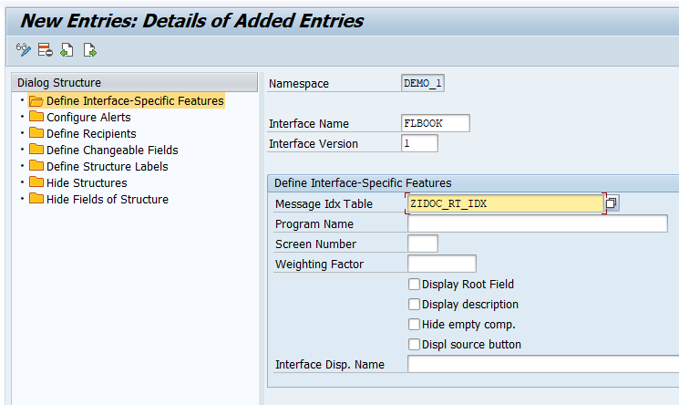

5. **Save** your changes.


### Create recipient for interface

If you want to monitor the newly created interface in the Interface Monitor of the Message Dashboard app, a recipient for the interface is required.

1. Go to **Customizing** (transaction `/AIF/CUST`) and navigate to **SAP Application Interface Framework** > **Error Handling** > **Define Namespace-Specific Features**. Enter or select your namespace **`DEMO_1`** and choose **Continue**.

2. In the menu on the left, navigate to **Define Recipients** by double-clicking it. Choose **New Entries**, enter a meaningful name for your new recipient and add a description.

    <!-- border -->

3. **Save** your changes.


### Assign recipient to interface


To be able to see any data in the Interface Monitor or the Message Dashboard, a recipient must be assigned to the interface you want to monitor.  

1. Go to **Customizing** (transaction `/AIF/CUST`) and navigate to **SAP Application Interface Framework** > **Error Handling** > **Define Interface-Specific Features**. Enter or select your namespace **`DEMO_1`**, as well as your interface name **`FLBOOK`** and interface version **`1`**. Choose **Continue**.

    <!-- border -->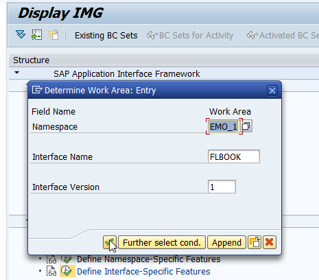

2. In the menu on the left, double-click **Assign Recipients Without Key Fields** and create a new entry. Enter or select the namespace and the recipient you created before.

    <!-- border -->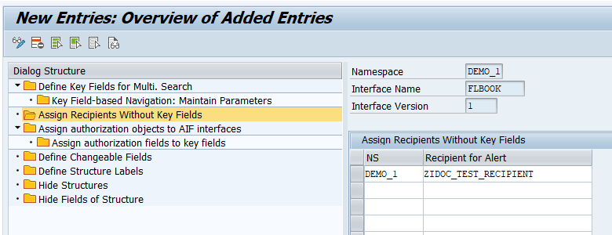

3. **Save** your changes.


### Assign users to recipient


Now the users in charge of monitoring the IDoc must be assigned to the recipient.

1. Go to transaction code `/AIF/RECIPIENTS` and select or enter your user name and any additional user names you want to assign to the recipient.

    <!-- border -->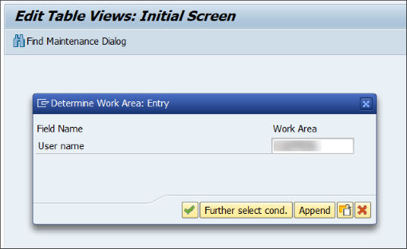

2. Create a new entry and select the namespace and recipient you created in the steps before. Enter a user number and check the boxes for **Include on Overview Screen** and **Technical User**.

    <!-- border -->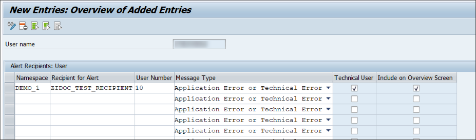

3. **Save** the new entry.


### Create test data


Before you can create flight bookings, you need to generate test data.

1. To do so, run transaction code `BC_DATA_GEN`, select the standard data record, and execute the report.

    <!-- border -->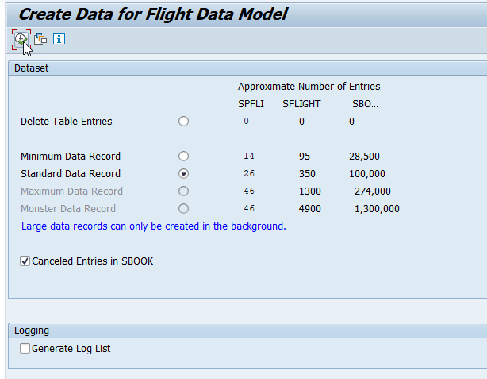

2. Open the **Data Browser** (transaction code `SE16`), select the table **SFLIGHTS**, and choose **Execute**. The generated flight data entries are displayed.

>If you run the requests in step 18, select existing flights from this table. Ensure that the flight date is in the future, otherwise your requests will fail.

    <!-- border -->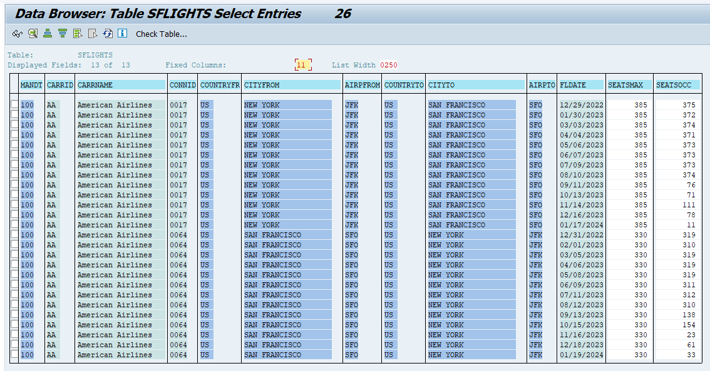


### Test IDoc interface


After the setup is complete, test your settings and verify that the IDoc monitoring is working as planned.

1. Send in new test IDocs, for example using the **Test Tool for IDoc Processing** (transaction code `WE19`).

2. In the test tool, maintain basic type `FLIGHTBOOKING_CREATEFROMDAT01`.

3. Maintain the control record fields corresponding to your partner profile and the port created beforehand as follows:

    | Field name                    | Value
    | :---------------------------- | :-------
    | Receiver Port                 | `SAP<SID>` (`<SID>` being your system ID)
    | Receiver Partner Number       | The partner number as specified in the partner profile
    | Receiver Type                 | `LS`
    | Sender Port                   | The port as specified before
    | Sender Partner Number         | The partner number as specified in the partner profile
    | Sender Type                   | `LS`
    | Message Type                  | **`FLIGHTBOOKING_CREATEFROMDAT`**

    <!-- border -->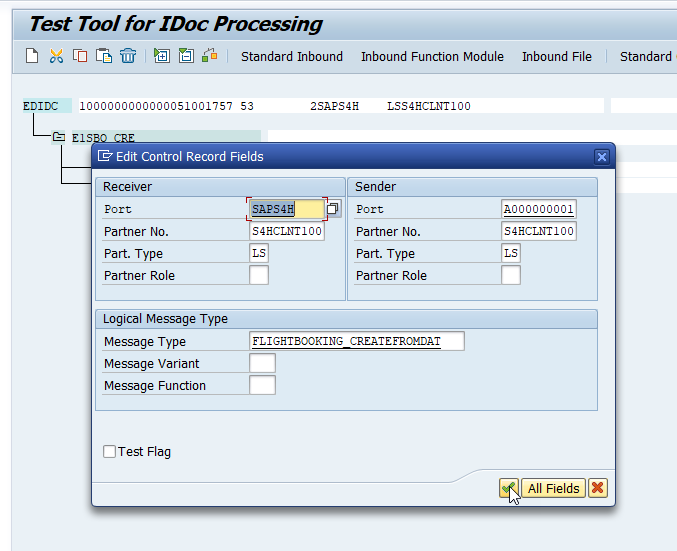

4. Maintain existing flight data from table `SFLIGHTS`, see above. Maintain a customer ID, e.g., `42` and an agency number, e.g., `109`. As flight class, choose either `Y`, `C` or `F`.

    <!-- border -->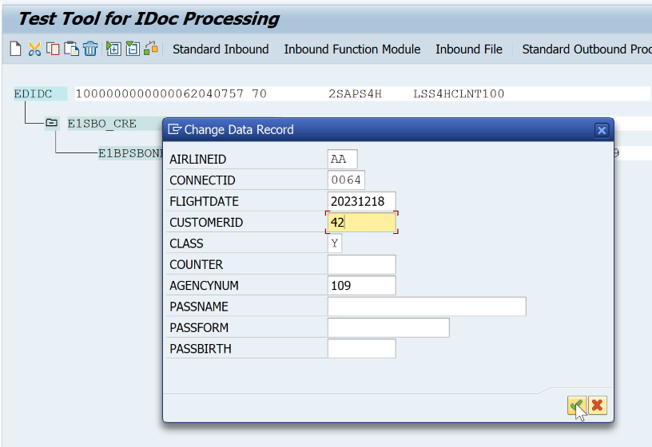

5. Then, choose **Standard Inbound**. A dialog pops up informing you that the IDoc was passed to the application.

6. Check the results of your test in the **Interface Monitor** (transaction code `/AIF/IFMON`). You'll only be able to see the new interface if you correctly assigned your user to the recipient.

    <!-- border -->

7. When you select the summary line for your interface, you're forwarded to **Monitoring and Error Handling**, where you can see your selected test message(s).

    <!-- border -->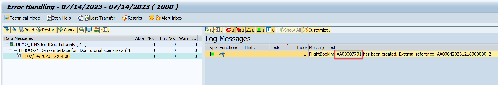

8. In the log message, the internal reference to the flight booking is displayed. It's a combination of the airline ID and the booking ID. Note down the ID. You need it for the next step.

9. Let's now check if the lookup value mapping functioned properly. Open the **Data Browser** (transaction `SE16`), and enter table name `SBOOK`. Then choose icon **Table Contents**.

10. On the next screen, enter **CARRID** and **BOOKID** of the successful created booking. You derive the values from the log message, see above. Then choose **Execute**.

    <!-- border -->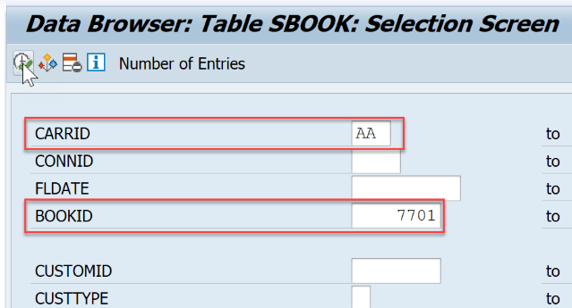

    As you can see for the chosen table entry, the pass name has been successfully mapped.

    <!-- border -->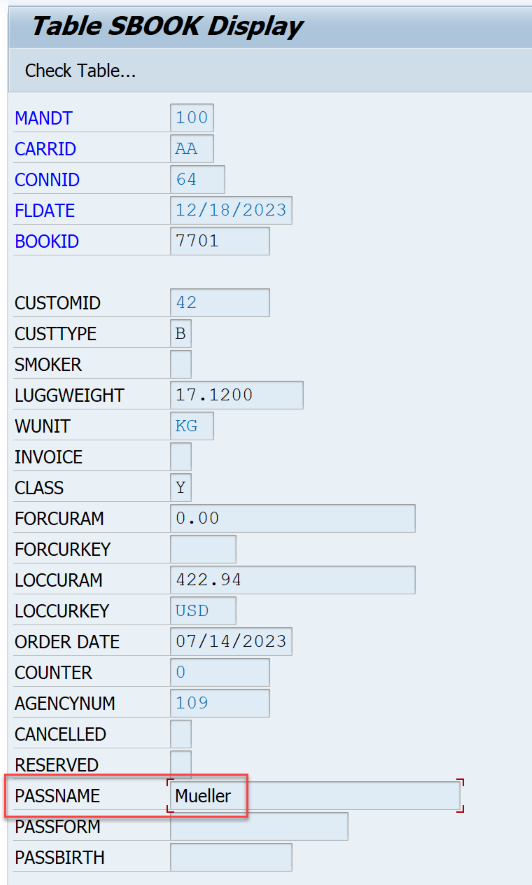

Congratulations! You've created, customized and tested an IDoc interface for processing and monitoring in SAP Application Interface Framework.


### Test yourself 


---
