# Enhance an IDoc Interface with Preprocessing
<!-- description --> Enhance an existing "monitoring only" IDoc interface to be able to carry out data checks and mappings using the preprocessing capability of SAP Application Interface Framework before actually calling the IDoc interface.

## Prerequisites
 - You've set up SAP Application Interface Framework
 - SAP S/4HANA 2022 FPS02 or later; for lower releases, apply SAP note [3274990](https://launchpad.support.sap.com/#/notes/3274990)
 - You've completed the tutorial [Create a Simple IDoc Interface](aif-idoc-monitoring-interface-create)

## You will learn
  - How to enhance an IDoc interface in SAP Application Interface Framework using the preprocessing capability
  - How to implement mappings in SAP Application Interface Framework

## Intro
In this tutorial, you will learn how to enhance a simple IDoc interface in SAP Application Interface Framework by enabling the preprocessing capability. The preprocessing capability allows you to not only monitor your IDoc interface but also to implement additional mappings, data checks, business logic, and so on, without changing your existing IDoc configuration, that is, without the need to change the existing partner profile.

---

### Change existing interface

1. Go to **Customizing** for SAP Application Interface Framework (transaction code `/AIF/CUST`) and navigate to **Interface Development** > **Define Interfaces**. In the upcoming dialog, enter your previously created namespace **`DEMO_1`**, and continue.
   
2. Enable **Change** mode. Double-click the existing interface `FCUSTOMER` to open it. Deselect the **Move Corresponding Structures** flag and select the **Pre-Processing** flag.

    <!-- border -->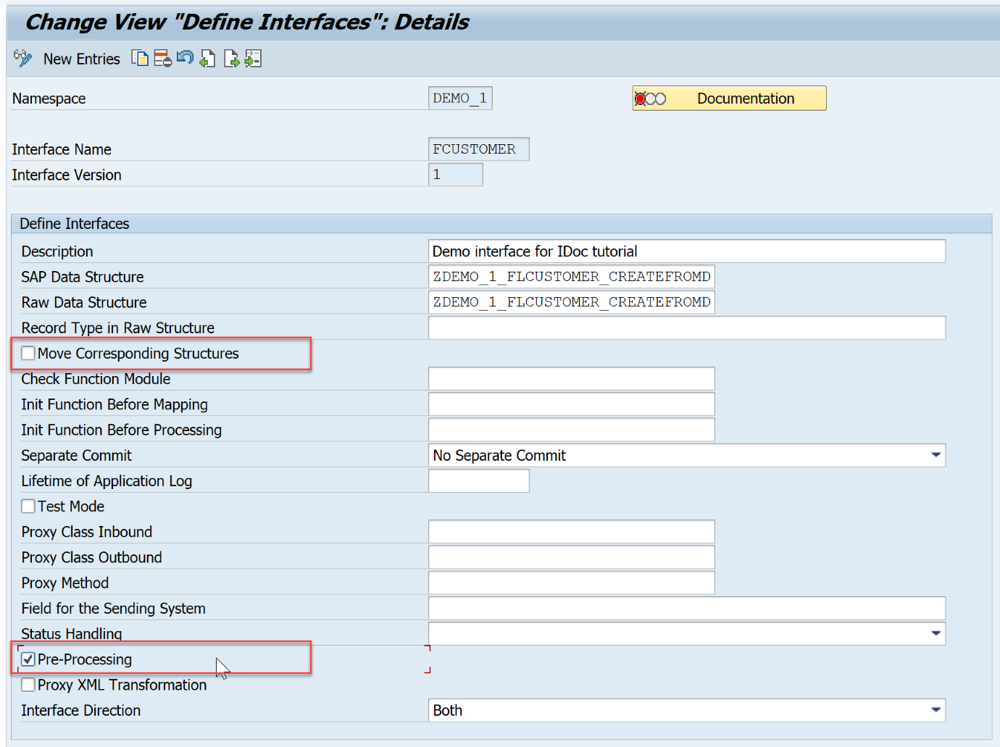

3. **Save** your changes.

### Select source and destination structures

1. While in **Customizing** (transaction code `/AIF/CUST`), navigate to **Interface Development** > **Define Structure Mappings**.

2. In the upcoming dialog, enter your previously created namespace **`DEMO_1`**, interface name **`FCUSTOMER`**, and interface version **`1`**. Choose **Continue**.

3. Choose **New Entries** and enter the root node of your interface structure, here **`ZDEMO_1_FLCUSTOMER_CREATEFROMD`**.

    <!-- border -->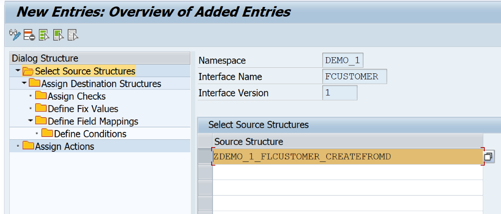

4. Select the new entry and double-click **Assign Destination Structure** in the menu on the left.

5. Choose **New Entries** and enter the **Number of Structure Mapping** **`10`**. As **Destination Structure**, enter the same root node of your interface structure, **`ZDEMO_1_FLCUSTOMER_CREATEFROMD`**. Finally, select the **Move Corresponding Fields** flag.

    <!-- border -->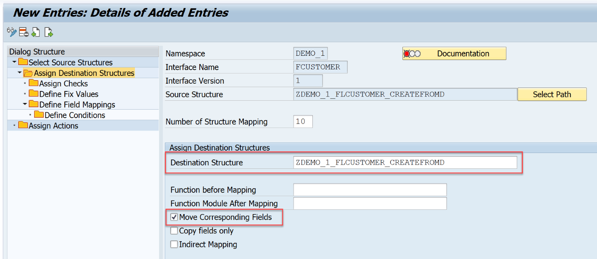

6. **Save** your changes.

### Add a fixed value

We would like to set a fixed discount when creating a new customer.

1. While in **Define Structure Mappings**, with your destination structure `ZDEMO_1_FLCUSTOMER_CREATEFROMD` selected, double-click the node **Define Fix Values** in the menu on the left. In **Change mode**, choose **New Entries** to add a new fixed value, and enter or select the following details:

    | Field | Value
    | :----  | :----
    | Field Name | **`E1SCU_CRE-E1BPSCUNEW-DISCOUNT`**
    | Namespace | **`DEMO_1`**
    | Name of Fix Value | **`FCUST_DISCOUNT`**

2. Press **Enter**. Because the fix value doesn't exist yet, you are asked to create the new fix value.

    <!-- border -->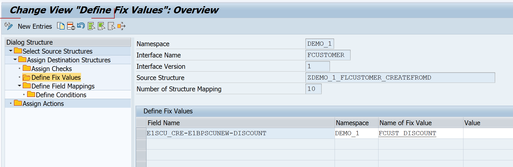

3. **Save** the new entry.

4. Double-click the new fix value to further define it. A new window opens in which you can enter the following information:

    | Field | Value
    | :---- | :-----
    | Fix Value Description | Enter a meaningful description, for example **`Flight customer discount`**.
    | Value | **`10`**

    <!-- border -->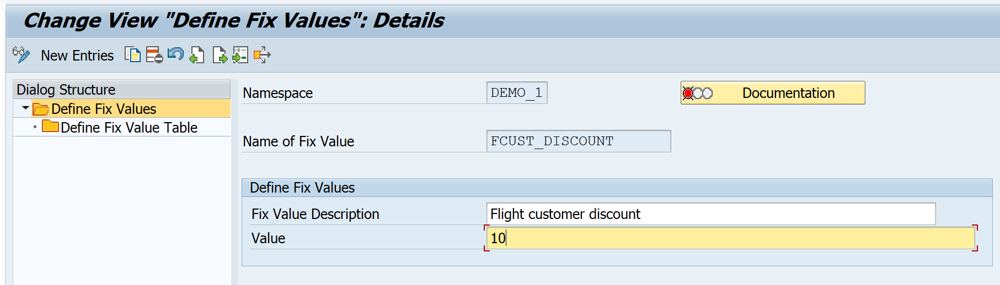

5. **Save** your changes and close the new window.

### Define value mapping

1. While in **Define Structure Mappings**, with your destination structure `ZDEMO_1_FLCUSTOMER_CREATEFROMD` selected, double-click the node **Define Field Mappings**. Create a new entry by choosing **New Entry** and define the field mapping as follows:

    | Field | Value
    | :---- | :-----
    | Field in Destination Structure | **`E1SCU_CRE-E1BPSCUNEW-CUSTTYPE`**
    | Field Name 1 | **`E1SCU_CRE-E1BPSCUNEW-CUSTTYPE`**
    | Namespace | **`DEMO_1`**
    | Value Mapping | **`VM_CUSTTYPE`**

    Since the value mapping doesn't exist yet, you are asked to create it. Confirm the dialog.

2. Navigate to the reusable value mapping by double-clicking `VM_CUSTTYPE` and define it with the following information:

    | Field | Value
    | :--- | :----
    | Value mapping description | **`Map customer type`**
    | Data Element for INT | **`S_CUSTTYPE`**
    | Number of External Values | **`1`**
    | Single or Multiple Value Mapping | **`Single`**
    | Customizing or Master Data | **`Master Data`**

    <!-- border -->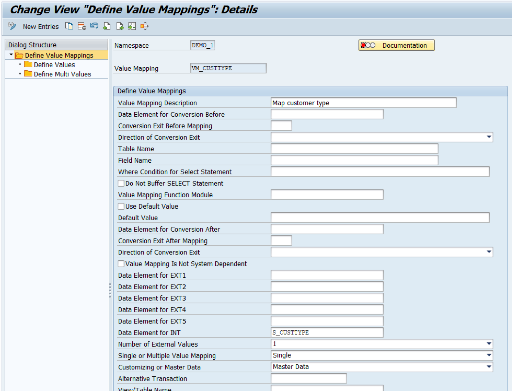

3. Save the value mapping and navigate back to **Define Field Mappings**. Your field mapping should look like this:
    
    <!-- border -->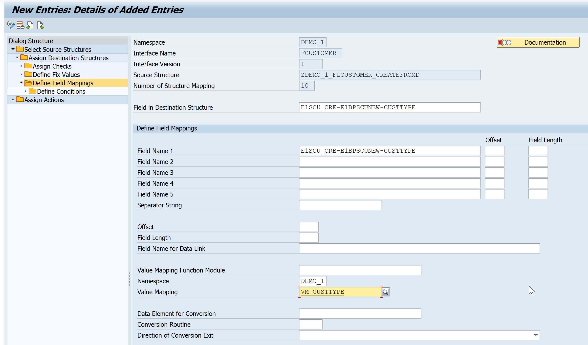

4. **Save** your changes.

### Maintain value mappings

In the mapping, you created a value mapping for the customer type. Before you run the scenario, maintain the value mapping table entries.

1. In **Maintenance of value mappings** (transaction code `/AIF/VMAP`), enter namespace **`DEMO_1`** and your value mapping name **`VM_CUSTTYPE`**. Press **Enter** and choose **Execute**.

    <!-- border -->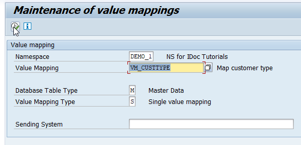

2. Choose **Append** and add the following two new entries:

    | Index | External Value | B/P customer
    | :--- | :--- | :---
    | **`1`** | **`1`** | **`P`**
    | **`2`** | **`2`** | **`B`**

3. **Save** your changes.

### Assign IDoc Types

1. Go to **Customizing** for SAP Application Interface Framework (transaction code `/AIF/CUST`) and navigate to **Interface Development** > **Additional Interface Properties** > **Assign IDoc Types**. In the upcoming dialog, enter your previously created namespace **`DEMO_1`**, and continue.

2. Double-click the existing interface `FCUSTOMER` to open it and select the **Preprocessing (IDoc Runtime)** flag.

    <!-- border -->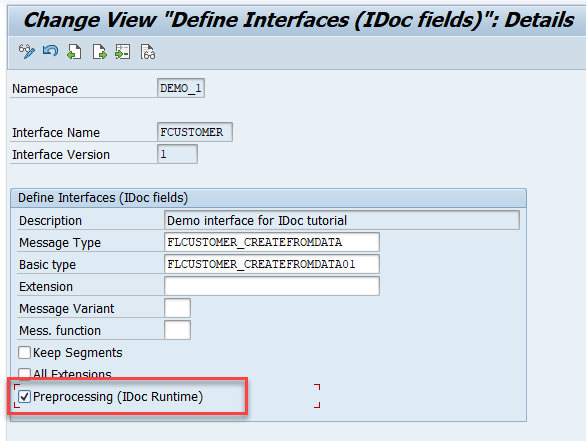

3. **Save** your changes.

### Test IDoc interface

After the setup is complete, test your settings and verify that the IDoc monitoring is working as planned.

1. Send in new test IDocs, for example using the **Test Tool for IDoc Processing** (transaction code `WE19`).

2. In the test tool, maintain basic type `FLCUSTOMER_CREATEFROMDATA01`.

3. Maintain the control record fields corresponding to your partner profile and the port created beforehand as follows:

    | Field name                    | Value
    | :---------------------------- | :-------
    | Receiver Port                 | `SAP<SID>` (`<SID>` being your system ID)
    | Receiver Partner Number       | The partner number as specified in the partner profile
    | Receiver Type                 | `LS`
    | Sender Port                   | The port as specified before
    | Sender Partner Number         | The partner number as specified in the partner profile
    | Sender Type                   | `LS`
    | Message Type                  | **`FLCUSTOMER_CREATEFROMDATA`**

4. Maintain sample data record by entering at least customer name, form, street, postcode, city, country and customer type. As customer type, choose either `1` or `2`.

5. Then, choose **Standard Inbound**. A dialog pops up informing you that the IDoc was passed to the application.

    <!-- border -->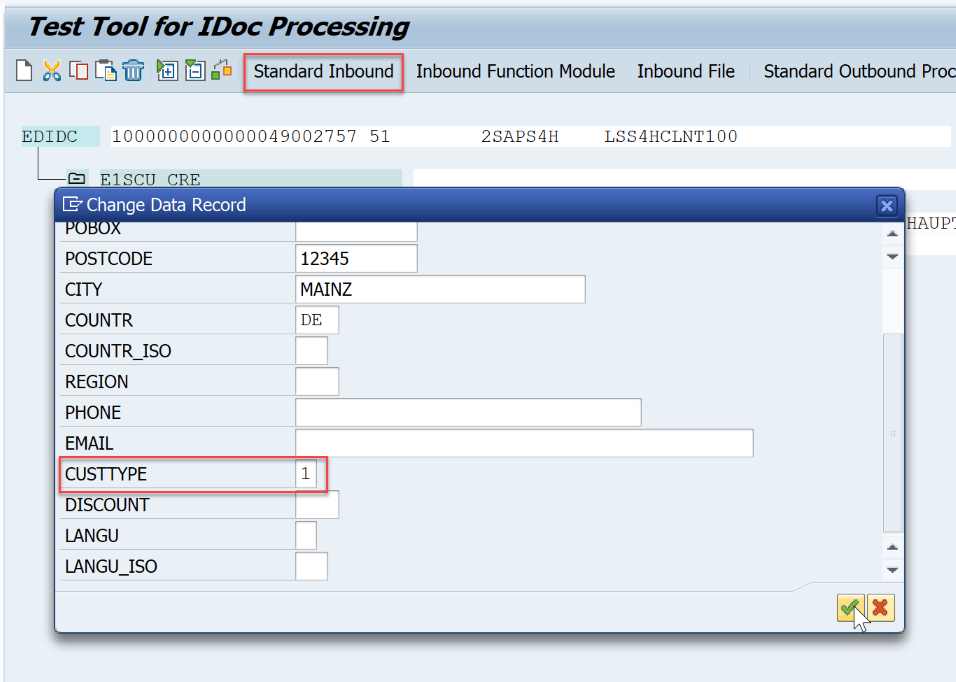

6. Check the results of your test in the **Interface Monitor** (transaction code `/AIF/IFMON`). When you select the summary line for your interface, you're forwarded to **Monitoring and Error Handling**, where you can see your selected test message(s).

    <!-- border -->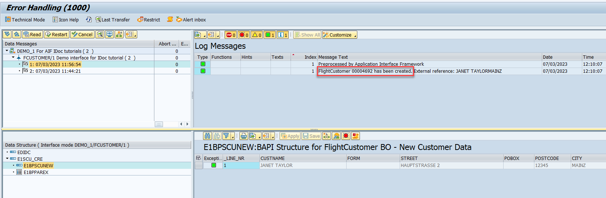

    As you can see, the flight customer has been successfully created. Note down the generated customer ID provided in the log message. You need it in the next step.

7. To check that the mappings worked as expected, open the **SCUSTOM record display** (transaction code `BC_GLOBAL_SCUST_DISP`), and enter the beforehand copied customer ID into the filter, then choose **Display**.

    <!-- border -->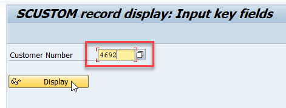

    In the data record, you can see that the customer type and the discount have been successfully mapped.

    <!-- border -->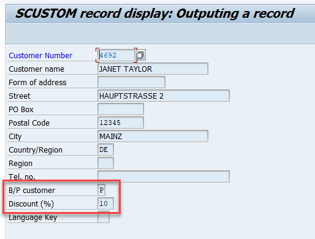  

Congratulations! You have enhanced an IDoc interface with preprocessing in SAP Application Interface Framework.  

### Test yourself

---
