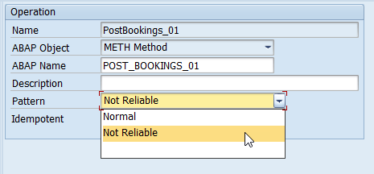
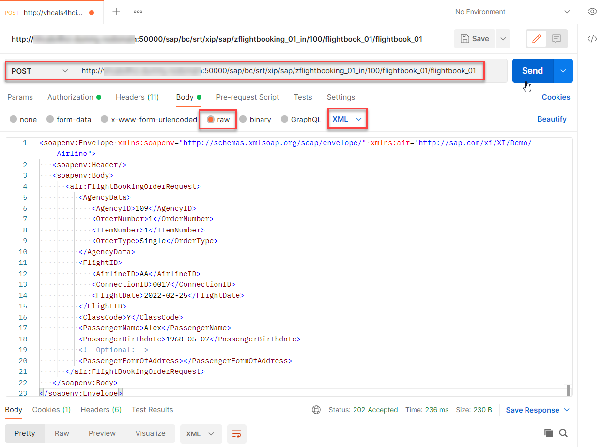

# Create a Simple Proxy Interface
<!-- description --> Create a simple proxy interface to enable monitoring proxy service interfaces with SAP Application Interface Framework.

## Prerequisites
 - You have set up SAP Application Interface Framework
 - SAP S/4HANA 1709 or later, AIF 4.0
 - Optional: You're familiar with a test client of your choice, like SoapUI or Postman

## You will learn
  - How to create a simple proxy interface
  - How to set up proxy monitoring in SAP Application Interface Framework


## Intro
In this tutorial, you'll learn how to create a simple proxy interface that enables you to monitor a proxy service interface.

Since you might not have an Enterprise Services Repository of SAP Process Integration/SAP Process Orchestration connected to your backend, this tutorial keeps it simple: you'll create a proxy in the Backend Metadata Repository by leveraging the structures of a standard demo flight booking scenario. After these preparatory steps, you will get started with SAP Application Interface Framework at step six.

---
### Create package

In order to have a destination for your newly created objects, you need to create a package.

>If you've completed other tutorials for SAP Application Interface Framework, you might already have created a package and can skip this step.

Open your system. Go to the **Object Navigator** (transaction code `SE80`). From the drop-down menu, select **Package**, enter the name **`ZDEMO`**, and press **Enter** or select **Display or Create Object**. Confirm the dialogue window, enter a meaningful short description for your new package, and select **Confirm**. If prompted, enter a workbench request and confirm again.


You have successfully created a new package named `ZDEMO`.


### Assign namespace to Backend Metadata Repository

Next, you need to assign a new namespace to the Backend Metadata Repository.

Run transaction **Assignment Namespace Generating Application** (transaction code `SPXNGENAPPL`). Switch to **Edit** mode, add a new entry, and enter or select the following details for your new namespace:

| Namespace                    | Generation Source
| :--------------------------- | :--------
| **`http://tutorial.com/aif`**| **`Backend Metadata Repository`**  

**Save** your changes.


### Create proxy

To create a new service interface, run the **proxy editor** (transaction code `SPROXY_START`).

In **Enterprise Services: Initial Screen**, select **Create with Wizard** and carry out the following configuration steps:

  1. As **Object Type**, select **Service Provider**. Click **Continue**.
  2. As **Kind of Service Provider**, select **Backend**. Click **Continue**.
  3. As **Name**, enter **`FlightBooking_01_In`** and namespace **`http://tutorial.com/aif`**. Click **Continue**.  
  4. For the transport options, enter your package **`ZDEMO`**, select a workbench request, and enter the prefix **`ZAIF_`**. Select **Continue**.
  5. Select  **Complete** to finish the wizard.

You can now see an overview of your service provider.


### Define proxy structures


Next, you need to add an operation and a fault message type in the proxy editor.

1. Switch to the **Internal View** tab. Right-click your service provider and select **Add Operation**. Enter the operation name **`PostBookings_01`**. With the new operation selected, switch the **Pattern** of the operation to **Not Reliable** to simplify testing.

    <!-- border -->

2. Right-click the operation and select **Set Request** > **Select Existing Message Type** from the context menu. In the upcoming **Restrict Value Range** dialog, remove all filters. Enter the message type **`SXIDAL_FBO_REQUEST_MT`** in the **ABAP Name** search filter, and the namespace **`http://sap.com/xi/XI/Demo/Airline`** in the **Namespace** search filter, then press **Enter**. In the search result, select the found entry, and select **Copy**.

3. Right-click the operation and select **Add Fault** > **Select Existing Fault Message Type**. Similar to the message type search, remove all filters. Then search for the fault message type **`CX_SXIDAL_TECHNICAL_PROBLEMS`**.  

4. **Save** and activate the proxy.

<!-- border -->


### Implement proxy class method


Finally, to book the flights in your test scenario, the proxy class method needs to be implemented.

Switch to the **Properties** tab. Double-click the implementing class **`ZAIF_CL_FLIGHT_BOOKING_01_IN`** and then double-click the method **`ZAIF_II_FLIGHT_BOOKING_01_IN~POST_BOOKINGS_01`**. Maintain the implementation of the method by copying and pasting the following:

```ABAP

method ZAIF_II_FLIGHT_BOOKING_01_IN~POST_BOOKINGS_01.

    DATA: lv_bookkey  TYPE bapisbokey,
          lv_bookdata TYPE bapisbonew,
          lt_bapiret  TYPE TABLE OF bapiret2.

* Convert input data
    lv_bookdata = VALUE #( airlineid  = input-flight_booking_order_request-flight_id-airline_id
                           connectid  = input-flight_booking_order_request-flight_id-connection_id
                           flightdate = input-flight_booking_order_request-flight_id-flight_date
                           customerid = '1'
                           class      = input-flight_booking_order_request-class_code
                           agencynum  = input-flight_booking_order_request-agency_data-agency_id
                           passname   = input-flight_booking_order_request-passenger_name
                           passform   = input-flight_booking_order_request-passenger_form_of_address
                           passbirth  = input-flight_booking_order_request-passenger_birthdate ).

* Call internal flight booking function
    CALL FUNCTION 'BAPI_FLBOOKING_CREATEFROMDATA'
      EXPORTING
        reserve_only  = ' '
        booking_data  = lv_bookdata
      IMPORTING
        airlineid     = lv_bookkey-airlineid
        bookingnumber = lv_bookkey-bookingid
      TABLES
        return        = lt_bapiret.

* error case
    IF line_exists( lt_bapiret[ type = 'E' id = 'BAPI' number ='001' ] ).

      CALL METHOD cl_proxy_fault=>raise
        EXPORTING
          exception_class_name = 'CX_SXIDAL_TECHNICAL_PROBLEMS'
          bapireturn_tab       = lt_bapiret.

    ENDIF.

endmethod.
```  

**Save** and activate the class.


### Create namespace


As interfaces in SAP Application Interface Framework are grouped using namespaces, you must create a namespace.

Go to **Customizing** for SAP Application Interface Framework (transaction code `/n/AIF/CUST`) and navigate to **Interface Development** > **Define Namespace**.

Select **New Entries** and enter the following name and description for your new namespace:

| Namespace | Namespace Description
| :------- | :--------------
| **`DEMO_2`** | **`NS for AIF Proxy tutorials`**

<!-- border -->


### Create interface


While still in **Customizing** (transaction code `/n/AIF/CUST`), navigate to **Interface Development** > **Define Interfaces**.

In the upcoming dialog, enter your previously created namespace **`DEMO_2`** and press **Enter**.

Select **New Entries** and enter the following parameters based on your proxy class and implementation. You can double-check this information in transaction code `SPROXY`.

>Be aware that entering the **Proxy Class Inbound** automatically fills in **Raw Data Structure**, **Record Type in Raw Structure**, and **Proxy Method**.

| Field name | Description | VALUE
| :---- | :---- | :----
| Interface Name | Name of the interface to be created, for example (an abbreviation of) the basic type | **`FLBOOK`**  
| Interface version | Version number of the interface | **`1`**
| Description | Description of the interface | **`Demo interface 1 for Proxy tutorial`**
| SAP Data structure | Input substructure of the proxy class | **`SXIDAL_FBO_REQUEST`**
| Raw Data structure | Input structure of the proxy class | **`SXIDAL_FBO_REQUEST_MT`**
| Record Type in Raw Structure | Main component of the raw data structure | **`FLIGHT_BOOKING_ORDER_REQUEST`**
| Proxy Class Inbound | Name of the proxy class |  **`ZAIF_CL_FLIGHT_BOOKING_01_IN`**
| Proxy Method | Method name of the generated proxy class | **`POST_BOOKINGS_01`**
| Interface Direction | Indicates the direction of the interface |  **`Inbound`**

**Save** your changes.


### Specify interface engines


Next, you have to select the engines that should be used to handle the messages that are processed. If you create a new interface, by default, SAP Application Interface Framework handles the messages as proxy messages, so you can keep the default settings.

To double-check the settings, go to **Customizing** for SAP Application Interface Framework (transaction code `/AIF/CUST`) and navigate to **Interface Development** > **Additional Interface Properties** > **Specify Interface Engines**.

In the upcoming dialog, enter your beforehand created namespace **`DEMO_2`**, and press **Enter**. Check that the following engines are preselected:

| Parameter          | Value
| :---               | :---
| Application Engine | Proxy
| Persistence Engine | Proxy
| Selection Engine   | AIF Index Tables
| Logging Engine     | AIF Application Log


### Create interface-specific single index table


It's recommended to implement an interface-specific single index table to ensure full flexibility, especially if you expect a high load of messages or if you plan to define key fields for your interface (now or later).

> You can also switch the single index table later, but when you do, all processed messages stored in the old single index table will no longer be visible in the Interface Monitor. The information for the newly incoming messages is stored in the new single index table of the interface.

1. Create a table via transaction `SE11`. You can use table `/AIF/STD_IDX_TBL` as a template by entering **`/AIF/STD_IDX_TBL`** in the field **Database table**, right-clicking it and selecting **Copy...**. Enter the name **`ZFLBOOK_MON_IDX`** for the new table and select **Continue**. When prompted, enter package **`ZDEMO`**, which you created earlier.

2. After creating the single index table, activate it by selecting **Display** and then **Activate**.

    <!-- border -->

3. Go to **Customizing** (transaction code `/n/AIF/CUST`) and navigate to **SAP Application Interface Framework** > **Error Handling** > **Define Namespace-Specific Features**. Enter your namespace **`DEMO_2`** and select **Continue**.

4. Select **New Entries** to create a new entry in **Define Interface-Specific Features**. Enter your interface name **`FLBOOK`** and version **`1`** and enter the name of the newly created single index table **`ZFLBOOK_MON_IDX`** in the field **Message Index Table**.

    <!-- border -->

5. **Save** your changes.


### Create recipient for interface


If you want to monitor the newly created interface in the Interface Monitor of the Message Dashboard app, you require a recipient for the interface.

Go to **Customizing** (transaction code `/AIF/CUST`) and navigate to **SAP Application Interface Framework** > **Error Handling** > **Define Namespace-Specific Features**. Enter or select your namespace **`DEMO_2`** and select **Continue**.

In the menu on the left, navigate to **Define Recipients** by double-clicking it. Select **New Entries**, enter the name **`ZPROXY_TEST_RECIPIENT`** for your new recipient, and add a meaningful description.

<!-- border -->

**Save** your changes.


### Assign recipient to interface


To be able to see any data in the Interface Monitor or the Message Dashboard, a recipient must be assigned to the interface you want to monitor.

Go to **Customizing** (transaction code `/AIF/CUST`) and navigate to **SAP Application Interface Framework** > **Error Handling** > **Define Interface-Specific Features**. Enter or select your namespace **`DEMO_2`**, as well as your interface name **`FLBOOK`** and interface version **`1`**. Select **Continue**.

In the menu on the left, double-click **Assign Recipients Without Key Fields** and create a new entry. Enter or select the namespace and the recipient you created before.

<!-- border -->

**Save** your changes.


### Assign users to recipient


Now the users in charge of monitoring the proxy must be assigned to the recipient.

Run transaction `/AIF/MYRECIPIENTS` and create a new entry. Select the namespace **`DEMO_2`** and recipient `ZPROXY_TEST_RECIPIENT` you created in the steps before. Check the boxes for **Overview** and **Technical User**.

<!-- border -->

**Save** the new entry.


### Create test data


Before you can create flight bookings, you need to generate test data.

To do so, run transaction `BC_DATA_GEN`, select the standard data record, and execute the report.

  <!-- border -->

Open the **Data Browser** (transaction code `SE16`), select the table **SFLIGHTS**, and choose **Execute**. The generated flight data entries are displayed.

>If you run the requests in step 15, select existing flights from this table. Ensure that the flight date is in the future, or your requests will fail.

  <!-- border -->


### Configure web service


To be able to send booking requests to the proxy interface, you need to define a service and a service binding in the SOA Management.

Open the SOA Management in your browser by running transaction code `SOAMANAGER`. In the tab **Service Administration**, select **Web Service Configuration**. Search for your service definition **`FlightBooking_01_In`** and click it to open its details.

On the **Configurations** tab, create a new service as follows:

1. Maintain a **Service Name** and a **New Binding Name**, then click **Next**.

2. In step **Provider Security**, go to **Authentication Settings** > **Authentication Method** > **Transport Channel Authentication** and select the **User ID/Password**  flag. Click **Next**.

3. On the next screen, click **Finish**. A new service and binding are displayed.

4. In the **Actions** column, select the **Open Binding WSDL Generation** icon to access the Binding WSDL URL that you may need to setup your test client. Copy it for later use.

    <!-- border -->

You can find the WSDL URL for binding on the bottom of the upcoming dialog.

<!-- border -->

If you open the WSDL URL for binding in your internet browser, scroll down to find the end point URL of your service interface.

<!-- border -->


### Send sample request


Use a test client of your choice to send a sample request to the proxy interface. This tutorial specifies the steps for using either **SoapUI** or **Postman**.

1. If you use **SoapUI**, create a new SOAP project.

2. Enter a project name and enter your WSDL URL for binding into the initial WSDL. You are prompted to authenticate to your backend system.

    In the request, a sample request is created. The end point URL of the service interface is automatically added.

3. Enter your username and password in the request properties to authenticate to your backend system. Then, enter some existing flight data from table `SFLIGHTS`, and post the request.

    <!-- border -->

1. If you use **Postman**, create a new POST request, and enter the end point URL of your service interface into the address field.

2. In the **Authorization** tab, enter the user credentials to log on to your backend system.

3. In the **Headers** tab, enter the key content-type with value `text/xml`.

    <!-- border -->

4. Switch to the **Body** tab and select **raw** and the type **XML**. Paste the XML sample request (see below) including the SOAP envelope into the Postman request body. Maintain existing flight data from table `SFLIGHTS`, and select **Send** to send the request.

    <!-- border -->

The following is an example of a booking request:

```XML

<soapenv:Envelope xmlns:soapenv="http://schemas.xmlsoap.org/soap/envelope/" xmlns:air="http://sap.com/xi/XI/Demo/Airline">
   <soapenv:Header/>
   <soapenv:Body>
      <air:FlightBookingOrderRequest>
         <AgencyData>
            <AgencyID>109</AgencyID>
            <OrderNumber>1</OrderNumber>
            <ItemNumber>1</ItemNumber>
            <OrderType>Single</OrderType>
         </AgencyData>
         <FlightID>
            <AirlineID>AA</AirlineID>
            <ConnectionID>0017</ConnectionID>
            <FlightDate>2022-02-25</FlightDate>
         </FlightID>
         <ClassCode>Y</ClassCode>
         <PassengerName>Luke</PassengerName>
         <PassengerBirthdate>1978-06-01</PassengerBirthdate>
         <!--Optional:-->
         <PassengerFormOfAddress></PassengerFormOfAddress>
      </air:FlightBookingOrderRequest>
   </soapenv:Body>
</soapenv:Envelope>
```
You have successfully sent in a sample request you can monitor in the next step.


### Monitor proxy interface


Finally, you should test your settings and verify that the proxy monitoring is working as planned.

If you're using SAP GUI, check the results of your test in the **Interface Monitor** (transaction code `/n/AIF/IFMON`). You'll only be able to see the new interface if you correctly assigned your user to the recipient.

<!-- border -->

When you select the summary line for your recipient, you're forwarded to **Monitoring and Error Handling**, where you can see your selected test message(s).

<!-- border -->

Alternatively, if you have set up Message Monitoring in the SAP Fiori launchpad, you can check the test results there. For more information, see [How to configure the SAP Fiori Apps for SAP Application Interface Framework](https://blogs.sap.com/2021/11/04/how-to-configure-the-sap-fiori-apps-for-sap-application-interface-framework/).

<!-- border -->

Congratulations! You've created a simple proxy interface and set up monitoring for it in SAP Application Interface Framework.  


### Test yourself


---
