# Customize a Proxy Interface with Runtime and Monitoring
<!-- description --> Create a proxy interface to be able to carry out data checks and mappings as well as the monitoring and error resolution capabilities of SAP Application Interface Framework.

## Prerequisites
 - You have set up SAP Application Interface Framework
 - SAP S/4HANA 1709 or later, AIF 4.0
 - Optional: You have completed [Create a Simple Proxy Interface](aif-proxy-monitoring-interface-create)
 - Optional: You're familiar with a test client of your choice, like SoapUI or Postman

## You will learn
  - How to create a proxy interface
  - How to implement a value mapping in SAP Application Interface Framework
  - How to create an action to call the actual application

## Intro
In this tutorial, you'll learn how to create and customize a proxy interface in SAP Application Interface Framework.

As a prerequisite, you first need to create a proxy service interface. Like in [Create a Simple Proxy Interface](aif-proxy-monitoring-interface-create), you create a proxy in the Backend Metadata Repository by leveraging the same structures as the standard demo flight booking scenario. However, we choose a different name as not to collide with the previous tutorial. After these preparatory steps, you will get started with the SAP Application Interface Framework-specific settings at step six.

If you've already completed [Create a Simple Proxy Interface](aif-proxy-monitoring-interface-create), you can skip some of the steps.


---

### Create package and function group


>If you've completed [Create a Simple Proxy Interface](aif-proxy-monitoring-interface-create), you can skip this step.

Create a package that serves as the destination for your newly created objects.

Open your system. Go to the **Object Navigator** (transaction code `SE80`). From the drop-down menu, select **Package**, enter the name **`ZDEMO`**, and select **Display or Create Object**. If the package exists, it will be displayed. Otherwise, create it.

Additionally, create a new function group by selecting Function Group from the drop-down menu and enter the name **`ZDEMO`**.

<!-- border -->

You have successfully created a new package named `ZDEMO` and a new function group named `ZDEMO`.


### Assign namespace to Backend Metadata Repository


>If you've completed [Create a Simple Proxy Interface](aif-proxy-monitoring-interface-create), you can skip this step.

Assign a new namespace to the Backend Metadata Repository. Otherwise, skip this step.

Run transaction **Assignment Namespace Generating Application** (transaction code `SPXNGENAPPL`). Switch to **Edit** mode, add a new entry, and enter or select the following details for your new namespace:

| Namespace                    | Generation Source
| :--------------------------- | :--------
| **`http://tutorial.com/aif`**| **`Backend Metadata Repository`**  

**Save** your changes.


### Create proxy


To create a new service interface, run the **proxy editor** (transaction code `SPROXY_START`).

In **Enterprise Services: Initial Screen**, select **Create with Wizard** and carry out the following configuration steps:

  1. As **Object Type**, select **Service Provider**. Click **Continue**.
  2. As **Kind of Service Provider**, select **Backend**. Click **Continue**.
  3. As **Name**, enter **`FlightBooking_02_In`** and namespace **`http://tutorial.com/aif`**. Click **Continue**.  
  4. For the transport options, enter your package **`ZDEMO`**, select a workbench request, and enter the prefix **`ZAIF_`**. Click **Continue**.
  5. Select **Complete** to finish the wizard.

You can now see an overview of your service provider.

<!-- border -->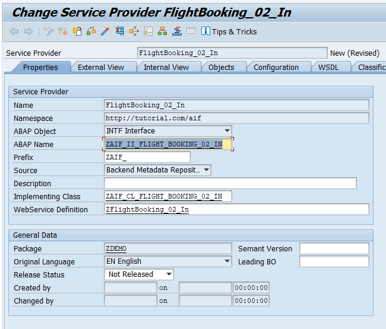


### Define proxy structures


Next, add an operation and a fault message type in the proxy editor. As mentioned before, you will be using objects from a standard demo flight booking scenario.

1. Switch to the **Internal View** tab. Right-click your service provider and select **Add Operation**. Enter the operation name **`PostBookings_02`**. With the new operation selected, switch the **Pattern** of the operation to **Not Reliable** to simplify testing.

    <!-- border -->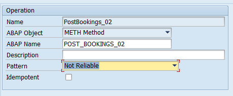

2. Next, right-click the operation and select **Set Request** > **Select Existing Message Type** from the context menu. In the upcoming **Restrict Value Range** dialog, remove all filters. Enter the message type **`SXIDAL_FBO_REQUEST_MT`** in the **ABAP Name** search filter, and the namespace **`http://sap.com/xi/XI/Demo/Airline`** in the **Namespace** search filter, then press **Enter**. In the search result, select the found entry, and select **Copy**.

3. Right-click the operation and select **Add Fault** > **Select Existing Fault Message Type**. Similar to the message type search, remove all filters. Then search for the fault message type **`CX_SXIDAL_TECHNICAL_PROBLEMS`**.  

4. **Save** and activate the proxy.

    <!-- border -->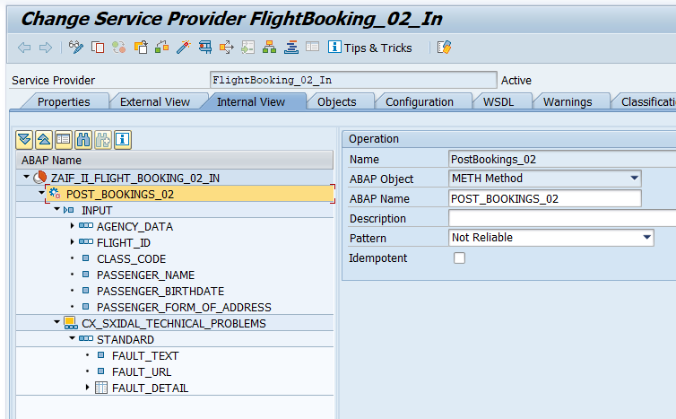


### Implement proxy class method


Finally, to call the interface in SAP Application Interface Framework, you must implement the proxy class method.

Switch to the **Properties** tab, double-click the implementing class **`ZAIF_CL_FLIGHT_BOOKING_02_IN`**, and then double-click the method **`ZAIF_II_FLIGHT_BOOKING_02_IN~POST_BOOKINGS_02`**. Maintain the implementation of the method by copying and pasting the following:

```ABAP

  method ZAIF_II_FLIGHT_BOOKING_02_IN~POST_BOOKINGS_02.

      /aif/cl_enabler_proxy=>process_message(
        is_input               = input
        iv_exception_classname = 'CX_SXIDAL_TECHNICAL_PROBLEMS' ).

  endmethod.
```

**Save** and **activate** the class.


### Create namespace


>If you've completed [Create a Simple Proxy Interface](aif-proxy-monitoring-interface-create), you can skip this step.

As interfaces in SAP Application Interface Framework are grouped using namespaces, you must create a namespace.

Go to **Customizing** for SAP Application Interface Framework (transaction code `/n/AIF/CUST`) and navigate to **Interface Development** > **Define Namespace**.

Select **New Entries** and enter the following name and description for your new namespace:

| Namespace | Namespace Description
| :------- | :--------------
| **`DEMO_2`** | **`NS for AIF Proxy tutorials`**

<!-- border -->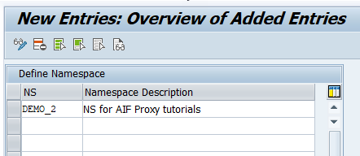


### Create interface


While still in **Customizing** (transaction code `/n/AIF/CUST`), navigate to **Interface Development** > **Define Interfaces**.

In the upcoming dialog, enter your previously created namespace **`DEMO_2`**, and press **Enter**.

Select **New Entries** and enter the following parameters based on your proxy class and implementation. You can double-check this information in transaction code `SPROXY`.

>Entering the **Proxy Class Inbound** automatically fills in **Raw Data Structure**, **Record Type in Raw Structure**, and **Proxy Method**.

| Field name | Description | VALUE
| :---- | :---- | :----
| Interface Name | Name of the interface to be created | **`FLBOOK2`**  
| Interface version | Version number of the interface | **`1`**
| Description | Description of the interface | **`Demo interface 2 for Proxy tutorial`**
| SAP Data structure | Input substructure of the proxy class | **`BAPISBONEW`**
| Raw Data structure | Input structure of the proxy class | **`SXIDAL_FBO_REQUEST_MT`**
| Record Type in Raw Structure | Main component of the raw data structure | **`FLIGHT_BOOKING_ORDER_REQUEST`**
| Proxy Class Inbound | Name of the proxy class |  **`ZAIF_CL_FLIGHT_BOOKING_02_IN`**
| Proxy Method | Method name of the generated proxy class | **`POST_BOOKINGS_02`**
| Interface Direction | Indicates the direction of the interface |  **`Inbound`**

**Save** your changes.


### Specify interface engines 


Next, select the engines that handle the messages that are processed. If you create a new interface, by default, SAP Application Interface Framework handles the messages as proxy messages, so you can keep the default settings.

To double-check the settings, go to **Customizing** for SAP Application Interface Framework (transaction code `/n/AIF/CUST`) and navigate to **Interface Development** > **Additional Interface Properties** > **Specify Interface Engines**.

In the upcoming dialog, enter your previously created namespace **`DEMO_2`**, and press **Enter**. Check that the following engines are preselected for your interface:

| Parameter          | Value
| :---               | :---
| Application Engine | Proxy
| Persistence Engine | Proxy
| Selection Engine   | AIF Index Tables
| Logging Engine     | AIF Application Log


### Define mapping


1. Go to **Customizing** for SAP Application Interface Framework (transaction code `/n/AIF/CUST`) and navigate to **Interface Development** > **Define Structure Mappings**.

2. In the upcoming dialog, enter your previously created namespace **`DEMO_2`**, interface name **`FLBOOK2`**, and interface version **`1`**. Select **Continue**.

3. Select **New Entries**, and enter the root node of your interface structure, here **`SXIDAL_FBO_REQUEST`**.

    <!-- border -->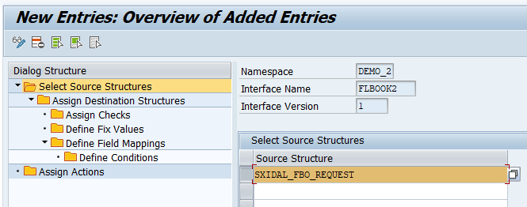

4. Select the new entry and double-click **Assign Destination Structure** in the menu on the left.

5. Select **New Entries**, and enter the **Number of Structure Mapping** **`10`**. As **Destination Structure**, enter the structure **`BAPISBONEW`** of the BAPI you will call to post the booking.

6. Double-click the node **Define Field Mappings**. Create a new entry and define the field mapping for each line of the following table:

    | Field in Destination Structure | Field Name 1
    | :--- | :---
    | **`AIRLINEID`** | **`FLIGHT_ID-AIRLINE_ID`**
    | **`AGENCYNUM`** | **`AGENCY_DATA-AGENCY_ID`**
    | **`CONNECTID`** | **`FLIGHT_ID-CONNECTION_ID`**
    | **`FLIGHTDATE`** | **`FLIGHT_ID-FLIGHT_DATE`**
    | **`PASSBIRTH`** | **`PASSENGER_BIRTHDATE`**
    | **`PASSNAME`** | **`PASSENGER_NAME`**


7. Select **Next Entry**. For the **Field in Destination Structure** `CLASS`, enter the following information:

    | Field | Value
    | :--- | :----
    | Field Name 1 | **`CLASS_CODE`**
    | Namespace | **`DEMO_2`**
    | Value Mapping | **`VM_CLASS`**

    Since the value mapping doesn't exist yet, you are asked to create it. Confirm the dialog.

8. Navigate to the reusable value mapping by double-clicking `VM_CLASS` and define it with the following information:

    | Field | Value
    | :--- | :----
    | Value mapping description | **`Map class ID`**
    | Data Element for EXT1 | **`FLIGHT_BOOKING_CLASS`**
    | Data Element for INT | **`S_CLASS`**
    | Single or Multiple Value Mapping | **`Single`**
    | Customizing or Master Data | **`Master Data`**

    Save the value mapping and navigate back to **Define Field Mappings**.

Your field mappings should look like this:

<!-- border -->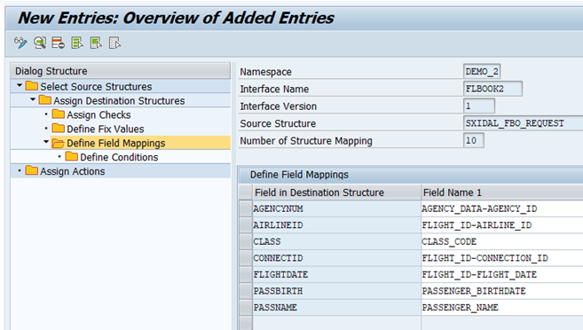

**Save** your changes.


### Define action


Next, create an action with a function to book the flights in your test scenario.

1. In **Define Structure Mappings**, double-click the node **Assign Actions**.

    Create a new entry and enter the following details:

    | Field | Value
    | :--- | :----
    | Action Number | **`10`**
    | Namespace | **`DEMO_2`**
    | Action | **`FLIGHT_CREATE`**

2. Since the action doesn't exist yet, you're asked to create it. Confirm the upcoming dialog with **Yes**.

3. Navigate to the new action by double-clicking `FLIGHT_CREATE`.

    In **Define Actions**, you can maintain multiple functions for each application. In this tutorial, you only need one function calling the BAPI to create new flight bookings.

    Enter an action description and set the **Commit Mode** to **`COMMIT WORK AND WAIT`** and the **Commit Level** to **`After Each Function`**.

4. Double-click the **Define Functions** node. Create a new function with **Function Number** **`10`** and **Function Module Name** **`ZFLBOOK_CREATE`**.

    Since the function module doesn't exist yet, you're asked to create it. Confirm the upcoming dialog with **Yes**.

5. In the next dialog, enter your function group **`ZDEMO`** and select **Copy**. A new function module is created as copy of the `/AIF/FILE_TEMPL_PROCESS` template.

    Open the function module, switch to the **Changing** tab. As **Associated Type** of the `DATA` parameter, enter **`BAPISBONEW`**.

    Switch to the **Source code** tab and enter the following source code:

    ```ABAP

    FUNCTION zflbook_create .
    *"----------------------------------------------------------------------
    *"*"Local Interface:
    *"  IMPORTING
    *"     REFERENCE(TESTRUN) TYPE  C
    *"     REFERENCE(SENDING_SYSTEM) TYPE  /AIF/AIF_BUSINESS_SYSTEM_KEY
    *"       OPTIONAL
    *"  TABLES
    *"      RETURN_TAB STRUCTURE  BAPIRET2
    *"  CHANGING
    *"     REFERENCE(DATA) TYPE  BAPISBONEW
    *"     REFERENCE(CURR_LINE)
    *"     REFERENCE(SUCCESS) TYPE  /AIF/SUCCESSFLAG
    *"     REFERENCE(OLD_MESSAGES) TYPE  /AIF/BAL_T_MSG
    *"----------------------------------------------------------------------
      DATA: lv_bookkey TYPE bapisbokey.

      data-customerid = '1'.

      CALL FUNCTION 'BAPI_FLBOOKING_CREATEFROMDATA'
        EXPORTING
          reserve_only  = ' '
          booking_data  = data
        IMPORTING
          airlineid     = lv_bookkey-airlineid
          bookingnumber = lv_bookkey-bookingid
        TABLES
          return        = return_tab.

      " in case of no error message, append success message
      IF NOT ( line_exists( return_tab[ type = 'E' ] ) OR line_exists( return_tab[ type = 'A' ] ) ).

        /aif/cl_appl_log_writer=>convert_msg_to_bapiret(
          EXPORTING
            iv_msgty      = 'S'
            iv_msgid      = 'ZDEMO_MESSAGE'
            iv_msgno      = '003'
            iv_msgv1      = lv_bookkey-bookingid
            iv_msgv2      = lv_bookkey-airlineid
          IMPORTING
            et_return_tab = DATA(lt_return_tab_log) ).

        APPEND LINES OF lt_return_tab_log TO return_tab.

        " delete standard message
        DELETE return_tab WHERE type = 'S' AND id = 'BAPI' AND number = '000'.
      ENDIF.

    ENDFUNCTION.
    ```

6. **Save** and activate your function module.

7. Navigate back to the action and **save** your changes.

8. Navigate back to **Define Structure Mappings** and **save** your changes.


### Create new message


As the function module refers to a message with number 003 of message class `ZDEMO_MESSAGE`, you now need to enhance message class `ZDEMO_MESSAGE`. If you haven't gone through [Create a Simple Proxy Interface](aif-proxy-monitoring-interface-create) and created that message class, first create a new message class `ZDEMO_MESSAGE`.

In **Message Maintenance** (transaction code `SE91`) for message class `ZDEMO_MESSAGE`, add a new message with number **`003`** and message short text **`Flight booking &1 created (airline &2)`**.

<!-- border -->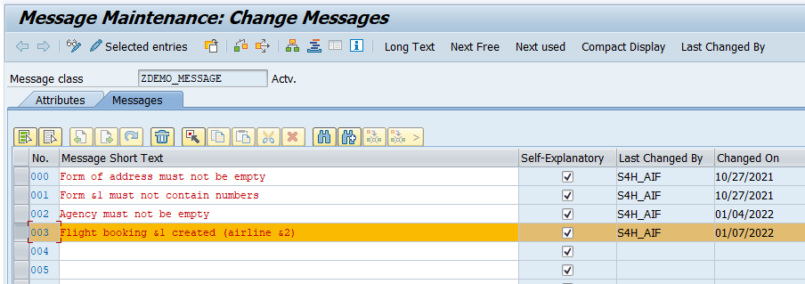

**Save** your changes.


### Maintain value mappings


In the mapping, you created a value mapping for the flight class. Before you run the scenario, maintain the value mapping table entries.

1. In **Maintenance of value mappings** (transaction code `/AIF/VMAP`), enter namespace **`DEMO_2`** and your value mapping name **`VM_CLASS`**. Press **Enter** and select **Execute**.

    <!-- border -->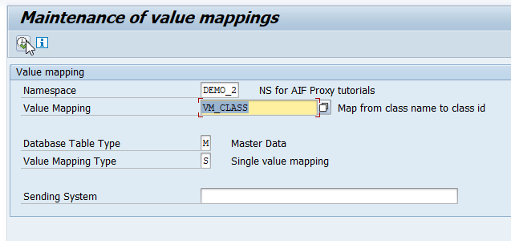

2. Select **Append** and add the following two new entries:

    | Index | Flight Booking Codes | Class
    | :--- | :--- | :---
    | **`1`** | **`1`** | **`F`**
    | **`2`** | **`2`** | **`C`**

3. **Save** your changes.


### Create interface-specific single index table


It's recommended to implement an interface-specific single index table to ensure full flexibility, especially if you expect a high load of messages or if you plan to define key fields for your interface (now or later).

> You can also switch the single index table later, but when you do, all processed messages stored in the old single index table will no longer be visible in the Interface Monitor. The information for the newly incoming messages is stored in the new single index table of the interface.

1. Create a table via transaction `SE11`. You can use table `/AIF/STD_IDX_TBL` as a template by entering **`/AIF/STD_IDX_TBL`** in the field **Database table**, right-clicking it and selecting **Copy...**. Enter the name **`ZFLBOOK_RT_IDX`** for the new table and select **Continue**. When prompted, enter the package **`ZDEMO`**, which you created earlier.

    <!-- border -->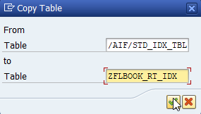

2. After creating the single index table, activate it by selecting **Display** and then **Activate**.

    <!-- border -->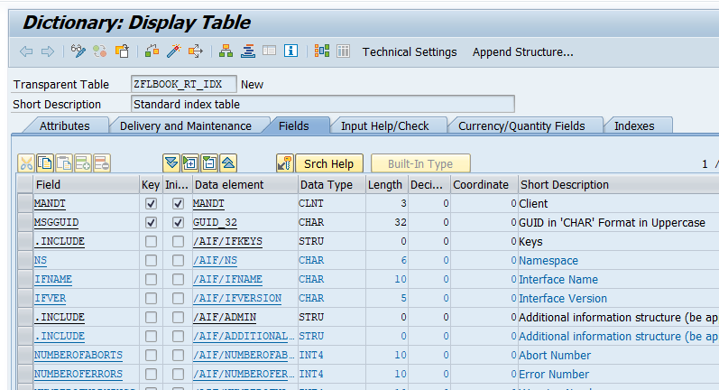

3. Go to **Customizing** (transaction `/n/AIF/CUST`) and navigate to **SAP Application Interface Framework** > **Error Handling** > **Define Namespace-Specific Features**. Enter your namespace **`DEMO_2`** and select **Continue**.

4. Select **New Entries** to create a new entry in **Define Interface-Specific Features**. Enter your interface name **`FLBOOK2`** and version **`1`** and enter the name of the newly created single index table **`ZFLBOOK_RT_IDX`** in the field **Message Index Table**.

    <!-- border -->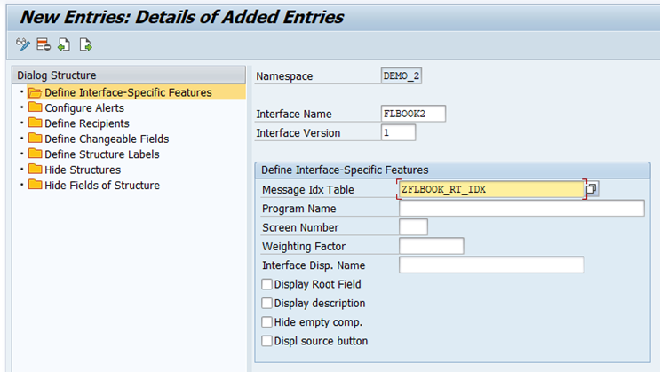

5. **Save** your changes.


### Create recipient for interface


>If you've completed [Create a Simple Proxy Interface](aif-proxy-monitoring-interface-create), you can skip this step.

Go to **Customizing** (transaction code `/n/AIF/CUST`) and navigate to **SAP Application Interface Framework** > **Error Handling** > **Define Namespace-Specific Features**. Enter or select your namespace **`DEMO_2`** and select **Continue**.

In the menu on the left, navigate to **Define Recipients** by double-clicking it. Select **New Entries**, enter a meaningful name for your new recipient, here **`ZPROXY_TEST_RECIPIENT`**, and add a description.

<!-- border -->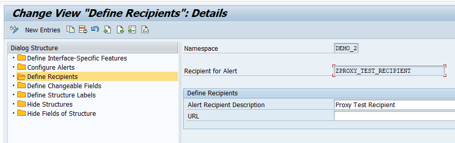

**Save** your changes.


### Assign recipient to interface


To be able to see any data in the **Interface Monitor** or the **Message Dashboard**, a recipient must be assigned to the interface you want to monitor.

Go to **Customizing** (transaction code `/n/AIF/CUST`) and navigate to **SAP Application Interface Framework** > **Error Handling** > **Define Interface-Specific Features**. Enter or select your namespace **`DEMO_2`**, as well as your interface name **`FLBOOK2`** and interface version **`1`**. Select **Continue**.

In the menu on the left, double-click **Assign Recipients Without Key Fields** and create a new entry. Enter or select the namespace and the recipient you created before.

<!-- border -->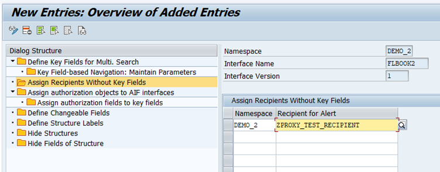

**Save** your changes.


### Assign user to recipient


>If you've completed [Create a Simple Proxy Interface](aif-proxy-monitoring-interface-create), you can skip this step.

The users in charge of monitoring the proxy must be assigned to the recipient.

Go to transaction `/AIF/MYRECIPIENTS` and create a new entry. Select the namespace **`DEMO_2`** and recipient `ZPROXY_TEST_RECIPIENT` you created in the steps before. Check the boxes for **Overview** and **Technical User**.

<!-- border -->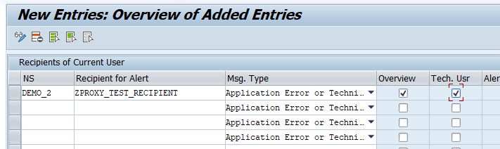

**Save** the new entry.


### Create test data


>If you've completed [Create a Simple Proxy Interface](aif-proxy-monitoring-interface-create), you can skip this step.

Before you can create flight bookings, you need to generate test data.

To do so, run transaction code `BC_DATA_GEN`, select the standard data record, and execute the report.

<!-- border -->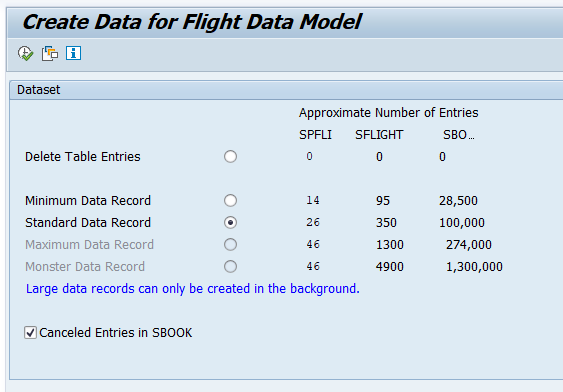

Open the **Data Browser** (transaction code `SE16`), select the table **SFLIGHTS**, and choose **Execute**. The generated flight data entries are displayed.

>If you run the requests in step 19, select existing flights from this table. Ensure that the flight date is in the future, otherwise your requests will fail.

<!-- border -->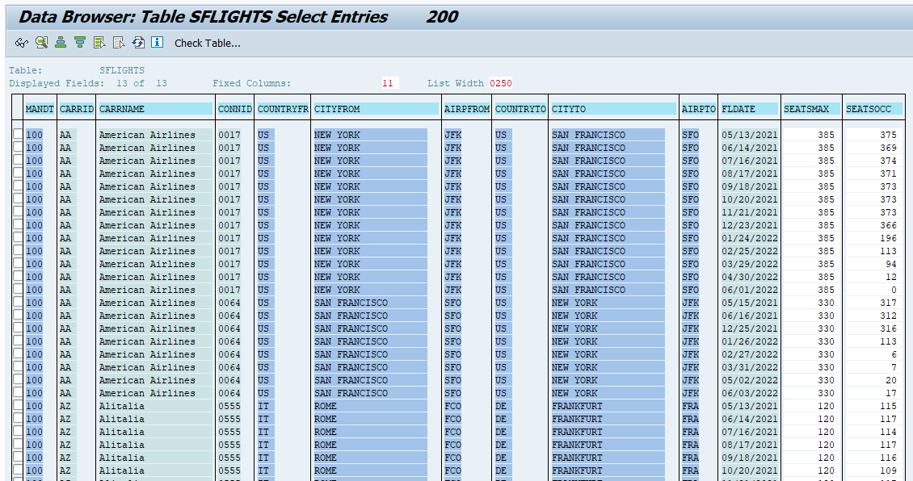


### Configure web service


In order to send booking requests to the proxy interface, you need to define a service and a service binding in the SOA Management.

Open the SOA Management in your browser by running transaction code `SOAMANAGER`. In the tab **Service Administration**, select **Web Service Configuration**. Search for your service definition **`FlightBooking_02_In`** and click it to open its details.

On the **Configurations** tab, create a new service as follows:

1. Maintain a **Service Name** and a **New Binding Name**, then click **Next**.

2. In step **Provider Security**, go to **Authentication Settings** > **Authentication Method** > **Transport Channel Authentication** and select the **User ID/Password**  flag, then click **Next**.

3. On the next screen, click **Finish**. A new service and binding are displayed.

4. In the **Actions** column, select the **Open Binding WSDL Generation** icon to access the Binding WSDL URL that you may need to setup your test client. Copy it for later use.

    <!-- border -->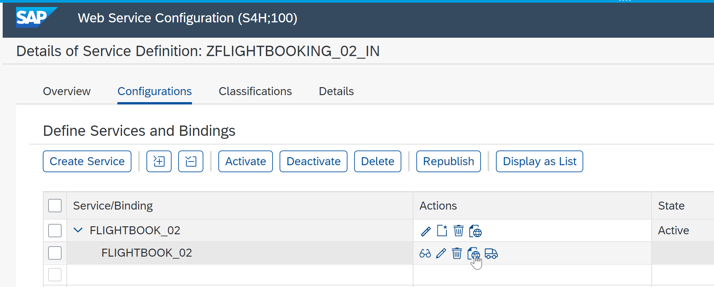

    You can find the WSDL URL for binding on the bottom of the upcoming dialog.

    <!-- border -->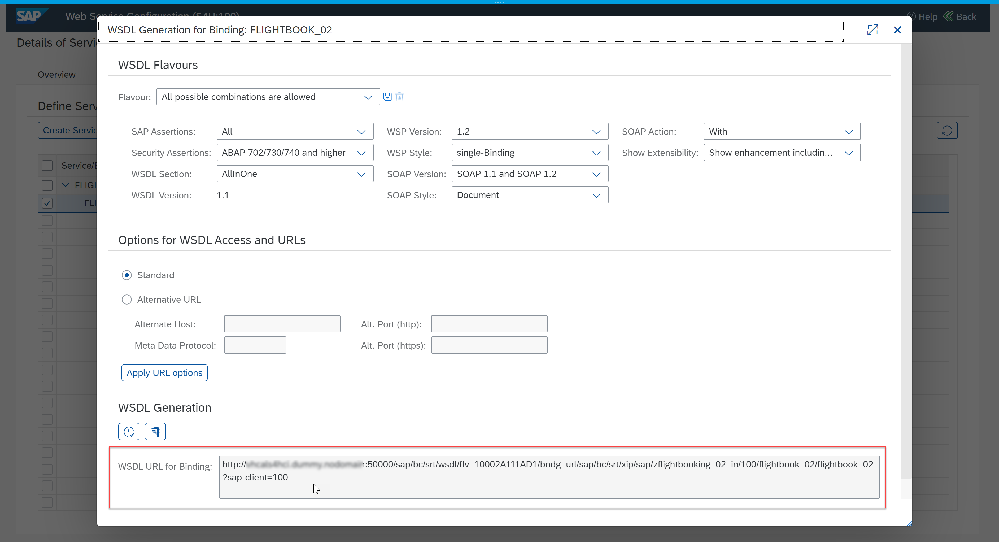

    If you open the WSDL URL for binding in your internet browser, scroll down to find the end point URL of your service interface.

    <!-- border -->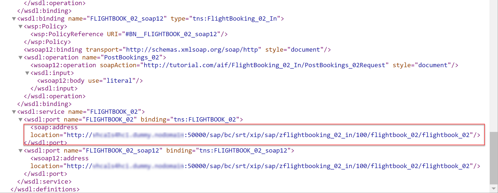


### Send sample request


Use a test client of your choice to send a sample request to the proxy interface. This tutorial uses **Postman**.

1. In Postman, create a new POST request, and enter the end point URL of your service interface into the address field.

2. In the **Authorization** tab, enter the user credentials to log on to your backend system.

3. In the **Headers** tab, enter the key `content-type` with value `text/xml`.

    <!-- border -->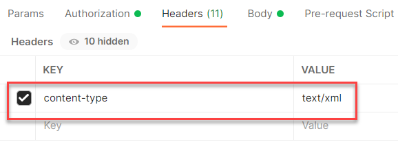

4. Switch to the **Body** tab and select **raw** and the type **XML**. Paste the XML sample request (see below) including the SOAP envelope into the Postman request body. Maintain existing flight data from table `SFLIGHTS`, and select **Send** to send the request.

    >  For the class code, enter **`1`** for first class or **`2`** for business class.


    ```XML

    <soapenv:Envelope xmlns:soapenv="http://schemas.xmlsoap.org/soap/envelope/" xmlns:air="http://sap.com/xi/XI/Demo/Airline">
      <soapenv:Header/>
      <soapenv:Body>
        <air:FlightBookingOrderRequest>
          <AgencyData>
              <AgencyID>109</AgencyID>
              <OrderNumber>1</OrderNumber>
              <ItemNumber>1</ItemNumber>
              <OrderType>Single</OrderType>
            </AgencyData>
            <FlightID>
              <AirlineID>LH</AirlineID>
              <ConnectionID>0402</ConnectionID>
              <FlightDate>2022-05-30</FlightDate>
            </FlightID>
            <ClassCode>1</ClassCode>
            <PassengerName>John</PassengerName>
            <PassengerBirthdate>1988-01-17</PassengerBirthdate>
            <!--Optional:-->
            <PassengerFormOfAddress></PassengerFormOfAddress>
          </air:FlightBookingOrderRequest>
        </soapenv:Body>
      </soapenv:Envelope>

    ```

5. Send the request.

<!-- border -->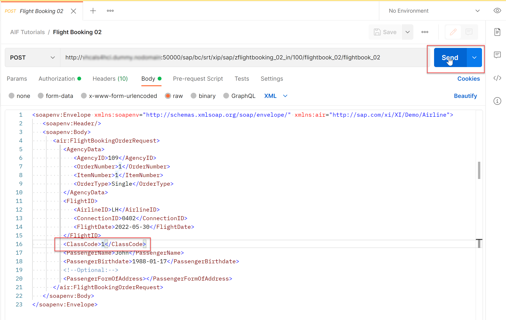

You have successfully sent in a sample request you can monitor in the next step.


### Monitor proxy interface


Finally, you should test your settings and verify that the proxy interface implementation and the monitoring are working as planned.

1. In the SAP GUI, check the results of your test in the **Interface Monitor** (transaction code `/n/AIF/IFMON`). You'll only be able to see the new interface if you correctly assigned your user to the recipient.

    <!-- border -->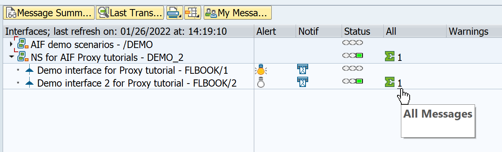

2. When you select the summary line for your recipient, you're forwarded to **Monitoring and Error Handling**, where you can see your selected test message. It should be in status `Successful` with the message text confirming that the flight booking has been created. In brackets you should see the airline code that you have provided in the booking request.

    <!-- border -->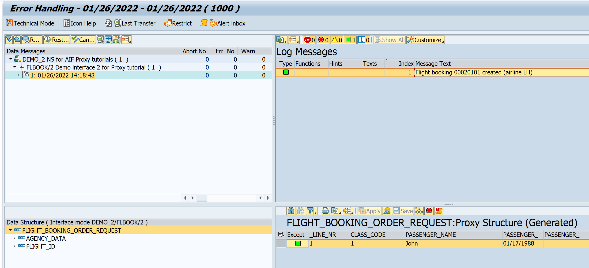

3. Resend a test message, this time entering the value **`3`** for the class code.

4. In **Monitoring and Error Handling**, select **Refresh**. You should see a new message in status `Error` because the value `3` doesn't exist in the value mapping. To fix the error, select **Value Mapping** on top of the **Log Messages** window to maintain the value mapping.

    <!-- border -->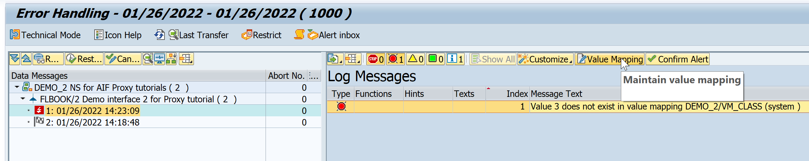

5. In the **Change Value Mappings** screen, insert the missing value.

    <!-- border -->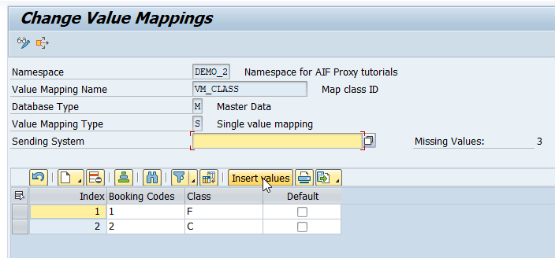

6. Map the missing value 3 to the `Economy Class` with class code `Y`.

    <!-- border -->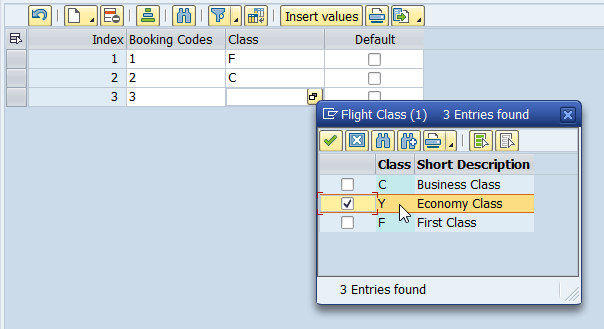

7. Save your changes and return to the message monitor. Here, select **Restart**. The message is now processed successfully.

    <!-- border -->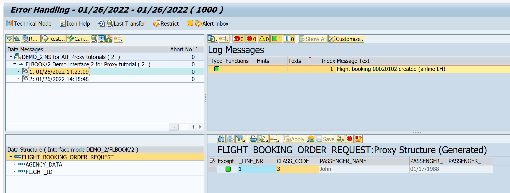


### Test yourself


---
