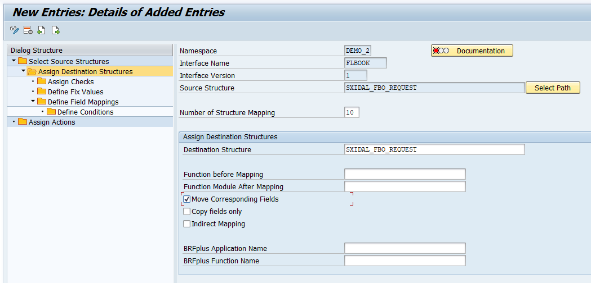
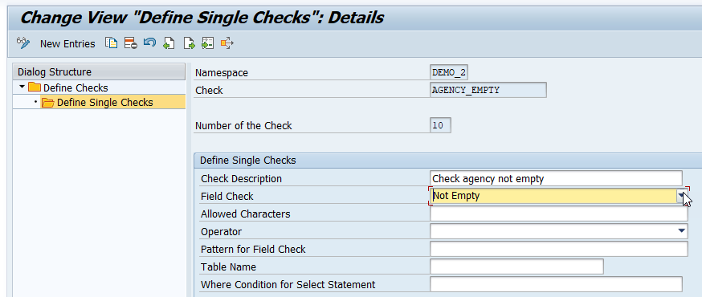

# Enhance a Proxy Interface with Preprocessing
<!-- description --> Enhance an existing "monitoring only" proxy interface to be able to carry out data checks and mappings using the preprocessing capability of SAP Application Interface Framework before actually calling the proxy interface.

## Prerequisites
 - You've set up SAP Application Interface Framework
 - SAP S/4HANA 1709 or later, AIF 4.0
 - You've completed the tutorial [Create a Simple Proxy Interface](aif-proxy-monitoring-interface-create)

## You will learn
  - How to enhance a proxy interface in SAP Application Interface Framework using the preprocessing capability
  - How to implement data checks and mappings in SAP Application Interface Framework

## Intro
In this tutorial, you will learn how to enhance a simple proxy interface in SAP Application Interface Framework by enabling the preprocessing capability.

---

### Change existing interface

Go to **Customizing** for SAP Application Interface Framework (transaction code `/n/AIF/CUST`) and navigate to **Interface Development** > **Define Interfaces**. In the upcoming dialog, enter your previously created namespace **`DEMO_2`**, and continue.

Enable **Change** mode. Double-click the existing interface `FLBOOK` to open it and select the **Pre-Processing** flag.

<!-- border -->

**Save** your changes.

### Select source and destination structures

1. While in **Customizing** (transaction code `/n/AIF/CUST`), navigate to **Interface Development** > **Define Structure Mappings**.

2. In the upcoming dialog, enter your previously created namespace **`DEMO_2`**, interface name **`FLBOOK`**, and interface version **`1`**. Select **Continue**.

3. Select **New Entries** and enter the root node of your interface structure, here **`SXIDAL_FBO_REQUEST`**.

    <!-- border -->

4. Select the new entry and double-click **Assign Destination Structure** in the menu on the left.

5. Select **New Entries** and enter the **Number of Structure Mapping** **`10`**. As **Destination Structure**, enter the same root node of your interface structure, **`SXIDAL_FBO_REQUEST`**. Finally, select the **Move Corresponding Fields** flag.

    <!-- border -->

6. **Save** your changes.

### Create a new message class

In **Message Maintenance** (transaction code `SE91`), create a new message class named **`ZDEMO_MESSAGE`**. In tab **Messages**, add a new message with the message short text **`Agency must not be empty`**.

<!-- border -->

**Save** your changes.

### Add a check

1. Go back to **Customizing** > **Interface Development** > **Define Structure Mappings** to see the structure mapping of your interface and add a check. Enter your namespace **`DEMO_2`**, interface **`FLBOOK`**, version **`1`**, and continue.

2. With your source structure `SXIDAL_FBO_REQUEST` selected, double-click the node **Assign Checks** in the menu on the left. In **Change mode**, select **New Entries** to add a new check, and enter or select the following details:

    | Field | Value
    | :----  | :----
    | Number of the Check | **`10`**
    | Namespace | **`DEMO_2`**
    | Check | **`AGENCY_EMPTY`**
    | Check Raw data | check the flag
    | Ignore Data If Check Is Not Successful | `Treat as error if check is not successful`
    | Field name 1 | **`AGENCY_DATA-AGENCY_ID`**

3. Press **Enter**. Because the check doesn't exist yet, you are asked to create the new check.

    <!-- border -->

4. **Save** the new entry.

5. Double-click the new check to further define it. A new window opens in which you can enter the following information:

    | Field | Value
    | :---- | :-----
    | Check Description | Enter a meaningful description, for example **`Check agency not empty`**
    | Error Message Class | **`ZDEMO_MESSAGE`**
    | Error Message Number | **`002`**

    <!-- border -->

6. Navigate to **Define Single Checks** and enter the following information for the single check:

    | Field | Value
    | :---- | :-----
    | Check Description | Enter a meaningful description, for example **`Check agency not empty`**
    | Field Check | `Not Empty`

    <!-- border -->

7. **Save** your changes and close the new window.

### Define changeable fields

Go to **Customizing** for SAP Application Interface Framework (transaction code `/n/AIF/CUST`) and navigate to **Error Handling** > **Define Interface-Specific Features**.

In the upcoming dialog, enter namespace **`DEMO_2`**, interface **`FLBOOK`**, and version **`1`**, then press **Enter**.

Double-click **Define Changeable Fields** in the menu on the left. Add a new entry with **Index** number **`10`** and **Field Path** **`AGENCY_DATA-AGENCY_ID`**.

<!-- border -->

**Save** your changes.

### Test proxy interface

After the setup is complete, you should test your settings and verify that the check and the proxy monitoring are working as planned.

>For detailed steps about sending test messages, see the tutorial [Create a Simple Proxy Interface](aif-proxy-monitoring-interface-create).

Send in a new test message with an empty agency ID.

<!-- border -->

If you're using SAP GUI, check the results of your test in the **Interface Monitor** (transaction code **`/n/AIF/IFMON`**).

When you select the summary line for your recipient, you're forwarded to **Monitoring and Error Handling**, where you can see your selected test message. It should be in status **Error** with the message text `Agency must not be empty`.

<!-- border -->

As you can see from the data, the field `AGENCY_ID` is empty. Since you defined the field as a changeable field in the previous step, you can fix the issue by maintaining a value for the empty field, here **`109`**. **Save** and restart the message.

<!-- border -->

Alternatively, if you have set up Message Monitoring in the SAP Fiori launchpad, you can check the test results there. For more information, see [How to configure the SAP Fiori Apps for SAP Application Interface Framework](https://blogs.sap.com/2021/11/04/how-to-configure-the-sap-fiori-apps-for-sap-application-interface-framework/).

In the **Message Monitoring** app, select the message, switch to **Edit** mode, and change the agency ID. Save your changes.

<!-- border -->

Select **Restart**. After the restart, the message is processed successfully.

<!-- border -->

Congratulations! You have enhanced a proxy interface with preprocessing in SAP Application Interface Framework.  

### Test yourself

---
