# Determine Recipients by Key Fields
<!-- description --> Define recipients based on key field values to be able to dispatch messages in the message monitor of SAP Application Interface Framework to different users or processing teams.

## Prerequisites
 - You've set up SAP Application Interface Framework
 - SAP S/4HANA 1709 or later, AIF 4.0
 - You've completed the tutorial [Create a Simple IDoc Interface](aif-idoc-monitoring-interface-create)

## You will learn
  - How to define a single key field
  - How to create recipients
  - How to create and maintain a recipient assignment table

## Intro
You use recipients to control which interfaces and messages can be accessed within the message monitor of SAP Application Interface Framework. To assign recipients to users, you can apply the following approaches: either by interface, by key field values, by error categories or via a combination of latter two approaches.

In this tutorial, you will learn how to set up recipients based on key field values. In our example, messages are dispatched to different users depending on a particular country code.

> As a prerequisite, you should have gone through the [Create a Simple IDoc Interface](aif-idoc-monitoring-interface-create) tutorial where you simply assigned a recipient to the IDoc interface. You will replace the recipient assignment by interface with a recipient assignment based on key field values.

> This tutorial focuses on customizing an IDoc interface. All the settings are also supported for any other technology that SAP Application Interface Framework supports, such as Proxies or Web Services.

---

### Maintain interface-specific single index table

To be able to determine recipients based on business data, you need to enhance the interface-specific index table.

> As a prerequisite, you should have gone through the [Create a Simple IDoc Interface](aif-idoc-monitoring-interface-create) tutorial and hence should have already defined an interface-specific single index table with name `ZIDOC_MON_IDX`. Otherwise, run through **step 7** of the tutorial to create the index table.

1. Run transaction code `SE11`, enter the table name `ZIDOC_MON_IDX` and choose **Change**.

2. Add the following new entry:

    | Field                   | Data element
    | :-----------------------| :-------------------------------------------
    | **`COUNTRY`**           | **`S_COUNTRY`**

3. **Save** and **activate** your changes.

    <!-- border -->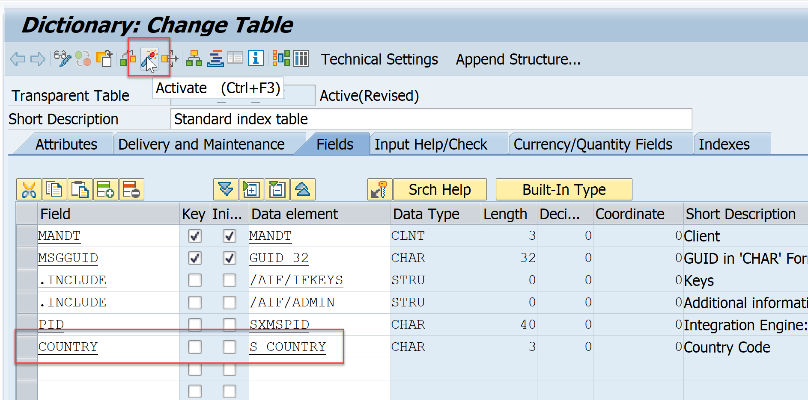

### Define single key field

You need to define the key field for your interface.

1. In the **Customizing** for SAP Application Interface Framework (transaction code `/AIF/CUST`), navigate to **Error Handling** > **Define Interface-Specific Features**.

2. In the upcoming dialog, enter namespace `DEMO_1`, interface `FCUSTOMER`, and version `1`, then press **Enter**.

3. Double-click **Define Key Fields for Multi. Search** in the menu on the left. Add a new entry with **Field Sequence No.** `10` and add the following values:

    | Field name                        | Value
    | :----------------------------------------| :-------------------------------------------
    | Key Field Name                           | **`COUNTRY`**
    | Data element                             | **`S_COUNTRY`**
    | Field Name                               | **`E1SCU_CRE-E1BPSCUNEW-COUNTR`**
    | Raw or SAP Structure                     | **`Source structure`**
    | Multi.Selection Type                     | **`Single selection`**
    | Hide Tree Node in the View 1 Tree        | **selected**
    | Field Name in Alert Recipient Assignment | **`COUNTRY`**
    | Relevant for Recipient Determination     | **selected**

4. **Save** your changes.

    <!-- border -->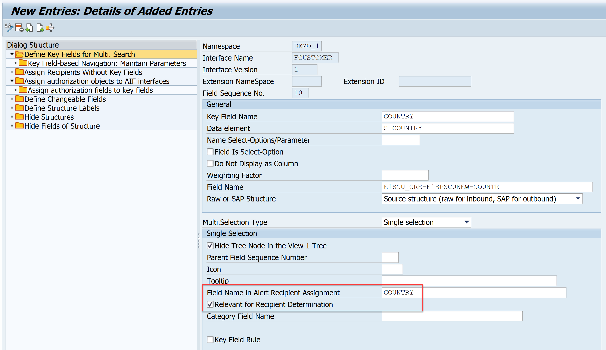

### Create recipient assignment table

You need to create a recipient assignment table by copying the template table `/AIF/T_ALRT_DEF`.

1. Run transaction code `SE11`, enter **`/AIF/T_ALRT_DEF`** in the field **Database table**, right-click it and select **Copy...**.

2. Enter the name **`ZFCUST_RECIPIENT`** for the new table and select **Continue**. When prompted, enter the package name you created in the previous tutorial.

3. Once created, choose **Change**.

4. Add the following new entry:

    | Field                   | Data element
    | :-----------------------| :-------------------------------------------
    | **`COUNTRY`**           | **`S_COUNTRY`**

5. **Save** and **Activate** your changes.

    <!-- border -->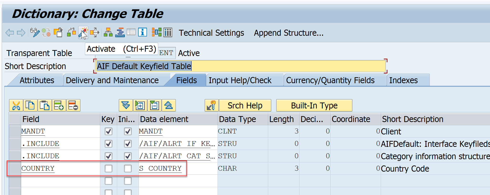

### Define recipients

You need to create different recipients for different key field values.

1. Go to **Customizing** (transaction `/AIF/CUST`) and navigate to **SAP Application Interface Framework** > **Error Handling** > **Define Namespace-Specific Features**. Enter or select your namespace **`DEMO_1`** and select **Continue**.

2. In the menu on the left, navigate to **Define Recipients** by double-clicking it. You should see a recipient that you have defined in the previous tutorial. You need to create three more recipients: two for the key field based recipient determination and one as default. Select **New Entries**, and enter the following details:

    | Recipient for Alert            | Alert Recipient Description
    | :------------------------------| :-----------------------------------------------
    | **`ZFCUST_RECIPIENT_DE`**      | **`Key field based recipient for country DE`**
    | **`ZFCUST_RECIPIENT_US`**      | **`Key field based recipient for country US`**
    | **`ZFCUST_RECIPIENT_DEFAULT`** | **`Default recipient`**

3. **Save** your changes.

    <!-- border -->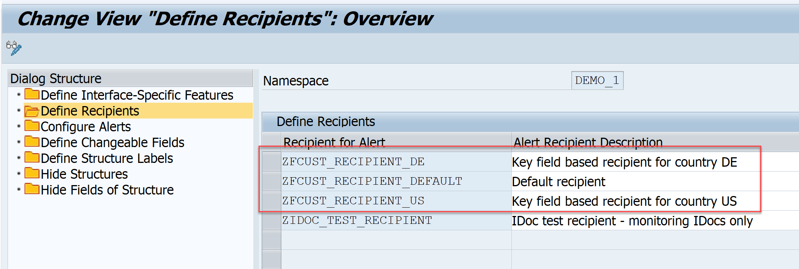

### Assign recipient assignment table to your interface

You need to assign the beforehand created recipient assignment table as well as the default recipient to your interface.

> You maintain a default recipient to make sure that no message slips through without anybody being notified. If the system cannot find any other recipient that receives a notification, a notification is always sent to the default recipient regardless of the alert settings.

1. While in **Customizing** (transaction `/AIF/CUST`), navigate to **SAP Application Interface Framework** > **Error Handling** > **Define Namespace-Specific Features**. Enter your namespace **`DEMO_1`** and select **Continue**.

2. Double-click the node **Configure Alerts**, and select **New Entries** to create a new entry. Enter your interface name **`FCUSTOMER`** and version **`1`**, and maintain the parameters as follows:

    | Field             | Value
    | :-----------------| :--------------------------
    | Rec Assgn Table   | **`ZFCUST_RECIPIENT`**
    | Namespace         | **`DEMO_1`**
    | Default Recipient | **`ZFCUST_RECIPIENT_DEFAULT`**

3. **Save** your changes.

    <!-- border -->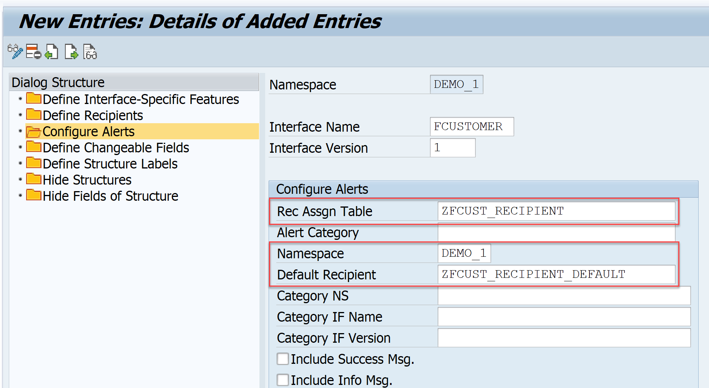

### Maintain recipient assignment table

You need to maintain the recipient assignment table to map key field values to your recipients.

> As a prerequisite to add entries to the recipient assignment table, the **Data Browser/Table View Editing** table setting should be set to **`Display/Maintenance Allowed`**. Since we copied the recipient assignment table from a template table, this should automatically apply. Otherwise, ensure to change the setting accordingly.

1. Run transaction code `SE16`, enter **`ZFCUST_RECIPIENT`** in the field **Table Name**, and select **Create Entries**.

2. Add the following entries to the table:

    | NS           | IFNAME          | IFVERSION | NSRECIP      | RECIPIENT                 | COUNTRY
    | :------------| :---------------| :---------| :------------| :-------------------------| :--------
    | **`DEMO_1`** | **`FCUSTOMER`** | **`1`**   | **`DEMO_1`** | **`ZFCUST_RECIPIENT_DE`** | **`DE`**
    | **`DEMO_1`** | **`FCUSTOMER`** | **`1`**   | **`DEMO_1`** | **`ZFCUST_RECIPIENT_US`** | **`US`**

3. **Save** your changes.

    <!-- border -->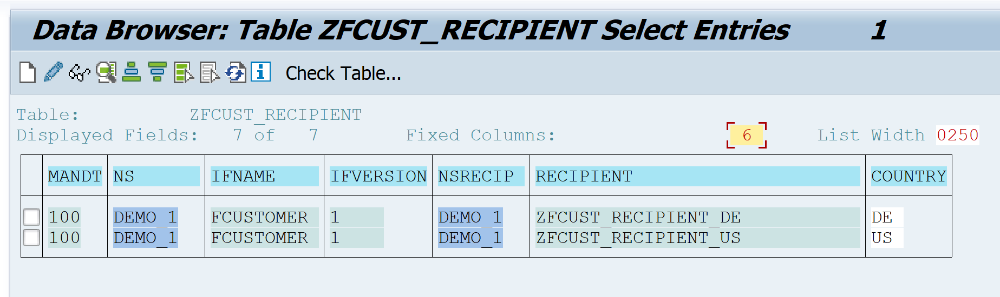

### Assign users to recipients

Now the users in charge of monitoring the IDoc must be assigned to the recipients. We assume that you have already created two different users, one will be responsible for the messages related to country **`DE`** and the other for country **`US`**.

1. Go to **Customizing** (transaction `/AIF/CUST`) and navigate to **SAP Application Interface Framework** > **System Configuration** > **Recipients** > **Assign Recipients**. Enter or select your namespace **`DEMO_1`** and the beforehand created recipient **`ZFCUST_RECIPIENT_DE`**, then select **Apply**.

2. Select **New Entries** to create a new entry in **Assign Users**. Enter your user responsible for **`DE`** and check the boxes for **Include on Overview** and **Tech. User**.

3. **Save** the new entry.

    <!-- border -->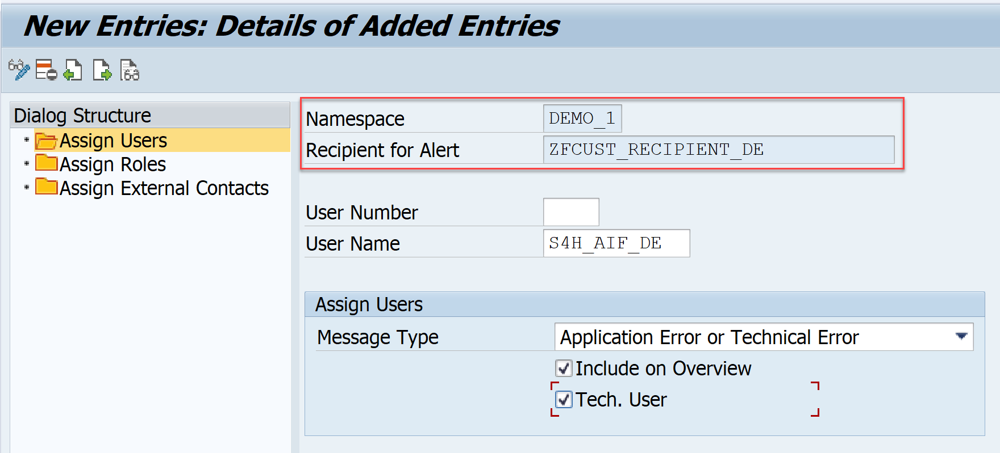

4. Navigate back, and run through the same steps for the recipient **`ZFCUST_RECIPIENT_US`**.

    <!-- border -->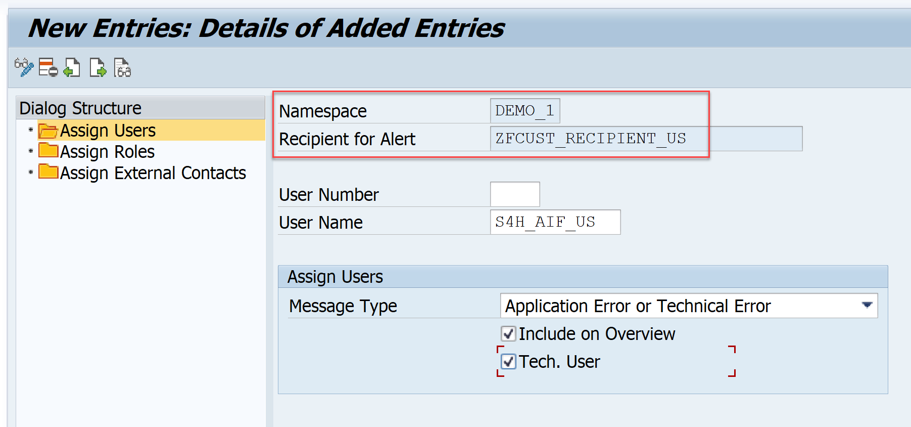

### Send sample requests

Let's create a couple of sample messages to showcase the customizing changes.

Open the **Test Tool for IDoc Processing** (transaction code `WE19`). Send in two new test messages with different countries, choose either **`DE`** or **`US`**. Maintain customer names, regions, and cities. Enter an existing customer type, either `P` or `B`, to ensure that the message won't fail. Optionally, enter any other customer type to force a message processing error.

<!-- border -->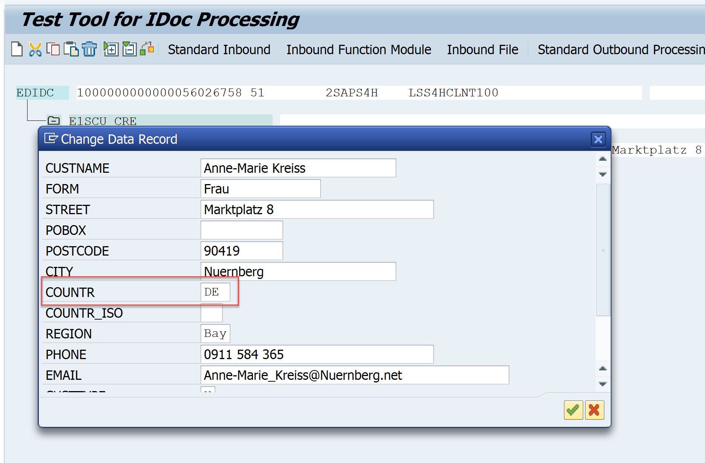

### Monitor your interface

Now, let's check the results of your tests in the Monitoring and Error Handling.

1. Log on with one of the users, e.g., the one responsible for **`DE`**.

2. Open the **Interface Monitor** (transaction code `/AIF/IFMON`). You should see one new message.

    <!-- border -->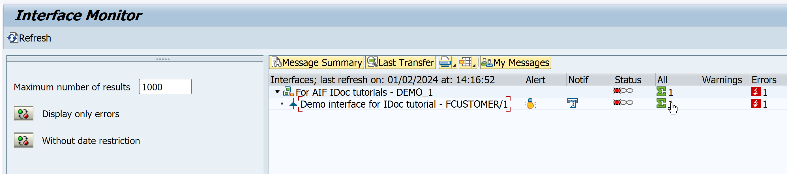

3. When you select the summary line for your interface, you’re forwarded to **Monitoring and Error Handling** where you can see your selected test message for country **`DE`**. You should not see the messages for any other country.

    <!-- border -->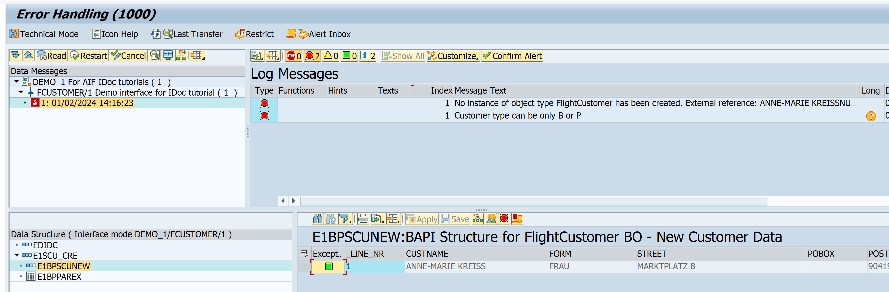

4. Alternatively, if you’ve set up Message Monitoring for Administrators in the SAP Fiori launchpad, you can check the test results there. Here, you see all messages grouped by recipient. See [Message Monitoring for Administrators](https://help.sap.com/docs/ABAP_PLATFORM_NEW/4db1676c3f114f119b500bd80ccd944d/2bfccaebd70f4efe905d4f0ec42da2c3.html).

    <!-- border -->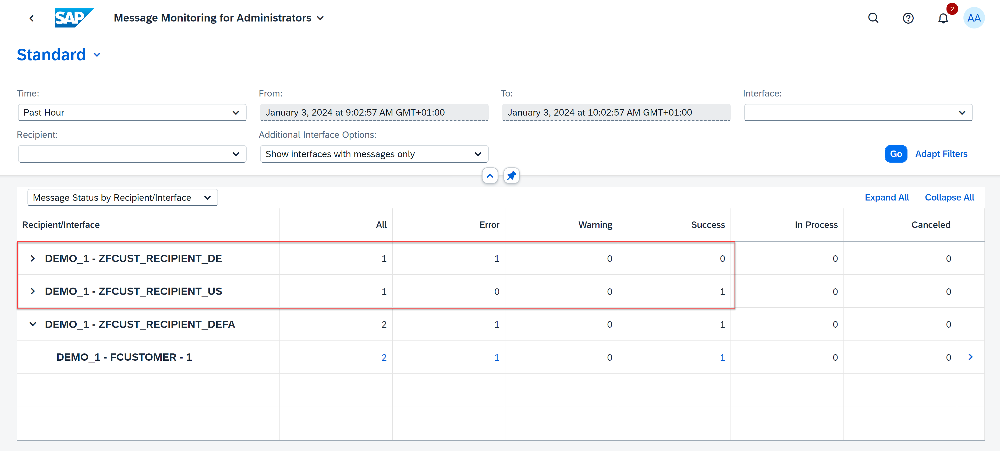

Congratulations! You've successfully defined key field based recipients.

### Test yourself

---
