# Determine Recipients by Message Categories
<!-- description --> Define recipients based on message categories to be able to dispatch messages in the message monitor of SAP Application Interface Framework to different users or processing teams.

## Prerequisites
 - You've set up SAP Application Interface Framework
 - SAP S/4HANA 1709 or later, AIF 4.0
 - You've completed the tutorial [Customize an IDoc Interface with Runtime and Monitoring](aif-idoc-monitoring-interface-customize)

## You will learn
  - How to define message categories
  - How to create recipients
  - How to create and maintain a recipient assignment table

## Intro
You use recipients to control which interfaces and messages can be accessed within the message monitor of SAP Application Interface Framework. To assign recipients to users, you can apply the following approaches: either by interface, by key field values, by error categories or via a combination of latter two approaches.

In this tutorial, you will learn how to set up recipients based on message categories. This way, you can dispatch messages to users or groups that are responsible for handling specific errors.

> As a prerequisite, you should have gone through the [Customize an IDoc Interface with Runtime and Monitoring](aif-idoc-monitoring-interface-customize) tutorial where you configured the monitoring for an IDoc flight booking interface. In this case, we simply assigned a recipient to the IDoc interface. You will replace the recipient assignment by interface with a recipient assignment based on message categories. Here, we distinguish between users handling either travel agency related errors, passenger related errors or errors caused by wrong flight details.

> This tutorial focuses on customizing an IDoc interface. All the settings are also supported for any other technology that SAP Application Interface Framework supports, such as Proxies or Web Services.

---

### Create recipient assignment table

You need to create a recipient assignment table by copying the template table `/AIF/RECA_TMPL`.

1. Run transaction code `SE11`, enter **`/AIF/RECA_TMPL`** in the field **Database table**, right-click it and select **Copy...**.

2. Enter the name **`ZFB_RECIPIENT`** for the new table and select **Continue**. When prompted, enter the package name you created in the previous tutorial.

3. Once created, choose **Dsiplay**.

5. **Activate** your table.

    <!-- border -->

### Define recipients

You need to create different recipients for different error categories.

1. Go to **Customizing** (transaction code `/AIF/CUST`) and navigate to **SAP Application Interface Framework** > **Error Handling** > **Define Namespace-Specific Features**. Enter or select your namespace **`DEMO_1`** and select **Continue**.

2. In the menu on the left, navigate to **Define Recipients** by double-clicking it. Select **New Entries**, and enter the following recipients:

    | Recipient for Alert         | Alert Recipient Description
    | :---------------------------| :-----------------------------------------------
    | **`ZFB_RECIPIENT_AGENCY`**  | **`Recipient for Agency related errors`**
    | **`ZFB_RECIPIENT_FLIGHT`**  | **`Recipient for Flight related errors`**
    | **`ZFB_RECIPIENT_PASS`**    | **`Recipient for Passenger related errors`**
    | **`ZFB_RECIPIENT_DEFAULT`** | **`Default recipient`**

3. **Save** your changes.

    <!-- border -->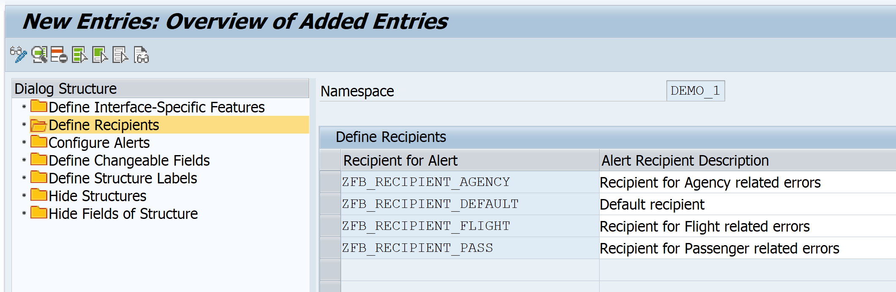

### Assign recipient assignment table to your interface

You need to assign the beforehand created recipient assignment table as well as the default recipient to your interface.

> You maintain a default recipient to make sure that no message slips through without anybody being notified. If the system cannot find any other recipient that receives a notification, a notification is always sent to the default recipient regardless of the alert settings.

1. While in **Customizing** (transaction code `/AIF/CUST`), navigate to **SAP Application Interface Framework** > **Error Handling** > **Define Namespace-Specific Features**. Enter your namespace **`DEMO_1`** and select **Continue**.

2. Double-click the node **Configure Alerts**, and select **New Entries** to create a new entry. Enter your interface name **`FLBOOK`** and version **`1`**, and maintain the parameters as follows:

    | Field             | Value
    | :-----------------| :--------------------------
    | Rec Assgn Table   | **`ZFB_RECIPIENT`**
    | Namespace         | **`DEMO_1`**
    | Default Recipient | **`ZFB_RECIPIENT_DEFAULT`**

3. **Save** your changes.

    <!-- border -->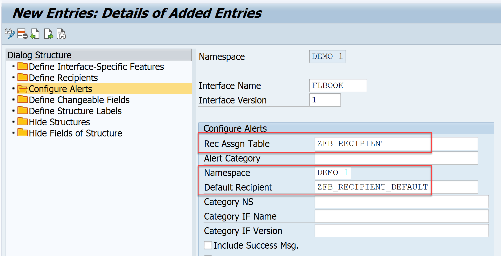

### Define Message Categories

You need to create message categories corresponding to your recipients.

1. Run transaction code `/AIF/MSG_CAT_DEF`, enter your namespace **`DEMO_1`** and select **Apply**.

2. Select **New Entries**, and enter the following message categories:

    | Message Category    | Msg. Cat. Desc
    | :-------------------| :------------------------------------
    | **`ERRORS_AGENCY`** | **`Agency related errors`**
    | **`ERRORS_FLIGHT`** | **`Flight related errors`**
    | **`ERRORS_PASS`**   | **`Passenger related errors`**

3. **Save** your changes.

    <!-- border -->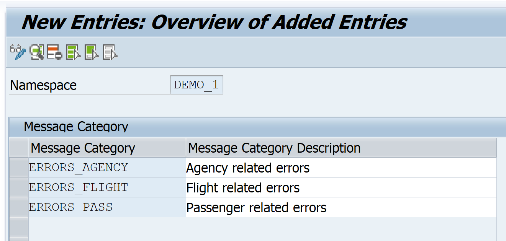

### Assign Messages to Message Categories

You need to group log messages in the beforehand created message categories.

1. Run transaction code `/AIF/MSG_CAT_ASGN`, enter your namespace **`DEMO_1`** and the first beforehand created message category **`ERRORS_AGENCY`**, then select **Apply**.

2. Select **New Entries**, and enter the following message categories:

    | Message Class | Message Number
    | :-------------| :------------------------------------
    | **`BC_IBF`**  | **`105`**
    | **`BC_IBF`**  | **`151`**

3. **Save** your changes.

    <!-- border -->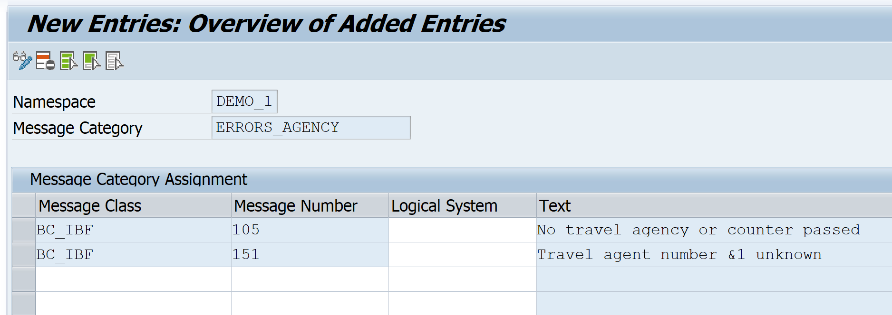

4. Rerun transaction code `/AIF/MSG_CAT_ASGN`, enter your namespace **`DEMO_1`** and the next message category **`ERRORS_FLIGHT`**, then select **Apply**.

5. Select **New Entries**, and enter the following message categories:

    | Message Class | Message Number
    | :-------------| :------------------------------------
    | **`BC_IBF`**  | **`055`**
    | **`BC_IBF`**  | **`057`**
    | **`BC_IBF`**  | **`107`**

6. **Save** your changes.

    <!-- border -->

7. Rerun transaction code `/AIF/MSG_CAT_ASGN`, enter your namespace **`DEMO_1`** and the next message category **`ERRORS_PASS`**, then select **Apply**.

8. Select **New Entries**, and enter the following message categories:

    | Message Class | Message Number
    | :-------------| :------------------------------------
    | **`BC_IBF`**  | **`106`**
    | **`BC_IBF`**  | **`150`**

9. **Save** your changes.

    <!-- border -->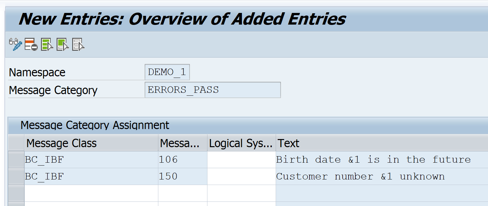

### Maintain recipient assignment table

Next, you need to maintain the recipient assignment table to map the message categories to your recipients.

> As a prerequisite to add entries to the recipient assignment table, the **Data Browser/Table View Editing** table setting should be set to **`Display/Maintenance Allowed`**. Since we copied the recipient assignment table from a template table, this should automatically apply. Otherwise, ensure to change the setting accordingly.

1. Run transaction code `SE16`, enter **`ZFB_RECIPIENT`** in the field **Table Name**, and select **Create Entries**.

2. Add the following entries to the table:

    | NS           | IFNAME       | IFVERSION | NSRECIP      | RECIPIENT                  | /AIF/NSMSGCAT | /AIF/MSGCATEGORY | /AIF/IS_FALLBACK
    | :------------| :------------| :---------| :------------| :--------------------------| :----------- | :-----------------| :-------------
    | **`DEMO_1`** | **`FLBOOK`** | **`1`**   | **`DEMO_1`** | **`ZFB_RECIPIENT_AGENCY`** | **`DEMO_1`** | **`ERRORS_AGENCY`** |
    | **`DEMO_1`** | **`FLBOOK`** | **`1`**   | **`DEMO_1`** | **`ZFB_RECIPIENT_FLIGHT`** | **`DEMO_1`** | **`ERRORS_FLIGHT`** |
    | **`DEMO_1`** | **`FLBOOK`** | **`1`**   | **`DEMO_1`** | **`ZFB_RECIPIENT_PASS`**   | **`DEMO_1`** | **`ERRORS_PASS`**   |

> Optionally, you can add an entry for a fallback recipient by setting the fallback flag (not covered in this tutorial). The fallback recipient would get all messages for error types other than maintained above.

3. **Save** your changes.

    <!-- border -->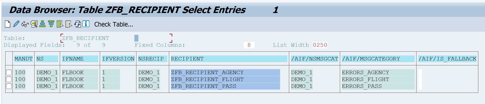

### Assign users to recipients

Now the users in charge of monitoring the IDoc must be assigned to the recipients. We assume that you have already created three different users, one for each message category.

1. Go to **Customizing** (transaction `/AIF/CUST`) and navigate to **SAP Application Interface Framework** > **System Configuration** > **Recipients** > **Assign Recipients**. Enter or select your namespace **`DEMO_1`** and the beforehand created recipient **`ZFB_RECIPIENT_AGENCY`**, then select **Apply**.

2. Select **New Entries** to create a new entry in **Assign Users**. Enter your user responsible for agency related errors and check the boxes for **Include on Overview** and **Tech. User**.

3. **Save** the new entry.

    <!-- border -->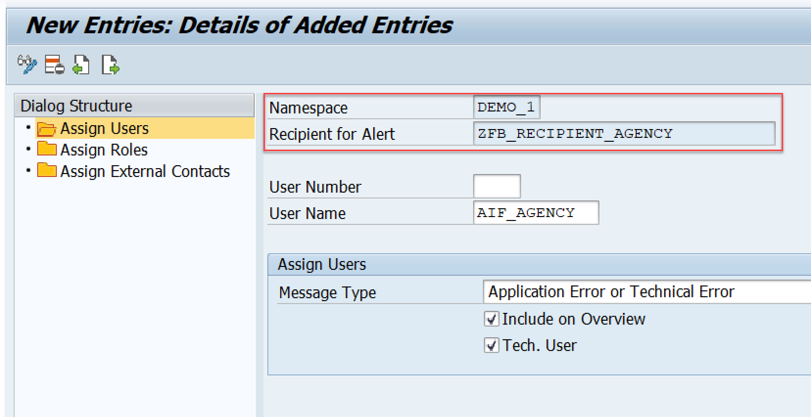

4. Navigate back, and run through the same steps for the recipients **`ZFB_RECIPIENT_FLIGHT`** and **`ZFB_RECIPIENT_PASS`**.

### Send sample requests

Let's create a couple of sample messages to showcase the customizing changes.

> As a prerequisite, you need to generate sample test data. If you haven't done so far, run through **step 17** of the [Customize an IDoc Interface with Runtime and Monitoring](aif-idoc-monitoring-interface-customize) tutorial. **Step 18** of the tutorial describes how to send test data.

Open the **Test Tool for IDoc Processing** (transaction code `WE19`). Send in new test messages forcing different kind of processing errors:
  - Select an existing flight however maintain an agency that does not exist like agency number **`00109345`**.
  - Select an existing flight however maintain no agency nor a counter.
  - Select an existing flight however maintain **`00000000`** as customer number.
  - Select an existing flight however maintain a wrong flight class such as **`X`**.
  - Select an existing flight where the flight date is in the past.
  - Select a flight that does not exist.

<!-- border -->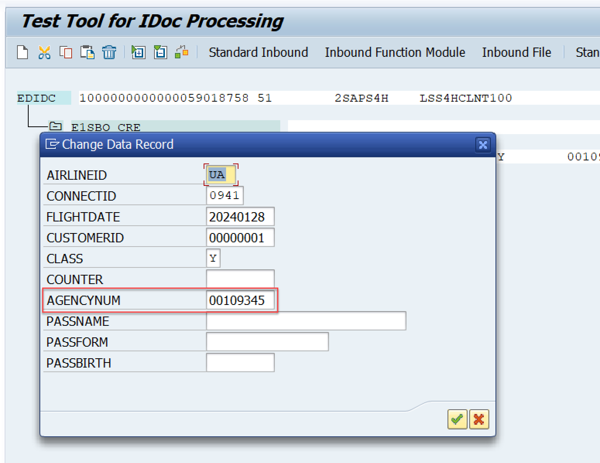

### Monitor your interface

Now, let's check the results of your tests in the Monitoring and Error Handling.

1. Log on with one of the users, e.g., the one responsible for agency related errors.

2. Open the **Interface Monitor** (transaction code `/AIF/IFMON`). You should see at least one new message.

    <!-- border -->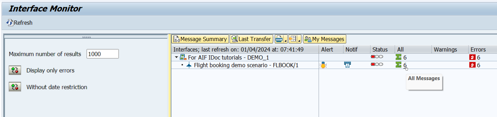

3. When you select the summary line for your interface, you’re forwarded to **Monitoring and Error Handling** where you can see your selected test messages. You should see agency related errors only, like an unknown agency:

    <!-- border -->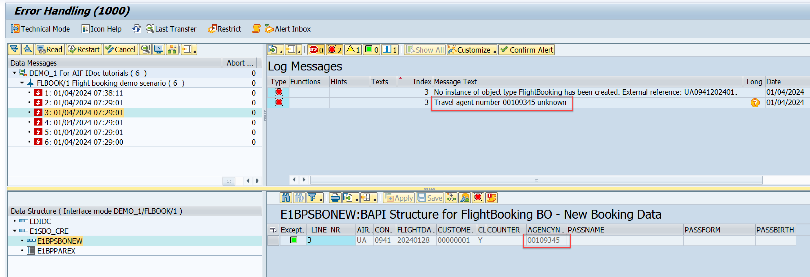

4. If you select another message you may find a message with no agency maintained:
   
    <!-- border -->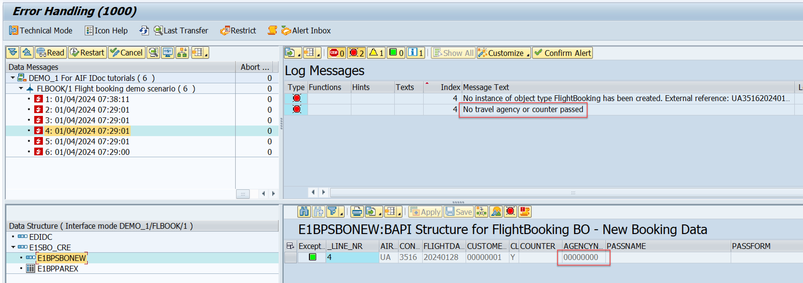

5. Alternatively, if you’ve set up Message Monitoring for Administrators in the SAP Fiori launchpad, you can check the test results there. Here, you see all messages grouped by recipient. See [Message Monitoring for Administrators](https://help.sap.com/docs/ABAP_PLATFORM_NEW/4db1676c3f114f119b500bd80ccd944d/2bfccaebd70f4efe905d4f0ec42da2c3.html).

    <!-- border -->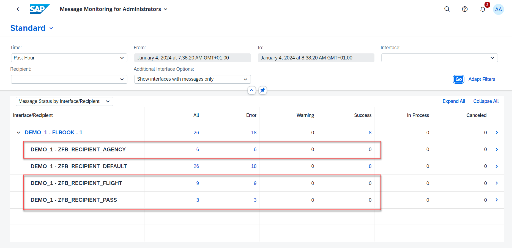

Congratulations! You've successfully defined message category based recipients.

### Test yourself

---
