# Create a Simple RFC Interface
<!-- description --> Create a simple RFC interface to enable monitoring messages exchanged via Remote Function Call (RFC).

## Prerequisites
  - You've set up SAP Application Interface Framework
  - SAP S/4HANA 1909 or later
  - You've set up background RFC (Background Remote Function Call) and created an RFC-enabled function module (see [bgRFC Configuration](https://help.sap.com/docs/ABAP_PLATFORM_NEW/753088fc00704d0a80e7fbd6803c8adb/489709f255493987e10000000a421937.html) on SAP Help Portal)

## You will learn
  - How to create a simple RFC interface
  - How to set up monitoring of an RFC interface in SAP Application Interface Framework


## Intro
In this tutorial, you'll learn how to create a simple RFC interface that enables you to monitor messages that you exchange via Remote Function Call (RFC).

---

### Create package and function group


>If you've completed other tutorials for SAP Application Interface Framework, you might already have created a package and a function group. In this case, you can skip this step.

Create a package that serves as the destination for your newly created objects.

1. Open your system and navigate to the **Object Navigator** (transaction code `SE80`).
2. From the drop-down menu, choose **Package** and enter the name `ZDEMO`. Press **Enter** or choose **Display or Create Object**.
3. Confirm the dialogue window, enter a meaningful short description for your new package, and select **Confirm**. If prompted, enter a workbench request and confirm again.
4. Repeating the same directions, also create a new function group by selecting **Function Group** from the drop-down menu and entering the name `ZDEMO`.

  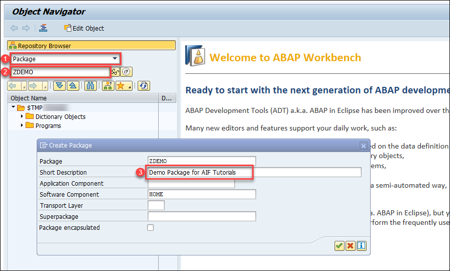

You have successfully created a new package named `ZDEMO` and a new function group named `ZDEMO`.


### Create message class


In preparation for the next step, in which you create a function module and a message in case of an application error, you need to create a new message class and a message.

1. Go to the **Message Maintenance** (transaction code `SE91`), enter message class `ZDEMO_MSG_CLASS`, and choose **Create**.

2. Enter the previously created package `ZDEMO` and a workbench request.

3. Add a new message with number `000` and message short text `Error in creating a flight booking`.

    <!-- border -->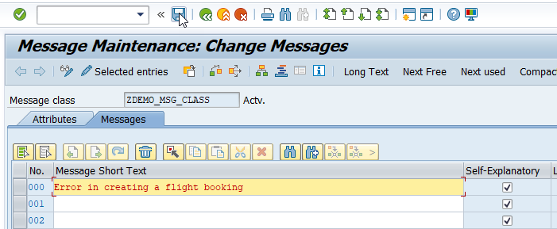

4. **Save** your changes.


### Create function module


Run the **Function Builder** (transaction code `SE37`) and create a new remote-enabled function module `ZBAPI_FLBOOKING_CREATEFROMDATA` as a wrapper of the standard demo function module `BAPI_FLBOOKING_CREATEFROMDATA`.

1. Enter the name `ZBAPI_FLBOOKING_CREATEFROMDATA` and choose **Create**.
2. On the upcoming dialog, enter the previously created function group `ZDEMO` and maintain a short text. Click **Save**.
3. In the **Attributes** tab, select the `Remote-Enabled Module` flag.

    <!-- border -->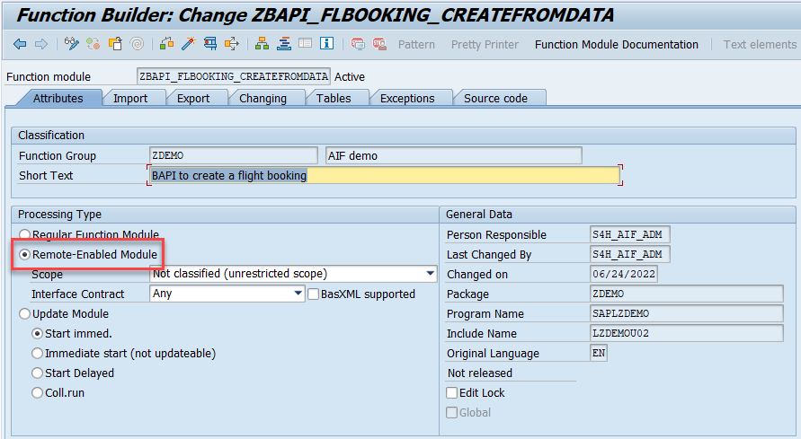

4. Switch to tab **Import**, and enter the following import parameters:

| Parameter Name | Typing | Associated Type
| :--- | :--- | :---
| **`RESERVE_ONLY`** | **TYPE** | **`BAPISBODAT-RESERVED`**
| **`BOOKING_DATA`** | **TYPE** | **`BAPISBONEW`**
| **`TEST_RUN`**     | **TYPE** | **`BAPISFLAUX-TESTRUN`**

Switch to tab **Export**, and enter the following export parameters:

| Parameter Name    | Typing   | Associated Type
| :---------- | :---- | :------
| **`AIRLINEID`**     | **TYPE** | **`BAPISBOKEY-AIRLINEID`**
| **`BOOKINGNUMBER`** | **TYPE** | **`BAPISBOKEY-BOOKINGID`**
| **`TICKET_PRICE`**  | **TYPE** | **`BAPISBOPRI`**

Switch to tab **Tables**, and enter the following table parameters:

| Parameter Name   | Typing   | Associated Type
| :----------- | :---- | :------
| **`EXTENSION_IN`** | **TYPE** | **`BAPIPAREX`**
| **`RETURN`**       | **TYPE** | **`BAPIRET2`**

Switch to tab **Source code**, and maintain the source code by copying and pasting the following:

```ABAP
    FUNCTION zbapi_flbooking_createfromdata.
      CALL FUNCTION 'BAPI_FLBOOKING_CREATEFROMDATA'
        EXPORTING
          reserve_only  = reserve_only
          booking_data  = booking_data
          test_run      = test_run
        IMPORTING
          airlineid     = airlineid
          bookingnumber = bookingnumber
          ticket_price  = ticket_price
        TABLES
          extension_in  = extension_in
          return        = return.
      /aif/cl_xrfc_temp_storage=>store_bapiret_tab( it_bapiret = return[] ).
      IF line_exists( return[ type = 'A' ] ) OR line_exists( return[ type = 'E' ] ).
        MESSAGE e000(zdemo_msg_class).
      ENDIF.
    ENDFUNCTION.
```  

> By default, successful messages are not displayed in the message monitor. To add additional log messages to the log, the method `/aif/cl_xrfc_temp_storage=>store_bapiret_tab` needs to be called. Also, the flag `Use temp. msg. store` needs to be selected in step **Define RFC Settings**.

**Save** and **activate** your changes.


### Create DDIC structure


Run the **ABAP Dictionary** (transaction code `SE11`), and create a new structure `ZDEMO_RFC_FLBOOKING_CREATE` corresponding to the signature of your function module. The DDIC structure needs to contain one component for each parameter of your function module.

1. Enter the **Data type** name `ZDEMO_RFC_FLBOOKING_CREATE` and choose **Create**.

2. In the upcoming dialog, select the `Structure` radio button. Choose **Continue**.

3. Enter a short description.

4. Switch to the **Components** tab and maintain the following structure:


    | Component       | Typing Method | Component Type
    | :----------- | :--------- | :------
    | `RESERVE_ONLY`  | Types     | `S_RESERV`
    | `BOOKING_DATA`  | Types     | `BAPISBONEW`
    | `TEST_RUN`      | Types     | `TESTRUN`
    | `AIRLINEID`     | Types     | `S_CARR_ID`
    | `BOOKINGNUMBER` | Types     | `S_BOOK_ID`
    | `TICKET_PRICE`  | Types     | `BAPISBOPRI`
    | `EXTENSION_IN`  | Types     | `BAPIPAREXTAB`
    | `RETURN`        | Types     | `BAPIRET2_T`

    <!-- border -->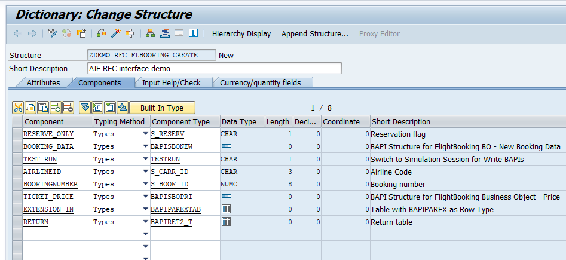

5. **Save** and **activate** your changes.


### Create namespace


As interfaces in SAP Application Interface Framework are grouped using namespaces, you must create a namespace.

Go to **Customizing** for SAP Application Interface Framework (transaction code `/n/AIF/CUST`) and navigate to **Interface Development** > **Define Namespace**.

Select **New Entries** and enter the following name and description for your new namespace:

| Namespace       | Namespace Description
| :----------- | :---------
| **`DEMO_3`** | **`Namespace for AIF RFC tutorials`**

  <!-- border -->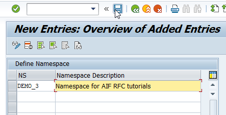


### Create interface


1. While still in **Customizing** (transaction code `/n/AIF/CUST`), navigate to **Interface Development** > **Define Interfaces**.

2. In the upcoming dialog, enter your previously created namespace **`DEMO_3`** and press **Enter**.

3. Select **New Entries** and enter the following parameters based on your previously created structure:

    | Field name          | Description                         | Value
    | :--------          | :---------                         | :--------
    | Interface Name      | Name of the interface to be created | **`FLBOOK`**   
    | Interface Version   | Version number of the interface     | **`1`**
    | Description         | Description of the interface        | **`Flight booking interface for RFC tutorial`**
    | SAP Data structure  | Input substructure of the RFC       | **`ZDEMO_RFC_FLBOOKING_CREATE`**
    | Raw Data structure  | Input structure of the RFC            | **`ZDEMO_RFC_FLBOOKING_CREATE`**
    | Interface Direction | Indicates the direction of the interface  |  **`Both`**

4. **Save** your changes.


### Specify interface engines


Next, you have to select the engines that should be used to handle the messages that are processed.

1. While still in **Customizing** (transaction code `/n/AIF/CUST`), navigate to **Interface Development** > **Additional Interface Properties** > **Specify Interface Engines**.

2. In the upcoming dialog, enter your previously created namespace **`DEMO_3`** and press **Enter**.

3. If your namespace contains more than one interface, select interface `FLBOOK` of version `1`. Otherwise, your interface is already displayed.

4. Change the engines as follows:

    | Parameter          | Value
    | :--------         | :--------
    | Application Engine      | `Application Engine xRFC integration`
    | Persistence Engine   | `Persistency engine xRFC integration`
    | Selection Engine  | `AIF Index Tables`
    | Logging Engine     | `AIF Application Log`

5. **Save** your changes.


### Define RFC settings


Next, you need to assign the RFC function module to the interface.

1. While still in **Customizing** (transaction code `/n/AIF/CUST`), navigate to **Interface Development** > **Additional Interface Properties** > **Define RFC Settings**.

2. Select **New Entries** and enter the following parameters:

    | Parameter              | Value
    | :----                   | :----
    | Function Module        | `ZBAPI_FLBOOKING_CREATEFROMDATA`
    | Namespace              | `DEMO_3`
    | Interface Name         | `FLBOOK`
    | Interface Version      | `1`
    | Deactivated                | Deselected
    | Use temporary message store | Selected


    <!-- border -->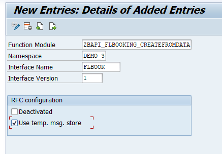

3. **Save** your changes.


### Create interface-specific single index table


It's recommended to implement an interface-specific single index table to ensure full flexibility, especially if you expect a high load of messages or if you plan to define key fields for your interface (now or later).

> You can also switch the single index table later, but when you do, all processed messages stored in the old single index table will no longer be visible in the Interface Monitor. The information for the newly incoming messages is stored in the new single index table of the interface.

1. Create a table via transaction `SE11`. You can use table `/AIF/XRFC_S_IDX` as a template by entering **`/AIF/XRFC_S_IDX`** in the field **Database table**, right-clicking it and selecting **Copy...**. Enter the name **`ZFLBOOK_RFC_IDX`** for the new table and select **Continue**. When prompted, enter package **`ZDEMO`**, which you created earlier.

2. After creating the single index table, activate it by selecting **Display** and then **Activate**.

3. Go to **Customizing** (transaction code `/n/AIF/CUST`) and navigate to **SAP Application Interface Framework** > **Error Handling** > **Define Namespace-Specific Features**. Enter your namespace **`DEMO_3`** and select **Continue**.

4. Select **New Entries** to create a new entry in **Define Interface-Specific Features**. Enter your interface name **`FLBOOK`** and version **`1`** and enter the name of the newly created single index table **`ZFLBOOK_RFC_IDX`** in the field **Message Index Table**.

5. Select both flags **Display Root Field** and **Display description**.

    <!-- border -->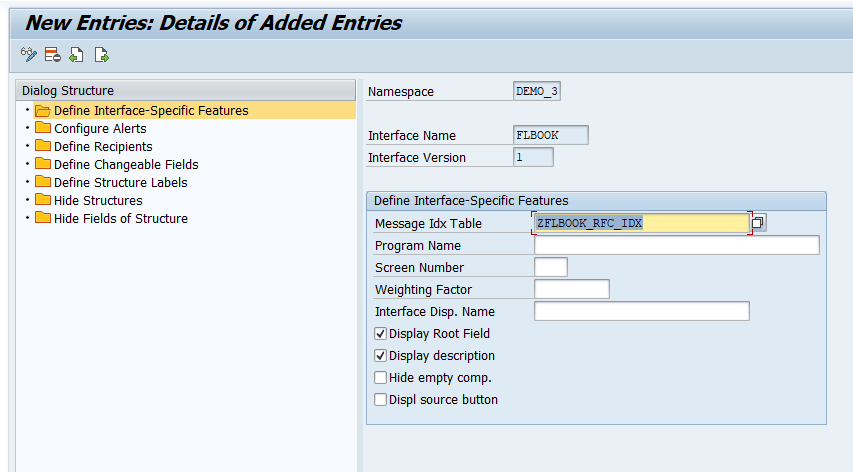

6. **Save** your changes.


### Create recipient for interface


If you want to monitor the newly created interface in the Interface Monitor of the Message Dashboard app, you require a recipient for the interface.

1. While still in **Customizing** (transaction code `/n/AIF/CUST`), navigate to **SAP Application Interface Framework** > **Error Handling** > **Define Namespace-Specific Features**. Enter or select your namespace **`DEMO_3`** and choose **Continue**.

2. In the menu on the left, navigate to **Define Recipients** by double-clicking it. Choose **New Entries**, enter the name **`ZRFC_TEST_RECIPIENT`** for your new recipient, and add a meaningful description.

    <!-- border -->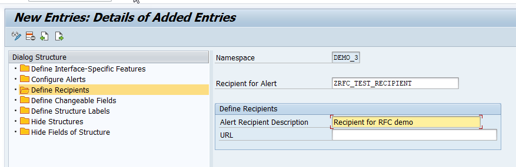

3. **Save** your changes.


### Assign recipient to interface


To be able to see any data in the Interface Monitor or the Message Dashboard, a recipient must be assigned to the interface they want to monitor.

1. While still in **Customizing** (transaction code `/n/AIF/CUST`), navigate to **SAP Application Interface Framework** > **Error Handling** > **Define Interface-Specific Features**. Enter or select your namespace **`DEMO_3`**, as well as your interface name **`FLBOOK`** and interface version **`1`**. Select **Continue**.

2. In the menu on the left, double-click **Assign Recipients Without Key Fields** and create a new entry. Enter or select the namespace and the recipient you created before.

    <!-- border -->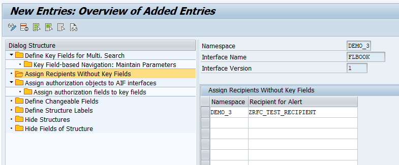

3. **Save** your changes.


### Assign users to recipient


Now the users in charge of monitoring the RFC must be assigned to the recipient.

Run transaction `/AIF/MYRECIPIENTS` and create a new entry. Select the namespace **`DEMO_3`** and recipient `ZRFC_TEST_RECIPIENT` you created in the steps before. Check the boxes for **Overview** and **Technical User**.

  <!-- border -->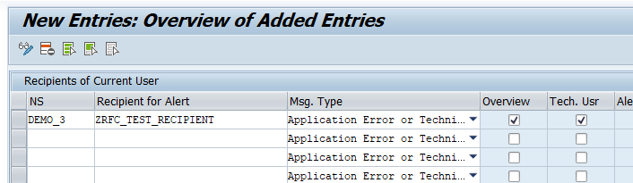

**Save** the new entry.


### Create test data


Before you can create flight bookings, you need to generate test data.

Run transaction `BC_DATA_GEN`, select the standard data record, and execute the report.

  <!-- border -->

Open the **Data Browser** (transaction code `SE16`), select the table **SFLIGHTS**, and choose **Execute**. The generated flight data entries are displayed.

>If you run the requests in step 16 **Send sample request**, select existing flights from this table. Ensure that the flight date is in the future, or your requests will fail.

  <!-- border -->


### Create inbound destination


Create a new inbound destination for your bgRFC configuration.

1. Run the **bgRFC Configuration** (transaction code `SBGRFCCONF`) and switch to tab **Define Inbound Destination**.
2. Choose **Create**.
3. In the upcoming dialog, maintain the **Inbound Destination Name** `AIF_INBOUND`.
4. Enter a new **Queue Prefix** `AIF_` and click **Add**.
5. **Save** your changes.

  	<!-- border -->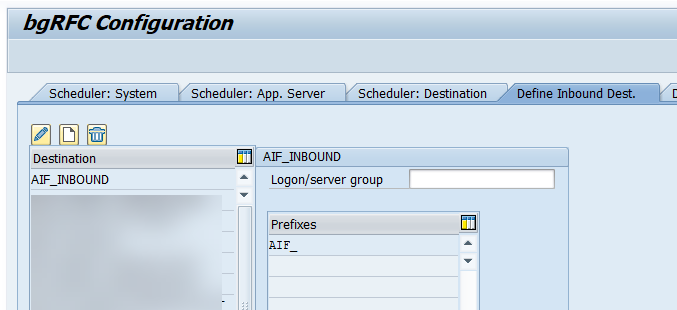


### Create test report


Now you have to create a new program to call your function module via bgRFC.

1. Run the **ABAP Editor** (transaction code `SE38`).
2. In field **Program**, enter the name `ZDEMO_FLBOOK_VIA_BGRFC` and click **Create**.
3. In the upcoming dialog, enter a **Title**, select **Type** `Executable program`, and **Status** `Test program`. Choose **Save**.
4. In the next dialog, maintain **Package** `ZDEMO`. Choose **Save**.
5. Maintain the code by pasting the following:

```ABAP
  REPORT ZDEMO_FLBOOK_VIA_BGRFC.

      SELECTION-SCREEN BEGIN OF BLOCK block WITH FRAME TITLE TEXT-001.
        PARAMETERS : airline TYPE S_CARR_ID.
        PARAMETERS : connect TYPE S_CONN_ID.
        PARAMETERS : date TYPE S_DATE.
        PARAMETERS : class TYPE S_CLASS.
        PARAMETERS : agency TYPE S_AGNCYNUM DEFAULT '00000109'.
      SELECTION-SCREEN END OF BLOCK block.

      " Convert input data
      data(lv_bookdata) = VALUE bapisbonew(
              airlineid = airline
              connectid = connect
              flightdate = date
              customerid = '1'
              class   = class
              agencynum = agency
              passname  = 'Dude'
              passform  = ''
              passbirth = '19640219' ).

      " bgRFC inbound
      DATA: my_destination TYPE REF TO if_bgrfc_destination_inbound,
            my_unit    TYPE REF TO if_trfc_unit_inbound,
            dest_name   TYPE bgrfc_dest_name_inbound.

      dest_name = 'AIF_INBOUND'.
      my_destination = cl_bgrfc_destination_inbound=>create( dest_name ).
      my_unit = my_destination->create_trfc_unit( ).

      CALL FUNCTION 'ZBAPI_FLBOOKING_CREATEFROMDATA' IN BACKGROUND UNIT my_unit
        EXPORTING
          reserve_only = ' '
          booking_data = lv_bookdata.

      " Commit
      COMMIT WORK.

      IF SY-SUBRC = 0.
        WRITE :/ 'Booking request passed to the application'.
      ENDIF.    
```

>If you chose a different destination name, replace the destination in the code with the one you chose.

**Save** and **activate** your changes.


### Send sample request


To send in a sample request, you have to run the previously created program and call the RFC interface via bgRFC.

Run program **`ZDEMO_FLBOOK_VIA_BGRFC`**. In the selection screen, enter existing flight data from table `SFLIGHTS` in the input parameters of your program, and select **Execute**.

  <!-- border -->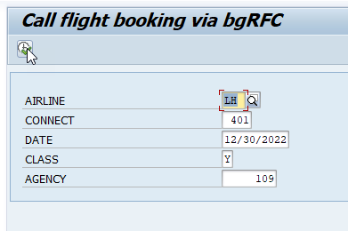

You have successfully sent in a sample request via bgRFC that you can monitor in the next step.


### Monitor RFC interface


Finally, you should test your settings and verify that the RFC monitoring is working as planned.

If you're using SAP GUI, check the results of your test in the **Interface Monitor** (transaction code `/n/AIF/IFMON`).

>If you don't see the new interface, check that your user is correctly assigned to the recipient as described in step **Assign users to recipient**.

  <!-- border -->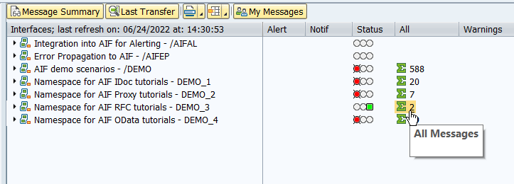

Select the summary line for your interface. You're forwarded to **Monitoring and Error Handling**, which shows your selected test message(s).

  <!-- border -->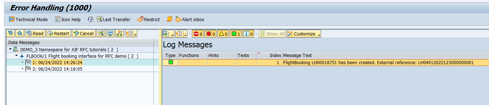

Alternatively, if you've set up Message Monitoring in the SAP Fiori launchpad, you can check the test results there. See [How to configure the SAP Fiori Apps for SAP Application Interface Framework](https://blogs.sap.com/2021/11/04/how-to-configure-the-sap-fiori-apps-for-sap-application-interface-framework/).

  <!-- border -->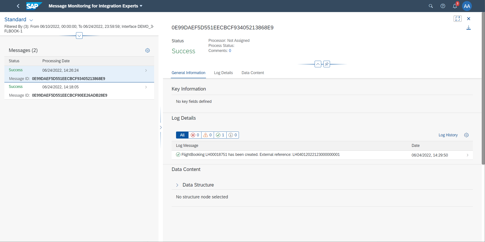

Congratulations! You've created a simple RFC interface and set up monitoring for it in SAP Application Interface Framework.  


### Test yourself


---
