## Prerequisites
 - If you are new to SAP BTP, follow the tutorial [View the SAP BTP from 10,000 Meters](cp-explore-cloud-platform).
 - If you do not have an SAP BTP account, follow the tutorial [Get a Free Account on SAP BTP Trial](hcp-create-trial-account).

## You will learn
   - How to enable SAP Alert Notification service in your SAP BTP trial account, so that you can use its features.
   - How to create an action of a type email, so that you can receive notifications to a given email.
   - How to create a condition with an event property **Category**, predicate **Is** **Equal** **To** and value **NOTIFICATION**. SAP Alert Notification service for SAP BTP uses this condition to filter all relevant events regarding notifications.
   - How to create a subscription using already created actions and conditions and receive notifications about SAP BTP events to your preferred communication channel or monitoring tool.

## Intro

### Open the SAP BTP cockpit

1. Go to your [SAP BTP cockpit landing page](https://cockpit.hanatrial.ondemand.com/). Click the **Enter Your Trial Account** button to see your global account.

    >The name of the **Enter Your Trial Account** button may vary.

    >You can use your personal CPEA enabled global account. Add the **SAP Alert Notification service** with a **free** plan to your account from the **Entitlements** section in the **SAP BTP Cockpit**. If you are not familiar with the process see [Initial Setup](https://help.sap.com/docs/ALERT_NOTIFICATION/5967a369d4b74f7a9c2b91f5df8e6ab6/812b6e3ed8934648ad15780cd51721ef.html?version=Cloud) from the SAP Alert Notification service for SAP BTP documentation.


2. The global trial account contains subaccounts. Navigate to your subaccount by clicking on the tile named 'trial'

    >The name of the subaccount may vary if you created it manually.

    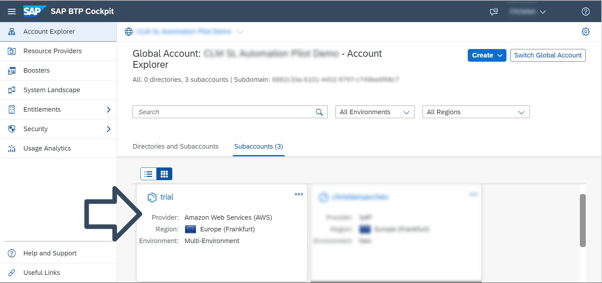

3. In the left panel, choose **Services > Service Marketplace**.

    The **Service Marketplace** is where you can find services to attach to any of your applications. These services are provided by **SAP BTP** to create and produce applications quickly and easily. Once a service has been created, it is known as a `service instance`.

    

4. Search for **Alert Notification**, and click on the **Alert Notification** tile.

    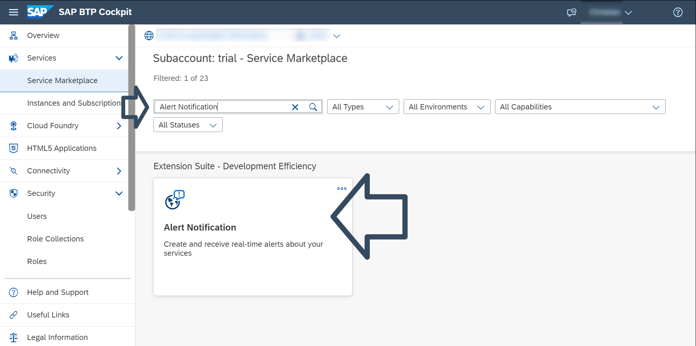

> For more information see the SAP Alert Notification service for SAP BTP documentation at [Initial Setup](https://help.sap.com/docs/ALERT_NOTIFICATION/5967a369d4b74f7a9c2b91f5df8e6ab6/812b6e3ed8934648ad15780cd51721ef.html?version=Cloud).

---

### Create an Instance and Open the SAP Alert Notification service Cockpit Page

1. Click on the **Create** button to open the **New Instance** dialog.

    

2. Before creating an **Instance** you will need to create a **Space**. You can skip this step if you already have created a **Space** in your subaccount.

    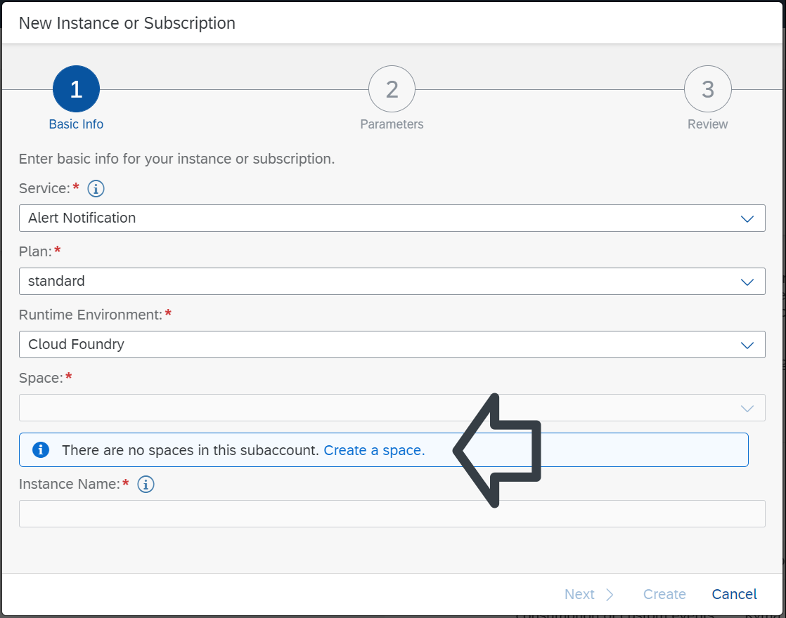

    Choose a name for your **Space** and click on the **Create** button.  

    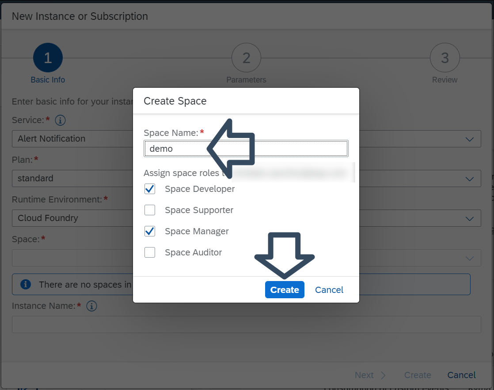


3. Enter a name for the instance and click on the **Create** button. No other configurations are needed.

    

4. To access your newly created **Instance**, choose **Instances and Subscriptions** from the left panel. Click on the **Actions** button, resembling three dots, to see your options for this particular **Instance**.

    To see the details of your **Instance** click on the arrow next to the **Actions** button.

    

5. To open the cockpit page of **SAP Alert Notification service** just click on the name of your **Instance**.

    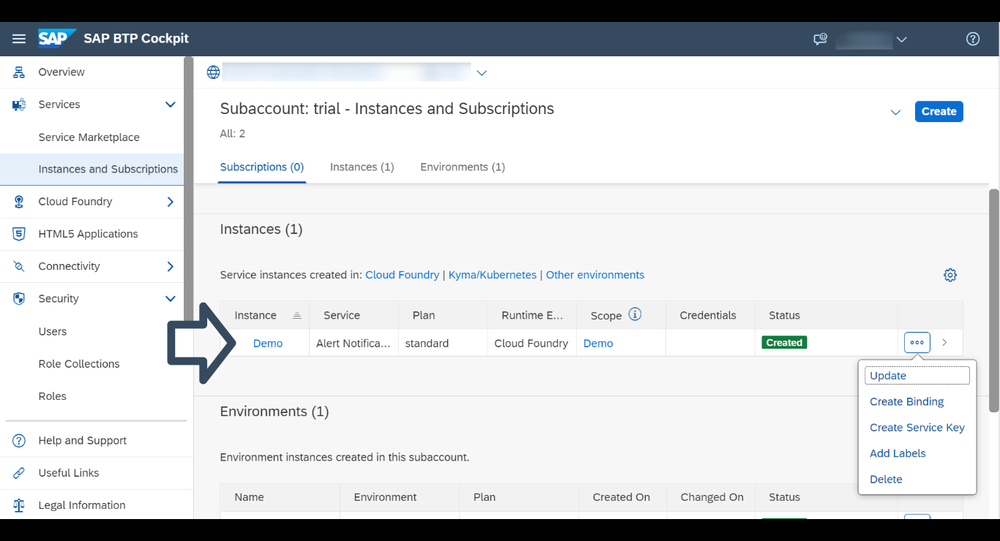


### Creatе а Service Key

1. To create a **Service Key** choose the option **Create Service Key** from the **Actions** list and enter the following:


    ``` JSON
    {
      "type": "BASIC",
      "permissions": [
             "ALERT_READ"
      ]
    }
    ```

    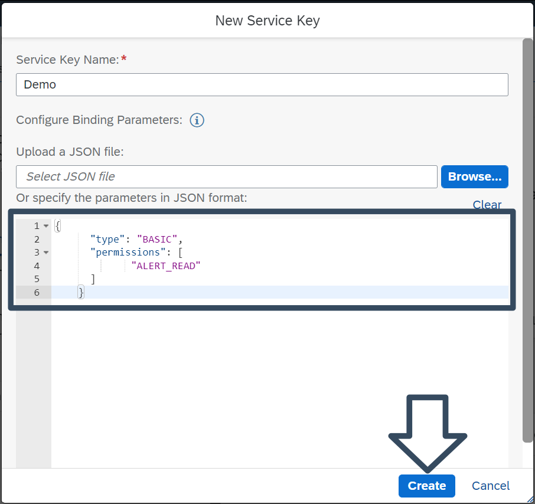

### Create an Аction of a Тype Еmail

> If you want to receive notifications to other delivery channels, see the SAP Alert Notification service documentation at [Managing Actions](https://help.sap.com/docs/ALERT_NOTIFICATION/5967a369d4b74f7a9c2b91f5df8e6ab6/8a7e092eebc74b3ea01d506265e8c8f8.html).

1. Open the **Actions** menu on the **SAP Alert Notification service** cockpit page and click on the **Create** button to open the dialog box.

    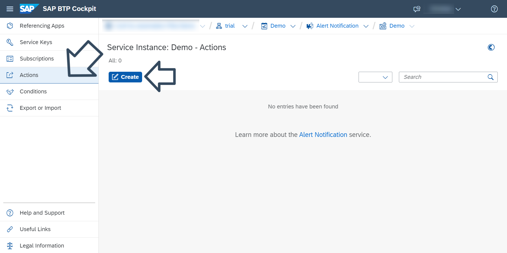

2. In the **Actions** dialog box, choose the preferred email action type and then click on the **Next** button.

    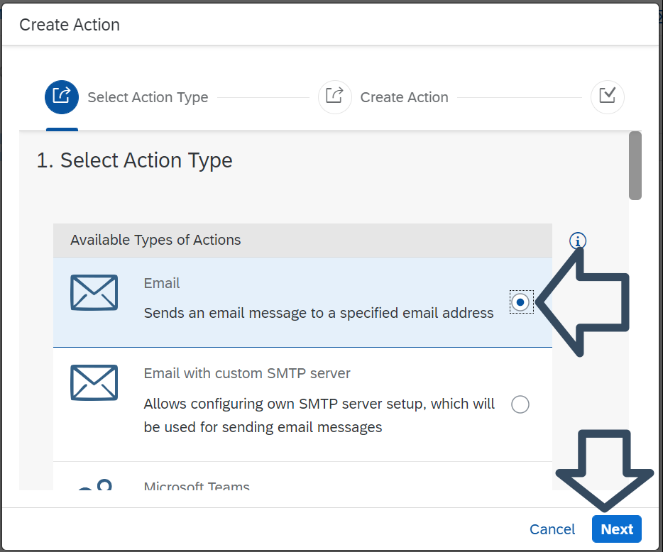

3. Enter a unique name for your action in the **Name** field.

    

4. In the **Email Address** field, enter the destination email address to which the notification must be sent and optionally provide a custom template for customizing your notification email. Then click on the **Create** button.

    

    Your newly created action is now available in the **Actions** menu in the left pane. Its initial state is **Not Confirmed**. A confirmation email with a confirmation token and a confirmation link is sent to the email address you have provided.

    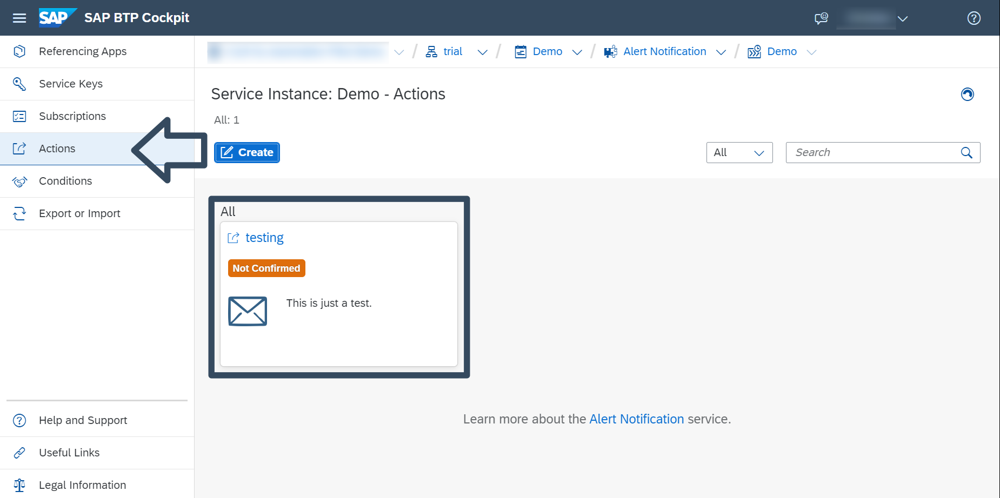

5. Open the automated confirmation email you have received. It contains the name of the action you have to confirm, a token, and a confirmation link you have to navigate to.

6. You can confirm the action in one of the following ways:

    * Using the **Actions** view:

        1. Locate and open your new action.
        2. In the overview that appears, click on the **Confirm Action** button.

            
        3. Enter the token that was sent to your email.

    * Using a confirmation link:

        1. Open the provided confirmation link that leads to the **Action Confirmation** page.
        2. Choose **Confirm**.

### Create an Action of a Type Store

> For more information see the SAP Alert Notification service for SAP BTP documentation at [Store Action Type](https://help.sap.com/docs/ALERT_NOTIFICATION/5967a369d4b74f7a9c2b91f5df8e6ab6/f7bac80425124baebbfe0ff1d50b2956.html).

1. Open the **Actions** menu on the **SAP Alert Notification service** cockpit page and click on the **Create** button to open the dialog box.

    

2. In the **Actions** dialog box, choose the **Store** action type and then click on the **Next** button.

    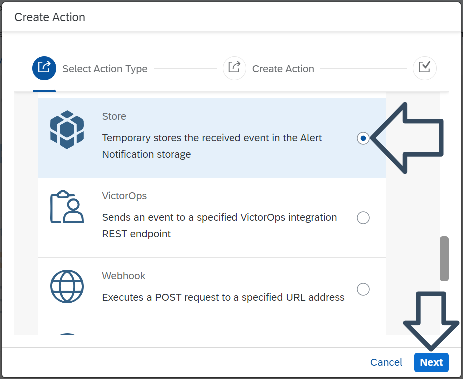

3. Enter a unique name for your action in the **Name** field and click on the **Create** button. The **Description** and **Labels** fields are optional.

    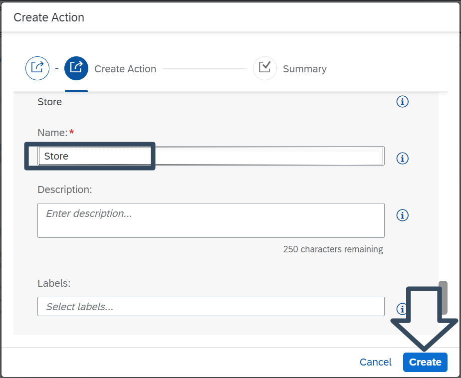

4. You will be presented with a dialog box that confirms the **Action** has been created. 

    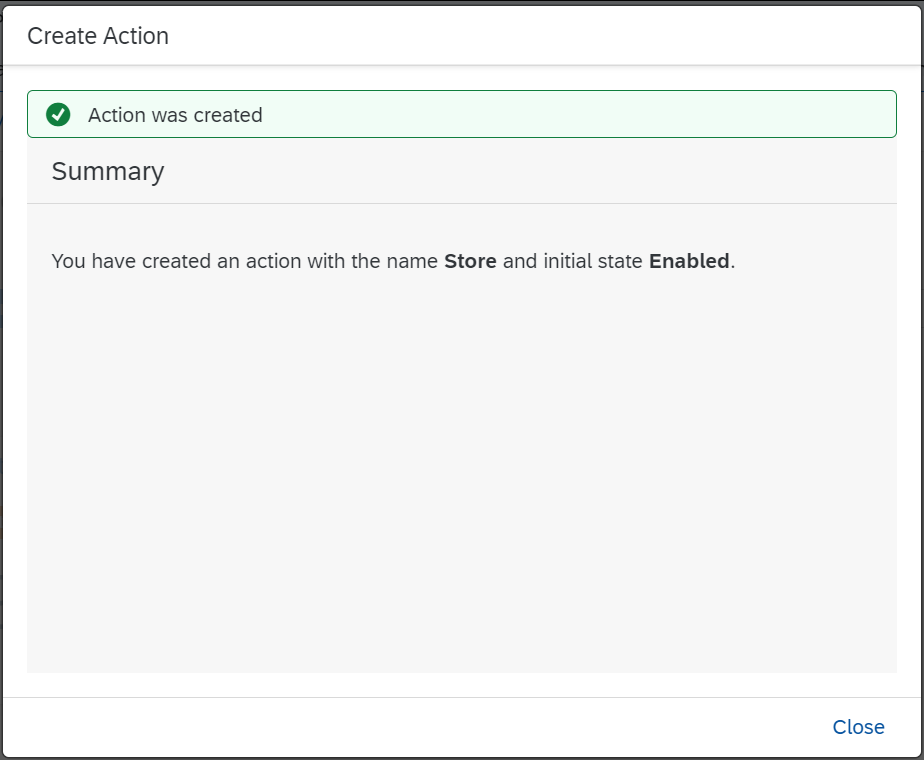

    Your newly created action is now available in the **Actions** menu in the left pane. 

    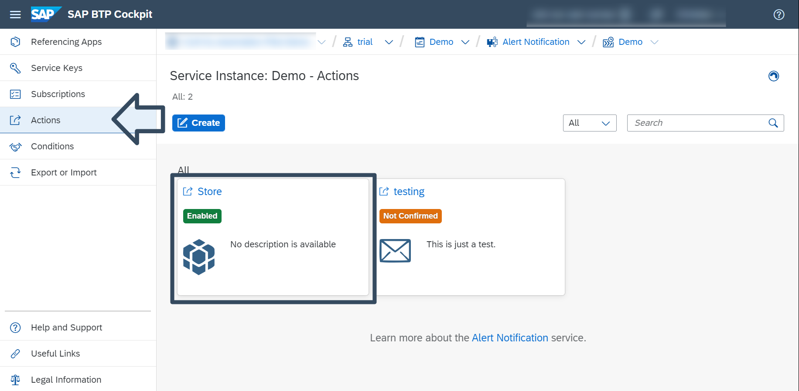

### Create a Condition

> If you want to use other conditions see the SAP Alert Notification service for SAP BTP documentation at [Managing Conditions](https://help.sap.com/docs/ALERT_NOTIFICATION/5967a369d4b74f7a9c2b91f5df8e6ab6/35ca5de101fc4d5791cdbb2df15e9d9b.html?locale=en-US).

1.	Open the **Conditions** menu on the **SAP Alert Notification service** cockpit page and click on the **Create** button.

    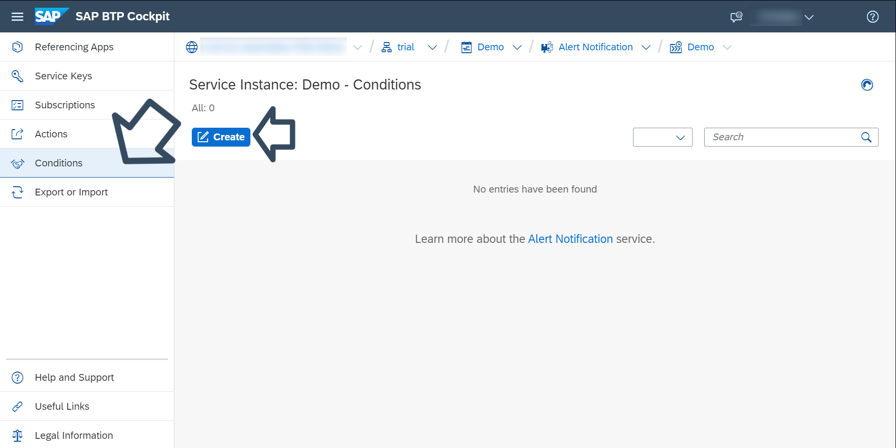

2.	Once the **Create Conditions** dialog opens, enter the following:
    * A unique name for your condition in the **Name** field.
    * [Optional] You can add additional details about the condition in the **Description** field and assign one or more labels to your condition in the **Labels** field. 
    * In the **Condition** field choose the **Category** option in the first box, **Is Equal To** in the second box, and in the third box set the value to **NOTIFICATION**. 

        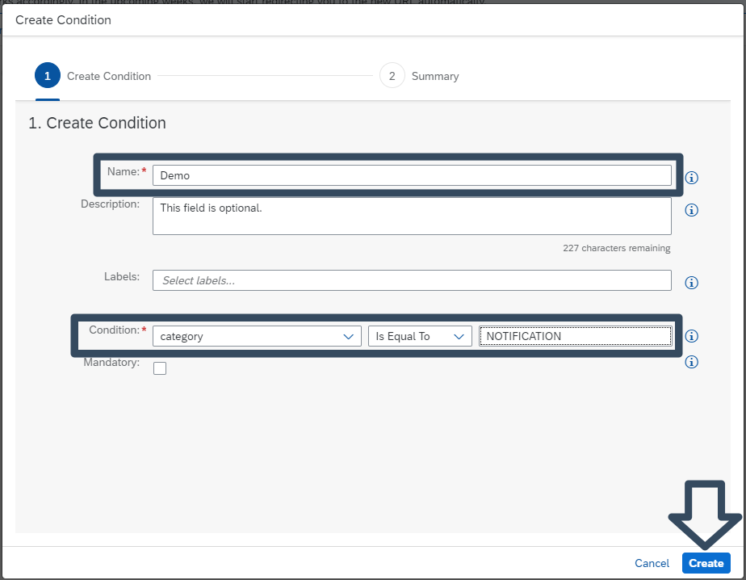
    
3. Click on the **Create** button. Your newly created condition is now available in the **Conditions** menu.

    

### Create a Subscription

> For more information see the SAP Alert Notification service for SAP BTP documentation at [Managing Subscriptions](https://help.sap.com/docs/ALERT_NOTIFICATION/5967a369d4b74f7a9c2b91f5df8e6ab6/07fd21e170c7452482c3532c5521bb90.html).

1. Open the **Subscriptions** menu on the **SAP Alert Notification service** cockpit page and click on the **Create** button to open the dialog box. 

    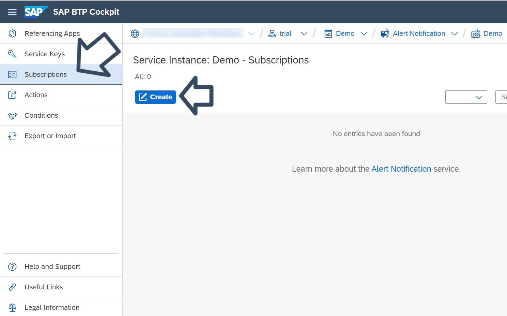

2. Once the **Create Subscription** dialog box opens, enter the following:
    * A unique name for your subscription in the **Name** field.
    * [Optional] You can add additional details about the subscription in the **Description** field and assign one or more labels to your subscription in the **Labels** field. 
    * [Optional] If you want to delay the matching of events on the subscription, set a period in the **Snooze by** field. Leave the field blank if delay is not required.
    * Click on the **Create** button.

        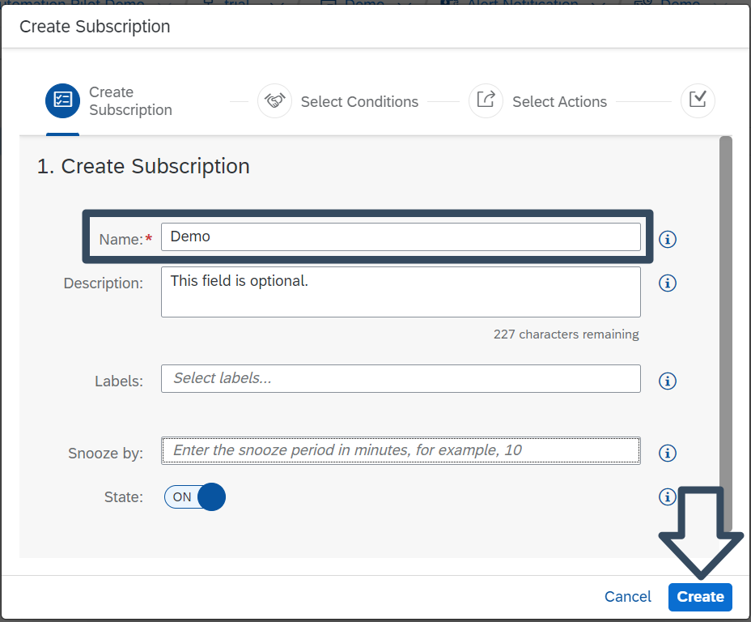

3. In the second dialog box you will be presented with the available conditions. Select a condition and click on the **Assign** button.

    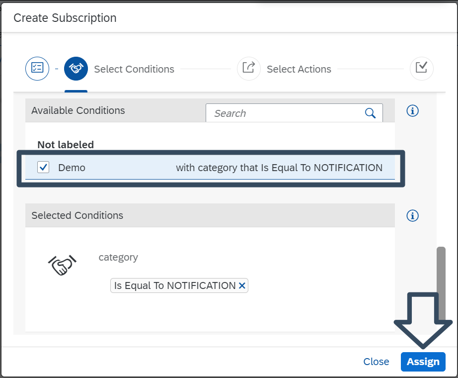

4. In the next dialog box you will be presented with the available actions. Select the actions of your choice and click on the **Assign** button once again. 

    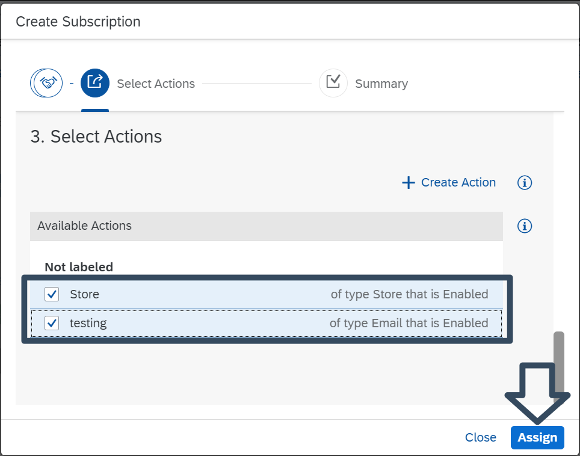

5. You will be notified your subscription was created via summary dialog box.

    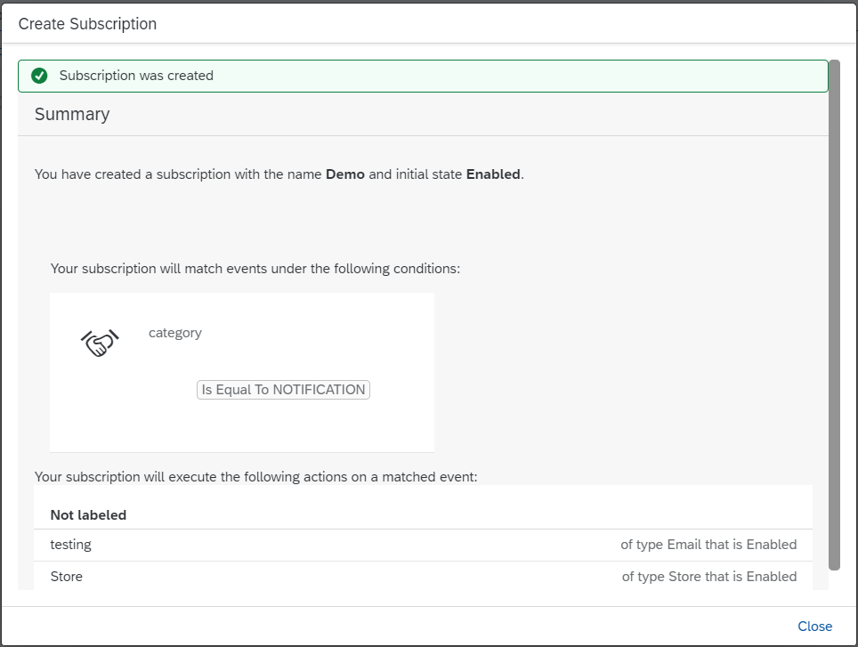

6. Close the dialog. Your newly created subscription is now available in the **Subscriptions** menu in the left pane.

    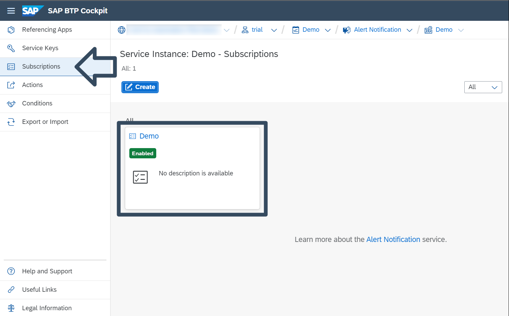

### Send Test Event

1. Open the **Subscriptions** menu on the **SAP Alert Notification service** cockpit page and click on the subscription of your choice. 

    

2. Once the subscription opens click on the **Send Test Event** button.

    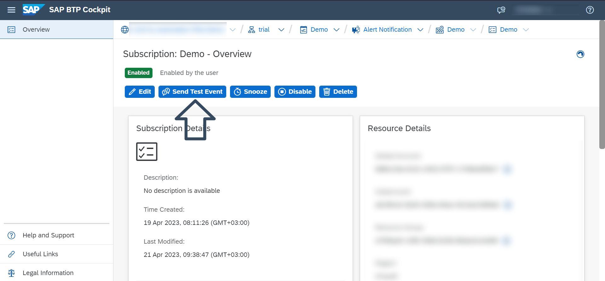

3. Enter your **Event** information and click on the **Send** button. You can either edit the existing information or copy it directly from here:
    
    ```JSON
    {
        "eventType": "MyDemoEventType",
        "resource": {
            "resourceName": "DemoApp",
            "resourceType": "app"
        },
        "severity": "INFO",
        "category": "NOTIFICATION",
        "subject": "My Demo Notification",
        "body": "Sample event body."
    }
    ```

    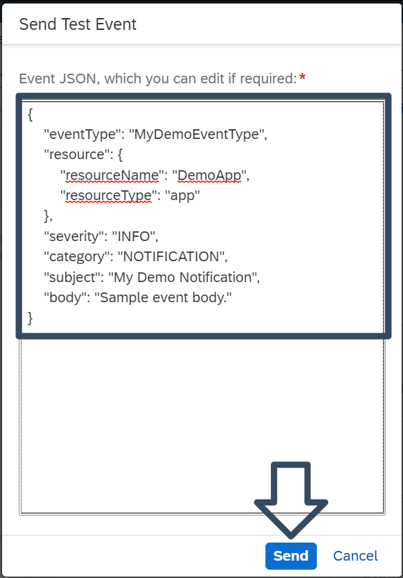

4. As a result you should receive an email similar to the one below. 

    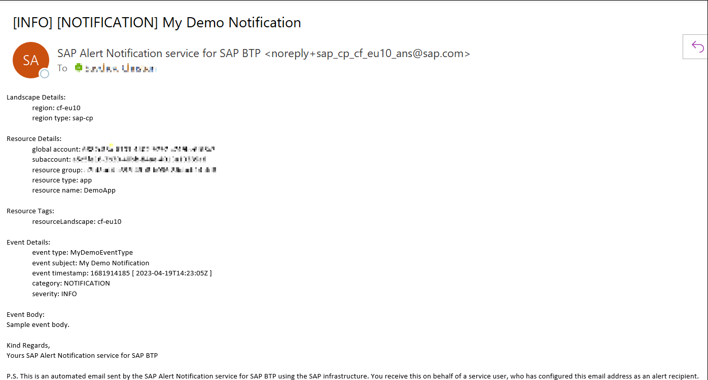

### Pull the Stored Event from Consumer API

1. Open the [Cloud Foundry Consumer API](https://api.sap.com/api/cf_consumer_api/resource/Matched_events) page and copy the endpoint path. 

    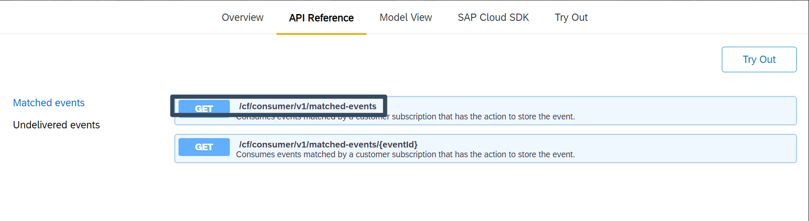


2. Open your HTTP Client of choice and follow these easy steps. For this tutorial we will be using **Postman**.

    1. Enter the provided URL and append the endpoint path you got from the [Cloud Foundry Consumer API](https://api.sap.com/api/cf_consumer_api/resource/Matched_events) to the end of the URL. 

    2. From the dropdown menu on the left choose the HTTP **GET** method. 
    
    3. Click on the **Authorization** tab below and enter your service key details in the username and password fields. 
    
    4. Click on the **Send** button.

        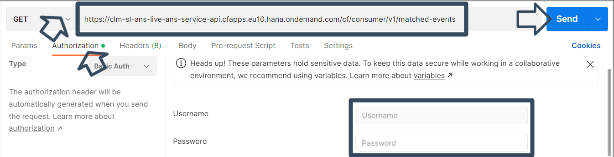

3. The end result should look something like this:

    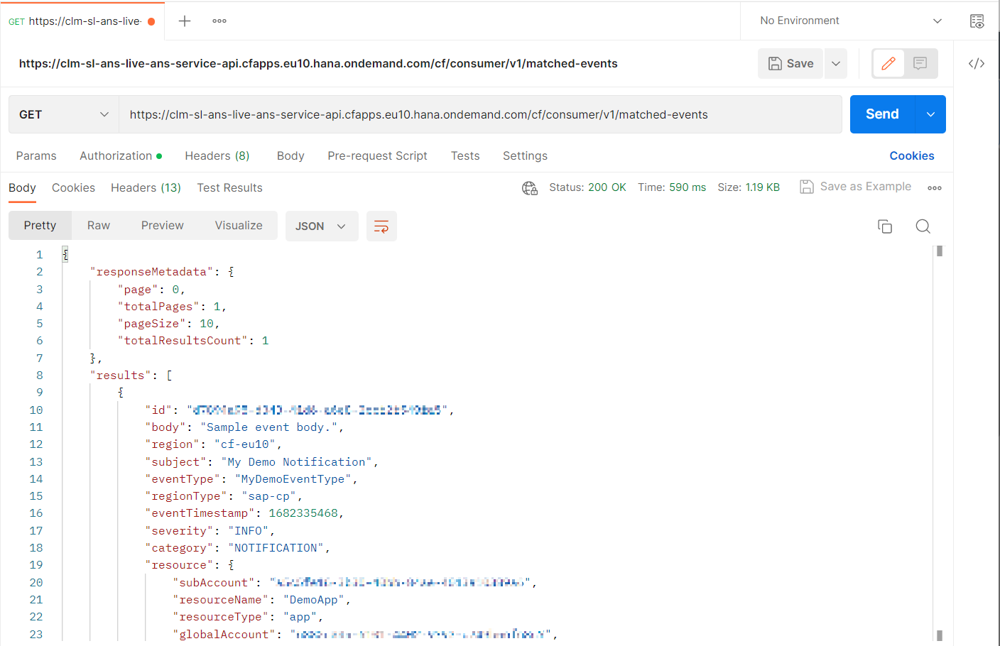


