## Prerequisites  
 - **Proficiency:** Beginner 
 - **Tutorials** Step #5 [Add OData to the application](http://www.sap.com/developer/tutorials/angular-add-odata.html)

## Next Steps
 - **Tutorials** Step 7 [Add a Form to your application](http://www.sap.com/developer/tutorials/angular-forms-intro.html)  

## Details
### You will learn  
In this tutorial series, we will explore another technology for Single Page Application (SPA) development - AngularJS (or just Angular).  Angular is a popular web framework in North America, and is used by many companies for both internal and client-facing systems.  These tutorials will parallel our SAPUI5 tutorials, building a visual interface using Angular, and connecting it to an OData back end service.

### Time to Complete
**15 Min**.

---
#### AngularJS series
**Step 6**: Add additional screens to our Angular application.  First, we will add a header to our list box, and second, we will add a Detail dialog box when the user clicks on a row.

---

### Add a header to our list

The list on the screen is nice, but it would be better if it had a header describing the data below.  We can add that header bar in Bootstrap.  (Later, we will add to that header bar, and put in an automatic filter component.)

1.  To add a simple title to our list, we start with a `navbar`.  The `navbar` CSS tag puts a permanent "floating" header on the top of the page, which will not move when the page is scrolled.

    Add the following HTML to your `index.html` file, under the `<body>` tag:
    
    ```html
    <nav class="navbar navbar-default navbar-fixed-top">
    	<div class="container">
    		<div class="navbar-header">
    			<div class="navbar-brand">Product Overview</div>
    		</div>
    	</div>
    </nav>
    ```
    >Don't forget to save your file!
    
    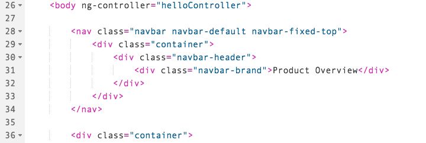

2.  Now, if you run your application, you will find a navigation bar at the top.  Unfortunately, it covers the first row of the list.

    

3.  To fix this, we are going to add some CSS to move the body text.  

    Add this CSS to the top of the `main.css` file
    
    ```css
    body {
       padding-top: 50px;
    }
    ```
    
    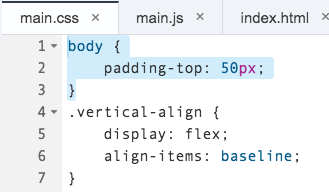
    
4.  Run your application again.  The header will now appear at the top, and will not cover anything

    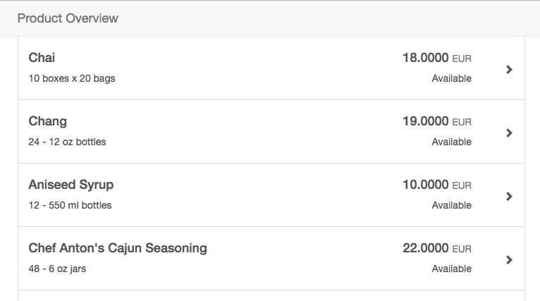

5.  Next, let's add some additional dynamic information to our header.  

    On the right side, we will add the length of the current list
    
    Add the following HTML to your `index.html` file
    
    ```html
    <div class="nav navbar-nav navbar-right">
    	<p class="navbar-text">Items: {{productList.length}}</p>
    </div>
    ```
    
    > The `length` parameter is a part of JavaScript.  All arrays have this property.

    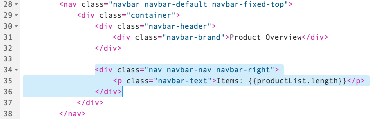
    
6.  Run the application, and you will see the item count in the navigation bar.

    

### Add a dialog box with product details

When you click on a product, the application should respond with the details of that product.  For our example, we will use a dialog box to show the details of the clicked item.

1.  First, we need to add a [Bootstrap Modal dialog box](https://getbootstrap.com/javascript/#modals) to our HTML page.  

    A modal dialog box looks complicated, but it's not.  It's broken up in to three sections:  the header, the body, and the footer.  We will add the HTML for all three at the same time, and then modify it.
    
    Start by adding this HTML to your `index.html` file, at the bottom after the last `</div>`, but before the closing `</body>` tag
    
    ```html
    <div class="modal fade" tabindex="-1" role="dialog" id="product-detail">
    	<div class="modal-dialog modal-lg" role="document">
    		<div class="modal-content">
    			<div class="modal-header">
    				<h4 class="modal-title">Title</h4>
    			</div>
    			<div class="modal-body">
    				<p>Modal body</p>
    			</div>
    			<div class="modal-footer">
    				<button type="button" class="btn btn-default" data-dismiss="modal">Close</button>
    			</div>
    		</div><!-- /.modal-content -->
    	</div><!-- /.modal-dialog -->
    </div><!-- /.modal -->
    ```

    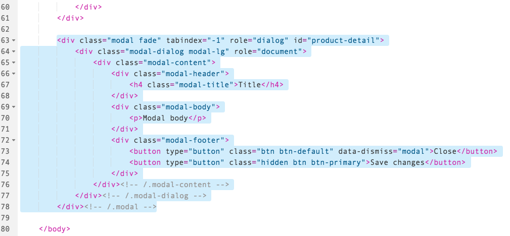
    
2.  Next, we will add some JavaScript to our page to activate the modal, when a row is clicked.

    Open your `main.js` file, and add the following JavaScript to the bottom of the `helloController` function:
    
    ```javascript
    $scope.selectedProduct = {};
    $scope.selectProduct = function( product ) {
    	$scope.selectedProduct = product;
    	$('#product-detail').modal("show");
    }
	``` 
    > These lines do two things.  
    >
    > The first line sets up a scope variable called `selectedProduct`. This gives us a place to store the product that was clicked, so the dialog box knows what to display.
    >
    > The second variable is a function.  This will be called when a row is clicked.
    
    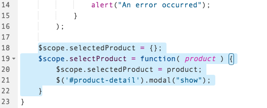
    
3.  Finally, we need to attach the Angular code to the HTML, when the user clicks on an object.  To do this, we will use another built-in Angular function, called `ng-click`.
    
    Modify the following attribute to your `<button>` element:
    
    ```html
    ng-click="selectProduct(product)"
    ```

    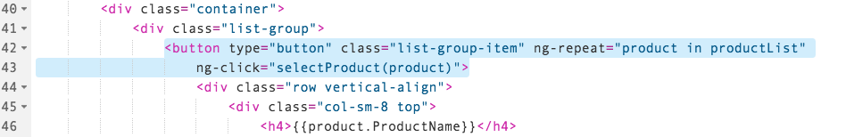

4.  Now run your application.  When you click on a row, a dialog box will appear.

    

### Add data to the dialog box
The `ng-click` attribute has sent the selected row to the function `selectProduct()` in our controller.  Then we saved that passed variable in to our scope (as `$scope.selectedProduct`).  Now we can use that variable to populate our modal dialog box.

1.  Update the header of the dialog box.  Replace the existing `<h4>` tag with the following HTML:

    ```html
    <h4 class="modal-title">Product Detail - {{selectedProduct.ProductName}}</h4>
    ```

    > You can run the project after each step, to see what changes in the dialog box..

    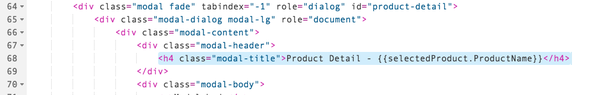

2.  Let's add a close button to the top of the dialog box, too.  Add the following line to the HTML **above** the new `<h4>` tag:

    ```html
    <button type="button" class="close" data-dismiss="modal" aria-label="Close">
    	<span aria-hidden="true">&times;</span>
    </button>
    ```

    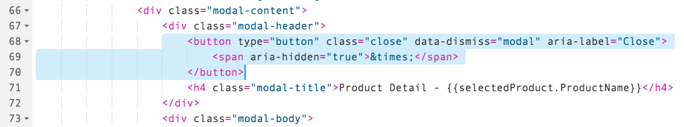

3.  Now, let's add the content to the body of the box.  Add the following HTML to the box inside the `<div class="modal-body">` tag:

    ```html
    <p>Product Name: {{selectedProduct.ProductName}}</p>
    <p>Unit Price: {{selectedProduct.UnitPrice}}</p>
    <p>Status: {{selectedProduct.Discontinued == true ? "Discontinued":"Available" }}</p>
    <p>Category: {{selectedProduct.CategoryID}} </p> 
    ```

    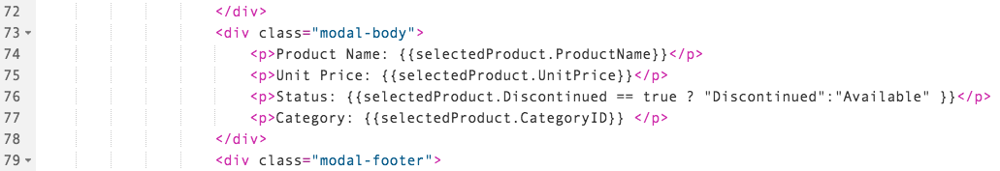

4.  Now run your application.  When you click on a row, you will see this dialog appear:
    
    >Doesn't look great, though.  We will make it look better in the next tutorial, when we cover Bootstrap forms!

    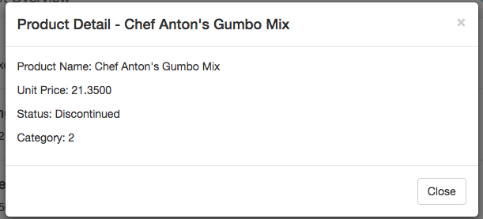

## Additional Information

#### Bootstrap

- [`navbar`](https://getbootstrap.com/components/#navbar) - Put a navigation bar on the page
- [`modal`](https://getbootstrap.com/javascript/#modals) - to display a modal dialog.

#### Angular
- [`ng-click`](https://docs.angularjs.org/api/ng/directive/ngClick) - Route a click event to an Angular function.

## Next Steps
 - **Tutorials** Step 7 [Add a Form to your application](http://www.sap.com/developer/tutorials/angular-forms-intro.html) 
