## Prerequisites  
- **Proficiency:** Beginner
#### AngularJS Series
- **Tutorials** Step 2 [Create the Bootstrap Template](https://www.sap.com/developer/tutorials/angular-bootstrap-template.html)

## Next Steps
- **Tutorials** [Separate the JavaScript and CSS Files](https://www.sap.com/developer/tutorials/angular-separate-files.html)

## Details
### You will learn  
In this tutorial series, we will explore another technology for Single Page Application (SPA) development - AngularJS (or just Angular).  Angular is a popular web framework in North America, and is used by many companies for both internal and client-facing systems.  These tutorials will parallel our SAPUI5 tutorials, building a visual interface using Angular, and connecting it to an OData back end service.

---

#### AngularJS series
Add AngularJS to our web application.  We will introduce the angular *module* and *controller* to our mix, and show how they can be used to control the data in an application.

---


[ACCORDION-BEGIN [Step 1: ](Add Angular to your application)]

Open the Web IDE, and then open your `index.html` page.

We need to add Angular to our application.  Add the following to the `<head>` section of your HTML page:

```html
<script src="https://ajax.googleapis.com/ajax/libs/angularjs/1.5.8/angular.js"></script>
```

> **`Angular.JS versions`**.  We are using version 1.5.8, but you can use a later release of Angular 1.  The new Angular 2 is about to be released, however, this tutorial is not yet updated for Angular 2.

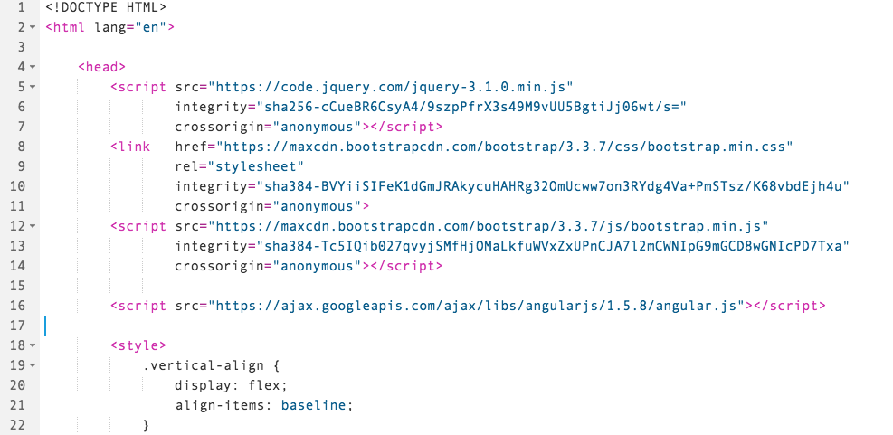


[ACCORDION-END]

[ACCORDION-BEGIN [Step 2: ](Update head element)]

Next, update the `<head>` element to tell the browser the text we will be using.  Add the following HTML:

```html
<meta charset="UTF-8">
<meta name="viewport" content="width=device-width, initial-scale=1">
```

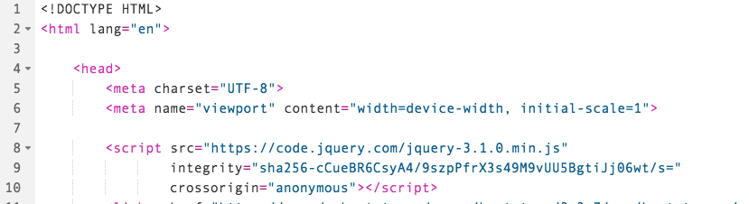


[ACCORDION-END]

[ACCORDION-BEGIN [Step 3: ](Add initial JavaScript element)]

Next, we will create a JavaScript section to define our application.  In this example, we will put the code in our `index.html` file, for convenience.  Later, we will move this over to a separate file, which is the standard convention for working with large JavaScript applications.

Add a `<script>` element to the `<head>` of your document.

>**WARNING** The placement of this script element is critical!  The script must be **after** the "import" of your Angular code.

```html
<script>

</script>
```

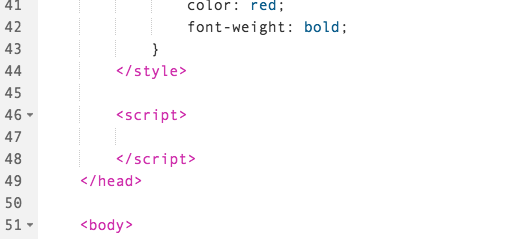


[ACCORDION-END]

[ACCORDION-BEGIN [Step 4: ](Add test data)]

Now, let's add some dummy test data to our script.  Add this code inside the `<script>` element:

```javascript
var testData = [
{
	ProductName: "Test Product 1",
	QuantityPerUnit: "100 units per box",
	UnitPrice: "49.75",
	Discontinued: false
},
{
	ProductName: "Test Product 2",
	QuantityPerUnit: "20 cases per pallet",
	UnitPrice: "168.77",
	Discontinued: false
},
{
	ProductName: "Test Product 3",
	QuantityPerUnit: "20 per box, 20 boxes",
	UnitPrice: "4953.75",
	Discontinued: false
},
{
	ProductName: "Test Product 4",
	QuantityPerUnit: "65 individually wrapped",
	UnitPrice: "112.50",
	Discontinued: true
}
];
```

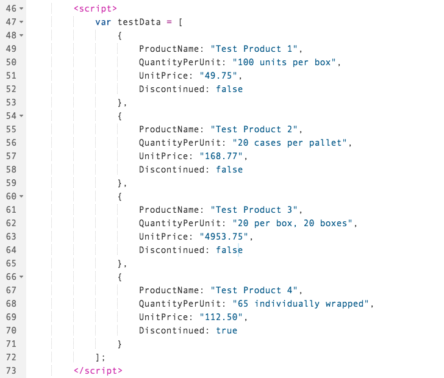


[ACCORDION-END]

[ACCORDION-BEGIN [Step 5: ](Add Angular module and controller)]

Next, we will add an Angular *module* and *controller* to the `<script>` tag.

The Angular *module* is the gathering point of many different Angular systems.  A module pulls all of those components together in to a single place.  

The Angular *controller* is one of those pieces.  It defines custom functions and variables which are used inside of a particular *scope*.  

In this simple application, we will use a single controller and a single scope for the entire tutorial.  When your application becomes more complex, with multiple screens, you may choose to separate the different sections in to different controllers, and if it is big enough you may choose to have different modules for different sections.  Angular allows you to divide this up, so that a variable, a function, or another Angular component used on one screen does not appear everywhere else.  And, if you have a large application, with hundreds of variables, this makes keeping track of everything much easier.

Add the following code to the bottom of your `<script>` tag:

```javascript
angular.module("helloWorld",[])
  .controller('helloController', helloController);

function helloController($scope){
  $scope.productList = testData;
}
```
>What does this do?  In our application, we have defined a controller.  Then, we have asked Angular to give us access to the `$scope`, which is the set of variables and functions available to our application.  Finally, we have attached our `testdata` to the `$scope`, which makes the test data visible to the local application.


[ACCORDION-END]

[ACCORDION-BEGIN [Step 6: ](Run the application)]

Run the application.  Nothing looks different, yet, because we haven't attached the data to the HTML.  That happens next.

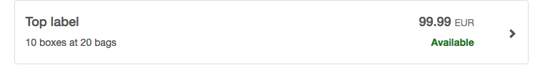


[ACCORDION-END]

[ACCORDION-BEGIN [Step 7: ](Connect the test data)]

Now, let's connect the `testdata` to our view.

First, we need to set up the Angular application.  The application uses the name of the module for our page, which we called `helloWorld`.  

Change the `<html>` tag, at the top of your file, to add the attribute `ng-app="helloWorld"`.

```html
<html ng-app="helloWorld" lang="en">
```

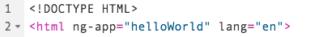


[ACCORDION-END]

[ACCORDION-BEGIN [Step 8: ](Add attribute for controller)]

Next, we have to tell the application which *controller* to use, and where it goes.  The controller we defined is called `helloController`.  We will add it to our `<body>` tag, so that it can be used in our entire HTML body.  

Add the attribute `ng-controller="helloController"` to the `<body>` tag:

```html
<body ng-controller="helloController">
```

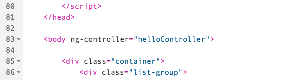


[ACCORDION-END]

[ACCORDION-BEGIN [Step 9: ](Add an Angular view)]

In order to view data, we use Angular **views**.  To inject a variable directly in to the HTML, we use the double curly brackets:  `{{ }}`.

Find the `<h4>` tag where the product name goes (it's currently called `Top Label`), and replace it with the following HTML and Angular:

```html
<h4>{{productList[0].ProductName}}</h4>
```

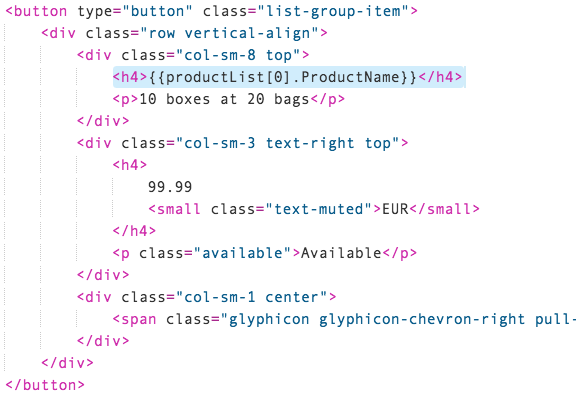


[ACCORDION-END]

[ACCORDION-BEGIN [Step 10: ](Run the application)]

Now run your application.  The text of the label should now read `Test Product 1`.


[ACCORDION-END]

[ACCORDION-BEGIN [Step 11: ](Loop through the data)]

We have added a field, but we have more than one row of data to display.  To do this, we will use the `ng-repeat` module of Angular.  This powerful attribute tells our code to loop across all of the elements in our array.  `ng-repeat` has more options, [check out the documentation for more details.](https://docs.angularjs.org/api/ng/directive/ngRepeat)

To set up the repeat, find the outermost item where the repeat starts.  Add in the `ng-repeat` tag to that item.

In our case, we want to add `ng-repeat="product in productList"` to our `<button>` tag:

```html
<button type="button" class="list-group-item" ng-repeat="product in productList">
```

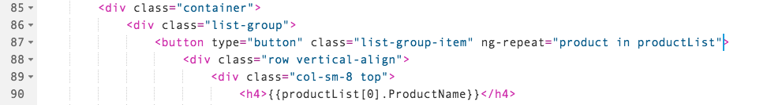


[ACCORDION-END]

[ACCORDION-BEGIN [Step 12: ](Bind H4 element)]

Next, change the first `<h4>` tag to use the new array variable.  

```html
<h4>{{product.ProductName}}</h4>
```

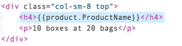


[ACCORDION-END]

[ACCORDION-BEGIN [Step 13: ](Run the application)]

Run your application.  You will see four items appear, with four different product names

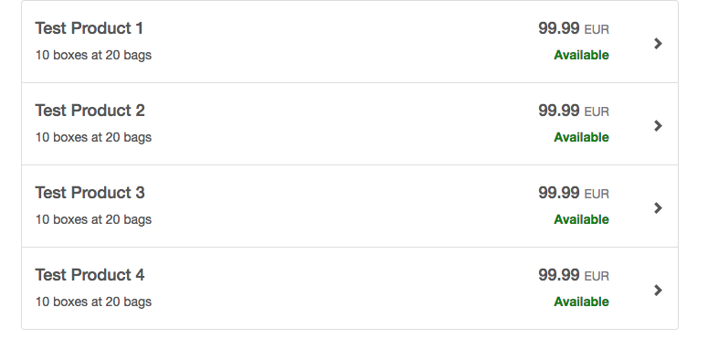


[ACCORDION-END]

[ACCORDION-BEGIN [Step 14: ](Bind fields to view)]

Now, update the rest of the fields to use the same **view** injection on the rest of the fields.  

Modify the code inside your first `<div>` to

```html
<h4>{{product.ProductName}}</h4>
<p>{{product.QuantityPerUnit}}</p>
```

And inside your second `<div>` to:

```html
<h4>
  {{product.UnitPrice}}
  <small class="text-muted">EUR</small>
</h4>
<p>{{product.Discontinued}}</p>
```

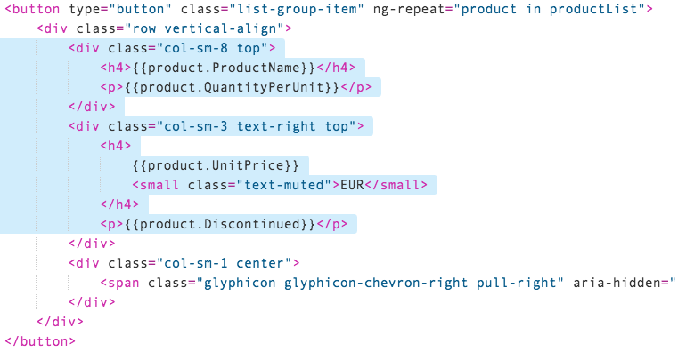


[ACCORDION-END]

[ACCORDION-BEGIN [Step 15: ](Run the application)]

Now run your application.  All the fields should be directly from the test data.

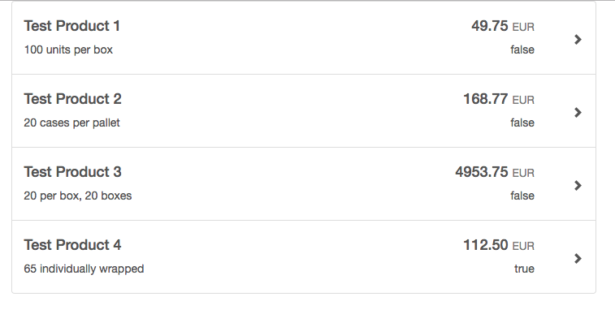


[ACCORDION-END]

[ACCORDION-BEGIN [Step 16: ](Add logic to views)]


Angular **views** are very powerful, because they don't just take variable names.  You can also use logic to control what is displayed.

In our list, we have a boolean called `Discontinued`.  But we don't want to display true or false, we would like to use a label.  It's easy to fix that.

Find the line with the ``{{product.Discontinued}}`` and add boolean logic to it.

```html
<p>{{product.Discontinued == false ? "Available" : "Discontinued"}}</p>
```

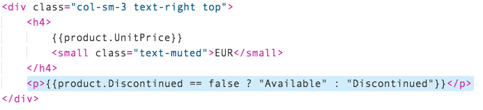


[ACCORDION-END]

[ACCORDION-BEGIN [Step 17: ](Run the application)]

Run your application.  It will change the text from true or false to Available or Discontinued:

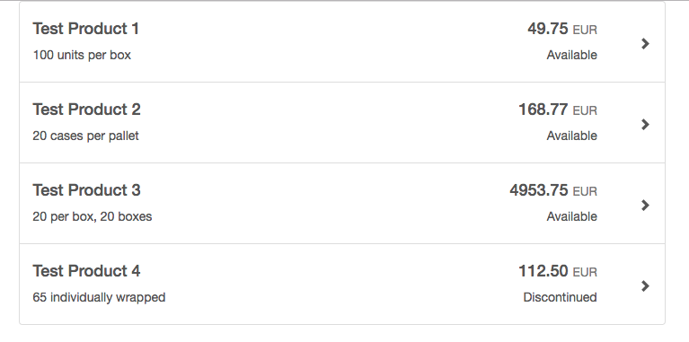


[ACCORDION-END]

[ACCORDION-BEGIN [Step 18: ](Review additional information)]

AngularJS:

- [Google Hosted Libraries](https://developers.google.com/speed/libraries/) - find a number of hosted web libraries, which can be loaded directly in your application without requiring a download.

- [`ng-repeat`](https://docs.angularjs.org/api/ng/directive/ngRepeat) - the AngularJS loop function


[ACCORDION-END]
