## Prerequisites  
 - **Tutorials:** [Bootstrap Forms](https://www.sap.com/developer/tutorials/angular-forms-intro.html)

## Details
### You will learn  
In this tutorial series, we will explore another technology for Single Page Application (SPA) development - AngularJS (or just Angular).  Angular is a popular web framework in North America, and is used by many companies for both internal and client-facing systems.  These tutorials will parallel our SAPUI5 tutorials, building a visual interface using Angular, and connecting it to an OData back end service.

### Time to Complete
**15 Min**.

---
#### AngularJS series
Start working with other Angular components, starting with the [AngularJS Filter](https://docs.angularjs.org/api/ng/filter/filter).  In this tutorial, we will:

 - Convert a number into a currency
 - Create a filter for our list
 - Write a custom filter for Available and Discontinued


### Convert a number into a Currency

We start by looking at our current list of items.  The currency is currently displayed with four decimal places.  This is how the data comes from the [OData repository](http://services.odata.org/ODataAPIExplorer/ODataAPIExplorer.html).

To fix it, we will use an inline filter.  These filters are a part of the core Angular service.  [Here is a complete list of the AngularJS filters you can use](https://docs.angularjs.org/api/ng/filter).

1.  Open the `index.html` file, and scroll down to the `<div class="list-group">` area.

    In the line `{{product.UnitPrice}}` area, change the line to the following:

    ```HTML
    {{product.UnitPrice | currency}}
    ```
    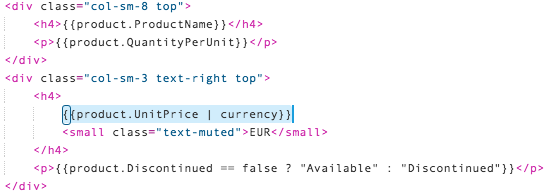

2.  Now run the application.  You will see the price changes.

    >**IMPORTANT** In this image, the currency is in US Dollars.  But, if you live somewhere else, this will be in your local currency!  The [currency filter](https://docs.angularjs.org/api/ng/filter/currency) from Angular defaults to your local currency symbol.

    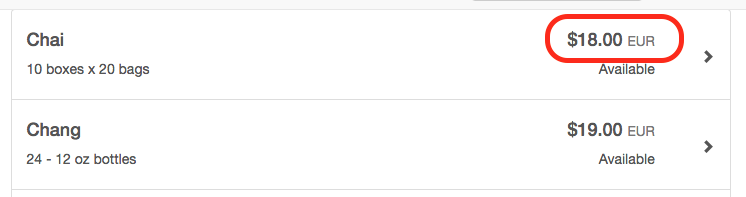

3.  The price is currently in your local currency (in the image, US Dollars $), but we want to use Euro (€).

    To choose a specific currency type, add a parameter at the end of currency, like this:

    ```HTML
    {{product.UnitPrice | currency:"€"}}
    ```

    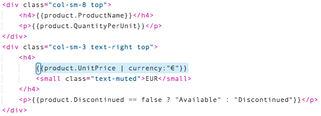

4.  Now run the application, and the prices will all list as Euro.

    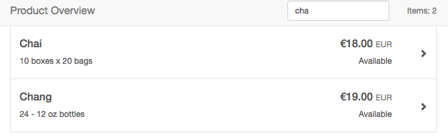

5.  We should also update the Unit Price in our dialog box.  Scroll down in the file, until you get to the `modal-body` section.  Replace the `selectedProduct.UnitPrice` section with the following:

    ```html
    <p class="form-control-static">{{selectedProduct.UnitPrice  | currency:"€"}}</p>
    ```
    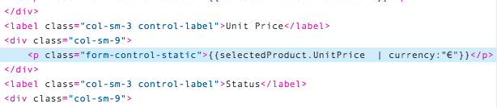

6.  Now run your application, and choose an item.  The dialog box should now show a currency:

    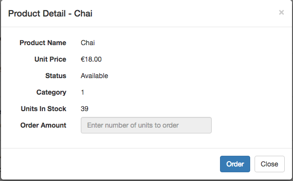

### Create a filter for our list

Now we will add a "filter" text input field box to the top of our list.  This text input will filter our list dynamically, only showing items that match the text in the input.

To do this, we will use another standard Angular feature called [filter](https://docs.angularjs.org/api/ng/filter/filter).  And we will then use another feature inside of Angular, which dynamically modified arrays.

1.  First, we need to create a text input box in our header.  Open the `index.html` file, and scroll down to the `<nav class="navbar navbar-default navbar-fixed-top">` element.  

    In that element, **replace** the entire section starting with `<div class="nav navbar-nav navbar-right">` with this new HTML:

    ```HTML
    <div class="collapse navbar-collapse">
    	<ul class="nav navbar-nav navbar-right">
    		<li class="navbar-form form-group">
    			<input type="text" class="form-control" placeholder="Filter" ng-model="productFilter">
    		</li>
    		<li>
    			<p class="navbar-text">Items: {{productList.length}}</p>
    		</li>
    	</ul>
    </div>
    ```

    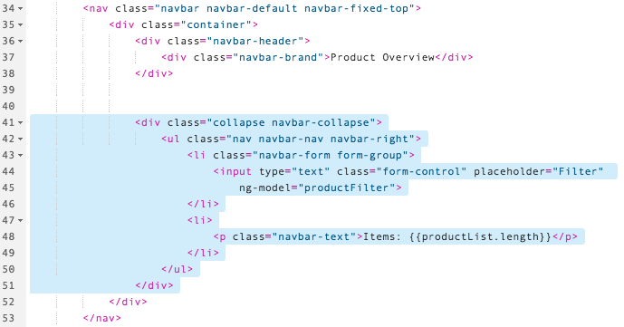

2.  Next, we will add the field `productFilter` to our `$scope`.  Open the `main.js` file, then scroll down a few lines.  This will attach the input text field to a variable in JavaScript that we can use later.  Insert the following JavaScript line:

    ```javascript
    $scope.productFilter = undefined;
    ```

    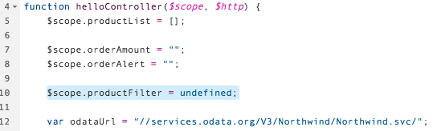

3.  Finally, we need to set up the filter.  Go back to the `index.html` file, and scroll down to the `<div class="container-fluid">` tag.  Under that tag you will see a `<button>` tag.  Update the `ng-repeat` attribute to look like this:

    ```javascript
    ng-repeat="product in productList | filter:productFilter
    ```

    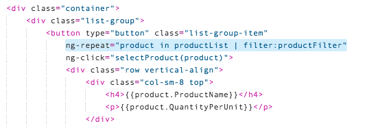

4.  Run your application.  The title bar should have a new text input field, like this:

    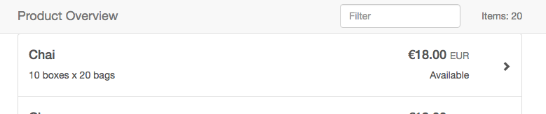

    If you type in a few characters, you will see the list dynamically change.

    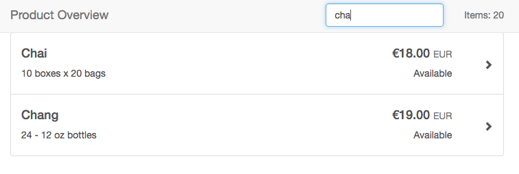

### Fix the item count

Only one problem.  Now, our Items count, in the title bar, isn't correct!  

The item count is still showing the number of total items, not the number of items after filtering.  To fix this, we will update the item count with a function that counts only the filtered items.

1.  First, we will define a function that counts the number of visible items.

    Open your `main.js` file.  At the end of the file, add the following function:

    ```javascript
    $scope.itemCount = function() {
		var	count = $filter('filter')($scope.productList, $scope.productFilter).length;
		return count;
	}
	```

	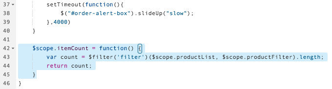

2.  Next we need to display this new count.  

    Open the `index.html` file, and scroll down to the `<nav>` section, to the line `<p class="navbar-text">`.  Replace the `productList.length` with the following new HTML

    ```javascript
    itemCount()
    ```

    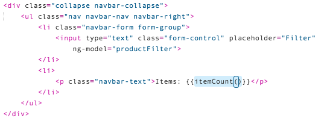

3.  Now run your application.  As you type in a filter, the item count will change as the list changes

    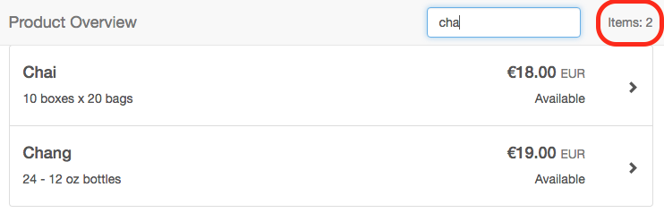

### Write a custom filter for Available/Discontinued

Next, we will replace our logic in the HTML with a new *Discontinued* custom filter.  

This filter will take the boolean value in our `product.Discontinued`, and turn it in to a word.  Although the current logic works fine (and is widely used), this will give you an example of a custom filter.

1.  Start by adding the filter to your Angular module definition.  

    Open the `main.js` file, and in the top, add the following code:

    ```javascript
    .filter('discontinued', discontinuedFilter);
    ```

    > **IMPORTANT!** Don't forget to remove the semicolon from the line above this one!  

    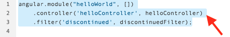

2.  Next, we will add the filter function.  Scroll to the bottom of the file, and add the following JavaScript:

    ```javascript
    function discontinuedFilter(){
    	return function(input){
    		return input ? 'Discontinued' : 'Available';
    	};
    }
    ```

    

3.  Finally, we need to modify the HTML code to use the new filter.

    Open your `index.html` file, and scroll down to the `<button>` section.  Replace the `product.Discontinued` logic with the following line:

    ```HTML
    <p>{{product.Discontinued | discontinued}}</p>
    ```

    

4.  Scroll down to the modal dialog.  In the line that starts with `{{selectedProduct.Discontinued`, replace the HTML with the following:

    ```HTML
    {{selectedProduct.Discontinued | discontinued}}
    ```

    

5.  Now run your application.  The text should be exactly the same, but the new filter will be doing all the work.

    

### Adding the CSS style back to the Discontinued label

Remember in our early application, the *Available* and *Discontinued* label were both colored.  We want to put that back.  To do that, we will modify our filter to add a style class.


1.  Open your `index.html` file, and scroll down to the `<div class="list-group">` section.  Find the line that displays the Discontinued state (`<p>{{product.Discontinued | discontinued}}</p>`) and replace it with this new HTML:

    ```HTML
    <p ng-class="product.Discontinued ? 'discontinued' : 'available'">
    	{{product.Discontinued | discontinued}}
    </p>

    ```

    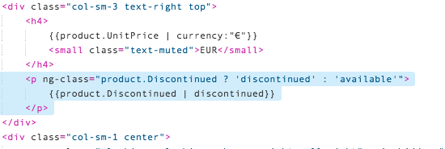

2.  Run your application.  You should see the words *Available* and *Discontinued* appear in green and red.

    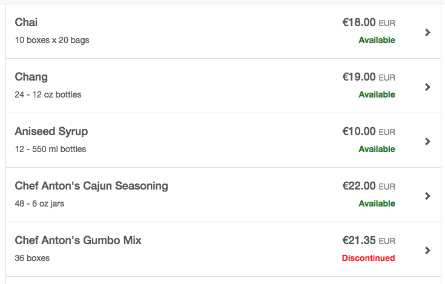

3.  Now, we also want to modify the dialog box.  If a product is discontinued, it should appear in red.  

    Scroll down your `index.html` file, until you reach the `modal-body` section.  Replace the `<p>` element above the discontinued section with the following HTML:

    ```HTML
    <p class="form-control-static" ng-class="{discontinued: selectedProduct.Discontinued}">
    ```

    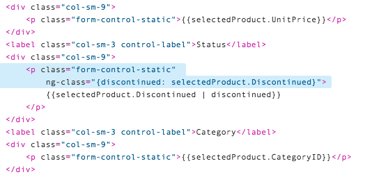

4.  Now run your application.  Select a *discontinued* product (for example, *Chef Anton's Gumbo Mix*), and you will see the *Discontinued* text in the dialog box will also be red.

    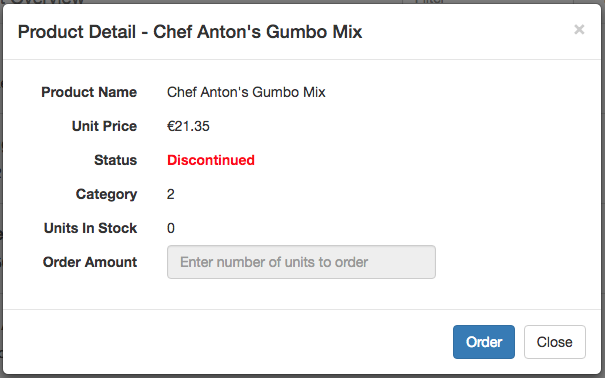


## Additional Information

#### AngularJS
- [Currency filter](https://docs.angularjs.org/api/ng/filter/currency)
- [Creating filters in your AngularJS module](https://docs.angularjs.org/tutorial/step_11)
- Dynamic CSS class in HTML: [`ng-class`](https://docs.angularjs.org/api/ng/directive/ngClass) directive.  


