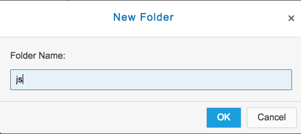
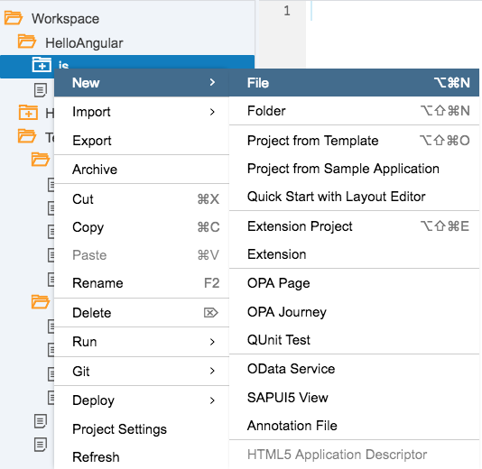
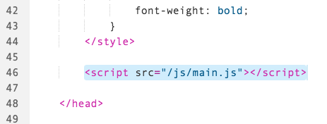
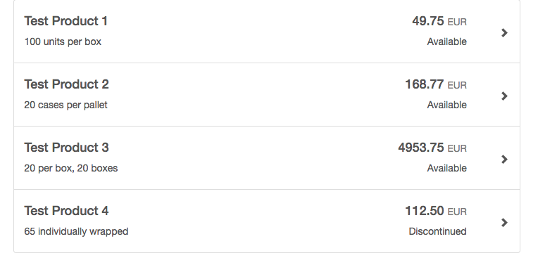
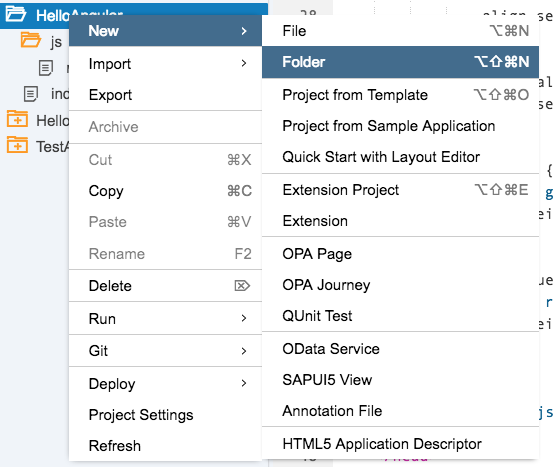
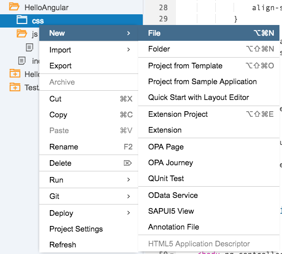
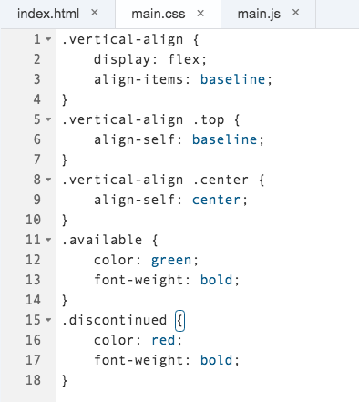

## Prerequisites  
 - **Proficiency:** Beginner 
 - **Tutorials** Step #3 [Add the AngularJS JavaScript](http://www.sap.com/developer/tutorials/angular-add-javascript.html)

## Next Steps
 - **Tutorials** Step #5 [Add ODATA to the application](http://www.sap.com/developer/tutorials/angular-add-odata.html)

 
## Details
### You will learn  
In this tutorial series, we will explore another technology for Single Page Application (SPA) development - AngularJS (or just Angular).  Angular is a popular web framework in North America, and is used by many companies for both internal and client-facing systems.  These tutorials will parallel our SAPUI5 tutorials, building a visual interface using Angular, and connecting it to an OData back end service.

### Time to Complete
**15 Min**.

---
#### AngularJS series
**Step 4**: Connect an external OData feed to our application.  While doing that, we will also learn how to use an Angular *factory* to insert functionality in multiple places.  Finally, we will examine the Angular `$resource` factory, which helps us connect to REST resources.

---

### Move the JavaScript to a Separate File

First, let's move the JavaScript and CSS files out of our application, and in to a proper place in our project.

1.  Right click on the folder `HelloAngular` and select **New** --> **Folder**

    
    
    Name the folder `js`, and click **OK**
    
    

2.  Next, right click on the new `js` folder, and select **New** --> **File**

    

    Name this file `main.js` and click **OK**.

    

3.  Next, copy this code in to the new `main.js` file.  (It is the same code that is in your `index.html` file.)  Then click **Save**.

    ```javascript
    var testData = [{
    	ProductName: "Test Product 1",
    	QuantityPerUnit: "100 units per box",
    	UnitPrice: "49.75",
    	Discontinued: false
    }, {
    	ProductName: "Test Product 2",
    	QuantityPerUnit: "20 cases per pallet",
    	UnitPrice: "168.77",
    	Discontinued: false
    }, {
    	ProductName: "Test Product 3",
    	QuantityPerUnit: "20 per box, 20 boxes",
    	UnitPrice: "4953.75",
    	Discontinued: false
    }, {
    	ProductName: "Test Product 4",
    	QuantityPerUnit: "65 individually wrapped",
    	UnitPrice: "112.50",
    	Discontinued: true
    }];
    
    angular.module("helloWorld", [])
    	.controller('helloController', helloController);
    
    function helloController($scope) {
    	$scope.productList = testData;
    }
    ```

    

4.  Next, we will delete the `<script>` tag out of the `index.html` file.  Select the entire text from `<script>` to `</script>`, and then press the delete key.  Save your file.

    

5.  Insert a link to the new file, so that the `index.html` file loads your new JavaScript file.  

    Under the `</style>` tag, add the following HTML
    
    ```html
    <script src="/js/main.js"></script>
    ```

    
    
6.  Run your application.  The page should look exactly the same, as the JavaScript now runs from an external file.

    

### Move the CSS file to a separate file

Follow the same procedures to move the CSS file

1.  Right click on the folder `HelloAngular` and select **New** --> **Folder**

    
    
    Name the folder `css`, and click **OK**

2.  Next, right click on the new `css` folder, and select **New** --> **File**

    

    Name this file `main.css` and click **OK**.

3.  Next, copy this code in to the new `main.css` file.  (It is the same CSS that is in your `index.html` file.)  Then click **Save**.

    ```css
    .vertical-align {
        display: flex;
        align-items: baseline;
    }
    
    .vertical-align .top {
        align-self: baseline;
    }
    
    .vertical-align .center {
        align-self: center;
    }
    
    .available {
        color: green;
        font-weight: bold;
    }
    
    .discontinued {
        color: red;
        font-weight: bold;
    }
    ```

    

4.  Next, we will delete the `<style>` tag out of the `index.html` file.  Select the entire text from `<style>` to `</style>`, and then press the delete key.  Save your file.

    

5.  Insert a link to the new file, so that the `index.html` file loads your new JavaScript file.  

    Under the last `<script>` tag (the one you just inserted, add the following HTML
    
    ```html
    <link href="/css/main.css" rel="stylesheet">
    ```

    
    
6.  Run your application.  The page should look exactly the same, as the CSS file now loads from an external file.

    


## Next Steps
 - **Tutorials** Step #5 [Add ODATA to the application](http://www.sap.com/developer/tutorials/angular-add-odata.html)
