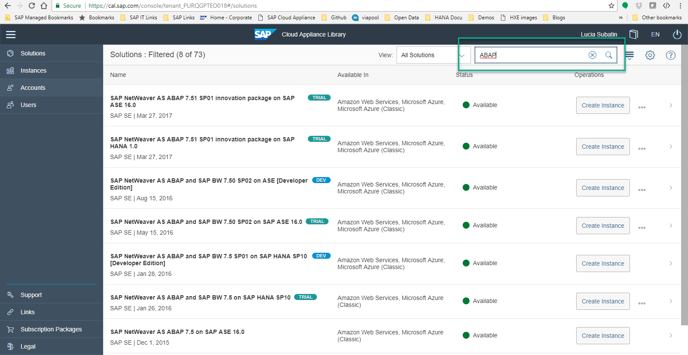
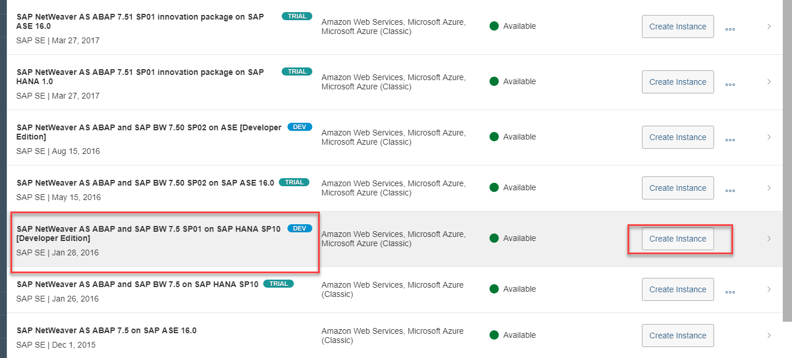
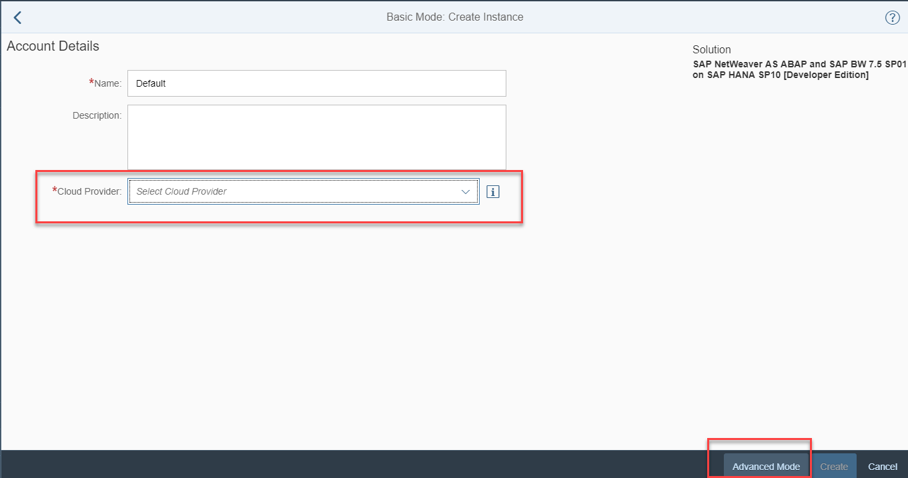
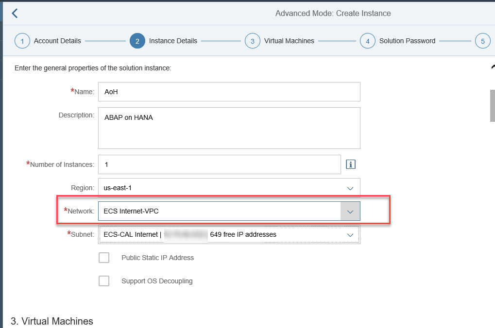
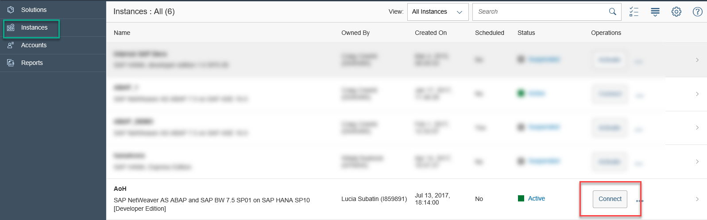
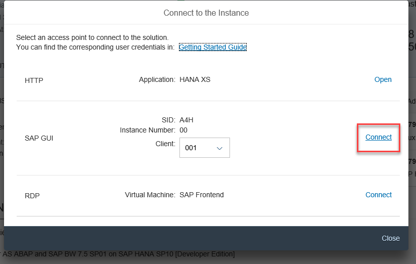
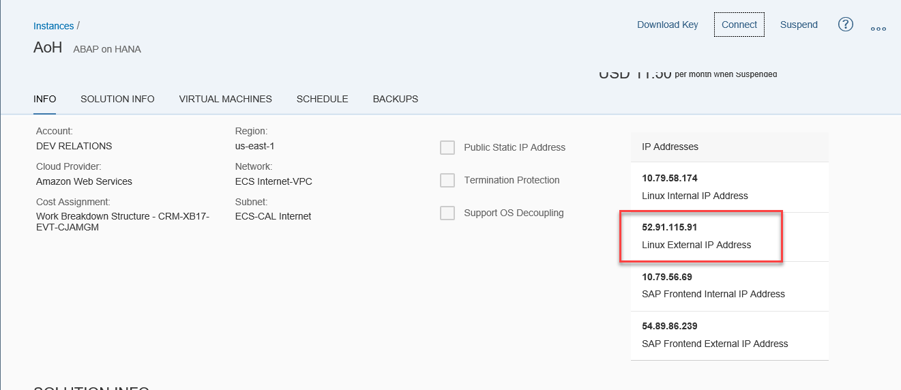
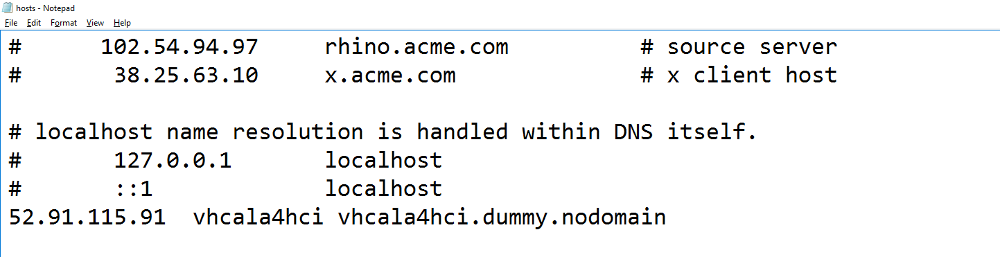
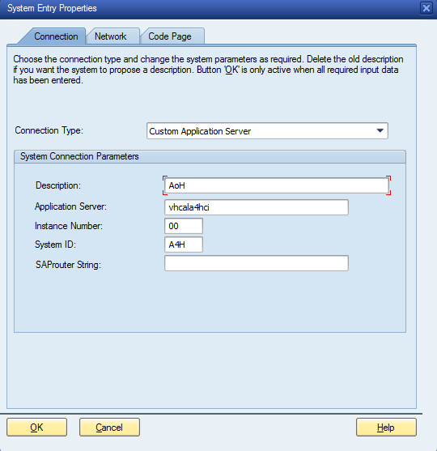

## Prerequisites  
 - **Proficiency:** Beginner | Intermediate | Advanced
 - Create an account in a Cloud Provider and generate an access key in Amazon Web Services or a Subscription ID in Microsoft Azure, depending on your choice. Check [this FAQ wiki for more information on AWS](https://wiki.scn.sap.com/wiki/display/SAPCAL/FAQ+-+Specific+questions+for+Amazon+Web+Services)
 - Create an account in the [Cloud Appliance Library ](https://cal.sap.com/)
 - OPTIONAL: Download and install SAP GUI 7.40 from the [SAP Software Download Center](https://launchpad.support.sap.com/#/softwarecenter).


## Next Steps
- [Connect to Eclipse and Create a Project](https://www.sap.com/developer/tutorials/abap-create-project.html)

## Details
### You will learn  
This tutorial will guide you through the creation of an instance of an ABAP application server with an SAP HANA database

### Time to Complete
**15 Min**

---

[ACCORDION-BEGIN [Step 1: ](Create your Developer edition instance in CAL)]

Log in to the [Cloud Appliance Library](https://cal.sap.com/) and look for **ABAP** in the solutions.



Choose **SAP NetWeaver AS ABAP and SAP BW 7.5 SP01 on SAP HANA SP10** and click on **Create Instance**.




[ACCORDION-END]

[ACCORDION-BEGIN [Step 2: ](Choose your cloud provider)]

Select your cloud provider. Enter the combination of Access and Secret keys for Amazon Web Services or the Subscription ID for MS Azure and click on **Advanced Mode** .



**Continue** to the next step.


[ACCORDION-END]


[ACCORDION-BEGIN [Step 3: ](Review instance details and change Network)]

Review the name, description and zones. Make sure the IP address can be accessed externally, for example:



Continue with the steps and wait until deployment is finished. If asked, download the SSH key files in a secure, known location and enter a master password you will remember.


[ACCORDION-END]

[ACCORDION-BEGIN [Step 4: ](Access your Virtual Machine)]

Once the Virtual Machine appears as `Active` in the **Instances** section, click on **Connect**.



You can use SAP GUI on your computer or from the RDP to test your connection. Use user **DEVELOPER** and the master password you have set. refer to the Getting Started Guide on CAL for more information.




[ACCORDION-END]


[ACCORDION-BEGIN [Step 4: ](Map your hosts file)]

Take note of the **SAP Front end External IP Address**



Open the file `/etc/hosts` in Mac or `C:\Windows\System32\drivers\etc\hosts` in MS Windows. Add the external front end IP Address and `vhcala4hci vhcala4hci.dummy.nodomain`

```
<<IP address>>  vhcala4hci vhcala4hci.dummy.nodomain
```

For example:



>Hint: If you cannot save your changes into the hosts file, try running Notepad as administrator and opening the file from there.

You can use the hostname as your SAP GUI entry and Eclipse ADT plugin



Proceed to add the 90-day trial license as described in the Getting Started Guide.


[ACCORDION-END]

---

## Next Steps
- [Connect to Eclipse and Create a Project](https://www.sap.com/developer/tutorials/abap-create-project.html)
