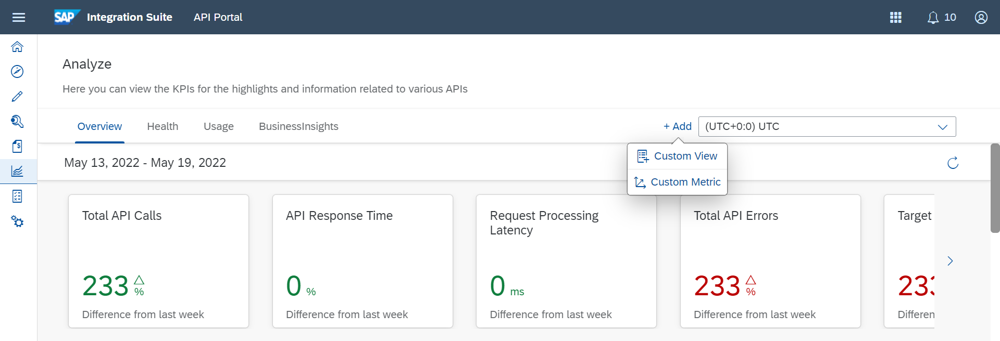
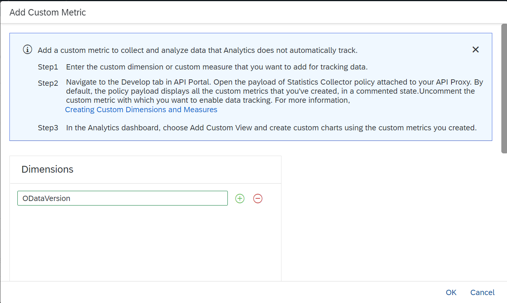
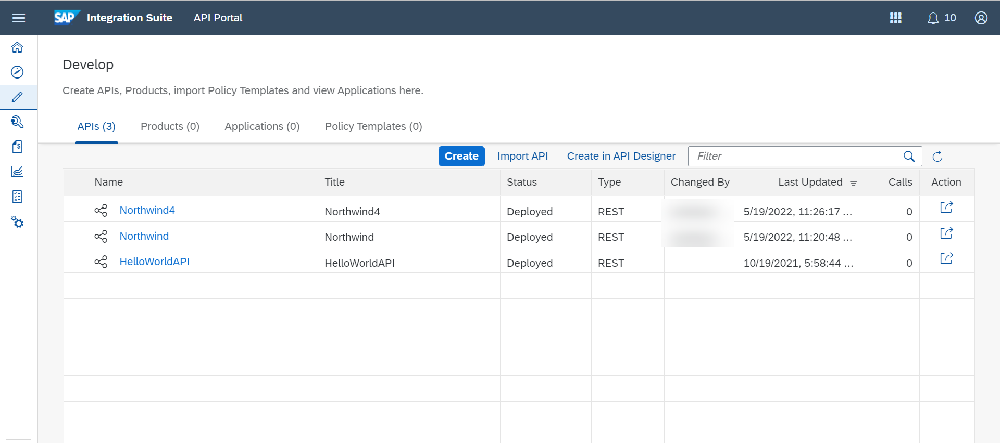
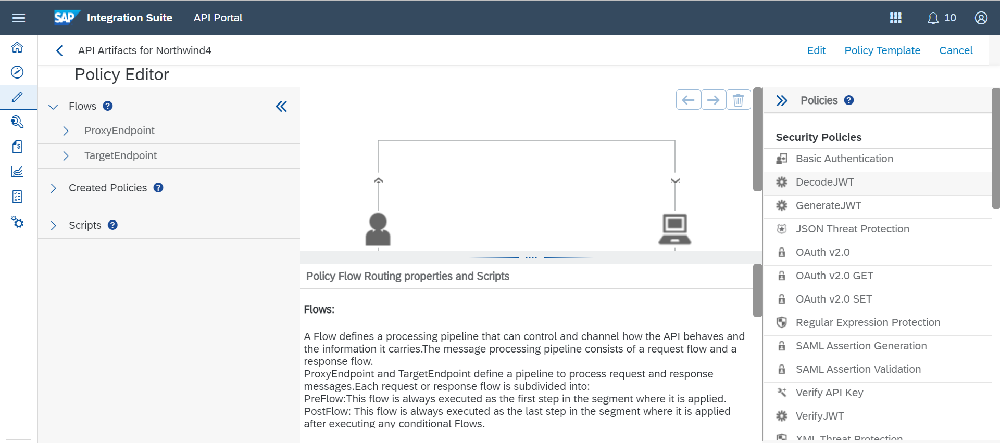
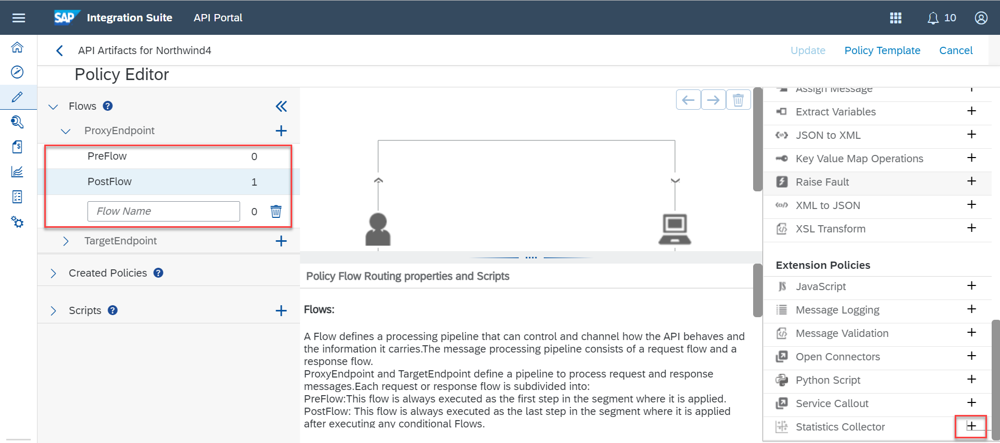
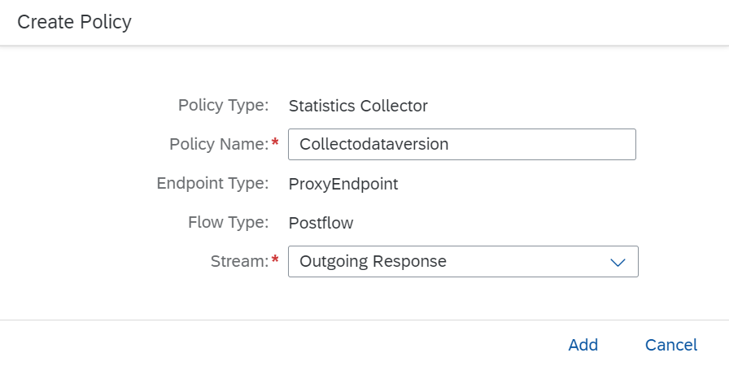
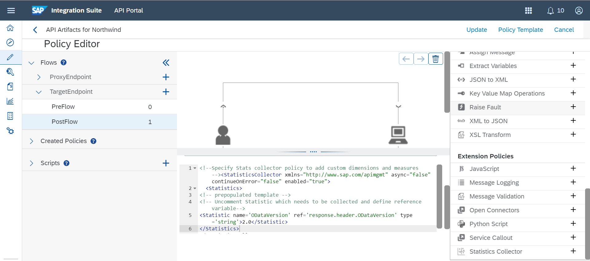
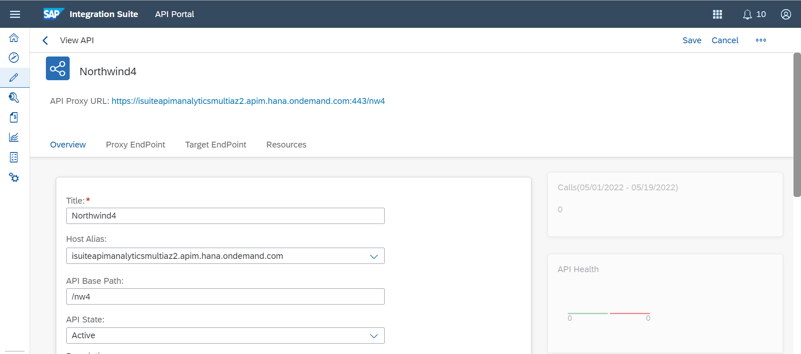
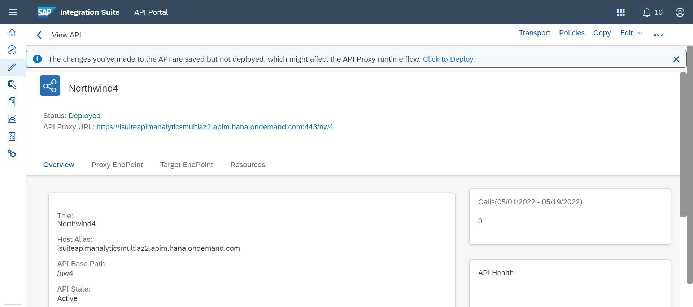

# Create Custom Dimensions and Measures
<!-- description --> Create custom dimensions and measures to collect and track analytics data in API Management.

## Prerequisites
You have provisioned your SAP Integration Suite tenant and activated  **Design, Develop and Manage APIs**. For more information, see [Set Up Integration Suite Trial](cp-starter-isuite-onboard-subscribe).


## Context
API Analytics allows you to track analytics with a set of predefined dimensions and measures. However, you may also create custom measures and dimensions if you have the need to track analytics data based on metrics that are not predefined. With a custom dimension or a custom measure, you can collect and analyze data that analytics doesn't automatically track. For instance, you want to capture API calls or API errors based on an API Key. Advanced API Analytics doesn't provide an out-of-the-box dimension that allows you to track data based on an API key. In such cases, you can define a custom dimension for capturing API key based data. Similarly, you can track the number of headers passed in an API call by creating a custom measure to track the total or average number of headers passed in an API call.
## You will learn
  - How to add a custom metric.
  - How to attach **Statistics Collector** policy to enable data collection using the custom dimension or measure.


### Add Custom Metric


1. In the Analytics dashboard, choose **Custom Metric** from the **+Add** dropdown menu.
  <!-- border -->

2.	In the **Add Custom Metric** window, enter the name of the custom dimension or custom measure that you want to add for tracking data.
  <!-- border -->

3. Choose **OK**.


### Attach Statistics Collector policy


To enable data collection, you must reuse the name of the custom metric created in Step 1 in the **Statistics Collector** policy of your API proxy.

1. Select **Develop** from the navigation menu to the left.
  <!-- border -->

2. Choose the API for which you want to collect data using the custom metric.

3. Select **Policies** and then choose **Edit**.
  <!-- border -->

4.	Attach the **Statistics Collector** policy to the `PreFlow` or `PostFlow` of your `ProxyEndpoint`/`TargetEndpoint`. Select `PreFlow` or `PostFlow` depending on the custom metric. Select **plus(+)** next to **Statistics Collector**.
  <!-- border -->

5. In the **Create Policy** window, enter **Policy Name** and choose **Stream**. Select **Add**.
  <!-- border -->

6. Open the payload of Statistics Collector policy that you attached to the API Proxy. By default, the payload of Statistics Collector policy displays all the custom dimensions and measures that you've created. It displays them in a commented state with XML indicators <!-- --> as shown in the sample payload given below.
```
<!--Specify Stats collector policy to add custom dimensions and measures --><StatisticsCollector xmlns="http://www.sap.com/apimgmt" async="false" continueOnError="false" enabled="true">
  <Statistics>
<!-- prepopulated template -->
<!-- Uncomment Statistic which needs to be collected and define reference variable-->
<!-- <Statistic name='API_Key' ref='' type='string'>0</Statistic> -->
<!-- <Statistic name='ODataVersion' ref='' type='string'>0</Statistic> -->
</Statistics>
</StatisticsCollector>
```
7.	To enable data collection, you must uncomment the custom dimension or the measure with which you want to enable data tracking. In the sample, data collection has been enabled only for the custom metric `ODataVersion`. Enter the reference(ref) and default value as shown in the sample payload given below.
```
<!--Specify Stats collector policy to add custom dimensions and measures --><StatisticsCollector xmlns="http://www.sap.com/apimgmt" async="false" continueOnError="false" enabled="true">
  <Statistics>
<!-- prepopulated template -->
<!-- Uncomment Statistic which needs to be collected and define reference variable-->
<!-- <Statistic name='API_Key' ref='' type='string'>0</Statistic> -->
<Statistic name='ODataVersion' ref='response.header.ODataVersion' type='string'>2.0</Statistic>
</Statistics>
</StatisticsCollector>
```

8. Select **Update**.
  <!-- border -->

9. Select **Save**.
  <!-- border -->

10. Select **Click to Deploy**.
  <!-- border -->


### Create custom charts

After you've created the custom dimension or measure, navigate to the analytics dashboard. Add a custom view and create custom charts using the custom dimensions or measures that you've created.
> Please note that there might be a delay of 20 to 30 minutes before data starts appearing in the charts.

For more information on creating views and charts see [Creating and Working with Custom Reports](https://help.sap.com/docs/SAP_CLOUD_PLATFORM_API_MANAGEMENT/66d066d903c2473f81ec33acfe2ccdb4/daf54fdbd2b34afba52833e8f896eb40.html)


---
