## Prerequisites
 - You already have a subaccount and have enable the Cloud Foundry environment in this subaccount. For more information, see [Create a Subaccount](https://help.sap.com/docs/BTP/65de2977205c403bbc107264b8eccf4b/05280a123d3044ae97457a25b3013918.html?q=entitlements).
 - An Integration Suite entitlement has been created for your subaccount. For more information, see [Configure Entitlements](https://help.sap.com/docs/BTP/65de2977205c403bbc107264b8eccf4b/37f8871865114f44aebee3db6ac64b72.html?q=create%20entitlements).

## Details
### You will learn
  - How to provision API Management capability from Integration Suite.  
  - Access API Management features and resources available on Integration Suite.

To set up the API Management capability from Integration Suite, you should first have an Integration Suite subscription.

>**IMPORTANT** Ensure that you don't have an instance of starter plan created in the same subaccount, where you plan to create an Integration Suite subscription. Also, note that API Management capabilities from Integration Suite and API Management subscriptions using the standalone tile cannot coexist in the same subaccount.

---

[ACCORDION-BEGIN [Step 1: ](Subscribe to Integration Suite)]

1. Log on to SAP BTP Cockpit and navigate to your subaccount.

2. In the navigation area of the subaccount, choose **Services** > **Service Marketplace**. Search for **Integration Suite** and choose **Create**.
   !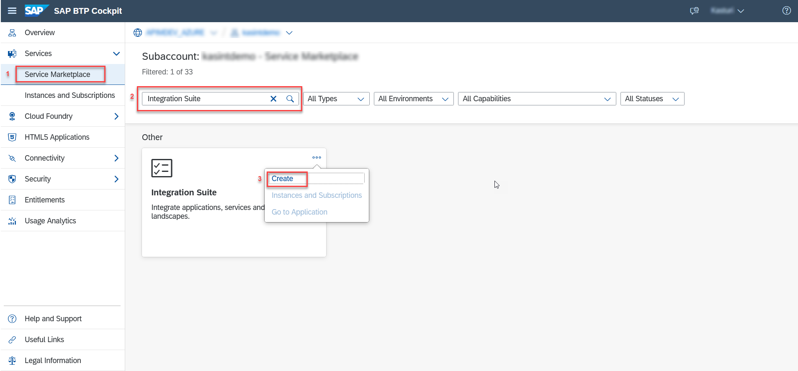

3. On the **New Instances and Subscriptions** dialog, select the **Service** and the **Plan** and choose **Create**.
   Wait for the subscription to complete successfully.
   !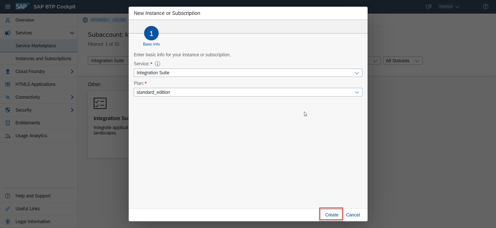

4. Choose **View Subscription** on the **Creation in Progress** dialog.
   !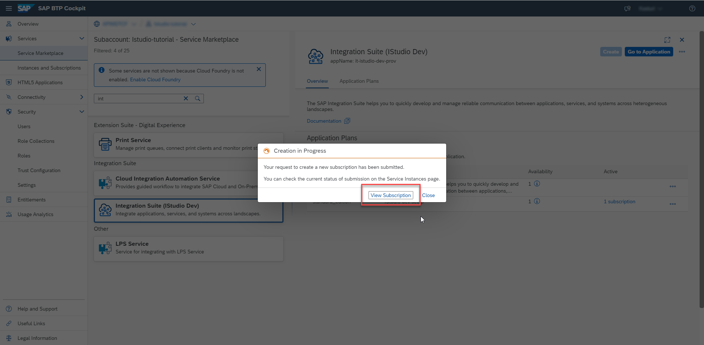
   Check the status of the submission in subscriptions section on the **Instances and Subscriptions** page. If the subscription is successful you'll notice the status of the **Integration Suite** shown as **Subscribed**.

   To access Integration Suite, you must first assign the "Integration Provisioner" role to yourself.

>**IMPORTANT** If you choose **Go to Application** without assigning the **Integration Provisioner** role, an application authentication error appears. If the error persists after assigning the role, clear your web browser cache, and log out of the application and log in again.

[VALIDATE_1]
[ACCORDION-END]

[ACCORDION-BEGIN [Step 2: ](Assign the Integration Provisioner Role)]

1. On the navigation pane, choose **Security** > **Users**.
   !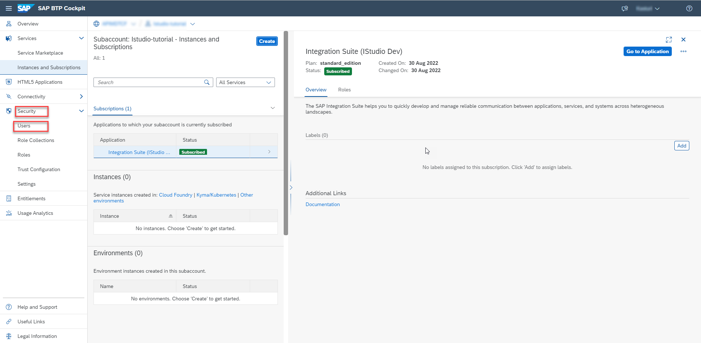

2. Select the user to whom you want to assign the role, and under **Role Collections** section, choose **Assign Role Collection**.
   !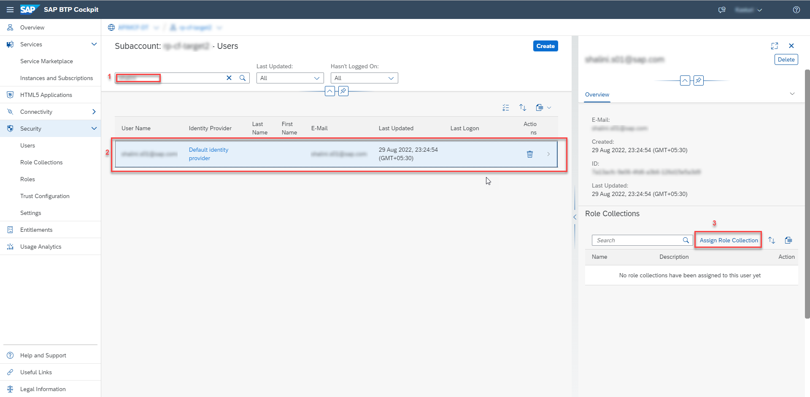

3. In the resulting dialog box, select the **Integration Provisioner** role and choose **Assign Role Collection**.
   !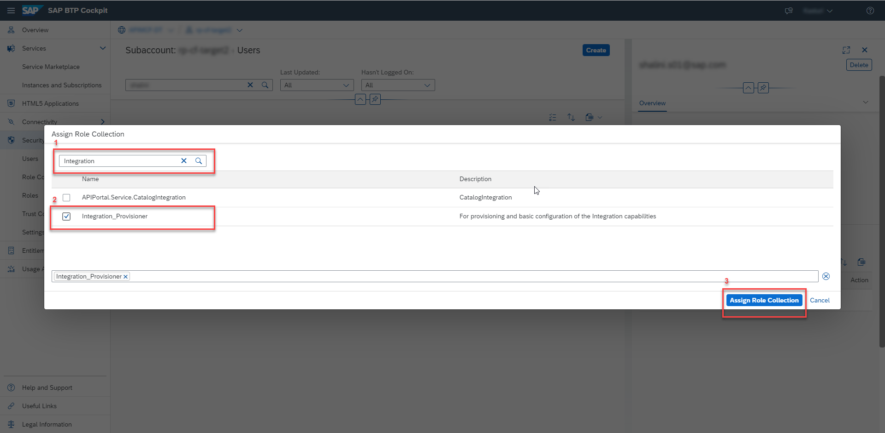

[DONE]
[ACCORDION-END]

[ACCORDION-BEGIN [Step 3: ](Get Directed to Integration Suite Homepage)]

1. Once the **Integration Provisioner** role is assigned, choose **Instances and Subscriptions** on the left navigation pane.

2. Under **Subscriptions** look for **Integration Suite**, and choose **Go To Application**.
  !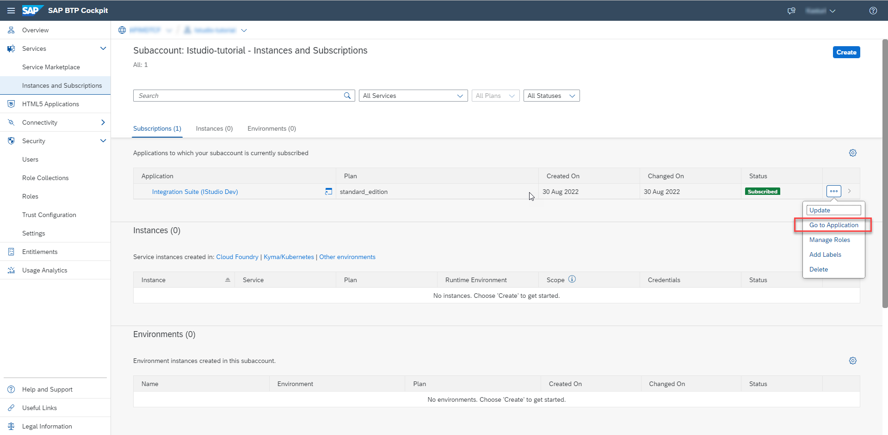

[DONE]
[ACCORDION-END]

[ACCORDION-BEGIN [Step 4: ](Activate API Management Capability )]

1. On the Integration Suite home page, under **Capabilities**, choose **Add Capabilities**.
   !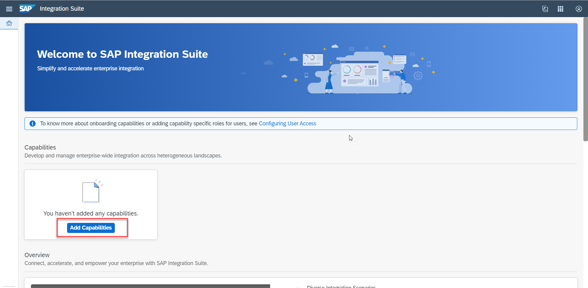

2. On the **Activate Capabilities** dialog, under **Select Capabilities**, choose **Design, Develop and Manage APIs** and choose **Next**.
   !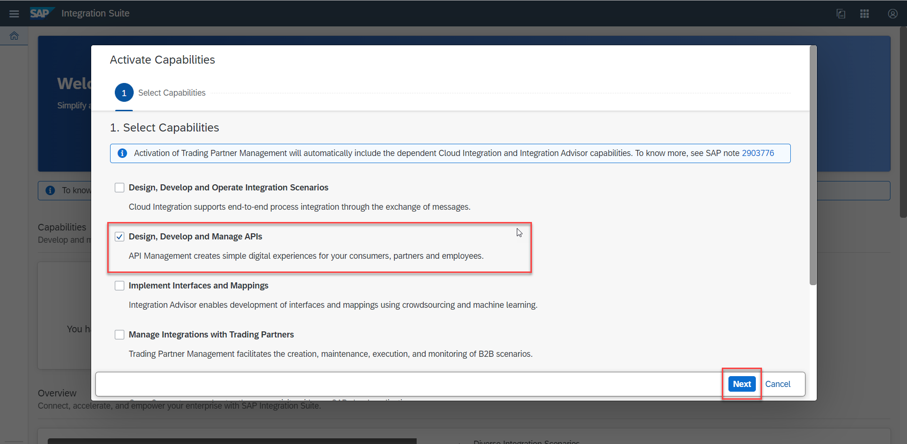

3. If you want to activate API Business Hub Enterprise, select the checkbox **Enable API Business Hub Enterprise** and choose **Next**.
   !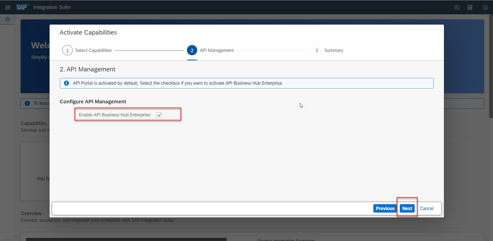

4. Choose **Activate** on the **Activate Capabilities** dialog.
   !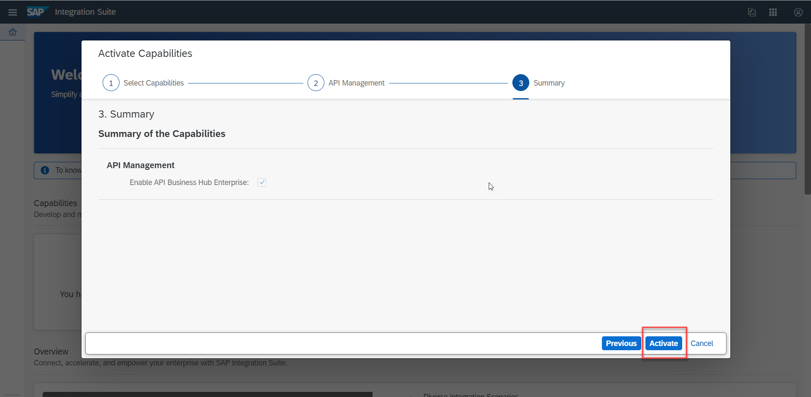

5. On the resulting screen, choose **OK** once the status changes from **In Progress** to **Active**.
   !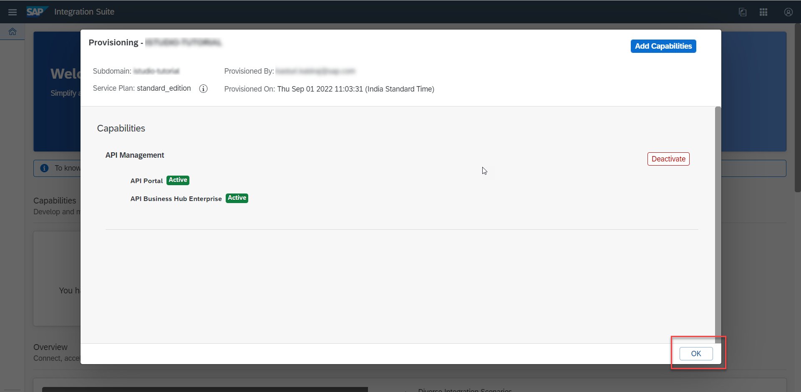

6. Log out of **Integration Suite**.

>**IMPORTANT** At this stage, navigate back to the **SAP BTP Cockpit** and assign the **APIManagement.Selfservice.Administrator** role to the user. This role is required to configure API Management service in Integration Suite. To assign the role, choose **Security** > **Users** and select the user to whom you want to assign the role. Under **Role Collections** section, choose **Assign Role Collection**. In the resulting dialog box, select the **APIManagement.Selfservice.Administrator** role and choose **Assign Role Collection**.
   !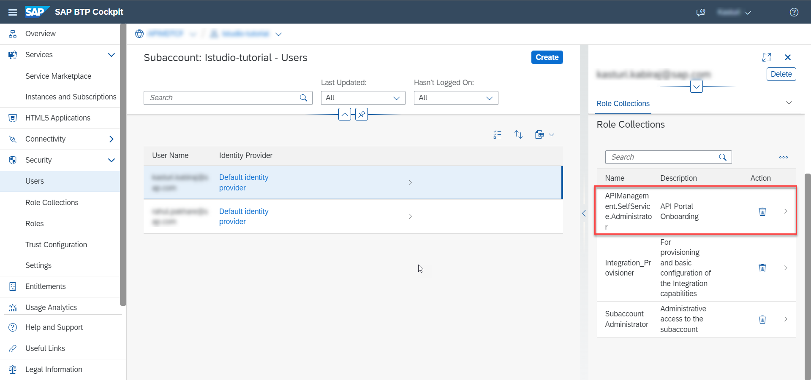

[VALIDATE_2]
[ACCORDION-END]

[ACCORDION-BEGIN [Step 5: ](Configure the API Management Service)]

1. Log on to **Integration Suite**.

2. On the **Integration Suite** home page, choose **Settings** > **APIs** from the left navigation pane.
   !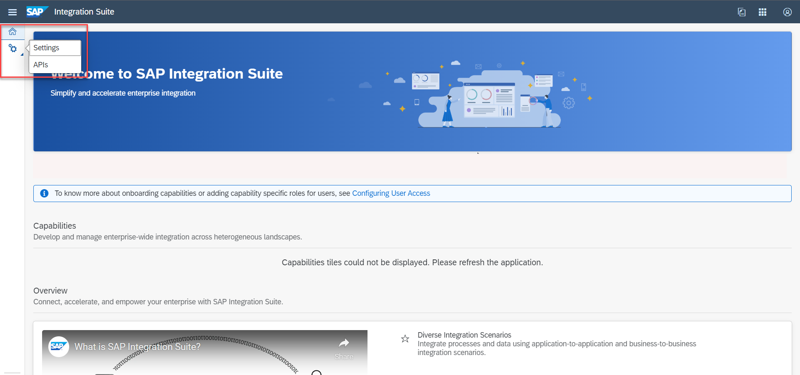

3. On the **Configure the API Management Service** page, configure the following and choose **Set Up**:

    - Select the Account type:

        - Select **Non-Production** account type for non-business critical activities.

        - Select **Production** account type for business-critical usage.

    - In the **Virtual Host** section, enter the **Host Alias**.

    - Provide an email ID in **Notification Contact** to receive updates.

    !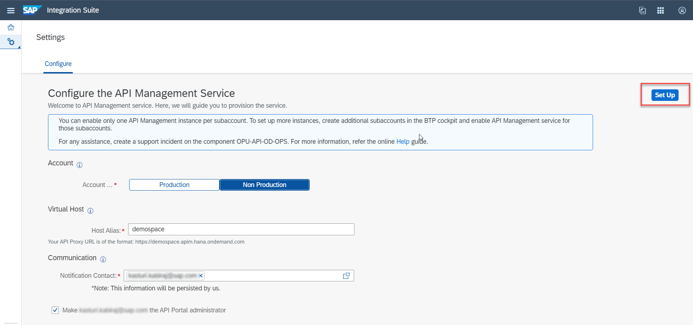

4. In the **Set-up Confirmation** window, review the provided details and choose **Confirm** to start the onboarding process.
   !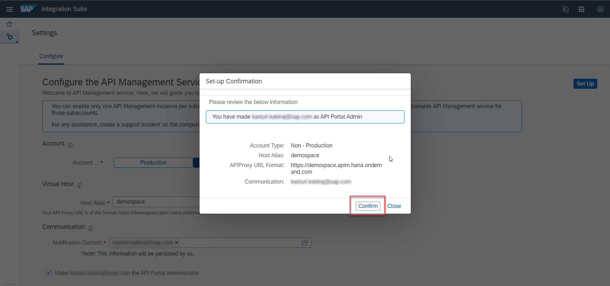
      You're redirected to a progress window, which states **API Management Service Setup In Progress**.

      The **Configuration** process is triggered, where the necessary resources are provisioned for you. It's followed by **Testing the Setup**, where a simple API Proxy is deployed and invoked to check that everything is set up properly.

      When the processes complete, the indicators turn green to indicate that the processes are successful. A **Release Notification** email is sent out to the email ID, which you provided earlier in the process in the **Configure the API Management Service** screen. This email contains details of the newly set up API Management service on your account.
    !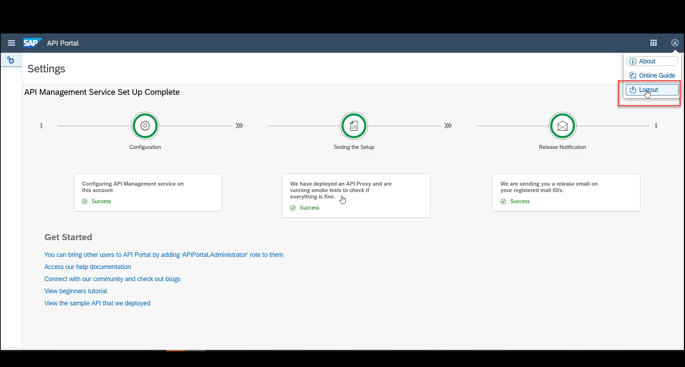

5. Log out of the **Integration Suite** and login again.
   !

    You can now create APIs, build API proxies as a service provider, or use APIs and other convenient services.

[DONE]
[ACCORDION-END]

---
