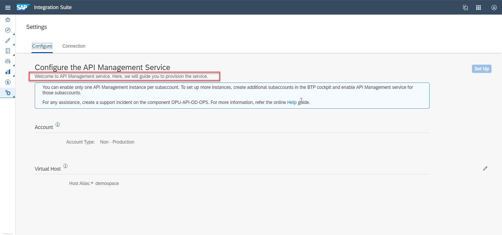

## Prerequisites
 - You already have a subaccount and have enable the Cloud Foundry environment in this subaccount. For more information, see [Create a Subaccount](https://help.sap.com/docs/BTP/65de2977205c403bbc107264b8eccf4b/05280a123d3044ae97457a25b3013918.html?q=entitlements).
 - An Integration Suite entitlement has been created for your subaccount. For more information, see [Create a Subaccount](https://help.sap.com/docs/BTP/65de2977205c403bbc107264b8eccf4b/05280a123d3044ae97457a25b3013918.html?q=entitlements).

## Details
### You will learn
  - How to provision the API Management, API portal capability from the Integration Suite launchpad.  
  - Access the API Management features and resources available on Integration Suite.

You should have Integration Suite subscription to set up the API Portal application.

>**IMPORTANT** Ensure that you don't have an instance of starter plan created in the same subaccount, if you are subscribing to the API Management, API portal in the Cloud Foundry subaccount, using the Integration Suite launchpad.
> Also, note that API Management capabilities from Integration Suite and API Management subscriptions using the standalone tile cannot coexist in a subaccount.

---

[ACCORDION-BEGIN [Step 1: ](Subscribe to Integration Suite)]

1. Log on to SAP BTP Cockpit and navigate to your subaccount.

2. Navigate to **Service Marketplace**, search for the **Integration Suite** tile and choose **Create**.
   !

3. On the **New Instances and Subscriptions** dialog, select the **Service** and the **Plan** from the dropdown list and choose **Create**.
   !

4. Choose **View Subscription** on the **Creation in Progress** dialog.
   !

   You have successfully subscribed to the Integration Suite.

  >**CAUTION:** After subscribing to the Integration Suite, don't immediately choose **Go to Application**. To access the Integration Suite, you must first assign the "Integration Provisioner" role to yourself.

  >If you choose **Go to Application** without assigning the **Integration Provisioner** role, an application authentication error appears. If the error persists after assigning the role, clear your web browser cache, and log out of the application and log on again.

[VALIDATE_1]
[ACCORDION-END]

[ACCORDION-BEGIN [Step 2: ](Assign the Integration_Provisioner Role)]

1. On the navigation pane, choose **Security** > **Users**.
   !

2. Select your **Username** and under **Role Collections** section, choose **Assign Role Collection**.
   !

3. In the resulting dialog box, select the **Integration Provisioner** role and choose **Assign Role Collection**.
   !

[DONE]
[ACCORDION-END]

[ACCORDION-BEGIN [Step 3: ](Getting Directed to Integration Suite Homepage)]

1. Once the **Integration Provisioner** role is assigned, navigate back to the **Instances and Subscriptions** page, under **Subscriptions** look for **Integration Suite** and choose **Go To Application**.
  !

[DONE]
[ACCORDION-END]

[ACCORDION-BEGIN [Step 4: ](Activating API Management Capability )]

1. On the Integration Suite home page, under **Capabilities**, choose **Add Capabilities**.
   !

2. On the **Activate Capabilities** dialog, under **Select Capabilities**, choose **Design, Develop and Manage APIs** and choose **Next**.
   !

3. Select the **Enable API Business Hub Enterprise** checkbox if you want to activate API Business Hub Enterprise, choose **Next**.
   !

4. Choose **Activate** on the **Activate Capabilities** dialog.
   !

5. On the **Provisioning <Subdomain>** dialog, choose **OK** once the status changes from **In Progress** to **Active**.
   !

>**IMPORTANT** At this stage, navigate back to the SAP BTP Cockpit and assign the **APIManagement.Selfservice.Administrator** role to the user. For more information, see [Assign User Roles](https://help.sap.com/docs/SAP_CLOUD_PLATFORM_API_MANAGEMENT/66d066d903c2473f81ec33acfe2ccdb4/911ca5a620e94ab581fa159d76b3b108.html?version=Cloud).
!
&nbsp;

6. Log out of **Integration Suite** and login again.

[VALIDATE_2]
[ACCORDION-END]

[ACCORDION-BEGIN [Step 5: ](Configure the API Management Service)]

1. On the **Integration Suite** home page, choose **Settings** > **APIs** from the left navigation pane.
   !

2. On the **Configure the API Management Service** page, configure the following and choose **Set Up**:

    - Select the Account type:

        - Select **Non-Production** account type for non-business critical activities.

        - Select **Production** account type for business-critical usage.

    - In the **Virtual Host** section, enter the **Host Alias**.

    - Provide an email ID in **Notification Contact** to receive updates.

!

2. In the **Set-up Confirmation** window, review the provided details and choose **Confirm** to start the onboarding process.
   !
   You're redirected to a progress window, which states **API Management Service Setup In Progress**.

   The **Configuration** process is triggered, where the necessary resources are provisioned for you. It's followed by **Testing the Setup**, where a simple API Proxy is deployed and invoked to check that everything is set up properly.

   When the processes complete, the indicators turn green to indicate that the processes are successful. A **Release Notification** email is sent out to the email ID, which you provided earlier in the process in the **Configure the API Management Service** screen. This email contains details of the newly set up API Management service on your account.
   !

3. Log out of the **Integration Suite** and login again.
   !

    You can now create APIs, build API proxies as a service provider, or use APIs and other convenient services.

[DONE]
[ACCORDION-END]

---
