# Consume API Management Service Instance from Kyma
<!-- description --> Use the Kyma environment to search and discover API Management, API Portal and API business hub enterprise applications. Kyma environment provides a fully managed Kubernetes runtime based on the open-source project Kyma.

## Prerequisites
- You already have a subaccount and have the required entitlements for API Management, API Portal and API Business Hub Enterprise. For more information, see [ Configure Entitlements and Quotas for Subaccounts](https://help.sap.com/docs/BTP/65de2977205c403bbc107264b8eccf4b/5ba357b4fa1e4de4b9fcc4ae771609da.html?q=entitlements)

## Intro
-	You've subscribed to Integration Suite, and have enabled API Management, API Portal and API business hub enterprise capability.
  >If you're using the API Management stand-alone service, ensure that you've already subscribed to API Management, API portal and API business hub enterprise.

-	Ensure that the `Kyma environment` has already been enabled.
  To enable `Kyma Runtime` in SAP BTP Cockpit:  

1. In SAP BTP cockpit, navigate to your subaccount.

2. Go to **Services > Service Marketplace** and select **`Kyma Environment`**.

    <!-- border -->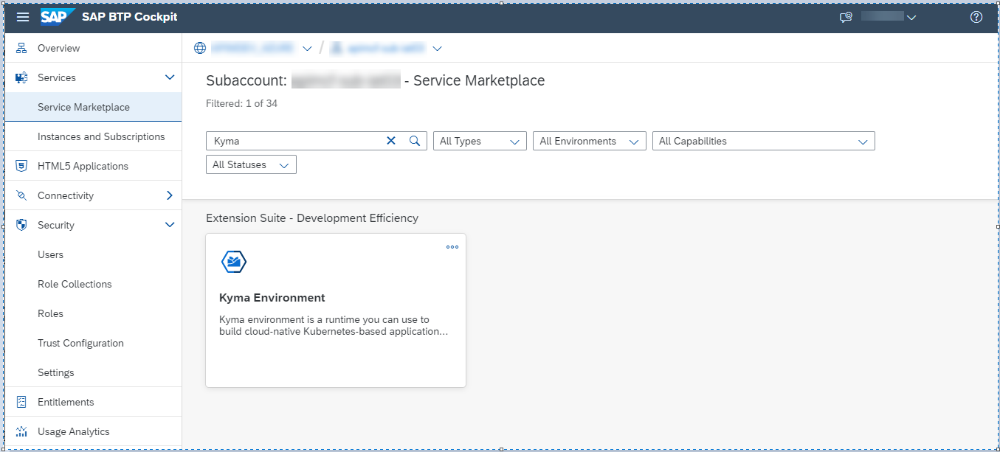

3. Select **Create** either from actions in the upper-right corner of the tile or from the tile overview page, to which you get by clicking on the tile..

    <!-- border -->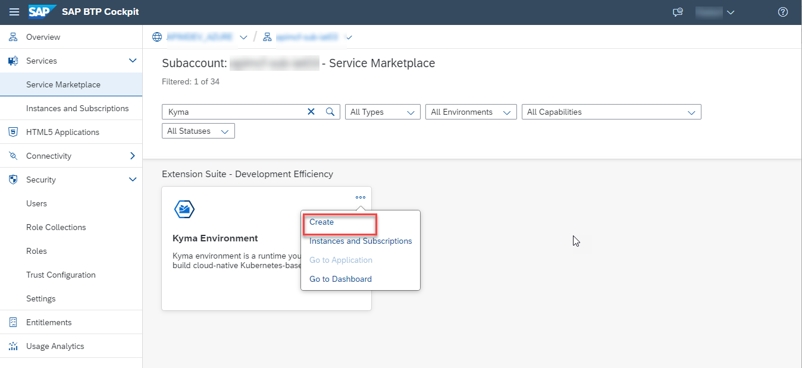

4. On the **New Instance and Subscription** dialog, change the instance name or keep the default name.
   The default plan assigned to your account is pre-populated.

   >The default plan and its specification can differ depending on your global account type.
   Confirm changes by selecting **Create**. For more information on how to set up a fully operational `Kyma environment`, click [`Kyma Environment`](https://help.sap.com/docs/BTP/65de2977205c403bbc107264b8eccf4b/468c2f3c3ca24c2c8497ef9f83154c44.html).

   <!-- border -->

## You will learn
  - How to Provision API Portal and API Business Hub Enterprise cluster services

### Provision the API Management, API Portal 

1. Log on to SAP BTP Cockpit and navigate to your subaccount.

2.	Choose **`Kyma Environment`** tab and choose **Console URL: Link to dashboard** to navigate to the `Kyma dashboard`.
  <!-- border -->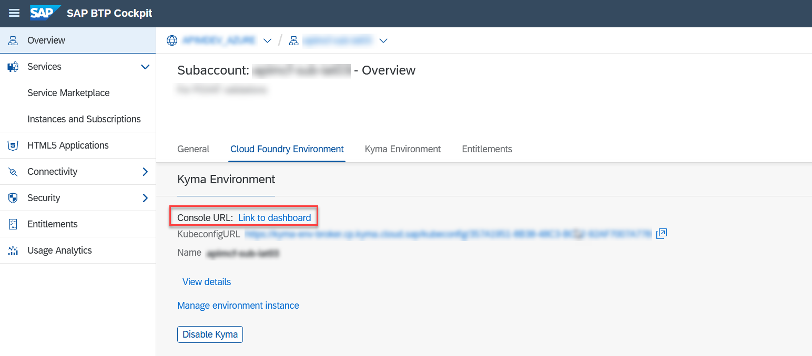

3. Choose **Namespaces** from the left navigation pane. At this point, only the **default** namespace appears.
   <!-- border -->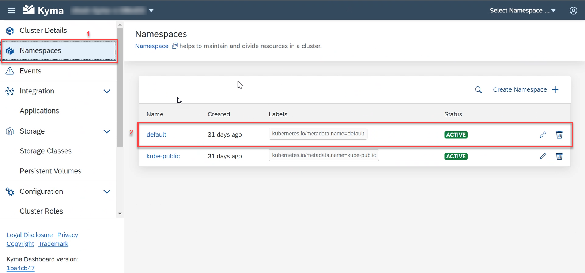

4. From the left navigation pane, choose **Service Management** >  **BTP Service Instances** > **Create Service Instance**.
  <!-- border -->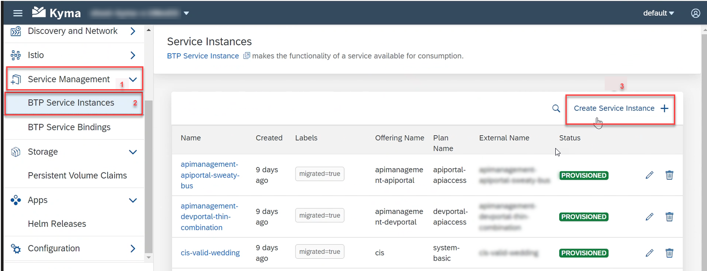

5. On the **Create Service Instance** dialog fill in the following details and choose **Create**:
   <!-- border -->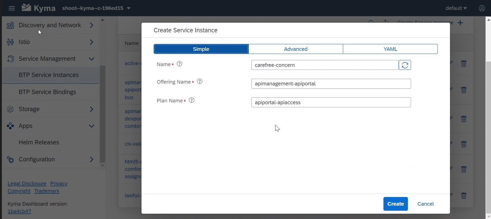

 - **Name**: Provide a name or generate it by choosing **Generate name**

 - **Offering Name**: You can find the SAP BTP service offering name in the **Service Marketplace** of the SAP BTP cockpit. Search for the **API Management, API Portal/ API Management, API business hub** enterprise service and copy the name of the service instance.

  - **Plan Name**: Similarly, you can find the relevant plan for the respective **API Management, API Portal/ API Management, API business hub** services in the **Service Marketplace** of the SAP BTP cockpit.
  <!-- border -->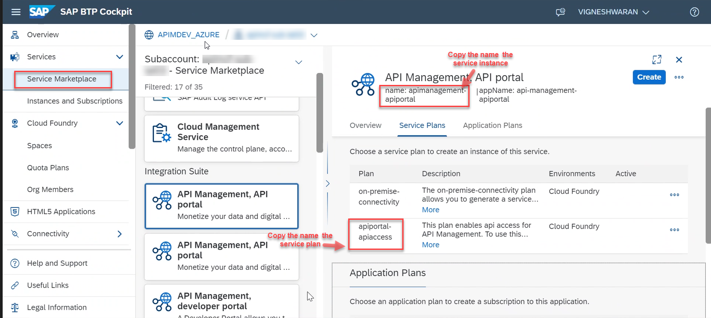

  - Choose **Advance** tab on the Create Service Instance dialog and expand **Instance Parameters**.
  <!-- border -->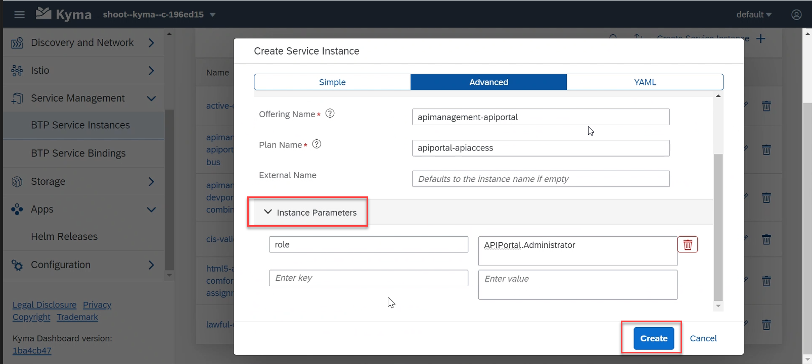

        * To create an instance of **API Management, API Portal**, enter **role** as the key in the first textbox and **APIPortal.Administrator** as the value in the second textbox.

        * Similarly, to create an instance of **API Management, API Business Hub Enterprise**, enter **role** in the first textbox and **AuthGroup.API.Admin** in the second textbox.

   You're directed to the **Service Management** > **Instances** page, where an instance of the newly provisioned **API Management, API Portal** or **API Management, API Business Hub Enterprise** service appears.
  <!-- border -->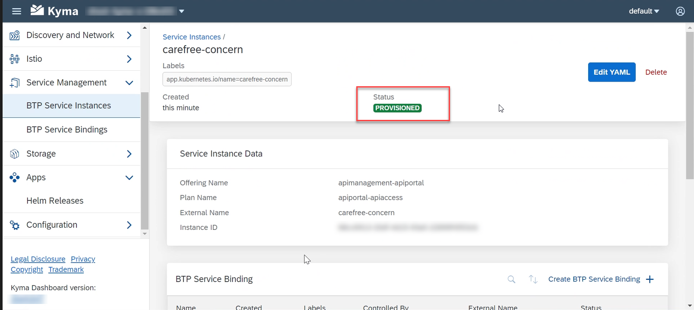

### Creating the Service Key

To create the Service Key:
    1. Navigate to the instance that you just created and choose **Add Service Binding**.
    <!-- border -->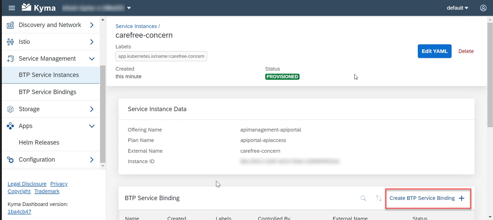
    2. Generate a **Name** for the service binding and select the **Service Instance Name** from the dropdown menu, and choose **Create**.
    <!-- border -->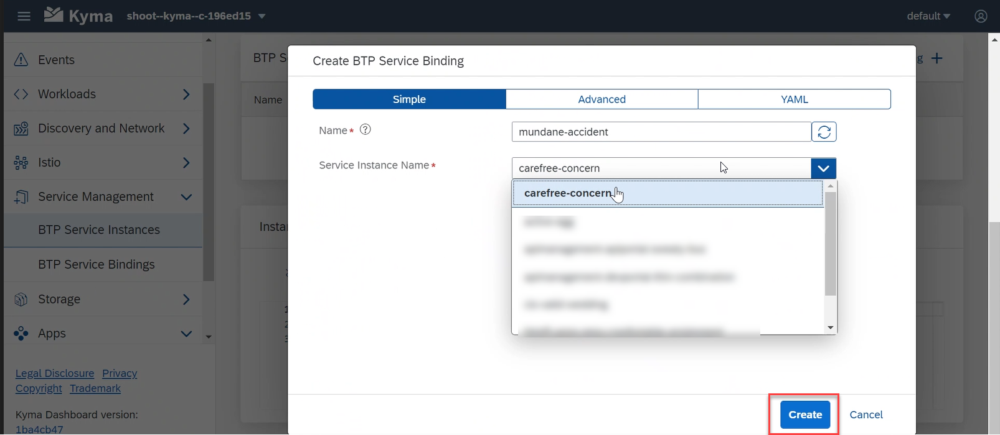
     The service instance name, secret, and external name appears under **Binding Data**. Select the link next to **Secret**.
     <!-- border -->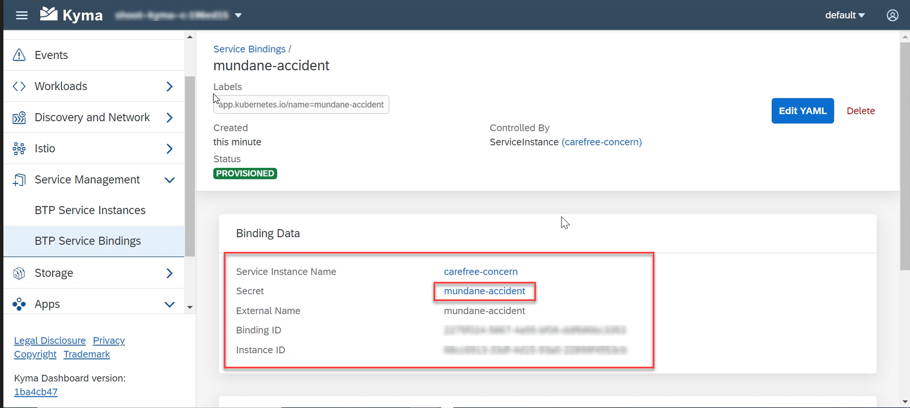

 Copy the `clientId`, `clientSecret`, `orgId`, `tokenUrl` and the `url` details.
    <!-- border -->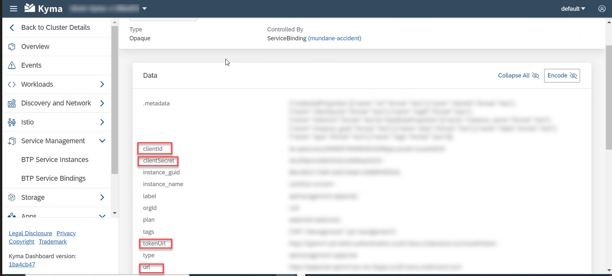

  You can now use the `clientId`, `clientSecret`, and `tokenUrl` to fetch the token, and the application URL to perform operation on the APIs.

  
