# Get Started with API Revisions

<!-- description --> Make incremental changes to an API proxy without causing any disruption to the published API.

## Intro
You can use API Revisions to make non-disruptive API changes in a safe and controlled environment. Make subsequent compatible changes to an already published API, by creating a revision of the API. Update changes in design time and once finalized, publish it for consumption. You can also create multiple revisions iteratively and revert to any of the created revisions.

## You will learn
  - How to create an API proxy with a Draft revision.
  - How to deploy the Draft and continue to work on it.
  - How to create a revision from a Draft.
  - How to create a Draft from a revision.
  - How to restore the revision to its previous state.
  - How to delete a revision.

### Create the Draft

>When you create an API, a Draft gets created by default.

1. Log on to the Integration Suite.

2. Choose **Design** from the navigation pane and choose **APIs**.
   <!-- border -->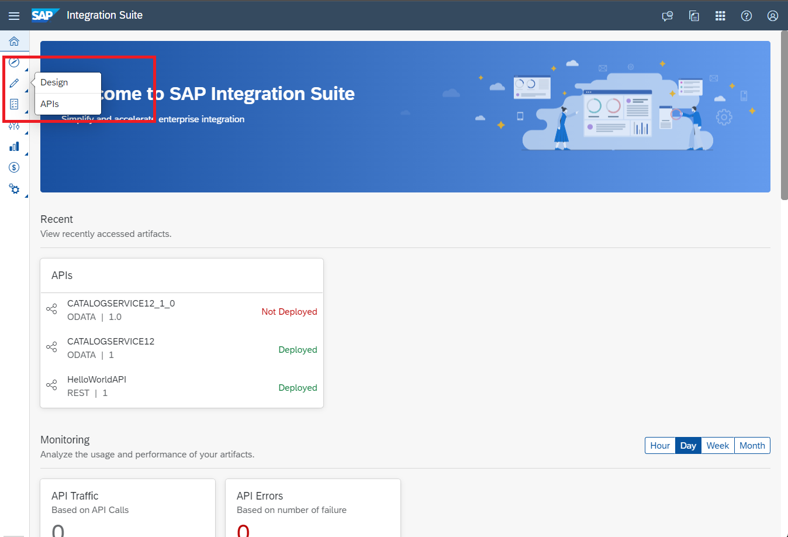

3. To create an API, choose **Create**.
   To create an API proxy from scratch, see [`Create an API`](https://help.sap.com/docs/sap-api-management/sap-api-management/create-api?version=Cloud).
   <!-- border -->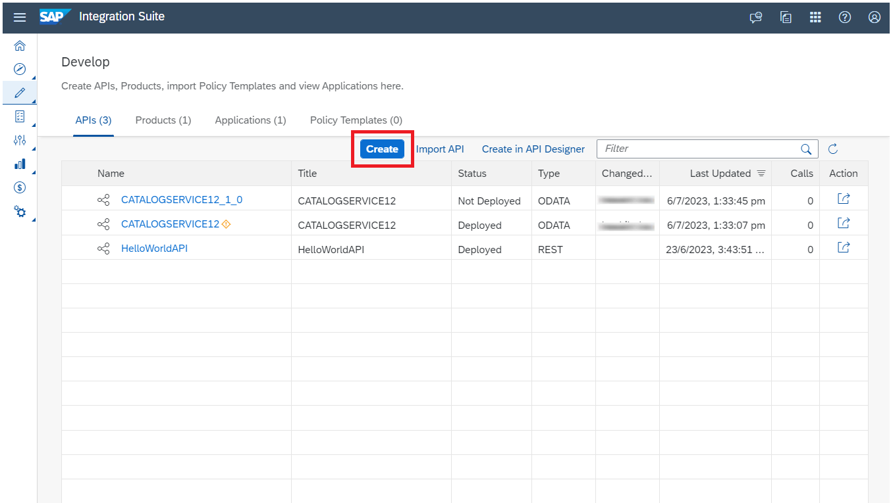
   
4. Fill in the details in the **Create API** dialog, and choose **Create**.
   <!-- border -->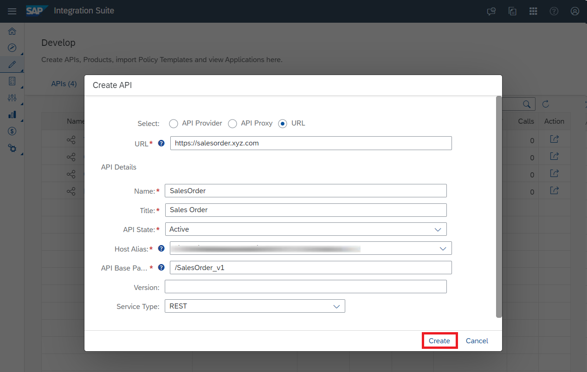

5. Edit the API by selecting the appropriate tabs and **Save** the changes.
   <!-- border -->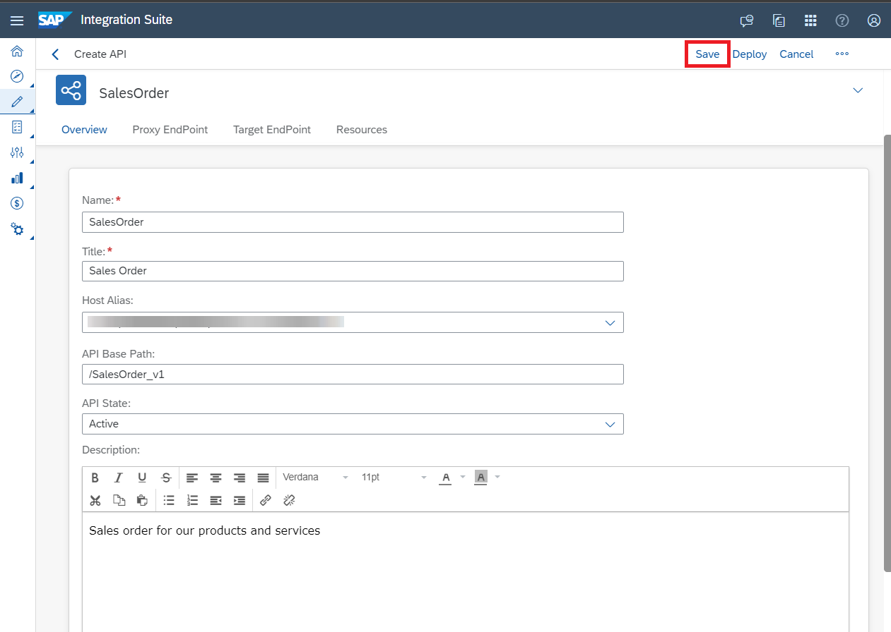

6. A draft gets created under the **Revisions** tab.
   <!-- border -->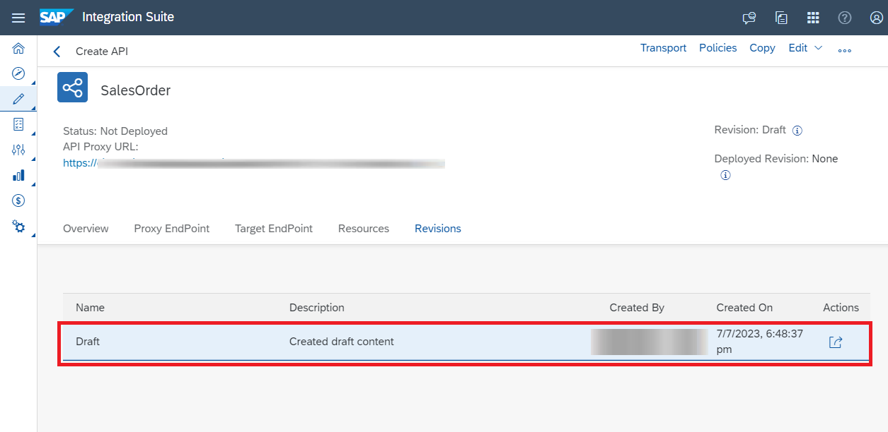
    

### Deploy the Draft

>At this point, the latest revision is **Draft**, and you don’t have any deployed revision.
        

1. Choose **Edit**, to continue to have a working copy of the Draft.

2. Choose **Save** after making the changes.
   <!-- border -->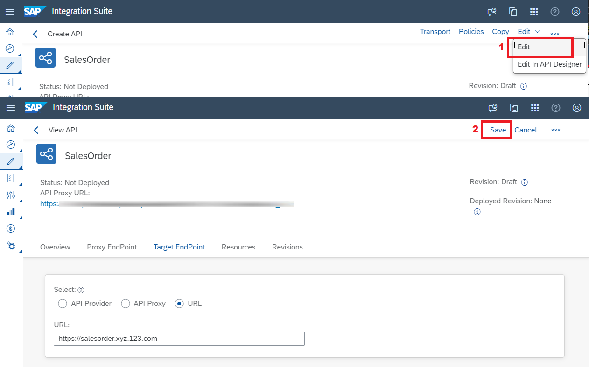

3. You can **Deploy** the Draft and see the **Deployed Revision** change to **Draft**.
   <!-- border -->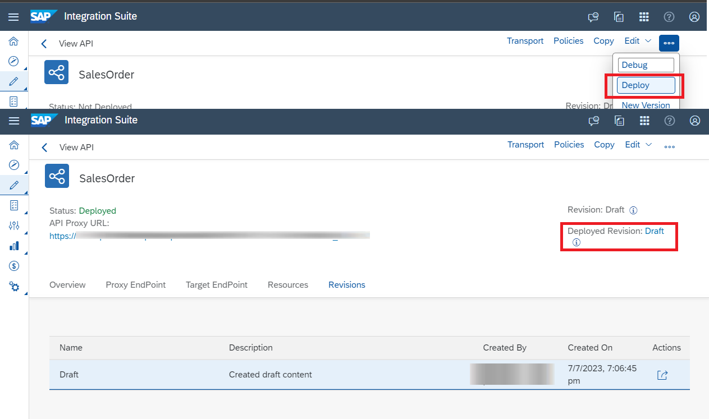

  
### Create a Revision from a Draft
 
>If you want to make this Draft as an immutable revision, you can save this draft as a revision.
      

1. Select the Draft, and choose **Save as Revision** from the inline action.
   <!-- border -->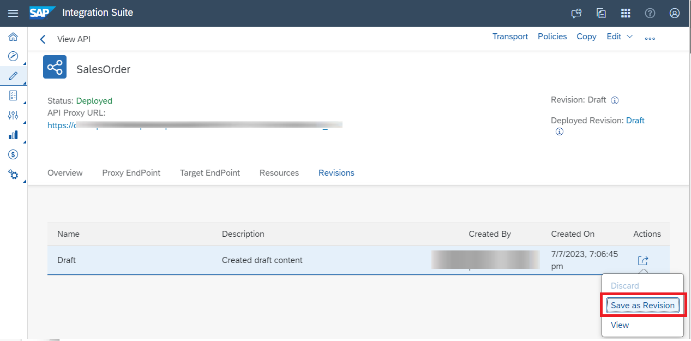

          
2. Enter the **Name** and **Description** and choose **Save**. 
   <!-- border -->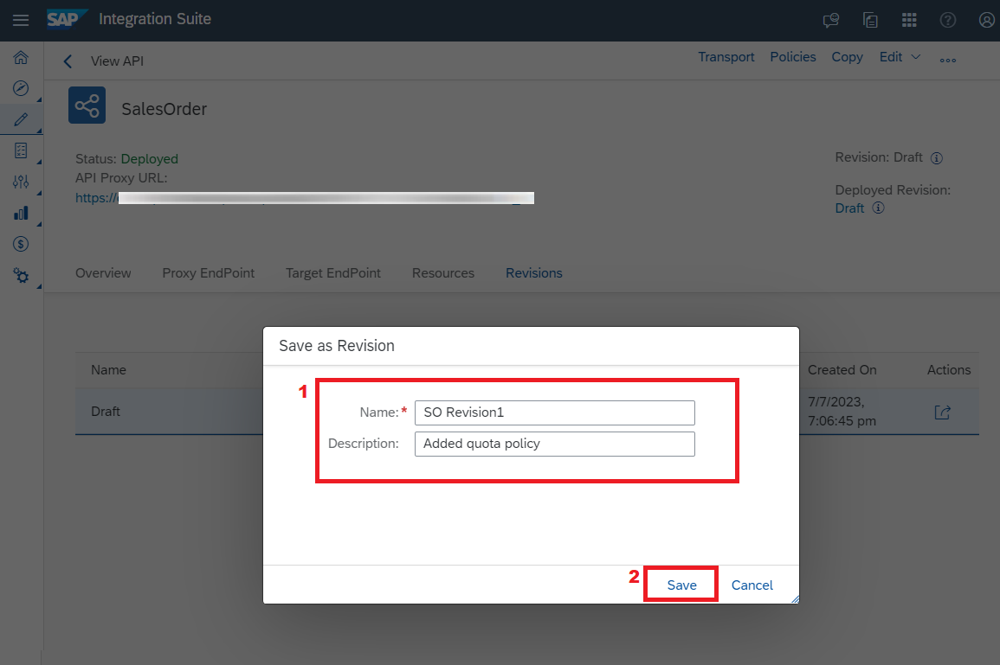

>**Note** You're not allowed to use Draft as the name of the revision, since it is reserved for draft.

   A new revision gets created. 
   <!-- border -->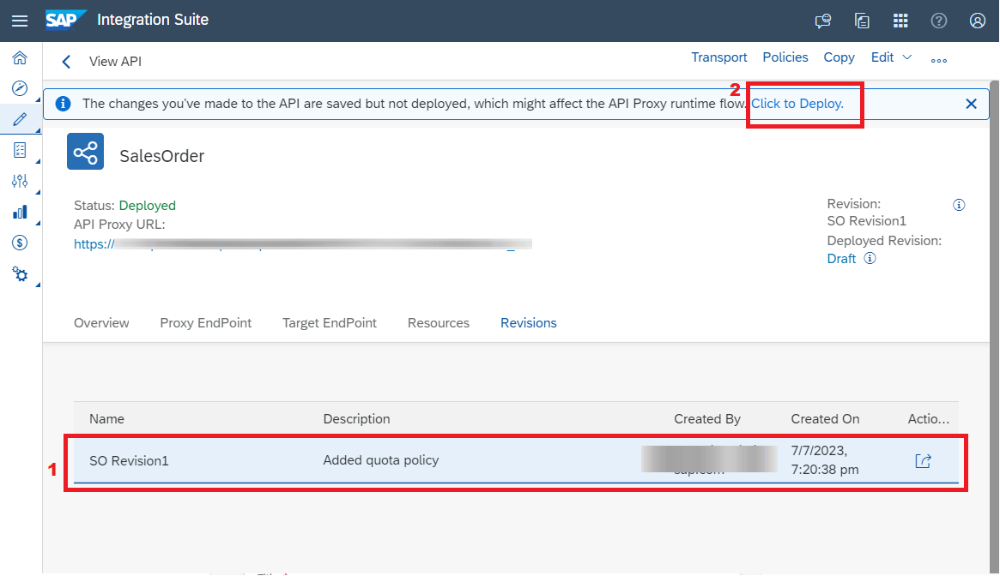
   You can deploy this revision by choosing **Click to Deploy** on the message strip.
   

### Create a Draft from a Revision

> Once you make changes to an API and save it, a Draft get created out of the latest revision.

1. Create a Draft out of the latest revision by choosing **Edit**.

2. Choose **Save** after making the changes.
   <!-- border -->

3. A Draft gets created out of the latest revision. 
   You can now **Deploy** the new Draft or save the Draft as a revision by choosing **Save as Revision** from the inline action.
   <!-- border -->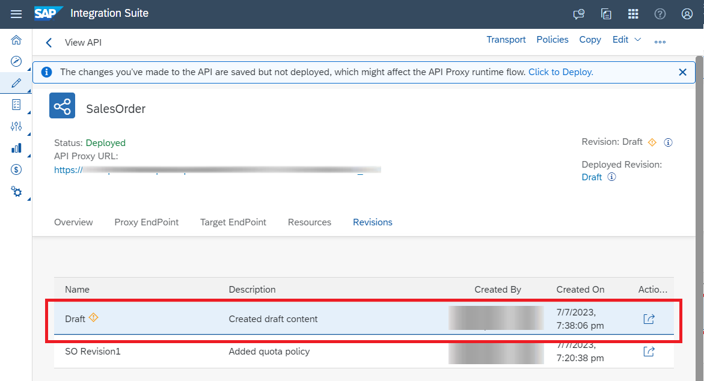
 
>**Note** By default, the maximum number of revisions you can create is 20. However, this number is configurable. If you proceed with the **Save as Revision** action once you've reached the maximum limit, the oldest revision which is not deployed will be deleted from the list. However, if the oldest revision is already deployed, a new revision will not be created.
 
   
### Restore a Previous Revision

>If you want to deploy any previous revision or to create a draft out of it, you can do so by using the **Revert** action. This action will restore a previous revision by creating a new revision which is a copy of the previous revision you are trying to restore.

>If the latest revision is a Draft, the revert action will discard the Draft and create a new revision. 

1. To restore the API to one of its previous revisions, choose **Revert** from the inline action. 
   The revert action will create a new revision out of it.
   <!-- border -->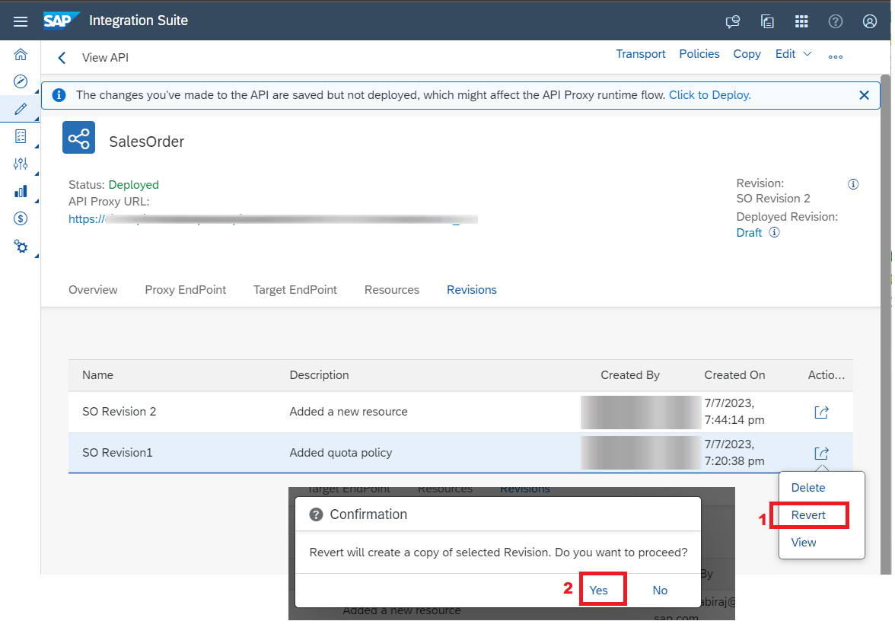

   For example, if you want to deploy Revision1 use the **Revert** action to make it your latest revision. This action creates Revision3, which is a copy of Revision1.
   <!-- border -->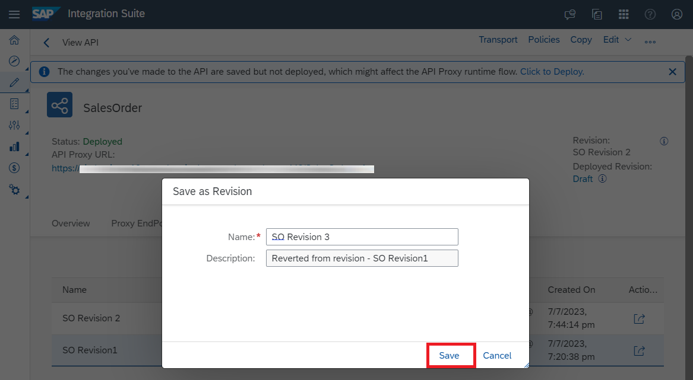
   <!-- border -->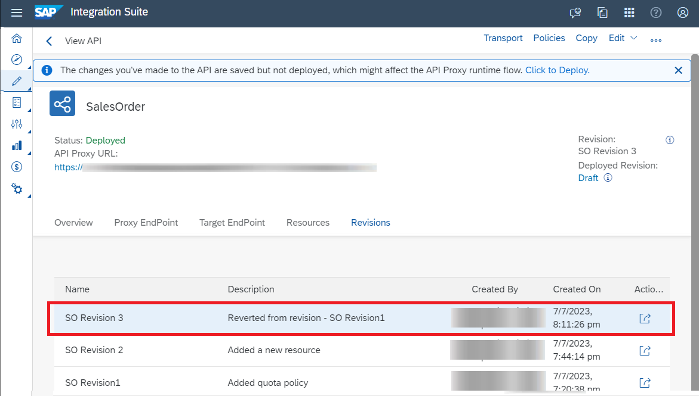
    
    
### Delete a Revision
    
>You can delete a revision if you don't plan to use it any longer or if you've reached the maximum limit of the number of API proxy revisions you can create.

1. Select the revision you want to delete, and choose **Delete** from the inline action.
   <!-- border -->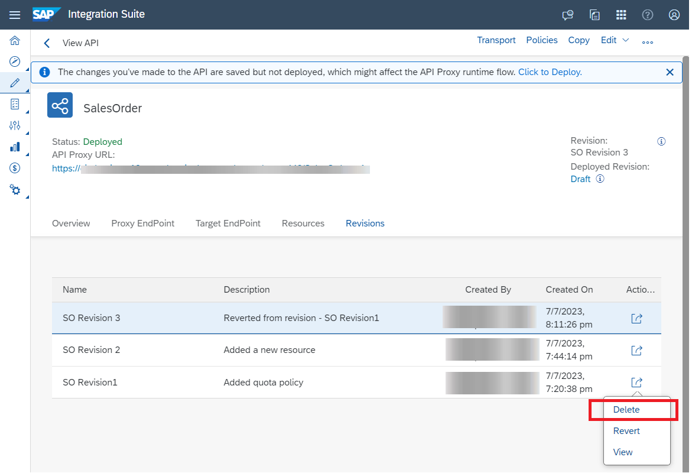

>**Note** You can’t delete a Draft if both the working and the deployed copy are the same. If only one revision exists at any given point in time, you can’t delete the same from the inline actions button. In such a scenario, you need to delete the proxy. You can do so by choosing the **Delete** option from the **Additional Options** on the top-right corner of the page.
    

