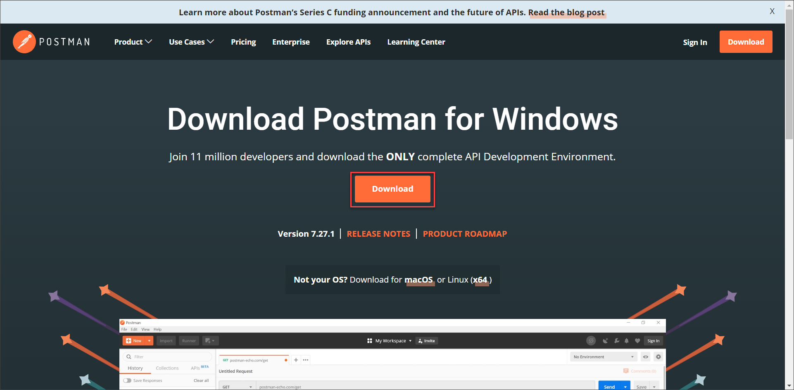
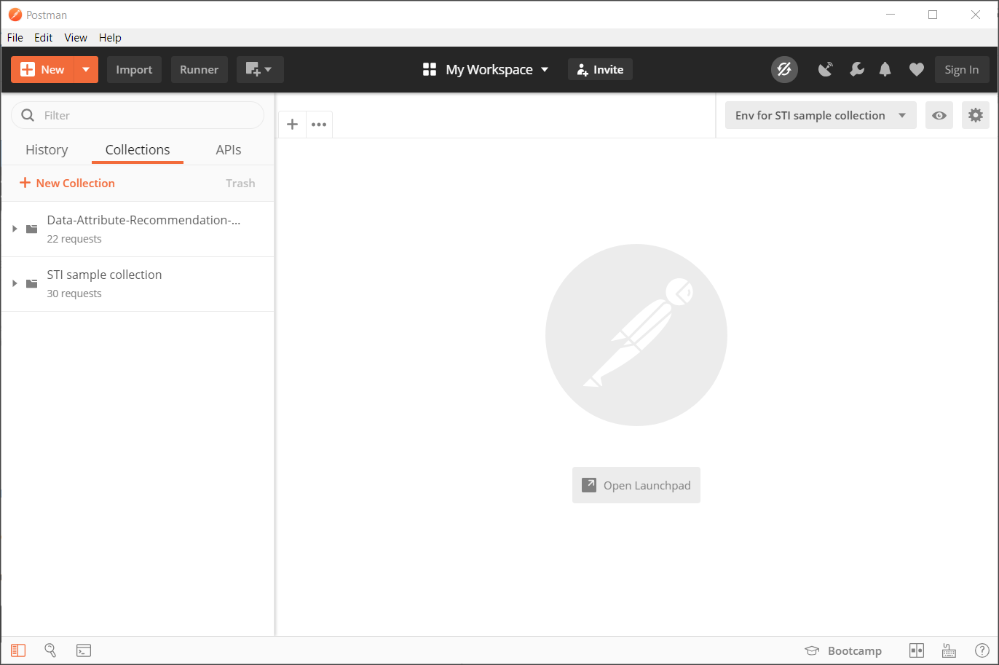
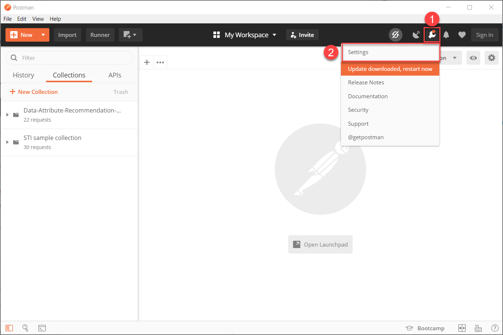
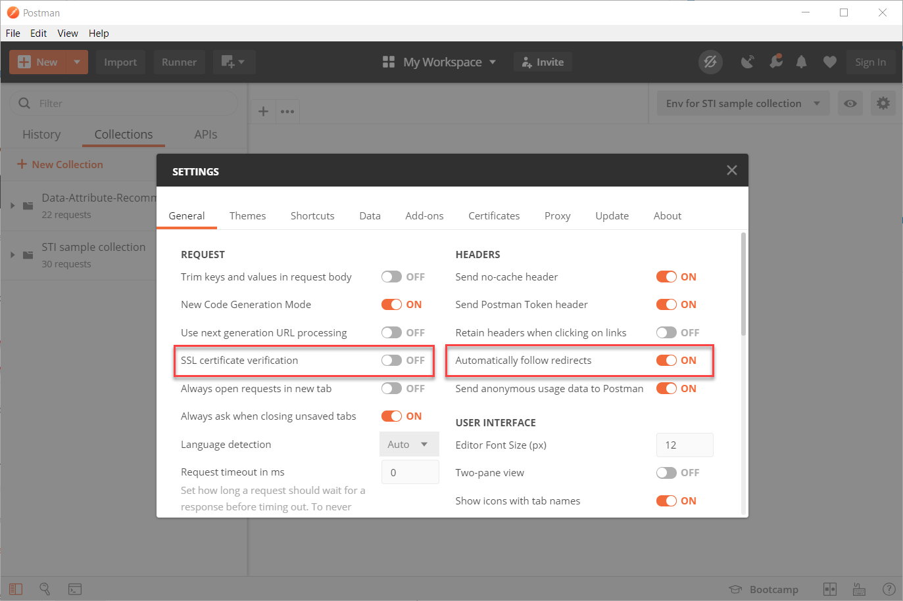

## Details
### You will learn
 - How to install and configure the [Postman](https://www.getpostman.com/) client

[ACCORDION-BEGIN [Step 1: ](Install Postman)]

Go to <https://www.getpostman.com/downloads/> to download Postman. Once downloaded, follow the installation instructions.

[DONE]
[ACCORDION-END]

[ACCORDION-BEGIN [Step 2: ](Configure Postman)]

Open Postman by searching for it in your programs.

Click on the **Tools** icon , then select **Settings** from the menu.

Disable the **SSL certificate verification** and enable the **Automatically follow redirects** option as highlighted.

You are now all set to move to your next tutorial.

[DONE]
[ACCORDION-END]
