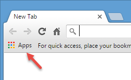
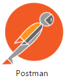
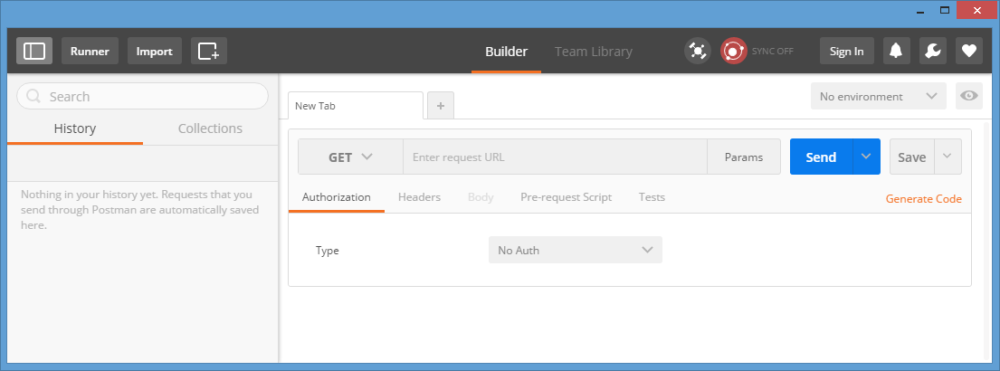
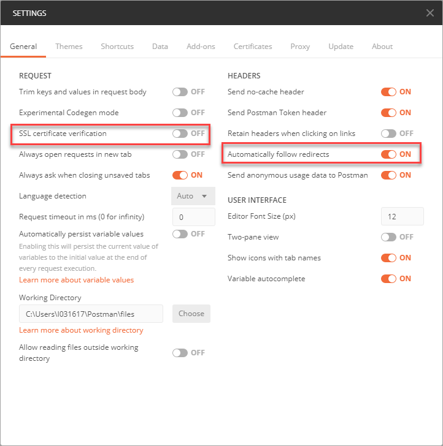

## How-To Details
In this ***how-to*** guide, you learn how to install and configure the [Google Chrome Postman extension](http://chrome.google.com/webstore/detail/postman/fhbjgbiflinjbdggehcddcbncdddomop/).

Postman will allow you to interact with REST API. In addition, you will
 setup the Postman Interceptor extension so that you can reuse your current Google Chrome session cookies while interacting with the APIs.

---

[ACCORDION-BEGIN [Step 1: ](Install Google Chrome)]

If you haven't done so yet, please install [Google Chrome](https://www.google.com/chrome/).

[ACCORDION-END]

[ACCORDION-BEGIN [Step 2: ](Install the Postman extension for Chrome)]

Open **Google Chrome** and install the [Chrome Postman extension](http://chrome.google.com/webstore/detail/postman/fhbjgbiflinjbdggehcddcbncdddomop/).

[ACCORDION-END]

[ACCORDION-BEGIN [Step 3: ](Install the Postman Interceptor extension for Chrome)]

Install the [Postman Interceptor extension](https://chrome.google.com/webstore/detail/postman-interceptor/aicmkgpgakddgnaphhhpliifpcfhicfo).

[ACCORDION-END]

[ACCORDION-BEGIN [Step 4: ](Configure Postman)]

Click on **Apps**

Click on the **Postman** icon

You will get access to all the ***Google Chrome*** installed extension.

Click on **Postman**

You are almost set to move to your next tutorial.

Enable the Interceptor by clicking on the Interceptor icon as highlighted.

Click on the **Tools** icon , then select **Settings** from the menu.

Enable the ***Automatically follow redirects*** option as highlighted.

You are now all set to move to your next tutorial.

[ACCORDION-END]

