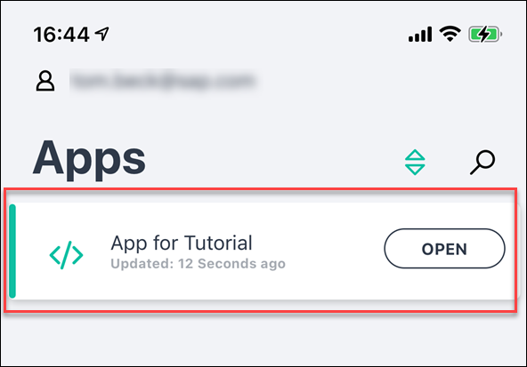

# Configure SAP Build Application to Open Device Camera
<!-- description --> Configure the logic flow in your application to enable your device to open your camera on demand, whenever the user clicks the Scan button.

## You will learn
  - How to add logic to a button in your mobile application
  - How to connect user interface elements to actions in your mobile application

## Intro
Logic flows are used to capture events in an application, such as a page loading or a user tapping on a button, and to execute actions. To create a barcode scanning app, you need to configure a logic flow that tells your application to open the camera device once the user taps the **Scan** button. To do this, we'll show you how to add the logic to the button, then how to take advantage of SAP Build Apps's QR and Barcode component.

---

### Add logic to button

Open your app, and in the Composer, click the **Scan** button and then click **Add Logic to BUTTON 1** (bottom right).

### Add scan QR/barcode component

In the logic panel, you can see the ***Event - Component Tap***, which captures when a user taps on the button within the application. We now need to decide what this event triggers.

1. Using the core logic components, scroll down to the ***Device – Scan QR / barcode*** component and drag and drop this into the logic editor. This is a preconfigured QR or barcode scanner component provided by SAP Build Apps, one of many available within your SAP Build Apps account.  

    

2. Click the existing ***Component Tap*** connection and manually draw a connection to the ***Device*** connector. This connector simply indicates the flow direction, which in this case is the button being tapped and then that triggering the camera device opening.

    

### Add an alert element

To test that the QR/barcode scanner is working, you'll add an Alert component to the application. This will simply show a pop-up alert once a barcode has been scanned, returning the barcode number to the screen.

1. To do this, return to the core logic options, scroll to **Alert**, and drag and drop this alongside the Scan QR/barcode logic.

    

2. Add a connector between the top **Scan QR/Barcode** option and the **Alert** element, again indicating the flow direction.

    

    >There are 3 outputs for the scan element. Connect the top output to the alert logic.

### Bind elements 

As the alert is currently set to display a static text response only, we want to add a dynamic binding here. This allows us to tell the app what information to provide instead, which in our case is the barcode being scanned.

1. To do this, select the **Alert** element and using the properties panel, click **Currently bound to: Static text**, opening the binding options screen.

    

2. Click **Output value of another node**.

    

    Configure the binding to the following:

    - Select logic node – Scan QR/barcode
    - Select node output – Scan QR/barcode / QR barcode content

3. Click **Save**.

    

### Save and preview

1. Click **Save** in the upper right, to save all changes to the application.

    

2. Using your device, open your draft application in the SAP Build Apps preview app and test the feature with a food item barcode.

    

    Tapping the **Scan** button will now automatically open your device camera.

    

    And scanning a barcode will return the barcode number only, as no further information has been configured for the event yet.

As an example:

If you can't find a barcode, here's an example:

  