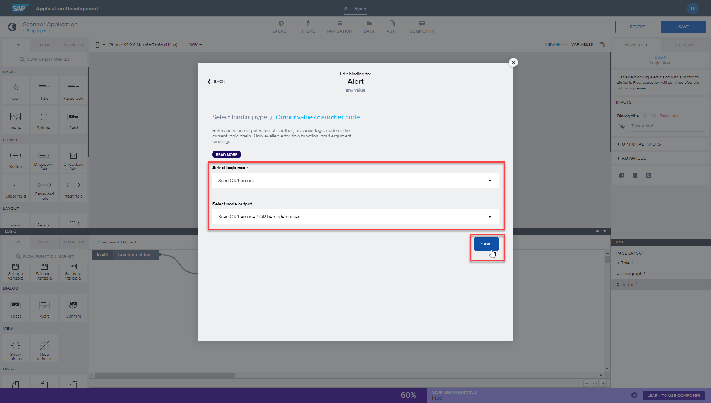
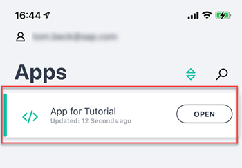
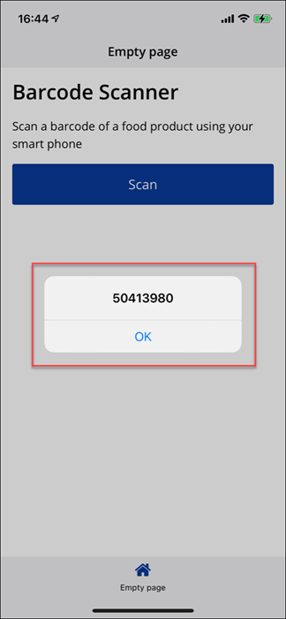

## Prerequisites
 - Access to an SAP BTP account in EU10 with Low-Code / No-Code entitlements
 - Previously followed the steps provided in [Create a Low-Code Application with SAP AppGyver](appgyver-create-application)
 - Access to the AppGyver Previewer App on a smart phone or tablet: [iOS](https://apps.apple.com/us/app/sap-appgyver-preview/id1585856868) / [macOS](https://apps.apple.com/fi/app/appgyver/id1485395192)/ [Android](https://play.google.com/store/apps/details?id=com.sap.appgyver.preview.release)

## Details
### You will learn
  - How to add logic to a button in your mobile application
  - How to connect user interface elements to actions in your mobile application

  Logic flows are used to trigger events in an application, such as a page loading or a user tapping on a button. To create a barcode scanning app, you need to configure a logic flow that tells your application to open the camera device once the 'Scan' button has been tapped. To do this, we'll show you how to add the logic to the button, then how to take advantage of AppGyver's QR and Barcode component.

---

[ACCORDION-BEGIN [Step 1: ](Add logic to button)]

Open your draft application in your AppGyver Composer account, displaying your barcode scanner app.

Click **Scan** button and then click **Add Logic to BUTTON 1**.

[DONE]
[ACCORDION-END]

[ACCORDION-BEGIN [Step 2: ](Add scan QR/barcode component)]

In the logic panel, you can see the ***Event - Component Tap***, which is when a user taps on the button within the application. We now need to decide what this event triggers.

Using the core logic components, scroll down to the ***Device – Scan QR / barcode*** component and then drag and drop this into the logic editor. This is a preconfigured QR or barcode scanner component provided by AppGyver, one of many available within your AppGyver account.  

Click the existing ***Component Tap*** connection and manually draw a connection to the ***Device*** connector. This connector simply indicates the flow direction, which in this case is the button being tapped and then that triggering the camera device opening.

[DONE]
[ACCORDION-END]

[ACCORDION-BEGIN [Step 3: ](Add an alert element)]

To test that the QR / barcode scanner is working, we now want to add an Alert component to our application. This will simply show a pop-up alert once a barcode has been scanned, returning the barcode number to the screen.

To do this, return to the core logic options, scroll to ***Alert***, and drag and drop this alongside the Scan QR / barcode logic.

Add a connector between the top ***Scan QR / Barcode*** option and the ***Alert*** element, again indicating the flow direction.

[DONE]
[ACCORDION-END]

[ACCORDION-BEGIN [Step 4: ](Bind elements)]

As the alert is currently set to display a static text response only, we want to add a dynamic binding here. This allows us to tell the app what information to provide instead, which in our case is the barcode being scanned.

To do this, select the **Alert** element and using the properties panel, click **Currently bound to: Static text**, opening the binding options screen.

Click **Output value of another node***.

Configure the binding to the following:

- Select logic node – Scan QR/barcode
- Select node output – Scan QR/barcode / QR barcode content

Click **Save**.

[DONE]
[ACCORDION-END]

[ACCORDION-BEGIN [Step 5: ](Save and preview)]

Click **Save**.

Using your device, open your draft application in the ***AppGyver Preview*** app and test the feature with a food item barcode.

Tapping the **Scan** button will now automatically open your device camera.

And scanning a barcode will return the barcode number only, as no further information has been configured for the event yet.

As an example:

[VALIDATE_4]
[ACCORDION-END]
