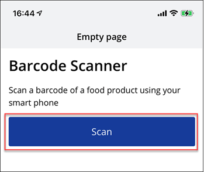

 

# Configure SAP Build Application to Open Device Camera
<!-- description --> Configure the logic flow in your application to enable your device to open your camera on demand, whenever the user clicks the Scan button.

## You will learn
  - How to add logic to a button in your mobile application

## Intro
Logic flows are used to capture events in an application, such as a page loading or a user tapping on a button, and to execute actions – for example, to change the value of data or to open the device's camera.

To create a barcode scanning app, you need to configure a logic flow that tells your application to open the camera device once the user taps the **Scan** button. To do this, we'll show you how to add the logic to the button, then how to take advantage of SAP Build Apps's QR and Barcode component.

### Add logic to button

Open your app, and in the UI canvas, click the **Scan** button and then click **Add Logic to BUTTON 1** (bottom right).

You should now see the logic canvas.

### Add scan QR/barcode component

In the logic panel, you can see the **Event - Component Tap**, which is triggered when a user taps on the button. We now need to decide what this event will do.

1. In the **Core** tab at the bottom left, scroll down to the **Device – Scan QR / barcode** flow function and drag this into the logic canvas.

    This flow function will display a preconfigured QR/barcode scanner component provided by SAP Build Apps, one of many available within your SAP Build Apps account.  

    

    After dropping it, it will look like this.

    

2. Click the **Component Tap** event and draw a connection from its output to the input of the **Device** flow function. 

    >This connection simply indicates the flow direction, which in this case is the button being tapped and then that triggering the camera device opening.

    

### Add an alert element

To test that the QR/barcode scanner is working, you'll add an **Alert** flow function to the application. This will simply show a pop-up alert once a barcode has been scanned, returning the barcode number to the screen.

1. From the **Core** tab, drag an **Alert** flow function alongside the **Scan QR/barcode** logic.

    

2. Connect the top **Scan QR/Barcode** output to the **Alert**.

    

    >There are 3 outputs for the scan flow function. Connect the top output to the alert logic.
    >
    >For each flow function with multiple outputs, the outputs may represent different flows. For the scan flow function, the outputs mean:
    >
    >- User successfully scans a QR/barcode
    >
    >- User cancels before scanning
    >
    >- Error

### Bind elements 

As the alert is currently set to display a static text response only, we want to add a dynamic binding here. This allows us to tell the app what information to provide instead, which in our case is the barcode being scanned.

1. Select the **Alert** flow function.

2. In the **Properties** tab, find the **Dialog title** property, and click the binding type (currently **ABC** or static text).
    
    

3. Click **Output value of another node**.

    

    Select **Scan QR/Barcode**.

    >This selects which flow function's output you want to take from. Only flow functions on the path leading up to the current flow function are available.

    

    Select **QR barcode content**.

    >This selects which of this flow function's outputs you want to take from. In this case, the **Scan QR/Barcode** flow function only outputs a single text output, the QR or barcode.

    

    Click **Save** in the dialog.

    

### Save and preview

1. Click **Save** in the upper right, to save all changes to the application.

    

2. Using your device, open your draft application in the SAP Build Apps preview app.

    >If the app timed out, you will have to go back to the launch tab to start it again, as described in the first tutorial.

    

    Tap **Scan**.

    

    Scan the following barcode.
   
    
   
    As soon as the barcode comes within the camera's sights, the camera will close and the barcode will be saved in the app.

    

    The alert box that you configured to be shown after a successful scan is now displayed with the barcode number.

    

    

    Here is a QR code. Scan it and enter the text below.
