 
# Connect Your SAP Build Application to a Public API
<!-- description --> Connect your application to a public API and then test that it's pulling the right information.

## You will learn
  - How to add and configure data resources
  - How to test data resources

In the previous tutorial, you configured your application to open a device camera once the scan button is tapped. This currently reads the barcode and displays the barcode number.

To improve on this, you will configure a data source that has food information related to that barcode. For this tutorial, you will use the Open Food Facts public API.


### Add data resources


1. Open your app to the **Integrations** tab.
   
    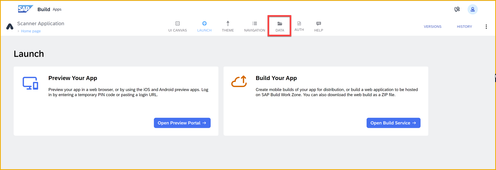

2. Click **SAP Build Apps classic data entities**.

    Select **Universal REST API integration**.

    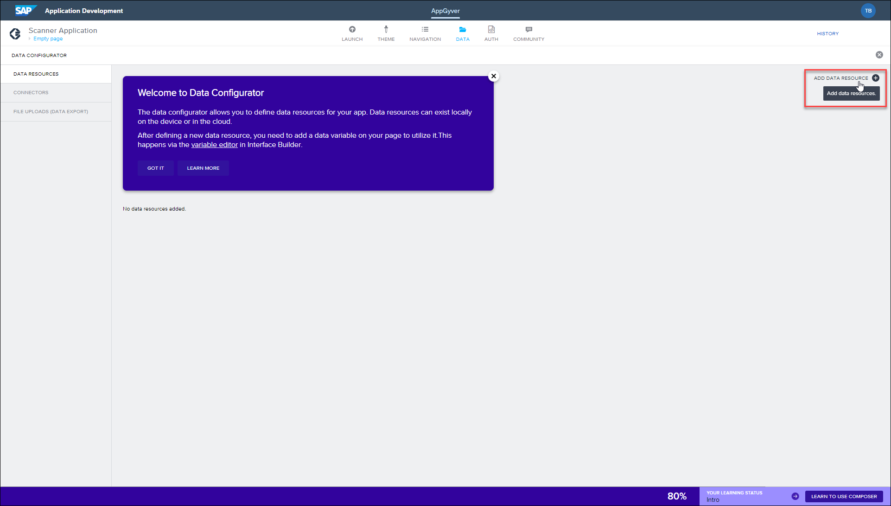

3. Configure the resource with the following details:

    | Field | Value |
    |-------|-------|
    | **Data entity name** | `OpenFoodFacts` |
    | **Base API URL** | <https://world.openfoodfacts.org/api/v0> |
    | **Data entity description** | Data from Open Food Facts API |

    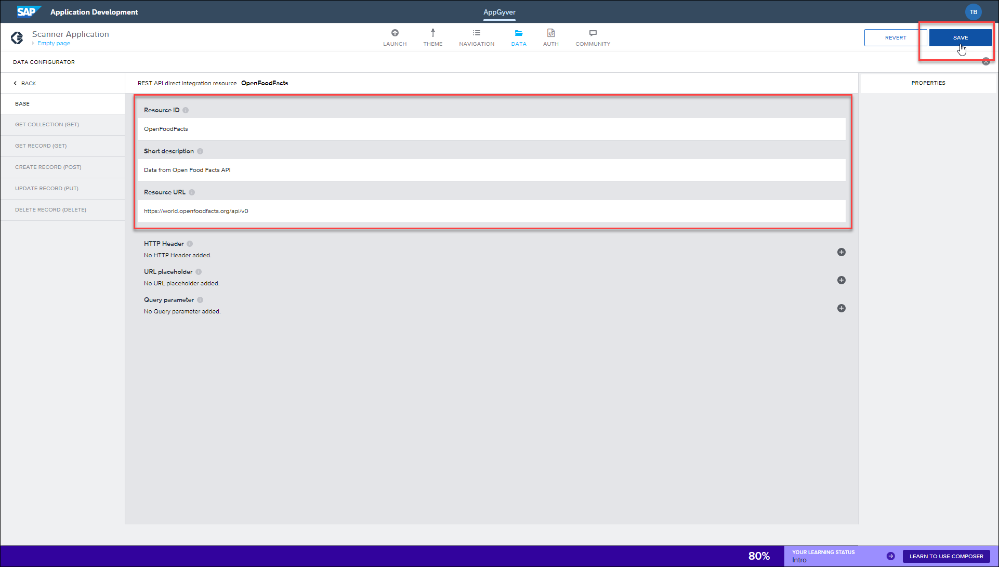

4. Scroll down to the **Additional Inputs** section, and click **Add New** to add a placeholder for a parameter in the URL.

    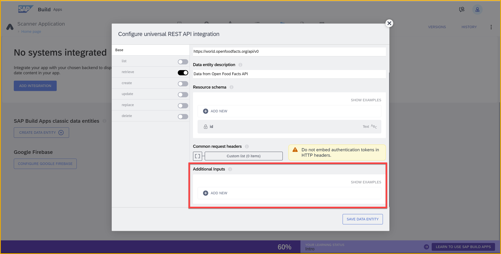

    >The API enables us to send a barcode as part of the URL, and then returns information about the food with that barcode.

    In the dialog, add a field called **barcode** of type **text**. Click **Add**.

    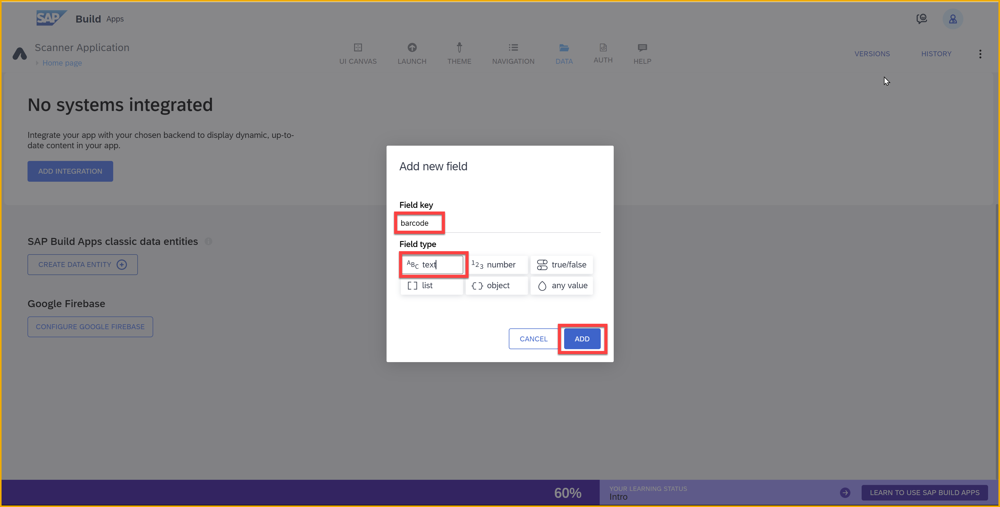

    If you scroll down you will see the additional input.

    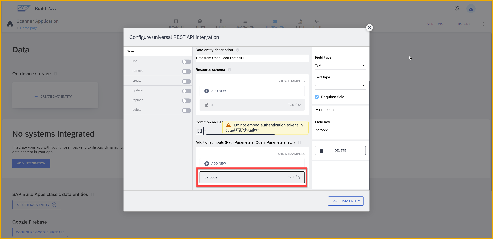


### Configure retrieve data
You now need to configure which information is taken from the Open Food Facts API. This can be achieved using a **Retrieve** request.

1. Click on **Retrieve** and enable the request by turning on the toggle switch.

    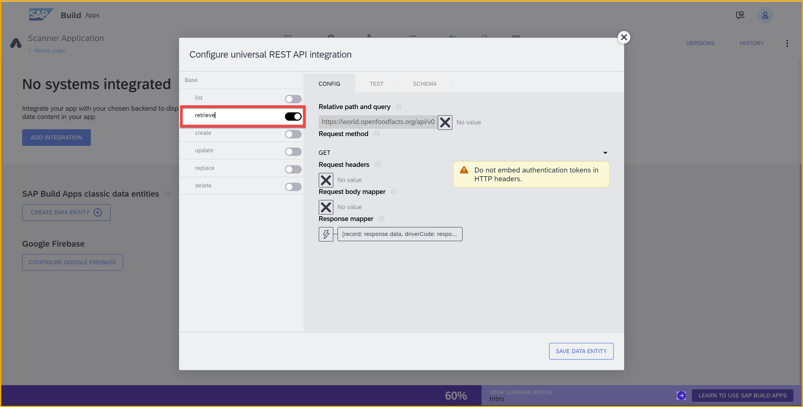

3. In the **Relative path and query** field enter, click on the **X**.

    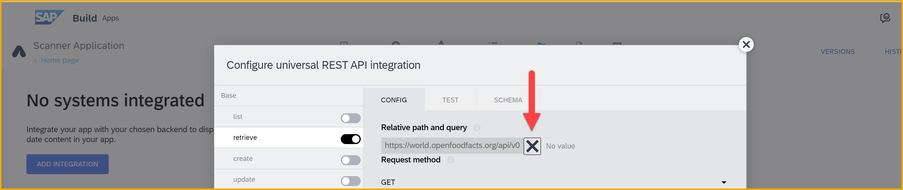

    Select **Formula**.

    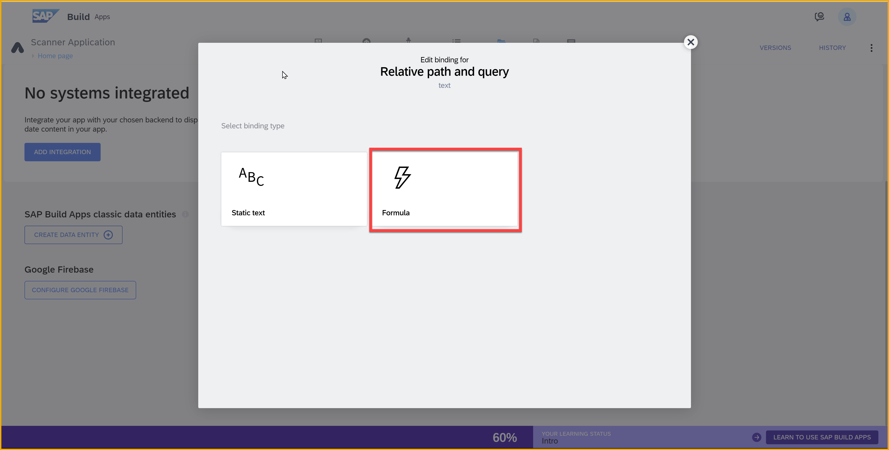

    Click **Create formula**.

    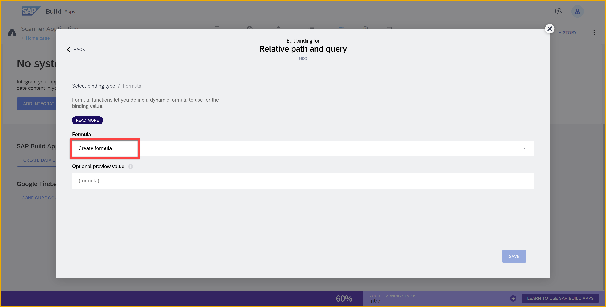

    Enter the following formula:

    ```JavaScript
    "/product/" + query.additionalInputs.barcode
    ```

    Click **Save** twice.


### Test data sources
You will now test to see if the resource is configured properly.

1. Go to the **Test** tab.

    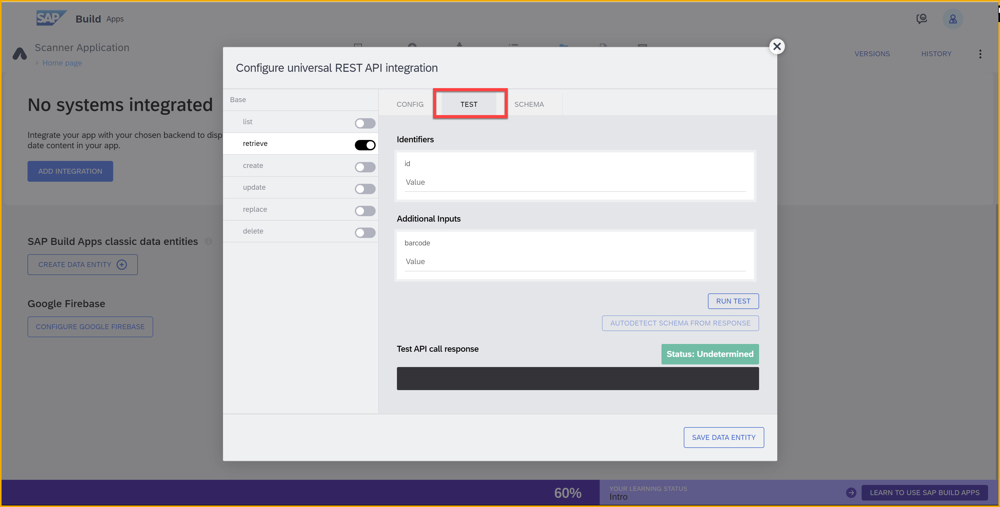

2. In the **barcode** additional inputs,  enter the following:

    ```JavaScript
    6416453061361
    ```

    Click **Run Test**.

    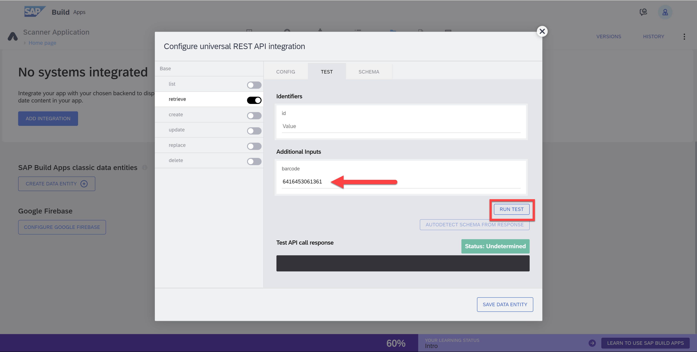

3. Scroll down a little to see the response.

    In this response, you can see information about the product. This includes the product categories, allergen information, and the brand that manufactured the product.

    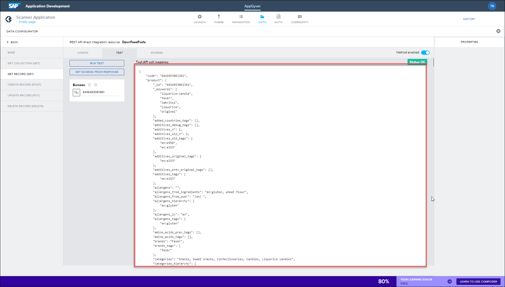


### Set schema from response

After a successful test you should now set the data schema. This stores the data structure from the URL, enabling the application to easily identify the types of information it is fetching.

1. In the same window where you did the test, click **Autodetect Schema from Response**.

    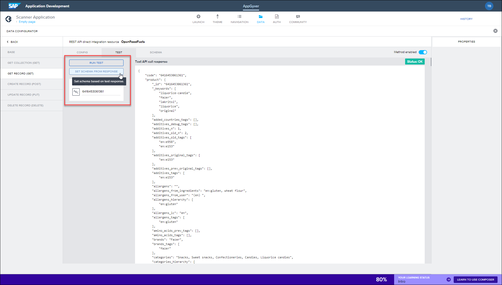

    If you click back to the **Base** tab, you will see the response schema now set.

    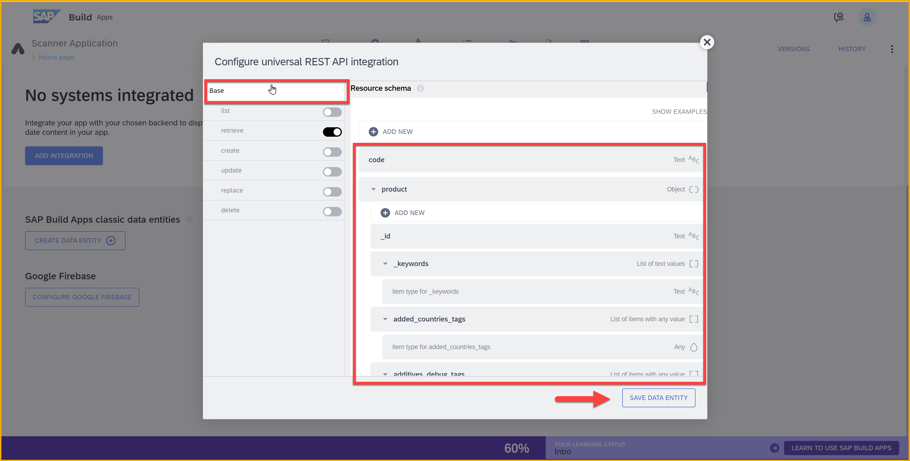

2. Click **Save Data Entity** (bottom right).

3. Click **Save** (upper right).


