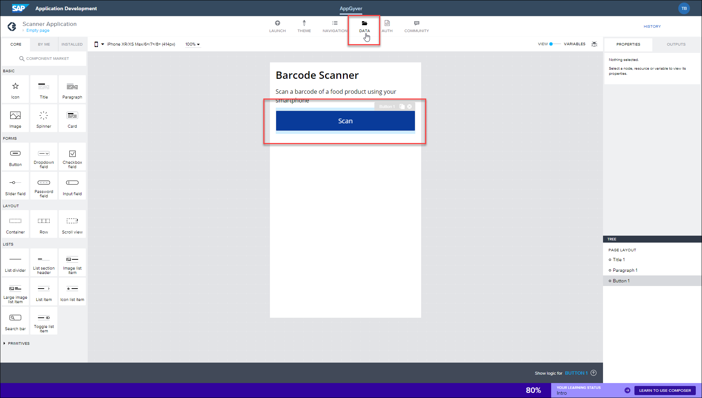

## Prerequisites
 - Access to an SAP BTP account in EU10 with Low-Code / No-Code entitlements
 - Previously followed the steps provided in [Configure your AppGyver Application to Open your Device Camera](appgyver-configure-camera)
 - Access to the AppGyver Previewer App on a smart phone or tablet: [iOS](https://itunes.apple.com/us/app/appgyver/id1311492157) / [Android](https://play.google.com/store/apps/details?id=com.appgyver.agclient)

## Details
### You will learn
  - How to add and configure data resources in your AppGyver application
  - How to call a public API by scanning a barcode

  In the previous tutorial, you configured your application to open a device camera once the scan button had been tapped. This currently reads the barcode and returns only the barcode number, which on it's own is just a reference with no further information. To improve this, you need to configure a data source connected to that information. In this example, we'll use the Open Food Facts public API. Here the application will make a HTTPS request to their URL, returning the information provided there.

---

[ACCORDION-BEGIN [Step 1: ](Add data resources)]

Open your draft application in your AppGyver Composer account, displaying your barcode scanner app.

Click your **Scan** button and then click **Data**.

Click **Add Data Resources – Rest API direct integration**.

Now configure the resource with the following details:

- ***Resource ID***: `OpenFoodFacts`
- ***Short description***: Data from Open Food Facts API
- ***Resource URL***: <https://world.openfoodfacts.org/api/v0>

Click **Save**, saving the data resource.

[DONE]
[ACCORDION-END]

[ACCORDION-BEGIN [Step 2: ](Configure Get Record data)]

You now need to configure which information is taken from the Open Food Facts API. For your application, you need to configure this to fetch the barcode information, since that's what's being scanned with the device camera. This can be achieved using a 'Get Record' request.

To configure this, click **Get Record (Get)**.

In the ***Relative path*** field enter:

`/product/{barcode}.json`

Click the existing **URL placeholder key**, and then configure the following settings:

- ***Label***: Barcode
- ***Key***: barcode
- ***Value type***: Text
- ***Description***: Resource ID to retrieve
- ***Is encoded***: Enabled
- ***Is static***: Disabled
- ***Is optional***: Enabled

[DONE]
[ACCORDION-END]

[ACCORDION-BEGIN [Step 3: ](Test data sources)]

To now test that the HTTPS is configured and able to fetch information, click **Test**.

Click **Currently bound to: static text**.

Click **Static Text**.

Enter **6416453061361** into the ***Type a text*** field. This is an example barcode number, taken from a confectionary wrapper.

Click **Run Test**.

The test now runs, displaying a Test API call response. In this response, you can see information about the confectionary. This includes the product categories, allergen information, and the brand who manufactured the product.

[DONE]
[ACCORDION-END]

[ACCORDION-BEGIN [Step 4: ](Set schema from response)]

After a successful test you should now set the data schema. This stores the data structure from the URL, enabling the application to easily identify the types of information it is fetching.

To do this, click **Set Schema from Response**.

Click **Save**.

Your draft application is now saved and available in your AppGyver Preview app.

[VALIDATE_4]
[ACCORDION-END]
