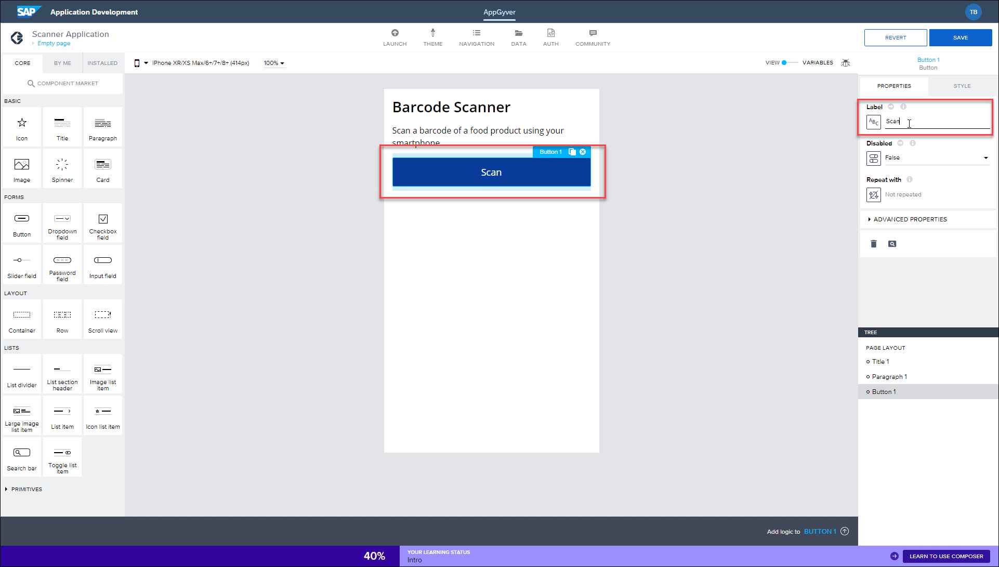

# Create an Application with SAP AppGyver
<!-- description --> Create an application with SAP AppGyver on SAP BTP. The application, created in a browser, can be used with the AppGyver Previewer App to scan physical barcodes on food packaging to display calorific information.

## Prerequisites
- Either an SAP BTP version of SAP AppGyver, as described in [Subscribe to the Low-Code / No-Code Service in SAP BTP](appgyver-subscribe-service) or the free community edition of SAP AppGyver, available at [AppGyver.com] (https://www.appgyver.com).
 - Access to the AppGyver Previewer App on a smart phone or tablet: [iOS](https://apps.apple.com/us/app/sap-appgyver-preview/id1585856868) / [macOS](https://downloads.appgyver.com/SAP_AppGyver_preview_v3.4.4.zip)/ [Android](https://play.google.com/store/apps/details?id=com.sap.appgyver.preview.release)

## You will learn
  - How to create a no-code project with SAP AppGyver
  - How to add and edit visual elements in the AppGyver Composer tool

## Intro
In this mission you will learn how to create a no-code application using the SAP AppGyver Composer tool. The application you create will enable you to scan a barcode on a smartphone and retrieve information from a public API. To do this, you will need to download the SAP AppGyver Preview app (available through iTunes and Google Play store).

The application you'll create across the tutorials will read barcodes from food packaging and display information about the product using the Open Food Facts API:

The steps provided detail the process using an SAP BTP account within a desktop browser. It is also possible to replicate many of the steps using a free account from [AppGyver.com](https://AppGyver.com).

All applications are created, edited, and managed within what we call a project, with one application created per project. Projects, and their related applications, are not automatically saved in this service, so care should be taken before closing a browser.

---

### Create SAP AppGyver project

>If you are working with the free version, just click **Create New**, fill in a name, and click **Create**.
>
> 

1. In BTP, SAP AppGyver projects are created from the application development lobby. To access this lobby from the SAP BTP Cockpit, click **Services - Instances and Subscriptions** and then select **SAP AppGyver**.

    

2. Within the application development lobby, click **Create** and then select **AppGyver Project**.

    

3. Enter `Scanner Application` for the project name, and an optional description, then click **Create**.

    

Your AppGyver application is created, with the AppGyver Composer Pro view displayed. Once created, projects can be accessed again at any time from your application development lobby.

### Understand SAP AppGyver

When working with AppGyver Composer Pro, the majority of your time will be spent in the App builder area. This area allows you to complete key tasks such as, but not limited to, the following:

- Define your app's structure and navigation logic
- Build pixel-perfect user interfaces
- Create complex logic with visual programming
- Integrate with external data resources
- Bind data to your components to create dynamic views, and more

For more detailed coverage of the features available in AppGyver's Composer Pro, view the [AppGyver documentation](https://docs.appgyver.com/).

### Edit app interface

You'll now start to create a basic layout for your application, starting with editing text.

Click the existing **Headline** field and edit the text to read:  `Barcode Scanner`

Click the **Paragraph** field and edit the text to read: `Scan a barcode of a food product using your smartphone`

### Add scan button

Next, you'll need to add a Scan button which, when tapped, will open the camera device on your smartphone.

To do this, locate the **Button** component (found under **Core > Forms**) and drag and drop this underneath the paragraph field.

Edit the Button text to read `Scan`.

Click **Save**.

The application is now saved in draft and available to preview using the AppGyver Preview app on your smartphone.

### Preview app in AppGyver previewer

Once downloaded to your smartphone, you can log into your AppGyver account using a QR code.

To scan the QR code, click **Launch**.

Then using your AppGyver Preview app login screen, scan the available QR code.

The application refreshes and your project is available to view.

