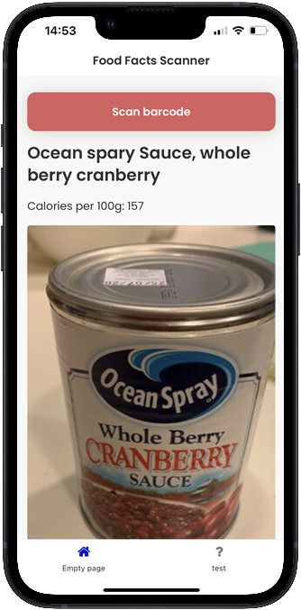

 
# Display Fetched Data in Your SAP Build Application
<!-- description --> Display data fetched from a public API, such as product names and calorific information, in your SAP Build application.

## You will learn
  - How to display data fetched from a public API within an SAP Build application

In the previous tutorial, you learned how to configure your application to read specific information from an API once a barcode has been scanned. Now, in this final tutorial for this mission, you will learn how to display the fetched information on your application interface.

---

### Add text components to app

To start with, you'll add further visual information to your app in the form of a title and a paragraph of text. This will eventually be used to display specific calorific information obtained from scanning a food item.

1. From the core component panel, drag and drop a **Title** component underneath your ***Scan*** button in your app.

    

2. Click the **Title** component and change the **Content** to `Product Information`.

    

3. From the core component panel, drag and drop a **Text** component to underneath this title.

    


### Display product name

This paragraph now needs to be bound to the data variable you configured in earlier tutorials. This will allow you to define what food information to display once it has been fetched from the API, as you may not want to display all information available for each food item.

For this example, we will show you how to display the Product Name and Energy-kcals_100g fields.

1. To display the product name, click your **Text** component and then click **Currently bound to: Static text**.

    

    >**IMPORTANT:** The following provides 2 ways to do this. The first way is the standard way, but for some people this may cause the SAP Build Apps editor to hang (you can click to exit). So we have provided a second way to store the data using a formula.

    - Select **Data and Variables**.

        

        Select **Data Variables** and then click your ***Open food facts*** variable.

        Scroll down to and select the `product_name` field. For this, we suggest using the 'Find text' function within your browser.

        

    - Instead, you can do the same thing with a formula. Most, if not all, bindings can be done with the UI or manually with a formula.

        Select **Formula** (instead of **Data and Variables**), and then enter for the formula the following:

        ```JavaScript
        data.OpenFoodFacts1.product.product_name
        ```

2. Click **Save**.

    

The paragraph will now display the product name of the scanned food item.


### Display calorific information

We'll now add the calorific information to your app, using the same steps provided in for the product name information. Repeat Step 1 and Step 2, adding a new text component to your interface.

1. Click your **Text** component and then click **Currently bound to: Static text**.

    

    >**IMPORTANT:** The following provides 2 ways to do this. The first way is the standard way, but for some people this may cause the SAP Build Apps editor to hang (you can click to exit). So we have provided a second way to store the data using a formula.

    - Select **Data and Variables**.

        

        Select **Data Variables** and then click your ***Open food facts*** variable.

        Scroll down to and select the `energy` field. For this, we suggest using the 'Find text' function within your browser.

    - Instead, you can do the same thing with a formula. Most, if not all, bindings can be done with the UI or manually with a formula.

        Select **Formula**, and then enter for the formula the following:

        ```JavaScript
        data.OpenFoodFacts1.product.nutriments.energy
        ```

2. Click **Save**.

    

The paragraph will now display the calorific information of the scanned food item.

Should you wish, you can now continue to add other information from the API using the same steps.


### Display image

We'll now display the image for the product (if there is one).

1. Add an image component after the calorific text field you added in the previous step.

2. Click the **Source** binding in the **Properties** pane.

    

    Select **Formula**, and then enter for the formula the following:

    ```JavaScript
    data.OpenFoodFacts1.product.image_front_url
    ```

    Click **Save**.


### Save and test

Now click **Save** (for the app, upper right).


Your draft application is now complete, allowing you to scan a food item and then read the product name and calorific information per 100g. To do this, open your Preview app and test the scan feature.

In this example, we are scanning some canned item:


Here's the barcode:


With the app returning the product name and the calorific information:



