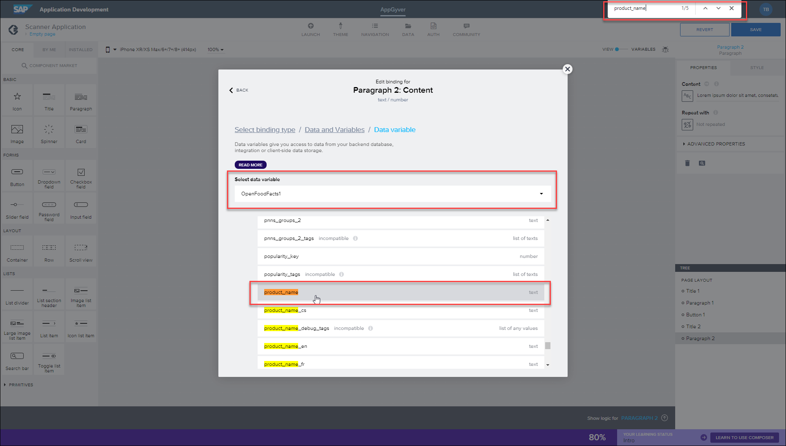

 
# Display Fetched Data in Your App
<!-- description --> Display data fetched from a public API, such as product names and calorific information, in your SAP Build app.

## You will learn
  - How to display fetched API data in your app

In the previous tutorial, you learned how to configure your application to read specific information from an API once a barcode has been scanned. Now, in this final tutorial for this mission, you will learn how to display the fetched information on your application interface.

### Add text components to app

To start with, you'll add further visual information to your app in the form of a title and a paragraph of text. This will eventually be used to display specific calorific information obtained from scanning a food item.

1. From the **Core** component tab, drag a **Title** component underneath your **Scan** button.

    

2. Click **Headline** in the **Title** component and type in `Product Information`.

    

3. Drag a **Text** component underneath the title.

    


### Display product name
You will now bind the **Product Name** and **Energy-kcals_100g** fields to the title and text components.

1. Select the **Text** component.

    In the **Properties** tab, click the binding type square (shown as **ABC** or static text).

    

2. Now you will select what to bind.

    >**IMPORTANT:** The following provides 2 ways to do this. The first way is the standard way, but for some people this may cause the SAP Build Apps editor to hang (probably only for a few seconds but you can always click to exit). So we have provided a second way to store the data using a formula.

    - Select **Data and Variables**.

        

        Select **Data Variables** and then click your **Open food facts** variable.

        Scroll down to and select the `product_name` field. For this, we suggest using your browser's search.

        

        The browser may hang, but only for a few seconds.

        

        Click **Save**.

    - Instead, you can do the same thing with a formula. Most, if not all, bindings can be done with the UI or manually with a formula.

        Select **Formula** (instead of **Data and Variables**), and then enter for the formula the following:

        ```JavaScript
        data.OpenFoodFacts1.product.product_name
        ```

        

        Click **Save** twice.

3. Click **Save** (upper right).

The paragraph will now display the product name of the scanned food item.


### Display calorific information
We'll now add the calorific information to your app, using the same steps provided for the product name. 

1. Add another **Text** component below the first one.

    

2. With the new **Text** component selected, click the binding type square (shown as **ABC** or static text).

    

2. Now you will select what to bind.

    >**IMPORTANT:** The following provides 2 ways to do this. The first way is the standard way, but for some people this may cause the SAP Build Apps editor to hang (probably only for a few seconds but you can always click to exit). So we have provided a second way to store the data using a formula.

    - Select **Data and Variables**.

        

        Select **Data Variables** and then click your ***Open food facts*** variable.

        Scroll down to and select the `energy` field. For this, we suggest using your browser's search.

        

        The browser may hang, but only for a few seconds.

        

        Click **Save**.

    - Instead, you can do the same thing with a formula. 

        Select **Formula** (instead of **Data and Variables**), and then enter for the formula the following:

        ```JavaScript
        data.OpenFoodFacts1.product.nutriments.energy
        ```

        

        Click **Save** twice.

3. Click **Save** (upper right).


### Display image
We'll now display the image for the product (if there is one).

1. Add an **Image** component after the calorific text field you added in the previous step.

    

2. With the **Image** component selected, go to the **Properties** tab.

    Click the binding square for the **Source** property.

    

    Select **Formula**, and then enter following formula:

    ```JavaScript
    data.OpenFoodFacts1.product.image_front_url
    ```

    Click **Save** twice.

3. Click **Save** (upper right**).

    


### Test
Your app is now complete.

It enables you to scan a barcode of a food item and retrieve the product name and calorific information per 100g.

1. Open the SAP Build Apps preview app, and select your app to preview.
   
   >If the preview app timed out, go to the **Launch** tab and reopen the app. Instructions are in the first tutorial of this mission.

2. Click **Scan**. The camera will open to let you scan a barcode.

    

    Scan this barcode.

    

    The app should displayed the following information and image.

    

