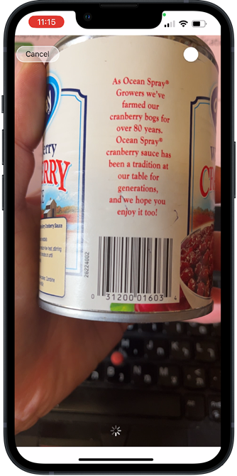

 
# Display Fetched Data in Your App
<!-- description --> Display data fetched from a public API, such as product names and calorific information, in your SAP Build app.

## You will learn
  - How to display fetched API data in your app

In the previous tutorial, you learned how to configure your application to read specific information from an API once a barcode has been scanned. Now, in this final tutorial for this mission, you will learn how to display the fetched information on your application interface.

### Add text components to app

To start with, you'll add further visual information to your app in the form of a title and a paragraph of text. This will eventually be used to display specific calorific information obtained from scanning a food item.

1. From the **Core** component tab, drag a **Title** component underneath your **Scan** button.

    

2. Click **Headline** in the **Title** component and type in `Product Information`.

    

3. Drag a **Text** component underneath the title.

    


### Display product name
You will now bind the **Product Name** field to the text component.

1. Select the **Text** component.

2. In the **Properties** tab, click the binding type square (shown as **ABC** or static text) for the **Content** property.

    

    Select **Data and Variables**.

    

    Select **Data Variables**.
    
    

    Click your **Open food facts** variable.

    Scroll down to and select the `product_name` field. For this, we suggest using your browser's search.

    

    The browser may hang, but only for a few seconds.

    

    Click **Save**.

3. Click **Save** (upper right).

The paragraph will now display the product name of the scanned food item.


### Display calorific information
We'll now add the calorific information to your app, using the same steps provided for the product name. 

1. Select the text component for the product, and duplicate it.

    

2. Select the duplicated text component, and click the binding (NOT the binding type square) for the **Content** property.

    

3. Select the field under **Select data variable field** (currently assigned **product_name**). 

    Scroll down to and select the `energy` field. For this, we suggest using your browser's search.

    

    The browser may hang, but only for a few seconds.

    

    Click **Save**.

4. Click **Save** (upper right).


### Display image
We'll now display the image for the product (if there is one).

1. Add an **Image** component after the calorific text field you added in the previous step.

    

2. With the **Image** component selected, go to the **Properties** tab.

    Click the binding square for the **Source** property.

    

    Select **Formula**, and then enter following formula:

    ```JavaScript
    data.OpenFoodFacts1.product.image_front_url
    ```

    Click **Save** twice.

3. Click **Save** (upper right).

    


### Run the app
Your app is now complete.

It enables you to scan a barcode of a food item and retrieve the product name and calorific information.

1. Open the SAP Build Apps preview app, and select your app to preview.
   
    >If the preview app timed out, go to the **Launch** tab and reopen the app. Instructions are in the first tutorial of this mission.

2. Click **Scan**. The camera will open to let you scan a barcode.

    

    Scan this barcode.

    

    The app should display the following information and image (it may take a few seconds to retrieve the information/image).

    

