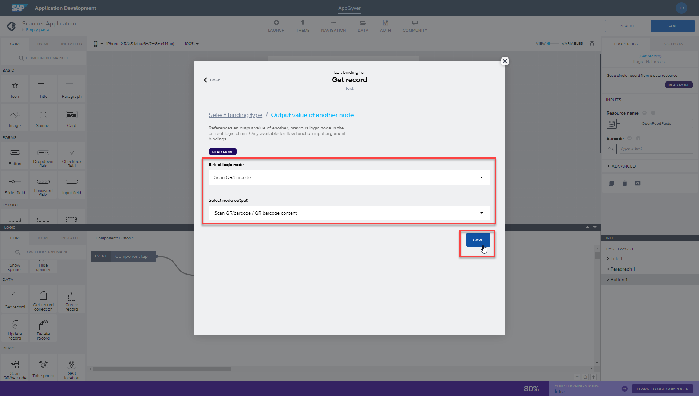
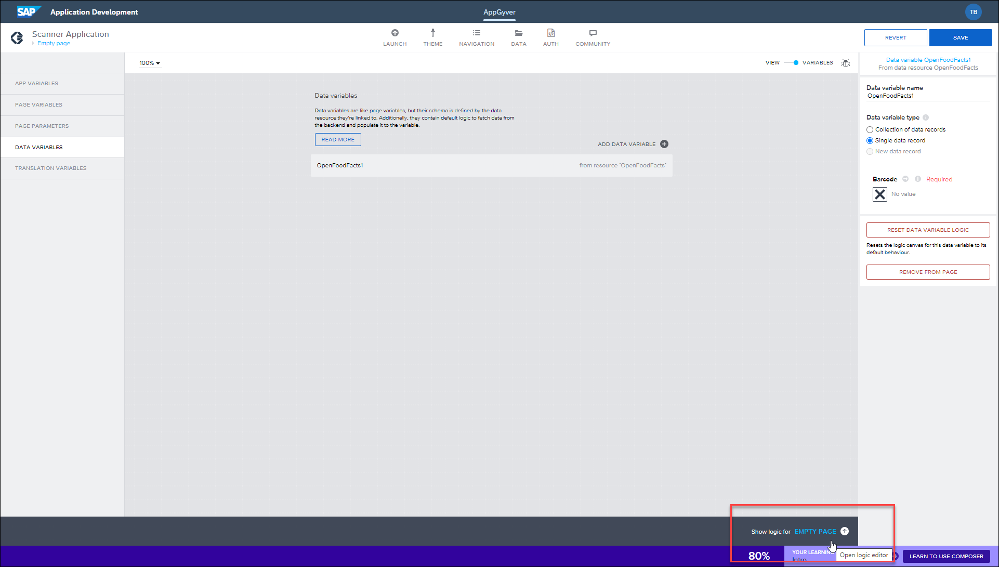
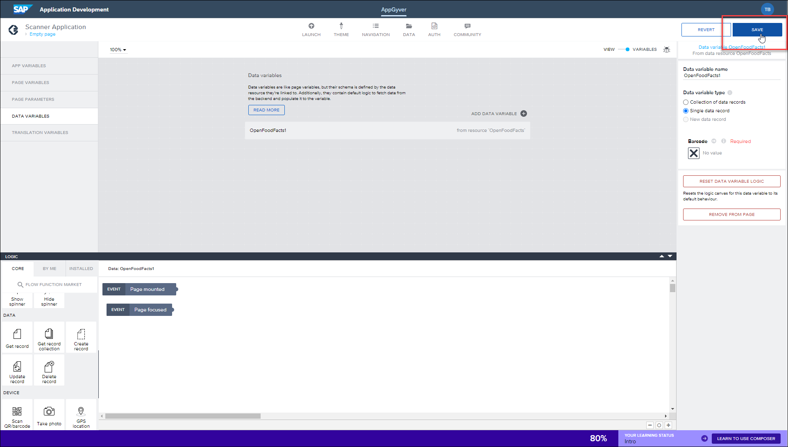
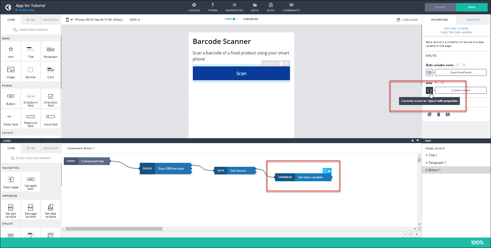

# Fetch Data from Public API to Your SAP Build Application
<!-- description --> Configure your application to fetch records from a public API when a food item is scanned, using a Get Record command, which first needs to be configured.

## You will learn
  - How to configure your application to fetch records from a public API
  - How to configure data variables.

## Intro
In the previous tutorial, you learned how to connect your application to a public API. From here, you now need to configure the application to read specific information from that API once a barcode has been scanned. This again uses the Get Record HTTPS request, but this time that request is triggered with a logic flow.


### Remove alert component

Open your draft application in your Composer account, displaying your barcode scanner app.

As you no longer need your application to send an alert, as this was just used as a test, you need to start by removing the alert component in your logic flow.

To do this, click your **Scan** button and then click **Show Logic for Button1**.


Remove the **Alert** component from your logic panel, as this is no longer needed.


### Add Get Record component

You now need to add your new logic flow for what should happen after the barcode has been scanned. For your application, you want the barcode scanner to fetch data from the data resource you configured in the previous tutorial.

To do this, using the core logic options, scroll down to **Data – Get Record** and then drag and drop this into the logic editor.


Add a connector from the top Scan QR/barcode option to the Get Record option, indicating the flow of logic in your application.


### Edit binding

Once the logic flow is set, you need to bind the information to the output of the scanner node.

1. To do this, select the **Get Record** element and, using the properties panel, click **Currently bound to: Static text**, opening the binding options screen.

    

2. Click **Output value of another node**.

    

    Configure the binding to the following:

    - **Select logic node** – Scan QR/barcode
    - **Select node output** – Scan QR/barcode / QR barcode content

3. Click **Save**.

The Get Record flow function should now be able to fetch data for any food barcode you scan with your application.




### Add data variables

You now need to configure your application to store the data it receives. To do this, you need to add data variables.

1. To do this, switch to the **Variables** view.

    

2. Click **Data Variables**.

    

3. Click **Add Data Variable**.

    

    Select your ***Open Food Facts*** variable.

    

    As the barcode will be for a single product, select **Data variable type – Single data record**.

    

4. Data variables come with default logic that fetches new information every five seconds, however your app should only fetch information when a barcode is scanned. As a result, you need to remove the default logic. 

    To do this, click **Show Logic for Empty Page**.

    

    Then delete the default logic by highlighting it and pressing the **delete button** on the keyboard.

    

    Click **Save**.

    

    >**Why did we delete default logic?**
    >
    >Whenever you create a data variable, default logic is added to fetch the data when the page loads, and then again every 5 seconds. But we want to fetch data only when the user clicks the button and scans a barcode, so we removed the default logic and will later add logic on the button click.

The data variables are now configured for your application.


### Store API data in data variable

1. Click **View** to switch back to your application interface view. 

    From here, you will need to add the final piece to your logic flow, storing the retrieved data into the data variable.

    

2. Click your **Scan** button to open the relevant logic panel.

    

    >This is where we add the logic to scan a barcode and retrieve the data for that product.

3. Using the core logic options, scroll down to **Variables – Set Data Variables** and then drag and drop this into the logic editor.

    

    Add a connector from the top **Get record** option to the **Set data variable** option.

    

5. Click the **Set data variable** element and click **Currently bound to: object with properties**.

    

    Now you must store the data you just retrieved to the data variable.

    >**IMPORTANT:** The following provides 2 ways to do this. The first way is the standard way, but for some people this may cause the SAP Build Apps editor to hang (you can click to exit). So we have provided a second way to store the data using a formula.

    -  Select **Output value of another node** and then choose the following:

        - ***Select logic node***: Get record
        - ***Select node output***: Record

        

    - Instead, you can do the same thing with a formula. Most, if not all, bindings can be done with the UI or manually with a formula.

        Select **Formula**, and then enter for the formula the following:

        ```JavaScript
        outputs["Get record"].record
        ```

    Click **Save** to save this logic (no matter how you entered it).

    

6. Click **Save** (upper right) to save your draft application.

    

The logic has now been added to your draft application.
