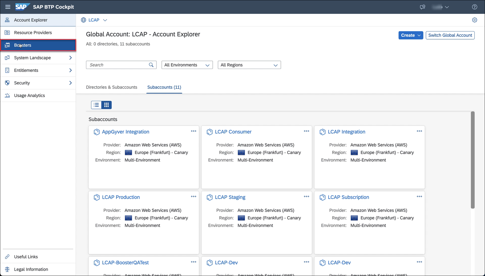
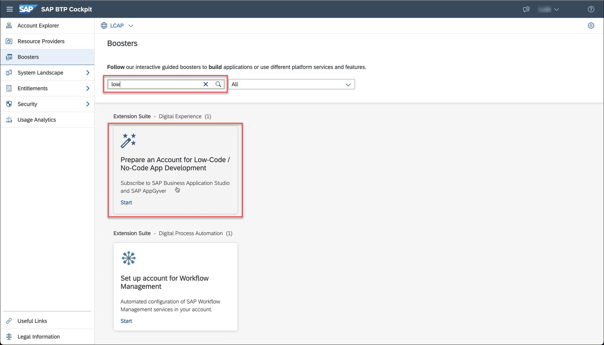
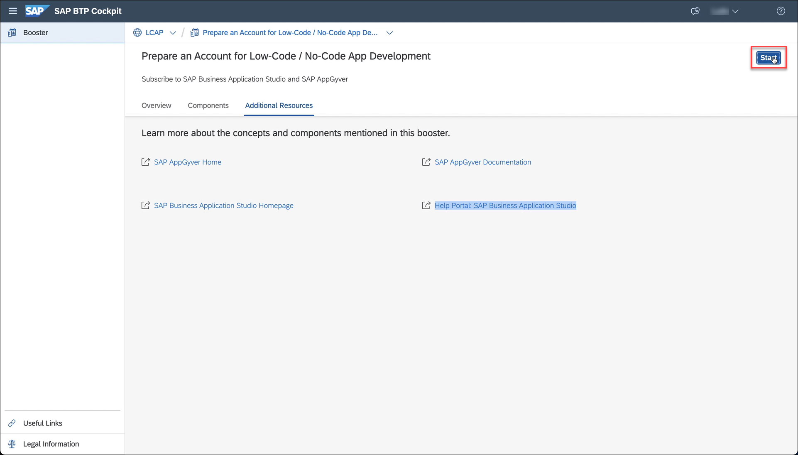
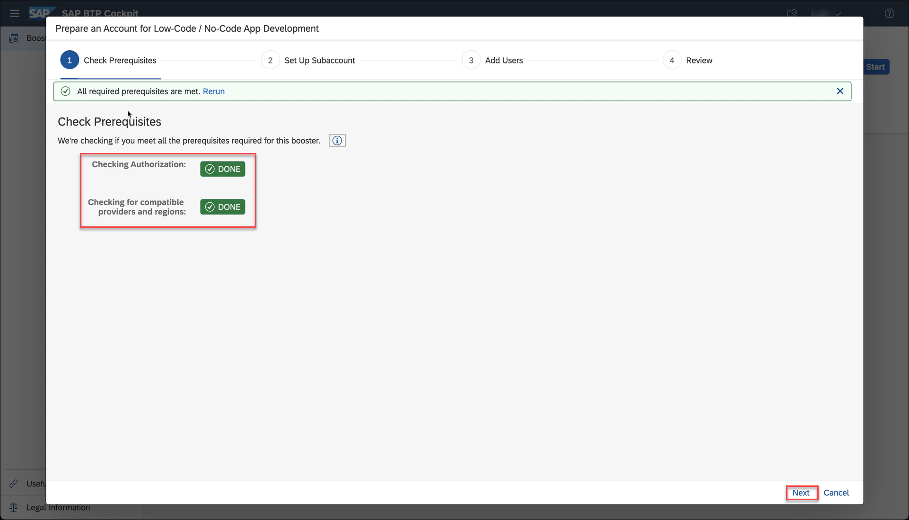
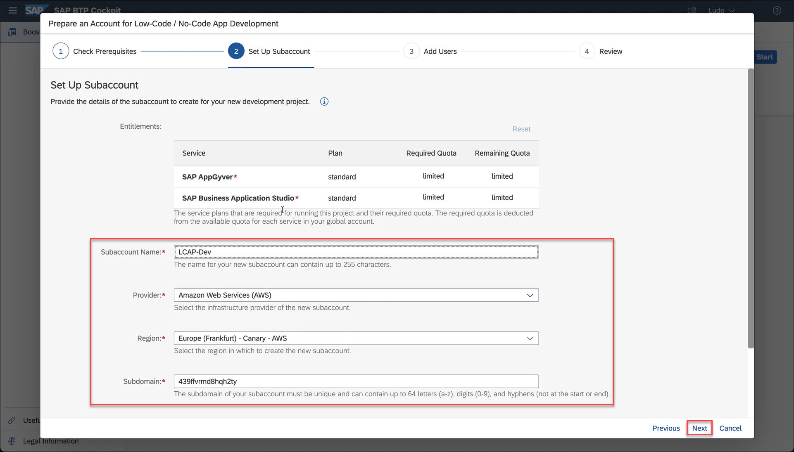
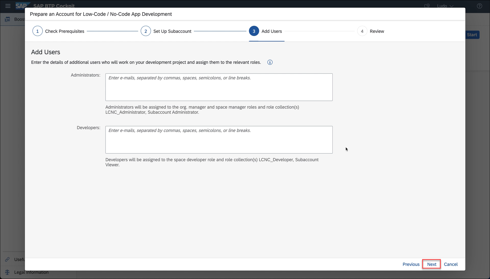
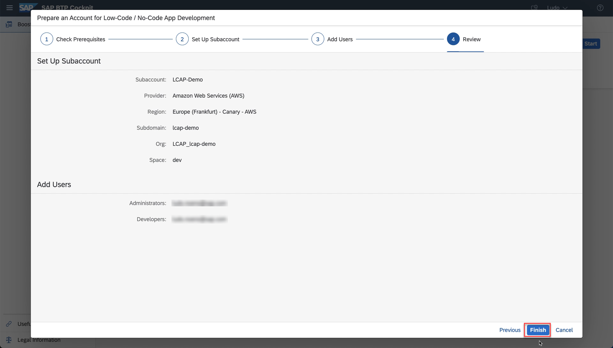
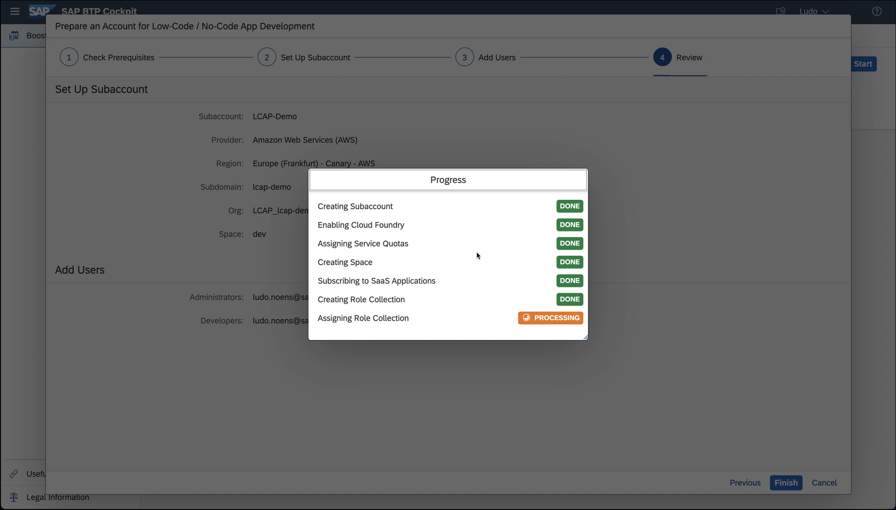
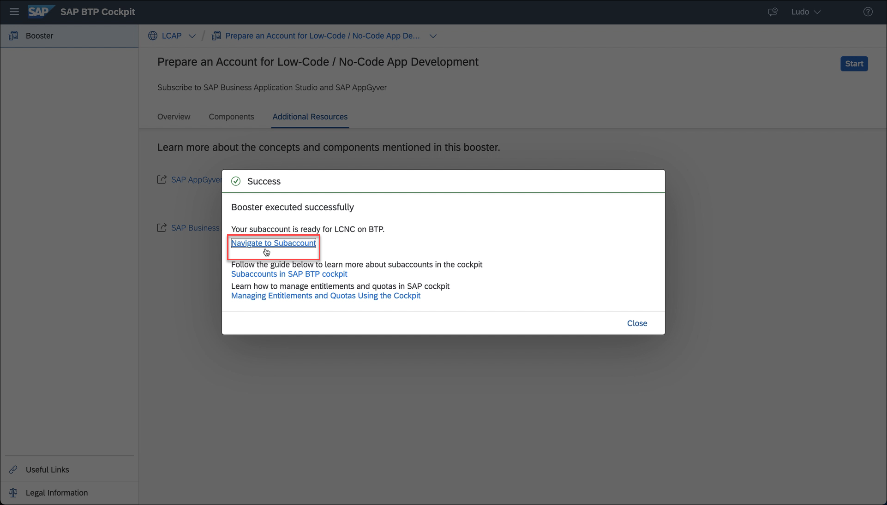

## Prerequisites
 - Access to an SAP BTP account in EU10 with paid Low-Code / No-Code entitlements. See [SAP Discovery Center]  (https://discovery-center.cloud.sap/serviceCatalog/sap-appgyver?region=europe(frankfurt)&service_plan=standard&tab=feature)

Alternatively you can use SAP AppGyver's free Community Edition, which includes the same features needed to complete the rest of the mission. You can sign up here: [AppGyver.com] (https://www.appgyver.com)

## Details
### You will learn
- How to subscribe to and open the Low-Code / No-Code service on SAP BTP
- How to access the AppGyver Composer tool within SAP BTP

The Low-Code / No-Code service on SAP BTP is available with a subscription booster. Boosters are a set of guided interactive steps that enable you to select, configure, and consume services on SAP BTP to achieve a specific technical goal. For more information about SAP BTP boosters, view: [Boosters] (https://help.sap.com/viewer/65de2977205c403bbc107264b8eccf4b/Cloud/en-US/fb1b56148f834749a2bf51127421610b.html?q=btp%20booster)

---
[ACCORDION-BEGIN [Step 1: ](Search for No-Code / Low-Code Booster)]

To subscribe to the Low-Code / No-Code service, use the following steps:

From your SAP BTP cockpit, click **Boosters**.

Search for **Prepare an Account for Low-Code**, locating the SAP Business Application Studio and SAP AppGyver booster.

Click the service icon, opening the service overview page.

[DONE]
[ACCORDION-END]

[ACCORDION-BEGIN [Step 2: ](Start setup wizard)]

Click **Start**, opening the booster wizard.

The prerequisite checks run automatically.

When both are marked as ***Done***, click **Next**.

[DONE]
[ACCORDION-END]

[ACCORDION-BEGIN [Step 3: ](Configure account details)]

***Note***: When entering your subaccount name, it is important to enter a new subaccount name, rather than targeting an existing SAP BTP subaccount.   

Enter your chosen ***Subaccount Name*** and ***Subdomain*** and then click **Next**.

Add any additional ***Users*** you need and then click **Next**.

Review your service information and then click **Finish**.

The service set up runs, showing ***Processing*** and then ***Done*** for each item.

Once subscribed, a success message is displayed.

[VALIDATE_1]

[ACCORDION-END]

[ACCORDION-BEGIN [Step 4: ](Navigate to SAP BTP subaccount)]

Once all items are marked as ***Done***, click **Navigate to Subaccount**.

You're now in your SAP BTP subaccount.

[DONE]
[ACCORDION-END]

[ACCORDION-BEGIN [Step 5: ](Open AppGyver service)]

Click **Instances and Subscriptions**.

Locate your ***SAP AppGyver*** subscription and click to **open** the application.

You're now in the Application Development lobby, from which you will create an AppGyver project in the following tutorials.

[DONE]
[ACCORDION-END]
