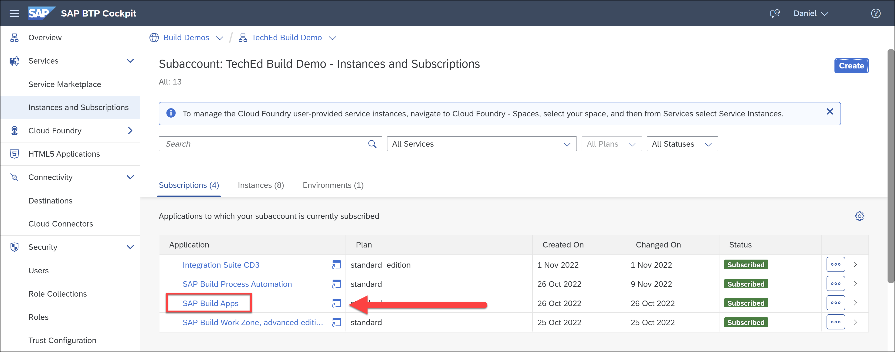

# Subscribe to SAP Build Apps on SAP BTP
<!-- description --> Subscribe to and open the free version of SAP BTP, using a free-tier service plan.

## You will learn
- How to subscribe to and open SAP Build Apps on SAP BTP
- How to open SAP Build Apps

## Intro
The Low-Code / No-Code service on SAP BTP is available with a subscription booster. Boosters are a set of guided interactive steps that enable you to select, configure, and consume services on SAP BTP to achieve a specific technical goal. For more information about SAP BTP boosters, view: [Boosters](https://help.sap.com/viewer/65de2977205c403bbc107264b8eccf4b/Cloud/en-US/fb1b56148f834749a2bf51127421610b.html?q=btp%20booster)

>Alternatively, you could use SAP AppGyver's free Community Edition, if you do not need any SAP BTP specific features. The community edition is available here: [AppGyver.com] (https://www.appgyver.com)

### Create account and install SAP Build Apps

Follow the instructions found in the following video.

<iframe width="560" height="315" src="https://www.youtube.com/embed/gk-jZaM6_Rc" frameborder="0" allowfullscreen></iframe>

More information is available from Bea Pasch's blog [SAP Build Apps Free Tier Individual Access](https://blogs.sap.com/2022/11/25/sap-build-apps-free-tier-individual-access/).

### Open SAP Build Apps

Under **Instances and Subscriptions**, locate your **SAP Build Apps** subscription and click to **open** the application.

You're now in the Application Development lobby, from which you can create an SAP Build Apps project.

