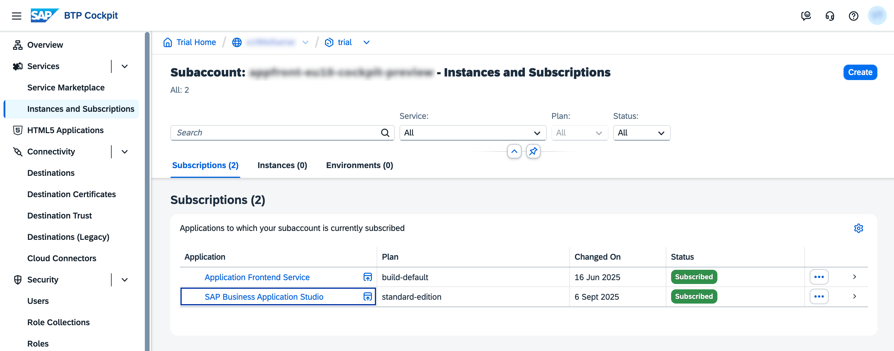
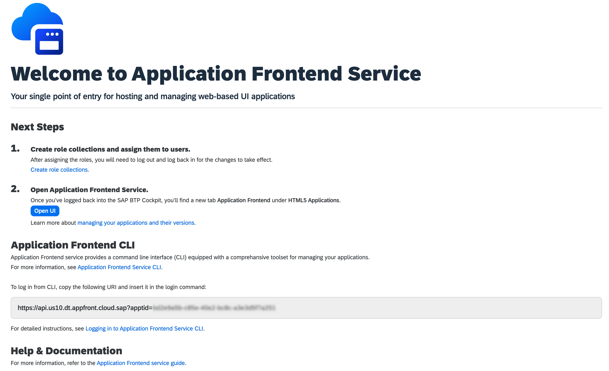
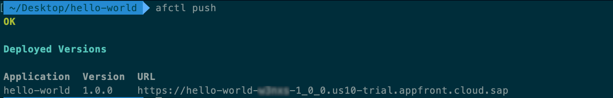
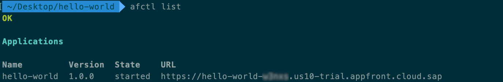
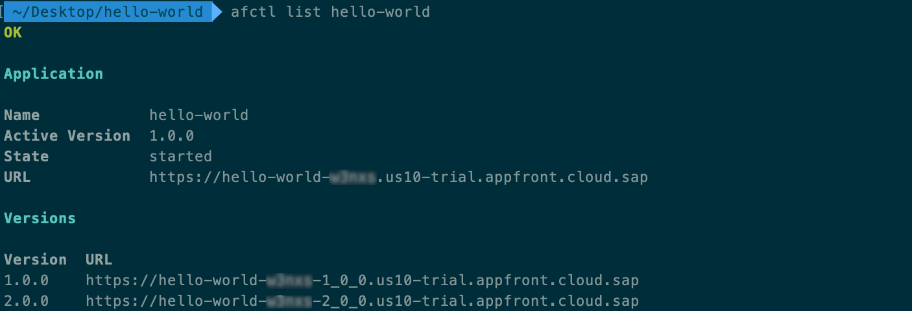

# Deploy your first application to Application Frontend using CLI
<!-- description --> Learn how to create and deploy your first "Hello World" application using Application Frontend Service and the afctl CLI, including version management basics.

## Prerequisites 
  - SAP Business Technology Platform subaccount
  - Cloud Foundry environment enabled in subaccount
  - [Subscription to Application Frontend service](application-frontend-trial-setup)
  - Subscription to SAP Business Application Studio

## You will learn
- How to log in to **Application Frontend Service** using the CLI.  
- How to create, deploy, and manage a simple "Hello World" application.  
- Understand how **application versions** work in Application Frontend.  
- Activate and manage different application versions using `afctl`.

---
### Enable Application Frontend CLI locally or in SAP Business Application Studio 

#### Option 1 - Create SAP Business Application Studio Dev Space:
<ol>
    <li>Navigate to BTP Cockpit subaccount.</li>
    <li>Navigate to <strong>Services > Instances and Subscriptions</strong></li>
    <li>In the <strong>Subscriptions</strong> table click on <strong>SAP Business Application Studio</strong> link.
</ol>

<!-- border -->

<ol start="4">
    <li>Click <strong>CreateDevSpace</strong>.</li>
    <li>Enter Dev Space name (e.g. <code>MyDevSpace</code>).</li>
    <li>Select <strong>SAP Fiori</strong> kind of application.</li>
    <li>Select <strong>Application Frontend Service CLI</strong> additional SAP extension.</li>
    <li>Click <strong>Create Dev Space</strong>.</li>
</ol>

<!-- border -->

#### Option 2 - Install Application Frontend CLI locally

Before you start, make sure you have the required tools installed locally.

1. Verify that **Node.js (version ≥ 22.6.0)** is installed:

```shell
node --version
```

> Note: If you don't have Node.js installed, download it from [nodejs.org](https://nodejs.org).

<ol start="2">
   <li>Install the <strong>Application Frontend CLI (<code>afctl</code>)</strong> globally using npm:</li>
</ol>

```shell
npm install -g @sap/appfront-cli
```

<ol start="3">
   <li>Verify the installation:</li>
</ol>

```shell
afctl
```

You should see the current CLI version printed in your terminal.

### Login to Application Frontend Service

1. Navigate to your **BTP Cockpit** subaccount with **Application Frontend Service** subscription.  
2. Go to **Services > Instances and Subscriptions**.  
3. In the **Subscriptions** table, click on **Application Frontend Service**.  
4. Copy the **URI** from the **Application Frontend CLI** section.  
5. Open your terminal (command line) on your local machine.  
6. Run the following command to log in to Application Frontend Service using the CLI. Replace `<URI>` with your copied one. 

```shell
afctl login --sso --api '<URI>'
```

> Tip: You can see all supported login options using `afctl login --help`

<ol start="7">
   <li>A new browser tab will open. Complete the login form with your user credentials if prompted.</li>
   <li>(Optional) Validate that you are logged in and your session is active:</li>
</ol>

```shell
afctl config
```



---

### Create & Deploy Application

1. Create a directory named `hello-world`.  
   This will be your **application root directory**.  
2. Change your working directory to it:

```shell
cd <path_to_hello_world>
```

<ol start="3">
   <li>Initialize your application with minimal configuration:</li>
</ol>

```shell
afctl init
```

<blockquote>
   <p>Tip: Use the `-f` flag to skip prompts and initialize with default name and version.</p>
   <p>Example: <code>afctl init -f</code></p>
   <p>This creates:</p>
   <ul>
      <li><code>manifest.json</code> — contains application name and version</li>
      <li><code>xs-app.json</code> — routing configuration</li>
   </ul>
</blockquote>

<ol start="4">
   <li>Create an <code>index.html</code> file with the following content:</li>
</ol>

```html
<html>
<head>
   <style>
      body {
         display: grid;
         place-content: center;
         position: absolute;
         inset: 0;
      }
   </style>
</head>
<body>
   <h1>Hello World!</h1>
</body>
</html>
```

<ol start="5">
   <li>Update <code>xs-app.json</code> to set the welcome file to <code>/index.html</code>:</li>
</ol>

```json
{
   "welcomeFile": "/index.html",
   "routes": [{
      "source": ".*",
      "service": "app-front"
   }]
}
```

<ol start="6">
   <li>Push your application to Application Frontend Service:</li>
</ol>


```shell
afctl push
```



<ol start="7">
   <li>List deployed applications and their URLs:</li>
</ol>


```shell
afctl list
```



<ol start="8">
   <li>Copy the URL of the <strong>hello-world</strong> app from the terminal output and open it in your browser. You should see <strong>Hello World!</strong> displayed in the middle of the page.</li>
</ol>

---

### Manage Application Versions

Application Frontend Service supports multiple versions of the same app to be deployed and accessed simultaneously. This allows previewing new versions before activation and publication under the main URL.

Let's update and redeploy your app to see this in action.

1. Update `xs-app.json` to add a new route that returns JSON with logged-in user details:

```json
{
   "welcomeFile": "/index.html",
   "routes": [{
      "source": "^/user-api/currentUser$",
      "service": "sap-approuter-userapi"
   }, {
      "source": ".*",
      "service": "app-front"
   }]
}
```

> Route order matters — Application Frontend processes routes sequentially and uses the first match.

<ol start="2">
   <li>Update <code>index.html</code> to fetch and display the current user's first name:</li>
</ol>

```html
<html>
<head>
   <style>
      body {
         display: grid;
         place-content: center;
         position: absolute;
         inset: 0;
      }
   </style>
</head>
<body>
   <h1>Loading...</h1>
   <script>
      fetch('./user-api/currentUser', { credentials: 'include' })
         .then(res => res.json())
         .then(user => {
               const h1 = document.querySelector('h1');
               h1.textContent = `Hello, ${user.firstname}!`;
         });
   </script>
</body>
</html>
```

<ol start="3">
   <li>Update <code>manifest.json</code> to bump the version:</li>
</ol>

```json
{
   "sap.app": {
      "id": "hello-world",
      "applicationVersion": {
         "version": "2.0.0"
      }
   }
}
```

<ol start="4">
   <li>Deploy the new version <strong>without activating it</strong>:</li>
</ol>

```shell
afctl push -n
```

<ol start="5">
   <li>List the application versions:</li>
</ol>

```shell
afctl list hello-world
```

You'll see:

  - One **main application URL** (stable, never changes)
  - Multiple **version-specific URLs** for each version



<ol start="6">
   <li>Refresh your browser tab with the <strong>main application URL</strong> — it still shows version 1.0.0.</li>
   <li>Open a new browser tab with the <strong>version 2.0.0 URL</strong> — you'll see your new greeting version ("Hello, {your name}!").</li>
   <li>Activate version <code>2.0.0</code>:</li>
</ol>

```shell
afctl activate hello-world 2.0.0
```

<ol start="9">
   <li>Refresh the <strong>main application URL</strong> again — it now serves the new version.</li>
</ol>

**Congratulations!** You successfully finished the **Hello World** Application Frontend exercise.

---
