# Deploy MTA based application to Application Frontend
<!-- description --> Learn how to create and deploy your Application Frontend applications as part of MTA based project using SAP Business Application Studio.

## Prerequisites
  - SAP Business Technology Platform subaccount
  - Cloud Foundry environment enabled in subaccount
  - [Subscription to Application Frontend service](application-frontend-trial-setup)
  - Subscription to SAP Business Application Studio

## You will learn
- Configure destinations to facilitate fast development with SAP Business Application Studio project templates.
- Create the MTA project with Fiori application and Application Frontend deployment configuration.
- Preview Fiori application without deploying it.
- Build and deploy MTA project.
- Find the link to deployed Fiori application and run it.
- Re-deploy UI static resources with CLI.

---

### Configure Destination

<ol>
    <li>Navigate to BTP Cockpit subaccount.</li>
    <li>Navigate to Destinations.</li>
    <p><strong>UI5</strong></p>
    <li>Click <strong>Create</strong>.</li>
    <li>Select <strong>From Scratch</strong>.</li>
    <li>Fill the <strong>Destination Details</strong> form:</li>
    <table>
        <tbody>
            <tr><th>Name</th><td><strong><code>ui5</code></strong></td></tr>
            <tr><th>Type</th><td><strong><code>HTTP</code></strong></td></tr>
            <tr><th>Proxy Type</th><td><strong><code>Internet</code></strong></td></tr>
            <tr><th>URL</th><td><strong><code>https<span>://</span>ui5.sap.com</code></strong></td></tr>
            <tr><th>Authentication</th><td><strong><code>NoAuthentication</code></strong></td></tr>
        </tbody>
    </table>
    <li>Click <strong>Create</strong>.</li>
    <p><strong>Northwind</strong></p>
    <li>Click <strong>Create</strong>.</li>
    <li>Select <strong>From Scratch</strong>.</li>
    <li>Fill the <strong>Destination Details</strong> form:</li>
    <table>
        <tbody>
            <tr><th>Name</th><td><strong><code>northwind</code></strong></td></tr>
            <tr><th>Type</th><td><strong><code>HTTP</code></strong></td></tr>
            <tr><th>Proxy Type</th><td><strong><code>Internet</code></strong></td></tr>
            <tr><th>URL</th><td><strong><code>https<span>://</span>services.odata.org/northwind/northwind.svc/</code></strong></td></tr>
            <tr><th>Authentication</th><td><strong><code>NoAuthentication</code></strong></td></tr>
        </tbody>
    </table>
    <li>Use <strong>Add Property</strong> button to configure additional destination properties:</li>
    <table>
        <tbody>
            <tr><th>WebIDEEnabled</th><td><strong><code>true</code></strong></td></tr>
            <tr><th>WebIDEUsage</th><td><strong><code>odata_gen</code></strong></td></tr>
            <tr><th>WebIDEAdditionalData</th><td><strong><code>full_url</code></strong></td></tr>
            <tr><th>HTML5.DynamicDestination</th><td><strong><code>true</code></strong></td></tr>
        </tbody>
    </table>
    <blockquote><p>The additional destination properties above are only required to enable relevant SAP Business Application Studio capabilities. Add them to destinations used in development, but not in production.</p></blockquote>
    <li>Click <strong>Create</strong>.</li>
</ol>

<!-- border -->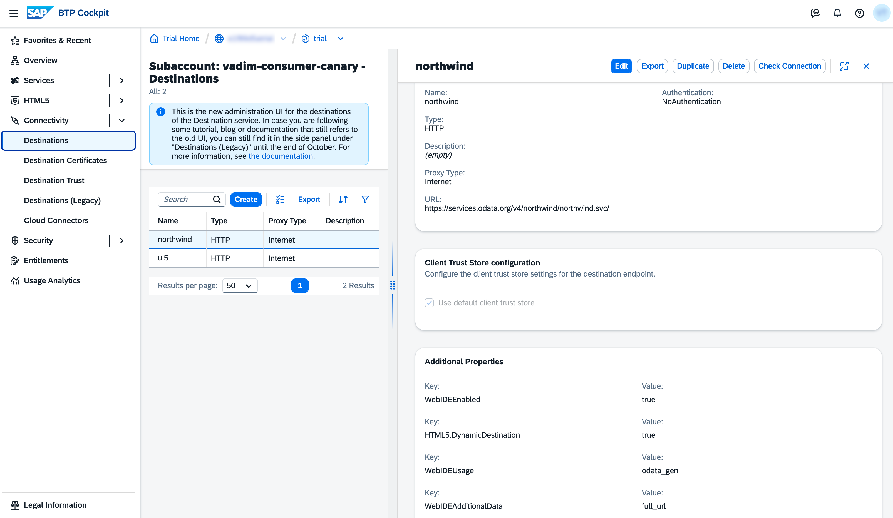

### Create SAP Business Appication Studio Dev Space

<ol>
    <li>Navigate to BTP Cockpit subaccount.</li>
    <li>Navigate to <strong>Services > Instances and Subscriptions</strong></li>
    <li>In the <strong>Subscriptions</strong> table click on <strong>SAP Business Application Studio</strong> link.
</ol>

<!-- border -->

<ol start="4">
    <li>Click <strong>CreateDevSpace</strong>.</li>
    <li>Enter Dev Space name (e.g. <code>MyDevSpace</code>).</li>
    <li>Select <strong>SAP Fiori</strong> kind of application.</li>
    <li>Select <strong>Application Frontend Service CLI</strong> additional SAP extension.</li>
    <li>Click <strong>Create Dev Space</strong>.</li>
</ol>

<!-- border -->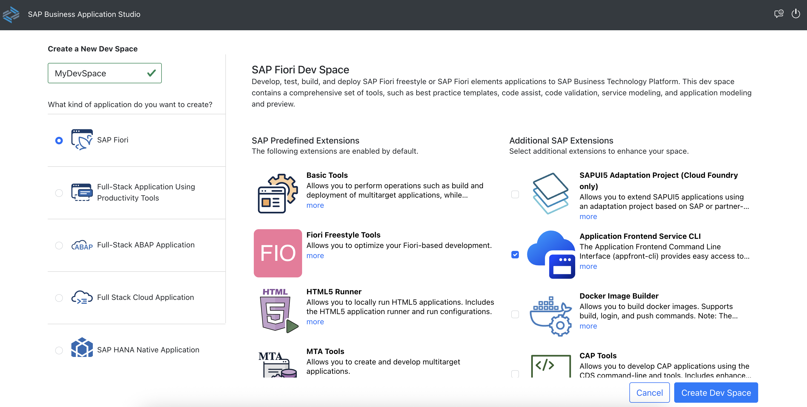

### Create Fiori Application From Template

<ol>
    <li>Open the dev space created at the previous step.</li>
    <li>Click on <strong>New Project from Template</strong> button of Get Started page. Alternatively, in the menu select:</li>
    <p><code>☰ &gt; File &gt; New Project from Template</code></p>
</ol>

<!-- border -->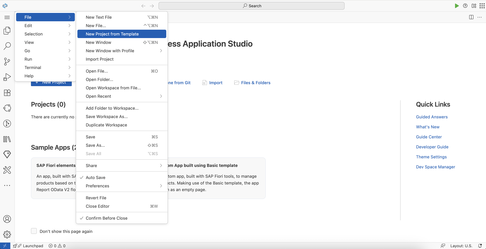

<ol start="3">
    <li>Select <strong>SAP Fiori generator</strong> card and click <strong>Start</strong>.</li>
</ol>

<!-- border -->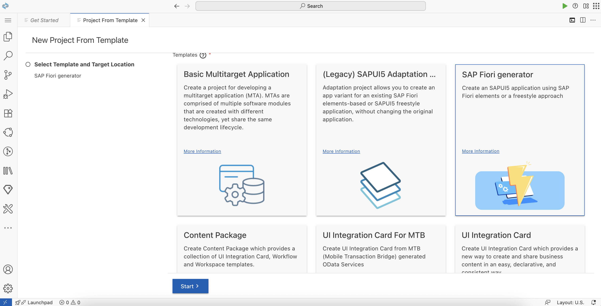

<ol start="4">
    <li>Select <strong>List Report Page</strong> card and click <strong>Next</strong>.</li>
</ol>

<!-- border -->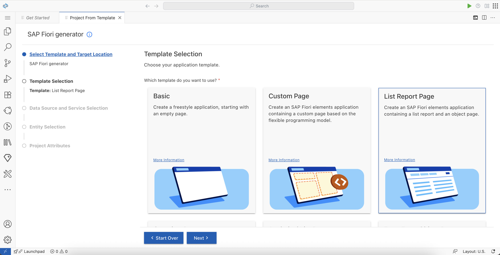

<ol start="5">
    <li>At <strong>Data Source and Service Selection</strong> step enter the following and click <strong>Next</strong>:</li>
    <table>
        <tr><th>Data Source</th><td><code>Connect to a System</code></td></tr>
        <tr><th>System</th><td><code>northwind</code></td></tr>
        <tr><th>Service</th><td><code>https<span>://</span>services.odata.org/northwind/northwind.svc/</code></td></tr>
    </table>
</ol>

<!-- border -->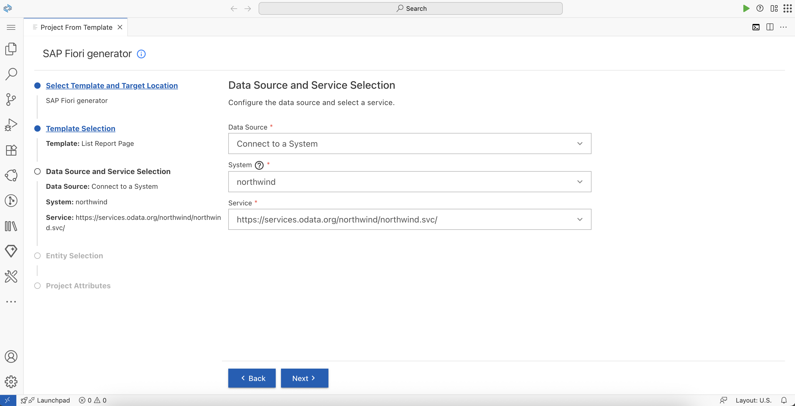

<ol start="6">
    <li>At <strong>Entity Selection</strong> step enter the following and click <strong>Next</strong>:</li>
    <table>
        <tr><th>Main Entity</th><td><code>Products</code></td></tr>
        <tr><th>Navigation Entity</th><td><code>None</code></td></tr>
        <tr><th>Table Type</th><td><code>Responsive</code></td></tr>
    </table>
</ol>

<!-- border -->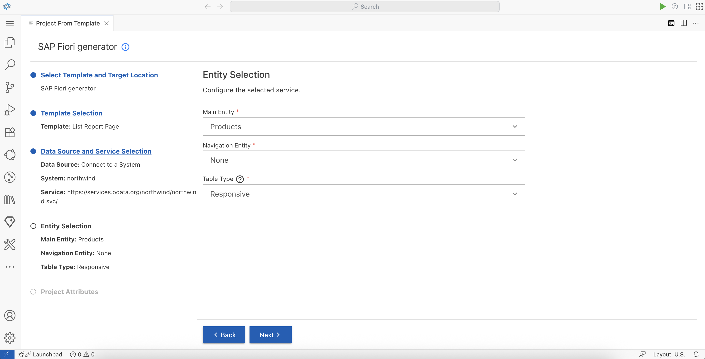

<ol start="7">
    <li>At <strong>Project Attributes</strong> step enter select:</li>
    <table>
        <tr><th>Add Deployment Configuration</th><td><code>Yes</code></td></tr>
    </table>
    <p>Leave the rest of the fields without modification. Click <strong>Next</strong>.</p>
</ol>

<!-- border -->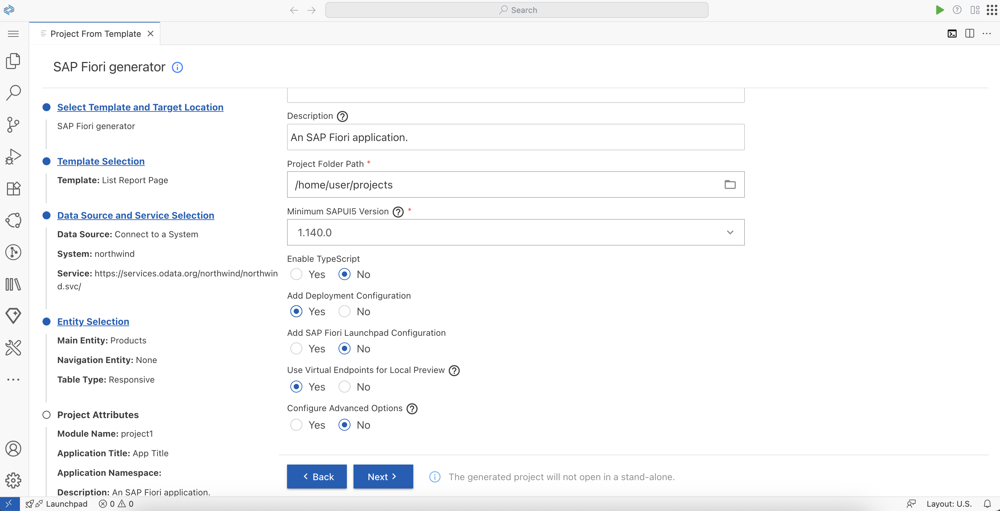

<ol start="8">
    <li>At <strong>Deployment Configuration</strong> step enter the following and click <strong>Finish</strong>:</li>
    <table>
        <tr><th>Please choose the target</th><td><code>Cloud Foundry</code></td></tr>
        <tr><th>Destination Name</th><td><code>northwind - https<span>://</span>services.odata.org/northwind/northwind.svc/</code></td></tr>
        <tr><th>Add Router Module</th><td><code>Add Application to Application Frontend Service</code></td></tr>
    </table>
</ol>

<!-- border -->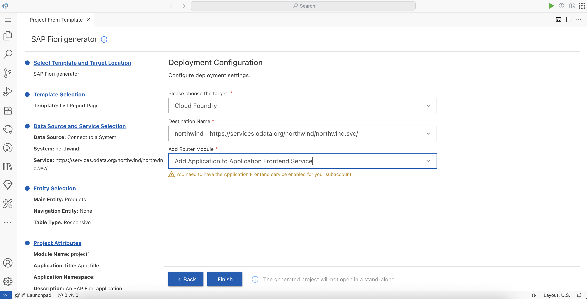

<ol start="9">
    <li>Click <strong>Open folder</strong>.</li>
</ol>

<!-- border -->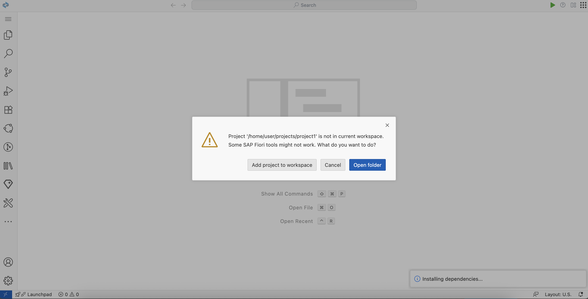

### Preview Application

<ol>
    <li>Press <kbd><strong>F1</strong></kbd> to open command menu.</li>
    <li>Select:</li>
    <p><code>Fiori: Preview Application</code></p>
</ol>

<!-- border -->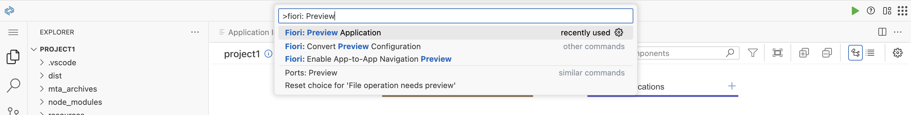

<ol start="3">
    <li>Select:</li>
    <p><code>start fiori run --open "test/flp.html#app-preview"</code></p>
</ol>

<!-- border -->

<ol start="4">
    <li>In the opened application preview click on the gear button and select columns to display in the table:</li>
</ol>

<!-- border -->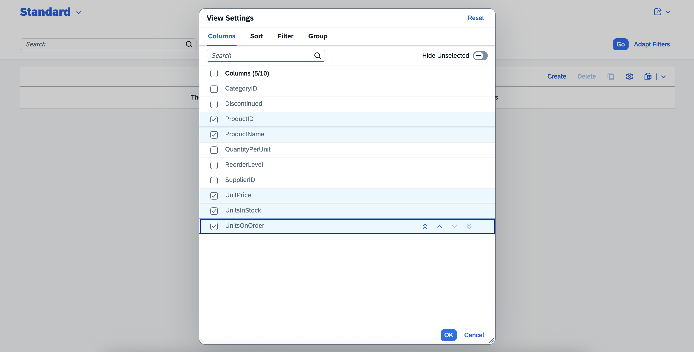

<ol start="5">
    <li>Click <strong>OK</strong>.</li>
    <li>Click <strong>Go</strong> button to see the data.</li>
</ol>

<!-- border -->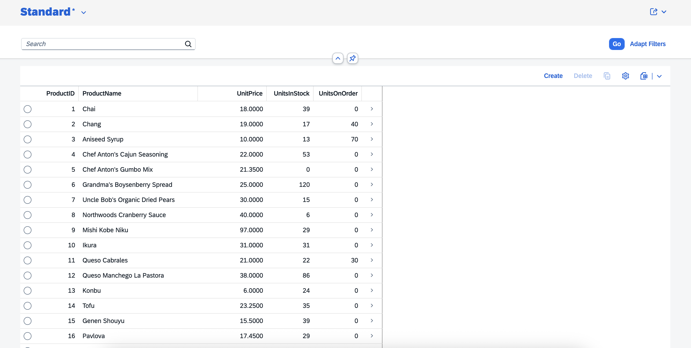

### Build & Deploy MTA

<ol>
    <li>Right click on <code>mta.yaml</code> file in project explorer and select <strong>Build MTA Project</strong>.</li>
</ol>

<!-- border -->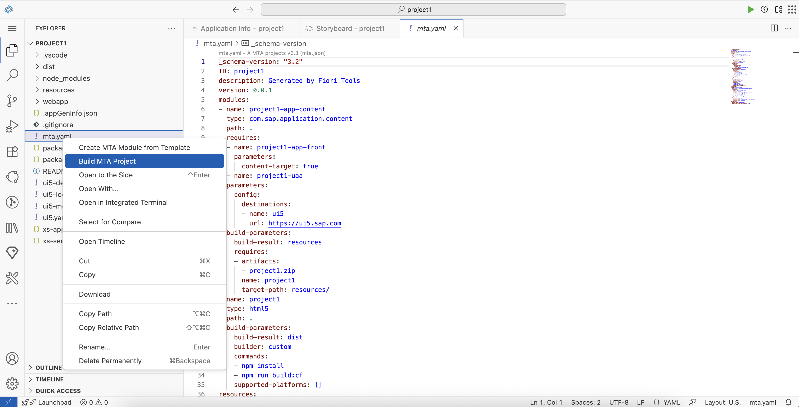

<ol start="2">
    <li>Wait until MTA project build process is finished.</li>
    <li>Right click on <code>mta_archives/project1_0.0.1.mtar</code> file in project explorer and select <strong>Deploy MTA Archive</strong>.</li>
</ol>

<!-- border -->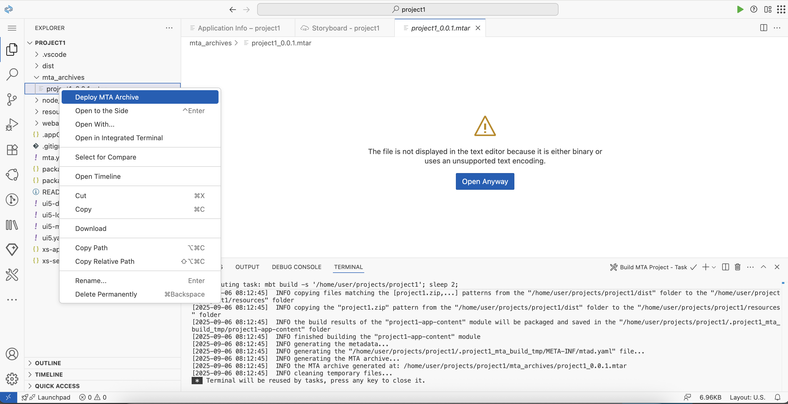

<ol start="4">
    <li>If prompted, sign in to Cloud Foundry.
        <ul>
            <li>Click <strong>Open a new browser page to generate your SSO passcode</strong> link.</li>
            <li>Proceed with authentication to generate passcode.</li>
            <li>Fill the <strong>Enter your SSO Passcode</strong> field with generated passcode.</li>
            <li>Click <strong>Sign in</strong>.</li>
            <li>Select organization and space.</li>
            <li>Click <strong>Apply</strong>.</li>
        </ul>
    </li>
</ol>

<!-- border -->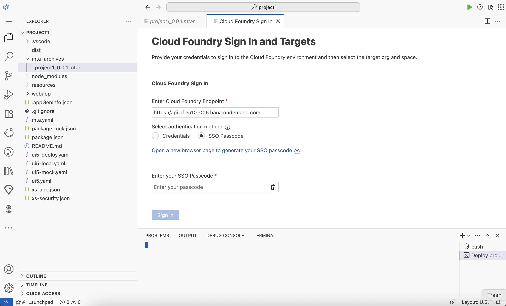

<!-- border -->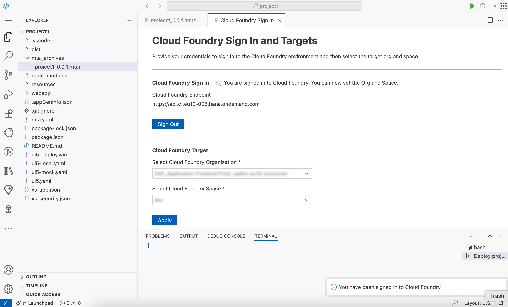

<ol start="5">
    <li>Wait until MTA archive is deployed.</li>
</ol>

### Run Application

<ol>
    <li>Navigate to BTP Cockpit subaccount.</li>
    <li>Navigate to <strong>HTML5 > Application Frontend</strong>.</li>
</ol>

<!-- border -->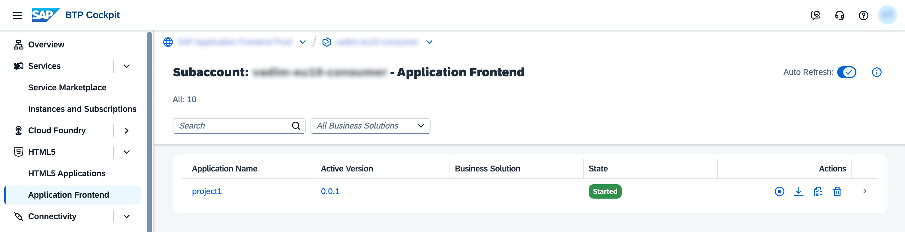

<ol start="3">
    <li>Click on the link with application name <strong>project1</strong> and see the application running.</li>
</ol>

<!-- border -->

### Re-deploy Application with CLI

This step of tutorial is optional. It shows how you can shorten the UI development cycle by skipping the build and re-deploy of the whole MTA. The technic below allows to re-deploy only static resources of UI application.

<ol>
    <li>Navigate to BTP Cockpit subaccount.</li>
    <li>Navigate to <strong>Services > Instances and Subscriptions</strong>.</li>
    <li>In the <strong>Subscriptions</strong> table click on <strong>Appication Frontend Service</strong> link.</li>
    <li>Copy the URL from <strong>Application Frontend CLI</strong> section of opened welcome page.</li>
    <li>Navigate to <string>SAP Business Application Studio</strong> (same Dev Space that you worked with during previous steps).</li>
    <li>Open <code>webapp/index.html</code> and change the title of the page:</li>
</ol>

<!-- border -->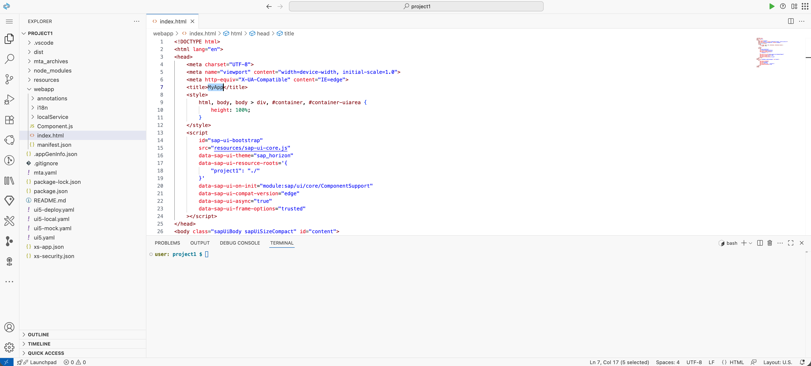

<ol start="3">
    <li>Open integrated <strong>Terminal</strong> in the root of the project.</li>
    <li>Build UI:</li>
</ol>

```bash
npm run build
```

<ol start="5">
    <li>Log in to Application Frontend service with CLI, using copied from welcome page URL. When prompted, click <string>Open</strong>.</li>
</ol>

```bash
afctl login --sso -a '<URL>'
```

<!-- border -->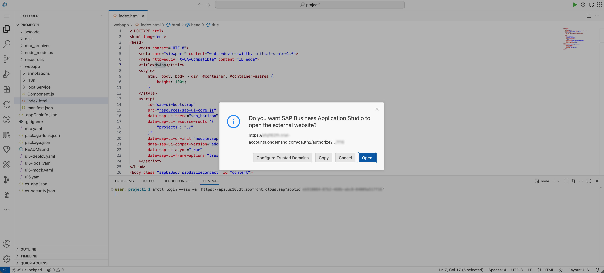

<ol start="6">
    <li>Re-deploy build results of the UI:</li>
</ol>

```bash
afctl push dist
```

<!-- border -->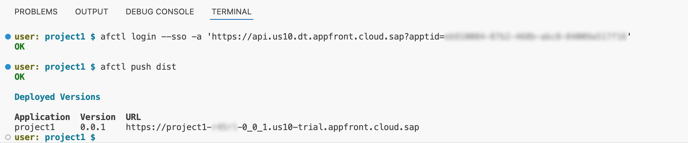

<ol start="7">
    <li>Click on the link in CLI command output or refresh the browser page with UI application to which you navigated from BTP Cockpit.</li>
    <li>See the title of application (browser tab label) changed.</li>
</ol>