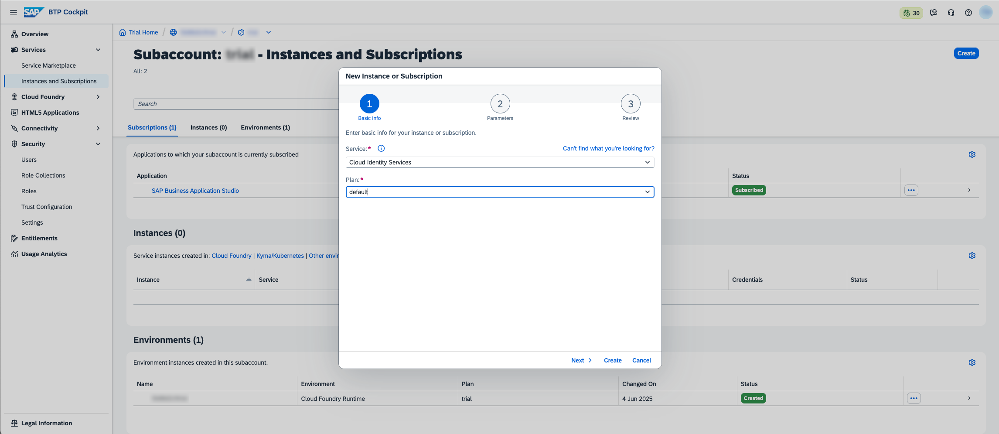
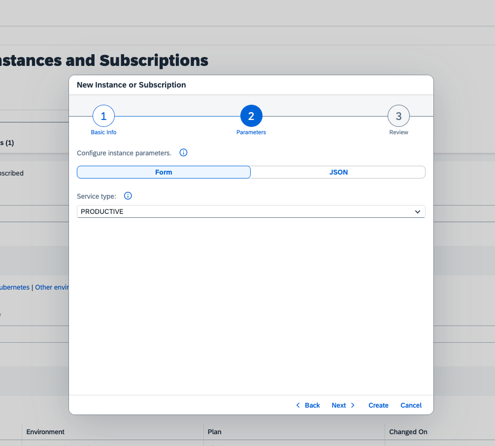
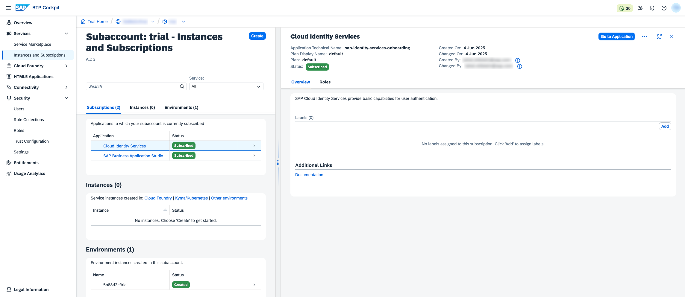
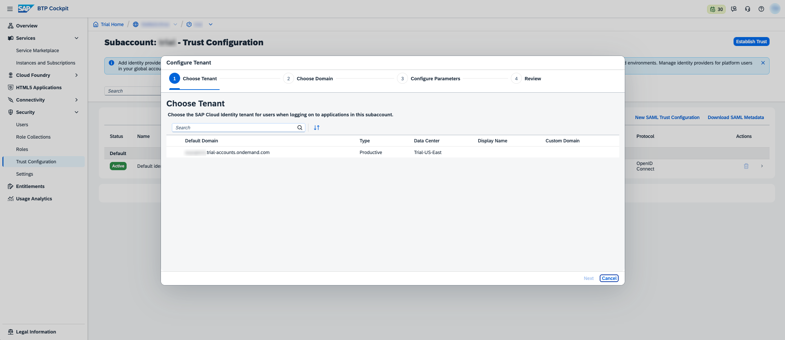
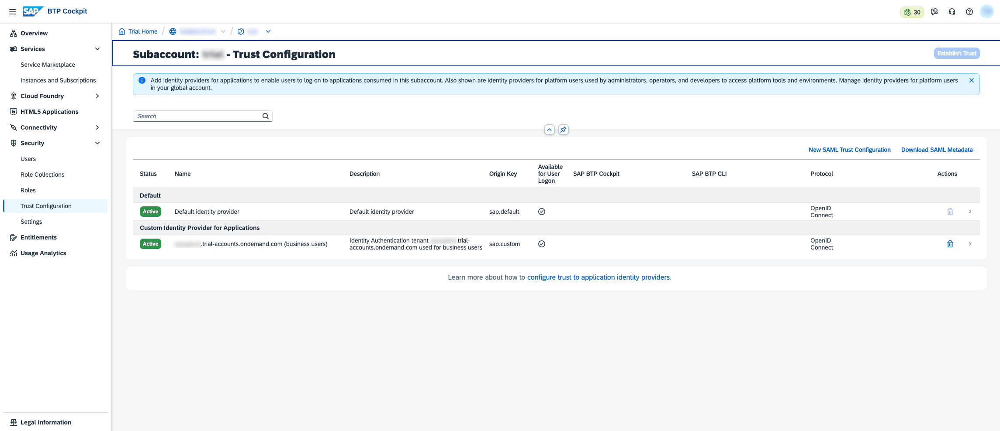
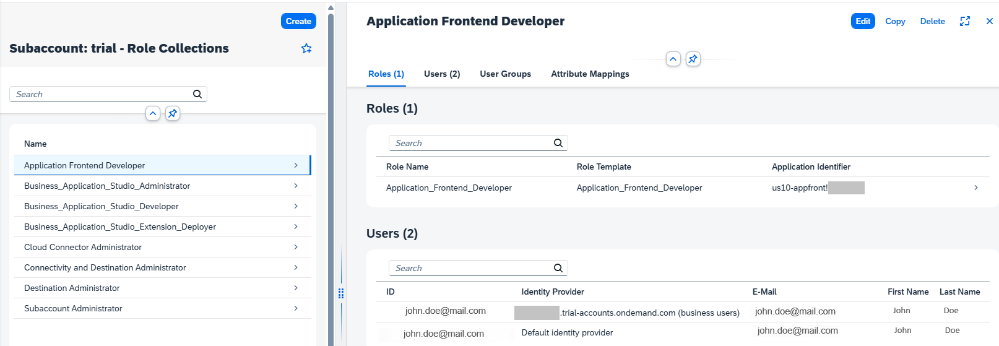
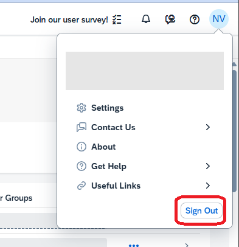

# Set Up Application Frontend service in your BTP trial account
<!-- description --> Learn how to configure your trial account with the right setup to enable Application Frontend service

## Prerequisites   
  - You have an account in SAP BTP Trial landscape us10-trial. If you don't have one yet, follow the instructions in [Get a Free Account on SAP BTP Trial](hcp-create-trial-account)

## You will learn
- How to configure your subaccount to enable subscription to Application Frontend
- How to subscribe to Application Frontend and grant the needed authorizations

---

### Subscribe to Cloud Identity Services
To use Application Frontend you need to estublish trust with Cloud Identity Services. 

To provision IAS tenant for your trial account, subscribe to the Cloud Identity Services application in your subaccount. 

> This step of provisioning Cloud Identity Services is only needed in the Trial landscape. In live accounts this done automatically on account creation.  

1. In the BTP Cockpit go to to your subaccount and navigate to Instances and Subscriptions tab.
2. Click the Create button at the top right corner
3. Choose
    Service: **`Cloud Identity Service`**
    Plan: **`default`** 
4. Click **Next**
5. Chose
    Service Type: **`PRODUCTIVE`**
6. Click **Create**

### Set Up Identity Authentication (IAS)

Configure Trust:
1. Navigate to **Security > Trust Configuration**.
2. Click the **Establish Trust** button on the top right corner.
3. Choose your IAS tenant and click **Next**. Continue the wizard with the default values and click **Finish** in the last step . 

Once the wizard is completed it should look like this

### Activate your IAS account after establishing trust
After creating the Cloud Identity Services instance, you will receive an activation email with the subject "Activate Your Account for Identity Authentication Service".  
Open the email and click the **Activate your account** button.  
Set your password to access the IAS Admin Console.  

### Subscribe to Application Frontend service

1. Back in the BTP Cockpit, navigate to your trial subaccount. 
2. Navigate to Services > Instances and Subscriptions.
3. Click the **Create** button.
5. Choose: Service: **`Application Frontend Service`**; Plan: **`trial`**  
6. Click **Create**

### Grant Permissions to Application Frontend

1. Navigate to **Security > Role Collections** and click **Create**.
2. Enter role name: **`Application Frontend Developer`** and click **Create**.
3. Click on **`Application Frontend Developer`** row, a details view should expand on the right.
4. Click **Edit**.
5. In the Roles table add the role: **`Application_Frontend_Developer`**
6. In the Users table add 2 users. 
- Your user from **`Default identity provider`** - for managing applications in BTP Cockpit  
- Your user from **`business users`** identity provider - for CLI and API access

7. Click **Save**.  

You should end up with something like this:

###  Check Access to Application Frontend UI

In this step you will validate that all settings are done correctly.

1. Navigate to **Security > Users**.
2. Select your user from Default identity provider.
3. Verify that there is an **Appication Frontend Developer** role in the list of role collections.
4. Sign Out from BTP Cockpit, for the new authorization to take effect for your user.

5. Sign In back to BTP Cockpit.
6. Navigate to your trial subaccount.
7. Verify that there is a new navigation entry **HTML5 > Application Frontend**. 

If you press this entry, you should see an empty table of applications. In the next tutorials we will fill it with applications.

