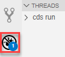

# Develop a Business App Using SAP Business Application Studio
<!-- description --> Develop a simple CAP Node.js application using SAP Business Application Studio.

## Prerequisites
- You have access to SAP Business Application Studio (see [Set Up SAP Business Application Studio for Development](appstudio-onboarding)).
- You have created a dev space as described in [Create a Dev Space for Business Applications](appstudio-devspace-create).


## You will learn
- How to create a CAP project
- How to develop business applications based on the SAP Cloud Programming Model (CAP)
- How to run and test your application using the Run Configurations tool

  The application you'll develop is a simple bookshop app consisting of a data model with three entities:

  - Books
  - Authors
  - Genres

  The data model is exposed via the Catalog Service. The application has some initial data that is used for testing the application, and some custom logic that runs after reading the books from the `Books` entity.

  Once you have all the code in place, you will test the application locally.

---

### Create new CAP project


1. From the SAP Business Application Studio Welcome page, click **Start from template**.

    >You can also go to the Command Palette and choose **SAP Business Application Studio: Create Project From Template**.

    <!-- border -->

2. Leave the default target folder path.

3. Select the **CAP Project** template, and click **Start**.

4. Enter **`bookshop`** as the name for the project, and leave all other options not checked.

5. Click **Finish**.


### Define bookshop data schema


1. In the `db` folder, create a new file called `schema.cds`.

2. Populate the file with the following entity definitions:

    ```CDS
    using { Currency, managed, sap } from '@sap/cds/common';
    namespace my.bookshop;

    entity Books : managed {
      key ID : Integer;
      title  : localized String(111);
      descr  : localized String(1111);
      author : Association to Authors;
      genre  : Association to Genres;
      stock  : Integer;
      price  : Decimal(9,2);
      currency : Currency;
    }

    entity Authors : managed {
      key ID : Integer;
      name   : String(111);
      books  : Association to many Books on books.author = $self;
    }

    /** Hierarchically organized Code List for Genres */
    entity Genres : sap.common.CodeList {
      key ID   : Integer;
      parent   : Association to Genres;
      children : Composition of many Genres on children.parent = $self;
    }

    ```

3. Save your changes.


### Define bookshop service

1. In the `srv` folder, create a new file called `cat-service.cds`.

2. Populate the file with the following service definitions:

    ```CDS
    using { my.bookshop as my } from '../db/schema';
    service CatalogService @(path:'/browse') {

      @readonly entity Books as SELECT from my.Books {*,
        author.name as author
        } excluding { createdBy, modifiedBy };

        action submitOrder (book:Books:ID, amount: Integer);
      }

    ```

3. Save your changes.    


### Add initial data

1. In the `db` folder, create a new folder called `data`.

2. In the `data` folder, create a new file called `my.bookshop-Authors.csv`, and populate it with the following:

    ```CSV
    ID;name
    101;Emily Brontë
    107;Charlotte Brontë
    150;Edgar Allen Poe
    170;Richard Carpenter
    ```

3. In the `data` folder, create a new file called `my.bookshop-Books.csv`, and populate it with the following:

    ```CSV
    ID;title;author_ID;stock
    201;Wuthering Heights;101;12
    207;Jane Eyre;107;11
    251;The Raven;150;333
    252;Eleonora;150;555
    271;Catweazle;170;22

    ```

4. Save your changes.


### Add custom logic


1. In the `srv` folder, create a new file called `cat-service.js`.
2. If asked if you want to allow the use of the ESLint library for validation, click **Allow**.

  <!-- border -->

3. Populate the `cat-service.js` file with the following:

```JavaScript
/**
* Implementation for CatalogService defined in ./cat-service.cds
*/
const cds = require('@sap/cds')
module.exports = function (){
  // Register your event handlers in here, e.g....
  this.after ('READ','Books', each => {
    if (each.stock > 111) {
      each.title += ` -- 11% discount!`
    }
  })
}

```

Your application should look similar to the structure shown in the picture below.

<!-- border -->

Save your changes.

You can also see the semantic structure of the application by expanding the CAP DATA MODELS AND SERVICES section located at the bottom of the *EXPLORER* view.

<!-- border -->


### Test the application with local database


You can explicitly deploy your application to a persistent local `SQLite` database, or you can run your application and it will implicitly use an in-memory database.

This step describes how to run the application with an in-memory database.

You will first add all required dependencies, and the create and run a run configuration.

1. Add and install all required dependencies.

    - From the **Terminal** menu, select **New Terminal**.

    - On the `bookshop` folder, run the following:

        ```NPM
        npm install

        ```

1. From the left side menu, open the Run Configurations view.

    <!-- border -->

2. Click **+** at the top of the view to add a new configuration.

    <!-- border -->

3. Select `bookshop (development profile)` as the runnable application from the command palette prompt.

    >There might be other run configuration options available in the command palette.

    By default, the run configuration is created for the "development" profile. If you configured an additional profile for your application, you can create a run configuration that activates and uses this profile.

    The dependencies of the application are calculated according to the profile selected.

    <!-- border -->

4. Press `Enter` to use the default name for the configuration. A new configuration is added to the run configuration tree.

5. Click the right green arrow on the right of the configuration name to run the application.


6. When prompted, click **Open in New Tab**.

    The application opens in the browser.

7. Press Enter to use the default description. The application opens in the browser and you can click to see the metadata and entities the service.

    <!-- border -->

    You can also debug your application to check your code logic. For example, to debug the custom logic for this application, perform the following steps:

9. Place a breakpoint in the function in the `cat-service.js` file.

10. In the running app, click the `Books` entity. It should stop at the breakpoint.

    <!-- border -->

11. Click [Debugger icon](debugger.png) on the side menu to open the **Debugger** view. Click Continue in the debugger until all the books are read and the page is presented.

    Remove the breakpoint.

12. Stop the application by clicking Stop in the Debug pane. The number beside the Debug icon represents the number of running processes. Click Stop until there are no processes running.

    <!-- border -->


---
