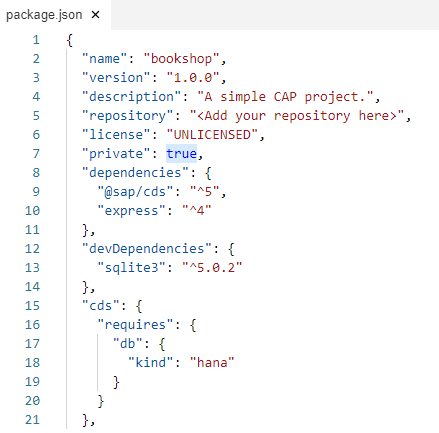
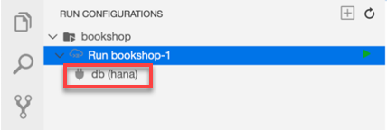
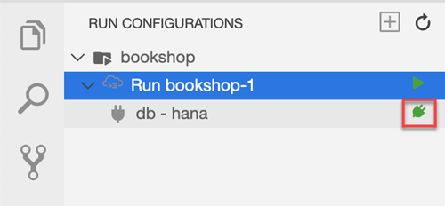
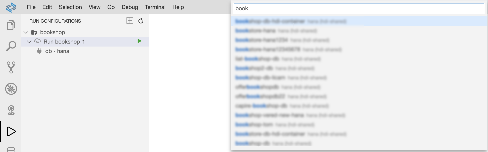
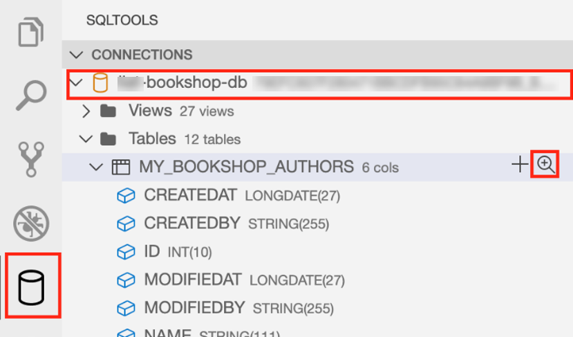
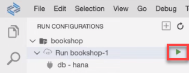
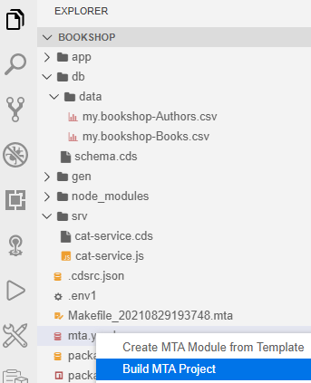
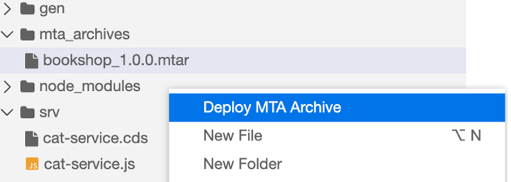

## Prerequisites
 - You have an SAP HANA service (SAP HANA as a Service or SAP HANA Cloud) available in your space.
    To create a new instance in your trial account:
    1. Go to your space in the SAP Cloud Platform cockpit.
    2. Go to **Service Marketplace**.
    3. Select **SAP HANA Schemas & HDI Containers (SAP HANA Trial)**.
    4. Click **Create New Instance**.
    5. Select `hdi-shared` as the service plan and provide a name for the new instance.
    6. Click **Create Instance**.


## Details
### You will learn
  - How to test your application using SAP HANA
  - How to deploy your application to Cloud Foundry

  In the previous tutorial we created a simple bookshop app and tested it with a local database.  Now we will first test the application with an SAP HANA database as used on Cloud Foundry and deploy it to Cloud Foundry.


---

[ACCORDION-BEGIN [Step 1: ](Configure the dependency to SAP HANA)]

1. In SAP Business Application Studio, open the `package.json` file.

2. Copy and paste the following dependency definition:

    ```JSON
      "cds": {
        "requires": {
          "db": {
            "kind": "hana"
          }
        }
      }

    ```

3. Save your changes.

The result should look as follows:

!


[DONE]
[ACCORDION-END]

[ACCORDION-BEGIN [Step 2: ](Run your app with SAP HANA)]


1. In the **Run Configurations** view, open the run configuration you previously created and make sure that the dependencies have changed and that you can see a dependency to `db(hana)`.

    !

    The **Run Configuration** view allows you to bind to the specific SAP HANA instance with which you want your application to run. It will automatically install all the required dependencies and offer you to deploy your data model.  (It actually generates a deploy task that you can run at any given time.) Moreover, it generates a connection in the **SQLTOOLS** view, so you can instantly check the data in your database.

2. Click the **Bind** icon to the right of the `db` dependency. A list of SAP HANA service instances from your space is presented (you may need to log into Cloud Foundry).

    !

3.	Select the SAP HANA service instance to which you want to bind the dependency.

    !

      The bind action runs and the dependency is now bound. You will get notifications regarding which tasks are run, and regarding the creation of a new SQL tools connection .

4.	After a few moments, a dialog box asking you to deploy your data model is displayed. Choose **Yes**.  

    The deployment task runs. Make sure it completes successfully.

5.	Open the **SQLTOOLS** view.

6.	Click on the connection created for your SAP HANA instance.

7.	Open the `Authors` tables, and click on the magnifier glass icon next to it.

    !

8. In the editor tab that opens, browse the table data and make sure it is correct.

9. Click the green arrow on the right of the configuration name to run the application.

    !

10. When prompted, click **Open**.

    The application opens in the browser and you can click to see the metadata and entities of the service. The data is now retrieved from the SAP HANA database in your Cloud Foundry space.

11. Stop the application by clicking **Stop** in the Debug pane.


[VALIDATE_7]
[ACCORDION-END]

[ACCORDION-BEGIN [Step 3: ](Deploy your application to Cloud Foundry)]

1.	From the terminal on the bookshop folder, run `cds add mta`.
This adds an `mta.yaml` file to the root of your application.

    Note: If you are working on a trial account, open the `mta.yaml` file, and in the `resources` section change the `service` parameter to `hanatrial`. Save your changes.

2.	Right-click the `mta.yaml` file and choose **Build MTA**.

    !

      A new folder for `mta_archives` is created containing the new `mtar` file.

3. Right-click the `mtar` file and choose **Deploy MTA Archive**.

    !

Once the task is complete, your application should be available in your Cloud Foundry space.
To access your application, go to your space in the SAP Cloud Platform cockpit and select **Applications** from the side menu.

[DONE]
[ACCORDION-END]


---
